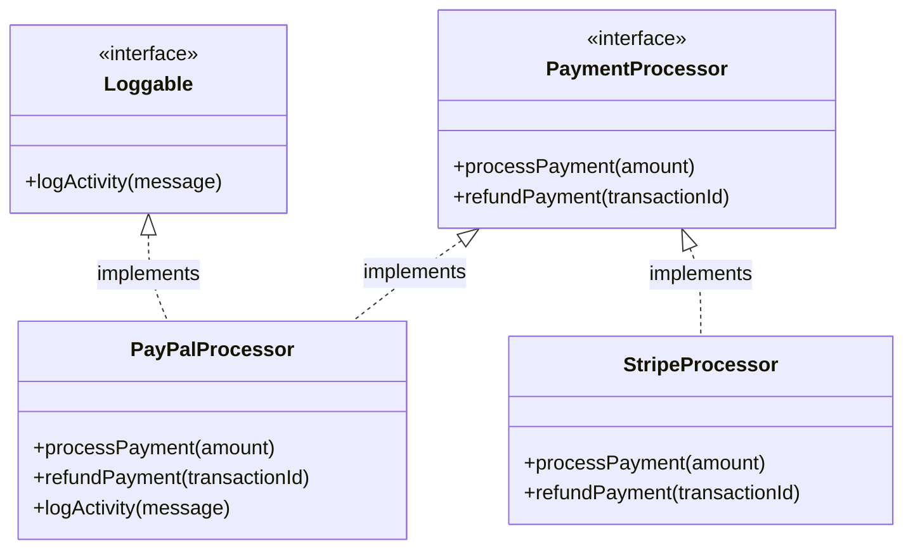

# PHP Interfaces

## Introduction

Interfaces are a fundamental concept in Object-Oriented Programming that allow you to define a contract for classes to follow. In PHP, an interface defines methods that a class must implement, without specifying how these methods should work. Think of an interface as a blueprint that ensures certain classes have specific methods with specific signatures.

Interfaces help create more maintainable and scalable code by enforcing consistency across different parts of your application. They're especially useful when multiple developers are working on the same project or when you're building systems that need to be extended in the future.

## What are Interfaces?

An interface in PHP is defined using the `interface` keyword. It contains method declarations (without implementations) that any class implementing the interface must define.

```php
<?php
// Define an interface
interface PaymentProcessor {
    public function processPayment($amount);
    public function refundPayment($transactionId);
}
```

Key characteristics of interfaces:

- Interfaces can only contain method declarations (not implementations)
- All methods declared in an interface must be public
- A class can implement multiple interfaces
- Interfaces can extend other interfaces
- Interfaces cannot be instantiated directly

## Implementing Interfaces

To use an interface, a class must "implement" it using the `implements` keyword. The class must then provide implementations for all methods declared in the interface.

```php
<?php
// Define an interface
interface PaymentProcessor {
    public function processPayment($amount);
    public function refundPayment($transactionId);
}

// Implement the interface in a class
class PayPalProcessor implements PaymentProcessor {
    public function processPayment($amount) {
        // PayPal-specific implementation
        echo "Processing $" . $amount . " payment via PayPal<br>";
        return "PP-" . rand(1000, 9999);
    }
    
    public function refundPayment($transactionId) {
        // PayPal-specific implementation
        echo "Refunding transaction $transactionId via PayPal<br>";
        return true;
    }
}

// Implement the interface in another class
class StripeProcessor implements PaymentProcessor {
    public function processPayment($amount) {
        // Stripe-specific implementation
        echo "Processing $" . $amount . " payment via Stripe<br>";
        return "ST-" . rand(1000, 9999);
    }
    
    public function refundPayment($transactionId) {
        // Stripe-specific implementation
        echo "Refunding transaction $transactionId via Stripe<br>";
        return true;
    }
}

// Using the classes
$paypal = new PayPalProcessor();
$transactionId = $paypal->processPayment(100);
$paypal->refundPayment($transactionId);

$stripe = new StripeProcessor();
$transactionId = $stripe->processPayment(200);
$stripe->refundPayment($transactionId);
```

**Output:**
```
Processing $100 payment via PayPal
Refunding transaction PP-5432 via PayPal
Processing $200 payment via Stripe
Refunding transaction ST-7890 via Stripe
```

In this example, both `PayPalProcessor` and `StripeProcessor` implement the `PaymentProcessor` interface. Each class provides its own implementation of the required methods, but they both follow the same contract defined by the interface.

## Type Hinting with Interfaces

One of the major benefits of interfaces is the ability to use type hinting in your code. This allows you to write functions that accept any object that implements a particular interface:

```php
<?php
function processOrder($cart, PaymentProcessor $processor) {
    $total = $cart->getTotal();
    $transactionId = $processor->processPayment($total);
    
    if ($transactionId) {
        echo "Order processed successfully!<br>";
        return $transactionId;
    }
    
    return false;
}

// This function will work with ANY class that implements PaymentProcessor
$paypal = new PayPalProcessor();
$stripe = new StripeProcessor();

processOrder($cart, $paypal);
processOrder($cart, $stripe);
```

## Multiple Interfaces

A class can implement multiple interfaces, which is one way PHP gets around the limitation of not supporting multiple inheritance:

```php
<?php
interface Loggable {
    public function logActivity($message);
}

interface Serializable {
    public function serialize();
    public function unserialize($data);
}

class PayPalProcessor implements PaymentProcessor, Loggable, Serializable {
    // Implementing PaymentProcessor methods
    public function processPayment($amount) {
        echo "Processing $" . $amount . " payment via PayPal<br>";
        $this->logActivity("Payment processed: $amount");
        return "PP-" . rand(1000, 9999);
    }
    
    public function refundPayment($transactionId) {
        echo "Refunding transaction $transactionId via PayPal<br>";
        $this->logActivity("Refund processed: $transactionId");
        return true;
    }
    
    // Implementing Loggable methods
    public function logActivity($message) {
        echo "LOG: " . $message . "<br>";
    }
    
    // Implementing Serializable methods
    public function serialize() {
        return serialize([
            'provider' => 'PayPal',
            'timestamp' => time()
        ]);
    }
    
    public function unserialize($data) {
        $data = unserialize($data);
        // Restore object state
    }
}
```

## Interface Inheritance

Interfaces can extend other interfaces using the `extends` keyword:

```php
<?php
interface BasicPaymentProcessor {
    public function processPayment($amount);
}

interface AdvancedPaymentProcessor extends BasicPaymentProcessor {
    public function refundPayment($transactionId);
    public function verifyPayment($transactionId);
}

// This class must implement ALL methods from both interfaces
class CompletePaymentProcessor implements AdvancedPaymentProcessor {
    public function processPayment($amount) {
        // implementation
        return "TX-" . rand(1000, 9999);
    }
    
    public function refundPayment($transactionId) {
        // implementation
        return true;
    }
    
    public function verifyPayment($transactionId) {
        // implementation
        return true;
    }
}
```

## Real-World Example: Content Management System

Let's look at a practical example of how interfaces might be used in a simple content management system:

```php
<?php
// Define interfaces
interface ContentType {
    public function render();
    public function save();
    public function validate();
}

interface Publishable {
    public function publish();
    public function unpublish();
    public function getStatus();
}

// Blog post content type
class BlogPost implements ContentType, Publishable {
    private $title;
    private $content;
    private $status = 'draft';
    
    public function __construct($title, $content) {
        $this->title = $title;
        $this->content = $content;
    }
    
    // ContentType implementation
    public function render() {
        echo "<h1>{$this->title}</h1>";
        echo "<div class='content'>{$this->content}</div>";
    }
    
    public function save() {
        echo "Saving blog post '{$this->title}' to database<br>";
        // Database operations would go here
        return true;
    }
    
    public function validate() {
        return !empty($this->title) && !empty($this->content);
    }
    
    // Publishable implementation
    public function publish() {
        if ($this->validate()) {
            $this->status = 'published';
            echo "Blog post '{$this->title}' published!<br>";
            return true;
        }
        echo "Cannot publish invalid content<br>";
        return false;
    }
    
    public function unpublish() {
        $this->status = 'draft';
        echo "Blog post '{$this->title}' unpublished<br>";
        return true;
    }
    
    public function getStatus() {
        return $this->status;
    }
}

// Product page content type
class ProductPage implements ContentType, Publishable {
    private $productName;
    private $description;
    private $price;
    private $status = 'draft';
    
    public function __construct($productName, $description, $price) {
        $this->productName = $productName;
        $this->description = $description;
        $this->price = $price;
    }
    
    // ContentType implementation
    public function render() {
        echo "<h1>{$this->productName} - \${$this->price}</h1>";
        echo "<div class='description'>{$this->description}</div>";
        echo "<button>Add to Cart</button>";
    }
    
    public function save() {
        echo "Saving product '{$this->productName}' to database<br>";
        // Database operations would go here
        return true;
    }
    
    public function validate() {
        return !empty($this->productName) && !empty($this->description) && $this->price > 0;
    }
    
    // Publishable implementation
    public function publish() {
        if ($this->validate()) {
            $this->status = 'published';
            echo "Product '{$this->productName}' published!<br>";
            return true;
        }
        echo "Cannot publish invalid product<br>";
        return false;
    }
    
    public function unpublish() {
        $this->status = 'draft';
        echo "Product '{$this->productName}' unpublished<br>";
        return true;
    }
    
    public function getStatus() {
        return $this->status;
    }
}

// CMS system that works with any content type
class CMS {
    public function createContent(ContentType $content) {
        if ($content->validate()) {
            $content->save();
            echo "Content created successfully!<br>";
            return true;
        }
        echo "Content validation failed!<br>";
        return false;
    }
    
    public function publishContent(Publishable $content) {
        return $content->publish();
    }
    
    public function renderContent(ContentType $content) {
        $content->render();
    }
}

// Usage example
$blogPost = new BlogPost("Understanding PHP Interfaces", "Interfaces are a powerful feature in PHP...");
$product = new ProductPage("PHP eBook", "Complete guide to PHP OOP", 29.99);

$cms = new CMS();

// Both content types work with the CMS
$cms->createContent($blogPost);
$cms->publishContent($blogPost);
$cms->renderContent($blogPost);

$cms->createContent($product);
$cms->publishContent($product);
$cms->renderContent($product);
```

**Output:**
```
Saving blog post 'Understanding PHP Interfaces' to database
Content created successfully!
Blog post 'Understanding PHP Interfaces' published!
<h1>Understanding PHP Interfaces</h1>
<div class='content'>Interfaces are a powerful feature in PHP...</div>

Saving product 'PHP eBook' to database
Content created successfully!
Product 'PHP eBook' published!
<h1>PHP eBook - $29.99</h1>
<div class='description'>Complete guide to PHP OOP</div>
<button>Add to Cart</button>
```

This example shows how interfaces allow us to create a flexible CMS system that can handle different types of content. The `CMS` class doesn't need to know the specific details of blog posts or product pages - it only needs to know that they implement the required interfaces.

## Visual Representation

Here's a diagram showing the relationship between interfaces and classes:



## Benefits of Using Interfaces

1. **Code Organization**: Interfaces provide a clear contract that classes must follow, making code easier to understand and maintain.

2. **Flexibility**: You can change the implementation of a class without affecting code that uses it, as long as it still adheres to the interface.

3. **Type Hinting**: You can type hint against interfaces in method parameters, ensuring your code receives objects that have the methods you need.

4. **Testability**: Interfaces make it easier to create mock objects for testing, as you can create test implementations of your interfaces.

5. **Team Collaboration**: Interfaces establish clear boundaries between different parts of an application, making it easier for teams to work independently.

6. **Future-Proofing**: Interfaces allow you to define functionality that might be implemented by multiple classes in the future.

## Common Use Cases for Interfaces

- **Database Abstraction**: Creating interfaces for database operations allows you to switch database systems without changing application code.
- **Payment Systems**: As shown in our examples, interfaces can define a contract for different payment processors.
- **Plugin Systems**: Interfaces can define what functionality plugins must provide to work with your system.
- **API Integration**: Interfaces can standardize how your application interacts with various external APIs.
- **Content Management**: Different content types can implement the same interfaces for consistent handling.

## Summary

PHP interfaces are a powerful tool for creating flexible, maintainable object-oriented code. They allow you to define a contract that classes must follow, without specifying how the implementation should work. This provides several benefits:

- Enforcing consistent method signatures across multiple classes
- Enabling type hinting for more reliable code
- Allowing different implementations of the same functionality
- Supporting a form of multiple inheritance in PHP
- Creating clear boundaries between different parts of your application

By understanding and using interfaces effectively, you can write more modular, extensible, and maintainable PHP code.

## Exercises

1. Create an interface called `FileHandler` with methods `readFile($filename)` and `writeFile($filename, $content)`. Then implement this interface for both local files and remote (FTP) files.

2. Design a notification system using interfaces. Create a `NotificationChannel` interface with a `send($message, $recipient)` method, and implement it for email, SMS, and push notifications.

3. Extend the CMS example from this tutorial by adding a new content type (e.g., `GalleryPage`) that implements the same interfaces.

4. Create a caching system with a `CacheProvider` interface that different cache implementations (file, database, memory) can implement.

## Additional Resources

- [PHP Documentation: Interfaces](https://www.php.net/manual/en/language.oop5.interfaces.php)
- [PHP: The Right Way - Interfaces](https://phptherightway.com/#interfaces)
- [Design Patterns in PHP](https://refactoring.guru/design-patterns/php)
- [SOLID Principles in PHP](https://www.digitalocean.com/community/tutorials/solid-principles-in-php-examples)