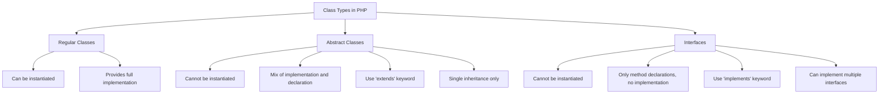

# PHP Abstract Classes

## Introduction

When advancing in Object-Oriented Programming (OOP) with PHP, you'll encounter abstract classes - a powerful concept that bridges the gap between regular classes and interfaces. Abstract classes provide a foundation for other classes while enforcing certain implementation requirements on child classes.

In this tutorial, we'll explore abstract classes in PHP, understand their purpose, learn how to implement them, and see how they fit into real-world applications.

## What Are Abstract Classes?

An abstract class is a special type of class that cannot be instantiated directly. Instead, it serves as a blueprint for other classes to extend. Abstract classes can contain a mixture of complete methods (with implementation) and abstract methods (without implementation).

The key characteristics of abstract classes in PHP include:

- Defined using the `abstract` keyword
- Cannot be instantiated directly with the `new` keyword
- May contain abstract methods that child classes must implement
- May contain regular methods with complete implementations
- Can have properties, constants, and constructors like regular classes

## Syntax and Basic Example

Let's look at the basic syntax for defining an abstract class in PHP:

```php
abstract class BaseClass {
    // Regular property
    protected $property;
    
    // Regular method with implementation
    public function regularMethod() {
        echo "This is a regular method";
    }
    
    // Abstract method (no implementation)
    abstract public function abstractMethod();
}

// Child class
class ChildClass extends BaseClass {
    // Must implement the abstract method
    public function abstractMethod() {
        echo "Abstract method implemented";
    }
}

// Usage
$object = new ChildClass();
$object->regularMethod(); // Output: This is a regular method
$object->abstractMethod(); // Output: Abstract method implemented

// This would cause an error:
// $baseObject = new BaseClass(); // Cannot instantiate abstract class
```

## Abstract Methods

Abstract methods are methods declared in an abstract class but without implementation. They have a method signature but no method body. Child classes that extend the abstract class must implement all abstract methods.

Rules for abstract methods:
- Must be declared with the `abstract` keyword
- Cannot have a body/implementation in the abstract class
- Must be implemented by any concrete (non-abstract) child class
- The child's implementation must follow the same (or less restrictive) visibility
- The child's implementation must match the parent's method signature

```php
abstract class Animal {
    protected $name;
    
    public function __construct($name) {
        $this->name = $name;
    }
    
    // Regular method
    public function getName() {
        return $this->name;
    }
    
    // Abstract methods
    abstract public function makeSound();
    abstract protected function move();
}

class Dog extends Animal {
    // Implement abstract methods
    public function makeSound() {
        return "Woof!";
    }
    
    // Notice this can be public (less restrictive than protected)
    public function move() {
        return "Running on four legs";
    }
}

class Bird extends Animal {
    // Implement abstract methods
    public function makeSound() {
        return "Chirp!";
    }
    
    public function move() {
        return "Flying with wings";
    }
}

// Usage
$dog = new Dog("Buddy");
echo $dog->getName() . " says: " . $dog->makeSound(); // Output: Buddy says: Woof!

$bird = new Bird("Tweety");
echo $bird->getName() . " says: " . $bird->makeSound(); // Output: Tweety says: Chirp!
```

## Abstract Classes vs. Interfaces

Abstract classes and interfaces are similar but serve different purposes:



Key differences:

| Feature | Abstract Class | Interface |
|---------|---------------|-----------|
| Keyword | `abstract class` | `interface` |
| Inheritance | `extends` | `implements` |
| Multiple Inheritance | No (PHP only allows single inheritance) | Yes (can implement multiple interfaces) |
| Methods | Can have both abstract and implemented methods | Can only have method declarations (PHP 8.0+ allows default methods) |
| Properties | Can have properties | Only constants (before PHP 8.1) |
| Constructor | Can have constructors | Cannot have constructors |
| Access Modifiers | Can use public, protected, private | All methods are implicitly public |

## When to Use Abstract Classes

Abstract classes are ideal in the following scenarios:

1. **Base functionality sharing**: When multiple related classes need to share common functionality
2. **Partial implementation**: When you want to provide default implementations for some methods while requiring child classes to implement others
3. **Template Method Pattern**: When implementing design patterns where an algorithm structure is defined but steps can be overridden
4. **Enforcing consistency**: When you need to enforce a common structure across related classes

## Practical Example: Database Access Layer

Let's build a practical example: a database access layer using abstract classes.

```php
abstract class DatabaseHandler {
    protected $connection;
    protected $table;
    
    public function __construct($table) {
        $this->table = $table;
        $this->connect();
    }
    
    // Common functionality for all database handlers
    public function getAll() {
        return "SELECT * FROM {$this->table}";
    }
    
    public function getById($id) {
        return "SELECT * FROM {$this->table} WHERE id = {$id}";
    }
    
    // Different databases might connect differently
    abstract protected function connect();
    
    // Each database type might have unique query methods
    abstract public function executeQuery($query);
}

class MySQLHandler extends DatabaseHandler {
    protected function connect() {
        // MySQL-specific connection code
        $this->connection = "MySQL Connection established";
    }
    
    public function executeQuery($query) {
        return "Executing in MySQL: {$query}";
    }
}

class PostgreSQLHandler extends DatabaseHandler {
    protected function connect() {
        // PostgreSQL-specific connection code
        $this->connection = "PostgreSQL Connection established";
    }
    
    public function executeQuery($query) {
        return "Executing in PostgreSQL: {$query}";
    }
}

// Usage
$mysql = new MySQLHandler("users");
echo $mysql->executeQuery($mysql->getAll());
// Output: Executing in MySQL: SELECT * FROM users

$postgres = new PostgreSQLHandler("products");
echo $postgres->executeQuery($postgres->getById(5));
// Output: Executing in PostgreSQL: SELECT * FROM products WHERE id = 5
```

## Advanced Concepts with Abstract Classes

### 1. Abstract Class with Constructor

Abstract classes can have constructors that child classes can leverage:

```php
abstract class Vehicle {
    protected $brand;
    protected $model;
    
    public function __construct($brand, $model) {
        $this->brand = $brand;
        $this->model = $model;
    }
    
    abstract public function calculateFuelEfficiency();
    
    public function getInfo() {
        return "This is a {$this->brand} {$this->model}";
    }
}

class Car extends Vehicle {
    private $doors;
    
    public function __construct($brand, $model, $doors) {
        parent::__construct($brand, $model);
        $this->doors = $doors;
    }
    
    public function calculateFuelEfficiency() {
        // Car-specific fuel efficiency calculation
        return "Calculating fuel efficiency for car";
    }
}

// Usage
$car = new Car("Toyota", "Corolla", 4);
echo $car->getInfo(); // Output: This is a Toyota Corolla
```

### 2. Nested Abstraction Levels

You can create abstract classes that extend other abstract classes:

```php
abstract class Shape {
    abstract public function getArea();
}

abstract class TwoDimensionalShape extends Shape {
    abstract public function getPerimeter();
}

class Rectangle extends TwoDimensionalShape {
    private $width;
    private $height;
    
    public function __construct($width, $height) {
        $this->width = $width;
        $this->height = $height;
    }
    
    public function getArea() {
        return $this->width * $this->height;
    }
    
    public function getPerimeter() {
        return 2 * ($this->width + $this->height);
    }
}

// Usage
$rectangle = new Rectangle(5, 3);
echo "Area: " . $rectangle->getArea(); // Output: Area: 15
echo "Perimeter: " . $rectangle->getPerimeter(); // Output: Perimeter: 16
```

## Best Practices for Abstract Classes

1. **Name abstract classes clearly**: Use descriptive names that reflect their purpose (e.g., `AbstractLogger`, `DatabaseHandler`)
2. **Don't overuse abstraction**: Use abstract classes only when you truly need shared functionality and structure enforcement
3. **Keep the hierarchy shallow**: Avoid deep inheritance chains that are difficult to understand
4. **Follow the Template Method Pattern**: Define the "skeleton" of an algorithm in the abstract class and delegate the implementation details to subclasses
5. **Balance abstract and concrete methods**: Too many abstract methods might indicate you need an interface instead

## Common Mistakes to Avoid

1. **Abstract class with all abstract methods**: If your abstract class has only abstract methods, consider using an interface instead
2. **Too specific implementations**: If your abstract class implementations are too specific, they may not be useful to all child classes
3. **Trying to instantiate abstract classes**: Remember that abstract classes cannot be instantiated directly
4. **Not implementing all abstract methods**: You must implement all abstract methods in a concrete child class

## Real-World Analogies

To better understand abstract classes, think of them as:

1. **Blueprints for a house**: They provide the overall structure and some fixed elements, but allow customization in specific areas
2. **Recipe templates**: They provide basic instructions and ingredients but allow variations in certain steps
3. **Job descriptions**: They outline required responsibilities but don't specify exactly how to perform each task

## Summary

Abstract classes in PHP provide a powerful way to:
- Create base classes that can't be instantiated directly
- Share common functionality across related classes
- Force child classes to implement specific methods
- Enforce a structure while allowing flexibility in implementation

They are particularly useful when building frameworks, libraries, or large applications where consistency and structure are important, but flexibility is still needed for specific implementations.

## Exercises

1. Create an abstract `PaymentGateway` class with common methods for all payment processors
2. Implement a `Logger` abstract class with different output methods (file, database, email)
3. Design a template system using abstract classes for different page layouts
4. Create an abstract `CachingSystem` with implementations for file, memory, and database caching

## Additional Resources

- [PHP Official Documentation on Abstract Classes](https://www.php.net/manual/en/language.oop5.abstract.php)
- [Design Patterns: Template Method Pattern](https://refactoring.guru/design-patterns/template-method)
- [The Difference Between Abstract Classes and Interfaces](https://phpenthusiast.com/object-oriented-php-tutorials/abstract-classes-and-methods)
- [PHP Object-Oriented Programming Best Practices](https://phptherightway.com/#object-oriented-programming)