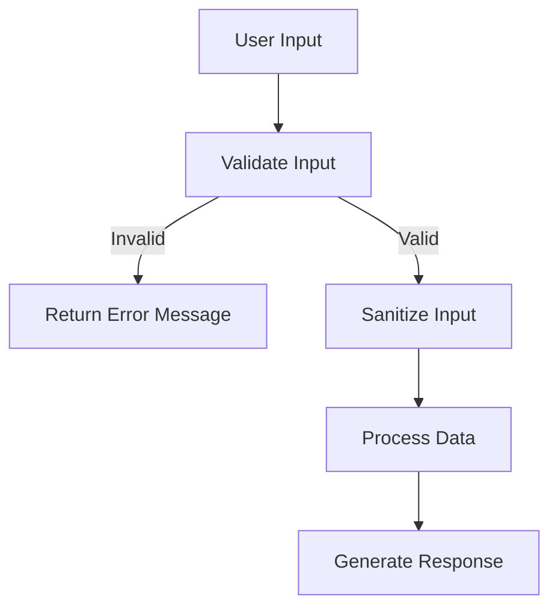

# PHP Input Validation

## Introduction

Input validation is one of the most critical security practices in PHP web development. Whenever your application accepts data from external sources—whether from form submissions, API requests, URL parameters, or cookies—that data should be treated as potentially malicious until properly validated.

In this tutorial, we'll explore why input validation matters, common validation techniques in PHP, and how to implement robust validation to protect your applications from various attacks including SQL injection, Cross-Site Scripting (XSS), and more.

## Why Input Validation Matters

Without proper input validation, your application becomes vulnerable to numerous security threats:

1. **SQL Injection**: Attackers can manipulate database queries to access, modify, or delete data
2. **Cross-Site Scripting (XSS)**: Malicious scripts can be injected into web pages viewed by other users
3. **Command Injection**: System commands can be executed through vulnerable PHP applications
4. **Path Traversal**: Attackers can access files outside intended directories
5. **Denial of Service**: Sending excessive or malformed input can crash your application

Let's see a simple example of a vulnerable form without input validation:

```php
// Vulnerable code - DO NOT USE
$username = $_POST['username'];
$query = "SELECT * FROM users WHERE username = '$username'";
$result = mysqli_query($connection, $query);
```

If an attacker submits `' OR '1'='1`, the query becomes:

```sql
SELECT * FROM users WHERE username = '' OR '1'='1'
```

This would return all users in the database!

## Basic Input Validation Principles

When validating input in PHP, follow these core principles:

1. **Validate on the server-side**: Never rely solely on client-side validation
2. **Validate data type**: Ensure the input is of the expected type (string, integer, email, etc.)
3. **Validate data range/length**: Check that numeric values are within acceptable ranges and strings have appropriate lengths
4. **Whitelist, don't blacklist**: Define what's allowed rather than what's not allowed
5. **Sanitize after validating**: Remove or escape potentially dangerous characters

## PHP Built-in Validation Functions

PHP provides several built-in functions for input validation:

### Type Validation Functions

```php
// Check if variable is an integer
$id = $_GET['id'];
if (!filter_var($id, FILTER_VALIDATE_INT)) {
    die("Invalid ID provided");
}

// Check if variable is an email
$email = $_POST['email'];
if (!filter_var($email, FILTER_VALIDATE_EMAIL)) {
    die("Invalid email format");
}

// Check if variable is a URL
$website = $_POST['website'];
if (!filter_var($website, FILTER_VALIDATE_URL)) {
    die("Invalid URL format");
}
```

### Using filter_input() for Direct Input Validation

The `filter_input()` function validates input from specific sources:

```php
// Validate an integer from GET request
$id = filter_input(INPUT_GET, 'id', FILTER_VALIDATE_INT);
if ($id === false || $id === null) {
    die("Invalid ID parameter");
}

// Validate an email from POST request
$email = filter_input(INPUT_POST, 'email', FILTER_VALIDATE_EMAIL);
if (!$email) {
    die("Invalid email address");
}
```

## Advanced Validation Techniques

### Regular Expressions

For complex validation patterns, regular expressions are invaluable:

```php
// Validate username (alphanumeric, 3-16 characters)
$username = $_POST['username'];
if (!preg_match('/^[a-zA-Z0-9]{3,16}$/', $username)) {
    die("Username must be 3-16 alphanumeric characters");
}

// Validate phone number (US format)
$phone = $_POST['phone'];
if (!preg_match('/^\d{3}-\d{3}-\d{4}$/', $phone)) {
    die("Phone must be in XXX-XXX-XXXX format");
}
```

### Custom Validation Functions

For reusable validation, create custom functions:

```php
function validateUsername($username) {
    // Length check
    if (strlen($username) < 3 || strlen($username) > 16) {
        return false;
    }
    
    // Character check
    if (!preg_match('/^[a-zA-Z0-9]+$/', $username)) {
        return false;
    }
    
    return true;
}

// Usage
$username = $_POST['username'];
if (!validateUsername($username)) {
    die("Invalid username");
}
```

## Input Sanitization

After validation, sanitize input before using it:

### For Database Queries

```php
// Using prepared statements (recommended approach)
$username = $_POST['username'];

// Validate username
if (!validateUsername($username)) {
    die("Invalid username");
}

// Use prepared statement
$stmt = $pdo->prepare("SELECT * FROM users WHERE username = ?");
$stmt->execute([$username]);
$user = $stmt->fetch();
```

### For HTML Output

```php
// Sanitize data before displaying in HTML
$comment = $_POST['comment'];

// Validate comment
if (strlen($comment) > 1000) {
    die("Comment too long");
}

// Sanitize for HTML output
$safeComment = htmlspecialchars($comment, ENT_QUOTES, 'UTF-8');
echo "<div class='comment'>$safeComment</div>";
```

## Real-world Example: Contact Form Validation

Let's put everything together with a practical example of a contact form:

```php
<?php
// Define validation errors array
$errors = [];

// Process form submission
if ($_SERVER['REQUEST_METHOD'] === 'POST') {
    // Validate name
    $name = filter_input(INPUT_POST, 'name', FILTER_SANITIZE_STRING);
    if (empty($name) || strlen($name) > 50) {
        $errors[] = "Name is required and must be less than 50 characters";
    }
    
    // Validate email
    $email = filter_input(INPUT_POST, 'email', FILTER_VALIDATE_EMAIL);
    if (!$email) {
        $errors[] = "A valid email address is required";
    }
    
    // Validate subject
    $subject = filter_input(INPUT_POST, 'subject', FILTER_SANITIZE_STRING);
    if (empty($subject) || strlen($subject) > 100) {
        $errors[] = "Subject is required and must be less than 100 characters";
    }
    
    // Validate message
    $message = filter_input(INPUT_POST, 'message', FILTER_SANITIZE_STRING);
    if (empty($message) || strlen($message) > 2000) {
        $errors[] = "Message is required and must be less than 2000 characters";
    }
    
    // If no errors, process the form
    if (empty($errors)) {
        // Process form (e.g., send email, save to database)
        // For this example, we'll just display success
        $success = "Thanks for your message! We'll get back to you soon.";
        
        // In a real application, you might do something like:
        // mail('contact@example.com', $subject, $message, "From: $email");
    }
}
?>

<!-- HTML Form -->
<!DOCTYPE html>
<html>
<head>
    <title>Contact Form</title>
</head>
<body>
    <h1>Contact Us</h1>
    
    <?php if (!empty($errors)): ?>
        <div class="errors">
            <ul>
                <?php foreach ($errors as $error): ?>
                    <li><?php echo htmlspecialchars($error); ?></li>
                <?php endforeach; ?>
            </ul>
        </div>
    <?php endif; ?>
    
    <?php if (isset($success)): ?>
        <div class="success"><?php echo htmlspecialchars($success); ?></div>
    <?php else: ?>
        <form method="post" action="">
            <div>
                <label for="name">Name:</label>
                <input type="text" id="name" name="name" value="<?php echo isset($name) ? htmlspecialchars($name) : ''; ?>">
            </div>
            
            <div>
                <label for="email">Email:</label>
                <input type="email" id="email" name="email" value="<?php echo isset($email) ? htmlspecialchars($email) : ''; ?>">
            </div>
            
            <div>
                <label for="subject">Subject:</label>
                <input type="text" id="subject" name="subject" value="<?php echo isset($subject) ? htmlspecialchars($subject) : ''; ?>">
            </div>
            
            <div>
                <label for="message">Message:</label>
                <textarea id="message" name="message"><?php echo isset($message) ? htmlspecialchars($message) : ''; ?></textarea>
            </div>
            
            <div>
                <button type="submit">Send Message</button>
            </div>
        </form>
    <?php endif; ?>
</body>
</html>
```

## Input Validation Flow

Here's a diagram showing the recommended flow for handling user input:



## Common Validation Scenarios

Here are some common validation patterns for different types of data:

| Data Type | Validation Method | Example |
|-----------|-------------------|---------|
| Integer | `FILTER_VALIDATE_INT` | Product ID, Quantity |
| Email | `FILTER_VALIDATE_EMAIL` | User email address |
| URL | `FILTER_VALIDATE_URL` | Profile website |
| Date | Regex or DateTime | Birth date, Event date |
| Phone | Regex | Contact phone number |
| Username | Custom function | Account username |
| Password | Complexity rules | User password |

## Best Practices Summary

1. **Always validate on the server side**, even if client-side validation exists
2. **Use type-appropriate validation** for each piece of data
3. **Set reasonable limits** on input length and value ranges
4. **Prefer whitelist validation** over blacklist approaches
5. **Use prepared statements** for database queries
6. **Sanitize output** appropriate to the context (HTML, SQL, etc.)
7. **Create reusable validation functions** for complex or repeated validations
8. **Provide clear error messages** to help users correct their input
9. **Log validation failures** to detect potential attack patterns

## Additional Resources

Here are some resources to further enhance your understanding of PHP input validation:

- [PHP Filter Functions Documentation](https://www.php.net/manual/en/book.filter.php)
- [OWASP Input Validation Cheat Sheet](https://cheatsheetseries.owasp.org/cheatsheets/Input_Validation_Cheat_Sheet.html)
- [PHP Security Guide](https://phpsecurity.readthedocs.io/en/latest/Input-Validation.html)

## Exercises

1. Create a registration form that validates username, email, password, and phone number.
2. Modify the contact form example to include file upload validation.
3. Write a custom validation function for a postal/zip code that works for multiple countries.
4. Create a validation class that can be reused across multiple forms.
5. Implement CSRF protection in addition to input validation for a form submission.

Remember, robust input validation is your first line of defense against many common web application attacks. Always validate, sanitize, and verify user input before trusting it in your application.