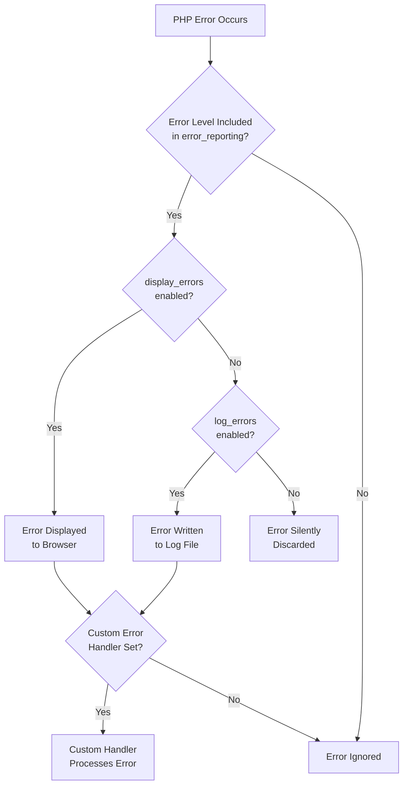

# PHP Error Reporting

## Introduction

Error reporting is a critical aspect of PHP development that serves two essential purposes: it helps developers identify and fix issues during development, while also preventing sensitive information leakage in production environments. In this guide, we'll explore how PHP's error reporting mechanisms work, how to configure them properly, and best practices for maintaining security while still being able to effectively debug your applications.

Understanding how to properly configure PHP error reporting is fundamental to creating secure PHP applications. Incorrectly configured error settings can expose sensitive information to potential attackers, including database credentials, file paths, and application logic vulnerabilities.

## Error Reporting Basics

PHP provides several built-in functions and directives to control how errors are handled and displayed. Let's start by understanding the basic error types in PHP:

| Error Level | Description | 
|-------------|-------------|
| E_ERROR | Fatal run-time errors that halt script execution |
| E_WARNING | Run-time warnings that don't halt script execution |
| E_PARSE | Compile-time parse errors |
| E_NOTICE | Run-time notices indicating possible errors |
| E_DEPRECATED | Warnings about code that will not work in future versions |
| E_ALL | All errors and warnings (except E_STRICT in < PHP 5.4.0) |

### Checking Current Error Reporting Settings

Before making any changes, it's helpful to understand your current PHP error configuration:

```php
<?php
// Display current error reporting settings
echo "Error reporting level: " . error_reporting() . "<br>";
echo "Display errors: " . (ini_get('display_errors') ? 'On' : 'Off') . "<br>";
echo "Log errors: " . (ini_get('log_errors') ? 'On' : 'Off') . "<br>";
echo "Error log path: " . ini_get('error_log') . "<br>";
?>
```

**Output:**
```
Error reporting level: 32767
Display errors: On
Log errors: On
Error log path: /var/log/php/error.log
```

## Configuring Error Reporting

There are two main ways to configure error reporting in PHP:

1. Using the `php.ini` configuration file
2. Using runtime functions within your PHP code

### Using php.ini

The primary way to configure PHP error reporting is through the `php.ini` file. Here are the key directives:

```ini
; Controls which errors are reported
error_reporting = E_ALL

; Controls whether errors are displayed to the browser
display_errors = On

; Controls whether errors are logged
log_errors = On

; Path to the error log file
error_log = /path/to/error.log
```

### Using Runtime Functions

You can also set error reporting behavior at runtime using PHP functions:

```php
<?php
// Set error reporting level
error_reporting(E_ALL);

// Turn on error display
ini_set('display_errors', 1);

// Turn on error logging
ini_set('log_errors', 1);

// Set path for error log
ini_set('error_log', '/path/to/error.log');

// Example error to test configuration
$undefined_variable;
?>
```

**Output:**
```
Notice: Undefined variable: undefined_variable in /var/www/html/example.php on line 14
```

## Development vs. Production Environments

A key security principle is to configure error reporting differently between development and production environments:

### Development Environment

In development, you want to see all errors to help with debugging:

```php
<?php
// Development settings - Show all errors
error_reporting(E_ALL);
ini_set('display_errors', 1);
ini_set('display_startup_errors', 1);
?>
```

### Production Environment

In production, you should hide detailed errors from users but still log them for administrators:

```php
<?php
// Production settings - Don't show errors, but log them
error_reporting(E_ALL);
ini_set('display_errors', 0);
ini_set('log_errors', 1);
ini_set('error_log', '/path/to/secure/error.log');
?>
```

## Environment-Based Configuration

A best practice is to automatically adjust error settings based on the environment:

```php
<?php
// Determine environment (set this based on your system)
$environment = 'development'; // Options: 'development', 'production'

// Base configuration - always report all errors
error_reporting(E_ALL);

// Environment-specific configuration
if ($environment === 'development') {
    ini_set('display_errors', 1);
    ini_set('display_startup_errors', 1);
} else {
    ini_set('display_errors', 0);
    ini_set('display_startup_errors', 0);
    ini_set('log_errors', 1);
    ini_set('error_log', '/path/to/secure/error.log');
}

// Test with a deliberate error
$test = $undefined_variable; // This will trigger a notice
?>
```

## Custom Error Handlers

For more control, PHP allows you to create custom error handlers:

```php
<?php
// Define custom error handler function
function customErrorHandler($errno, $errstr, $errfile, $errline) {
    // Log the error details securely
    error_log("Error [$errno]: $errstr in $errfile on line $errline");
    
    // For production, display a generic message to the user
    if (ini_get('display_errors') == 0) {
        echo "An error occurred. Please try again later.";
        // Prevent further script execution for serious errors
        if ($errno == E_ERROR || $errno == E_USER_ERROR) {
            exit(1);
        }
    } else {
        // For development, show details
        echo "<b>Error:</b> [$errno] $errstr<br>";
        echo "On line $errline in file $errfile<br>";
    }
    
    // Return true to prevent standard PHP error handler
    return true;
}

// Set the custom error handler
set_error_handler("customErrorHandler");

// Test the error handler
$test = $undefined_variable; // This will trigger our custom handler
?>
```

## Error Reporting Flow

Understanding how PHP processes errors is important for configuring error reporting correctly:



## Security Implications

Improper error reporting can lead to several security issues:

1. **Information Disclosure**: Detailed error messages can reveal:
   - Database schema details
   - File paths
   - Application logic
   - Server infrastructure details

2. **Debugging Information Leakage**: Stack traces and variable dumps can give attackers insights into your application's structure.

3. **Path Disclosure**: File paths in error messages can reveal your server's directory structure.

### Example of Insecure Error Reporting

Consider this database connection error in a production environment with `display_errors = On`:

```php
<?php
// Incorrect database details
$conn = mysqli_connect("db-server.example.com", "admin_user", "Secret123!", "app_database");

// This would display sensitive information to all visitors if connection fails
if (!$conn) {
    die("Connection failed: " . mysqli_connect_error());
}
?>
```

**Output visible to all users (including attackers):**
```
Connection failed: Access denied for user 'admin_user'@'web-server.example.com' to database 'app_database' at db-server.example.com:3306
```

This error reveals:
- Database server hostname
- Username
- Database name
- Server relationship information

### Secure Alternative

```php
<?php
// Production-safe approach
$conn = mysqli_connect("db-server.example.com", "admin_user", "Secret123!", "app_database");

// Log the detailed error but show a generic message to users
if (!$conn) {
    // Log actual error for administrators
    error_log("Database connection failed: " . mysqli_connect_error());
    
    // Show generic message to users
    die("A database error occurred. Please try again later.");
}
?>
```

**Output visible to users:**
```
A database error occurred. Please try again later.
```

**In error log (only accessible to administrators):**
```
Database connection failed: Access denied for user 'admin_user'@'web-server.example.com' to database 'app_database' at db-server.example.com:3306
```

## Error Reporting with Try-Catch

Modern PHP applications often use exceptions and try-catch blocks for error handling:

```php
<?php
try {
    // Attempt database connection
    $conn = new PDO(
        "mysql:host=localhost;dbname=app_database", 
        "db_user", 
        "password"
    );
    
    // Set PDO to throw exceptions on errors
    $conn->setAttribute(PDO::ATTR_ERRMODE, PDO::ERRMODE_EXCEPTION);
    
    // Attempt a query
    $result = $conn->query("SELECT * FROM non_existent_table");
    
} catch (PDOException $e) {
    // Log the actual error
    error_log("Database error: " . $e->getMessage());
    
    // Display a user-friendly message
    echo "Sorry, we encountered a problem accessing your data.";
    
    // Optionally include a reference code for support
    $error_ref = uniqid();
    error_log("Error reference: $error_ref");
    echo " Reference #$error_ref";
}
?>
```

## Practical Implementation Guide

Here's a step-by-step approach to implement secure error reporting in a PHP application:

1. **Create an Environment Detection System**:

```php
<?php
// Place this in a configuration file
function getEnvironment() {
    // Method 1: Based on hostname
    $hostname = gethostname();
    if (strpos($hostname, 'dev') !== false || 
        $hostname === 'localhost') {
        return 'development';
    }
    
    // Method 2: Based on environment variable
    if (getenv('APP_ENV') === 'development') {
        return 'development';
    }
    
    // Default to production for safety
    return 'production';
}

// Configure error reporting based on environment
$environment = getEnvironment();
configureErrorReporting($environment);

function configureErrorReporting($environment) {
    // Always report all errors
    error_reporting(E_ALL);
    
    if ($environment === 'development') {
        // Development: Show errors
        ini_set('display_errors', 1);
        ini_set('display_startup_errors', 1);
    } else {
        // Production: Hide errors, log them
        ini_set('display_errors', 0);
        ini_set('display_startup_errors', 0);
        ini_set('log_errors', 1);
        
        // Ensure log path is secure and writable
        $log_path = '/var/log/php/app-errors.log';
        ini_set('error_log', $log_path);
        
        // Register custom error handler
        set_error_handler('productionErrorHandler');
        
        // Register exception handler
        set_exception_handler('productionExceptionHandler');
    }
}

// Custom handlers for production
function productionErrorHandler($errno, $errstr, $errfile, $errline) {
    // Generate reference ID
    $reference = substr(md5(uniqid()), 0, 8);
    
    // Log with reference
    error_log("[$reference] Error $errno: $errstr in $errfile on line $errline");
    
    // Only show user-friendly message for actual errors
    if (in_array($errno, [E_ERROR, E_CORE_ERROR, E_COMPILE_ERROR, E_USER_ERROR])) {
        echo "An application error occurred. Please contact support with reference #$reference";
    }
    
    // Don't execute PHP's internal error handler
    return true;
}

function productionExceptionHandler($exception) {
    // Generate reference ID
    $reference = substr(md5(uniqid()), 0, 8);
    
    // Log with reference
    error_log("[$reference] Uncaught Exception: " . $exception->getMessage() . 
              " in " . $exception->getFile() . 
              " on line " . $exception->getLine());
    
    // User-friendly message
    echo "An application error occurred. Please contact support with reference #$reference";
    
    exit(1);
}
?>
```

2. **Include in Application Bootstrap**:

Include this configuration early in your application's bootstrap process before any potential errors might occur.

## Best Practices

1. **Never display errors in production**:
   - Always set `display_errors = Off` in production
   - Always set `log_errors = On` in production

2. **Use specific error reporting levels appropriately**:
   - Development: `error_reporting(E_ALL)`
   - Production: `error_reporting(E_ALL & ~E_DEPRECATED & ~E_STRICT)`

3. **Secure error logs**:
   - Place logs outside web root
   - Use proper file permissions (readable only by appropriate users)
   - Implement log rotation to prevent disk space issues

4. **Implement custom error pages**:
   - Configure web server to display custom 500 error pages
   - Never reveal system information in error pages

5. **Use try-catch extensively**:
   - Wrap operations that might fail in try-catch blocks
   - Log details but show generic messages to users

6. **Add reference codes**:
   - Include unique reference IDs in logs and user-facing error messages
   - This helps support staff connect user reports with detailed log entries

## Summary

Proper PHP error reporting configuration is a critical security practice. By following these guidelines, you can create an error handling system that:

1. Provides detailed debugging information during development
2. Protects sensitive information in production
3. Maintains proper logs for troubleshooting
4. Presents user-friendly messages when errors occur

Remember that error handling is not just about fixing bugs—it's an essential security layer that prevents information disclosure and improves user experience when things go wrong.

## Additional Resources

- [PHP Manual: Error Handling](https://www.php.net/manual/en/book.errorfunc.php)
- [OWASP: Error Handling](https://owasp.org/www-community/Improper_Error_Handling)
- [PHP Security Checklist](https://cheatsheetseries.owasp.org/cheatsheets/PHP_Configuration_Cheat_Sheet.html)

## Practice Exercises

1. **Error Configuration Test**: Create a script that tests whether your error reporting is correctly configured for your environment.

2. **Custom Error Page**: Implement a custom error handler that displays user-friendly error pages while logging detailed information.

3. **Log Analysis**: Write a script that parses your PHP error logs to identify the most common errors.

4. **Environment Detection**: Build a robust environment detection system that automatically configures error reporting based on where your application is running.