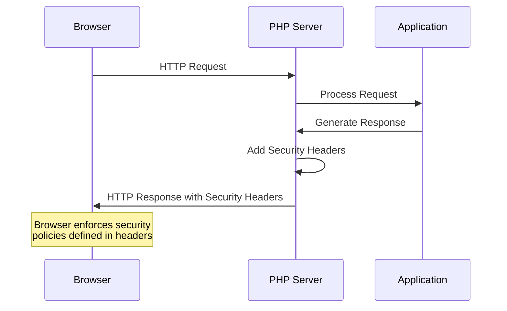

# PHP Security Headers

## Introduction

HTTP security headers are special instructions sent from your web server to the browser that enhance the security of your website. They act as an additional layer of defense against various attacks like Cross-Site Scripting (XSS), clickjacking, and other code injection attacks. In this guide, we'll explore how to implement these important security headers in PHP applications.

As web threats continue to evolve, properly configured security headers have become essential for any production website. The good news is that PHP makes it relatively easy to add these protective measures to your applications!

## Why Security Headers Matter

Before diving into implementation, let's understand why security headers are crucial:

1. They help mitigate common web vulnerabilities
2. They enhance your site's security posture with minimal effort
3. They often improve your security ratings in tools like Mozilla Observatory or Security Headers
4. They protect your users from various attack vectors

## Common Security Headers

Let's explore the most important security headers you should consider implementing in your PHP applications:

### 1. Content-Security-Policy (CSP)

Content Security Policy is one of the most powerful security headers. It helps prevent XSS attacks by controlling which resources (scripts, styles, images, etc.) can be loaded by the browser.

```php
<?php
// Setting a basic Content Security Policy
header("Content-Security-Policy: default-src 'self'; script-src 'self' https://trusted-cdn.com;");
?>
```

This example only allows scripts to be loaded from your own domain and a trusted CDN.

#### Real-world example:

```php
<?php
// A more comprehensive CSP for a PHP application
$csp = "default-src 'self'; " .
       "script-src 'self' https://cdnjs.cloudflare.com https://ajax.googleapis.com; " .
       "style-src 'self' 'unsafe-inline' https://fonts.googleapis.com; " .
       "img-src 'self' data: https://i.imgur.com; " .
       "font-src 'self' https://fonts.gstatic.com; " .
       "connect-src 'self'; " .
       "media-src 'self'; " .
       "object-src 'none'; " .
       "frame-src https://www.youtube.com;";

header("Content-Security-Policy: $csp");
?>
```

### 2. X-XSS-Protection

This header enables the browser's built-in XSS filter to prevent cross-site scripting attacks.

```php
<?php
// Enable XSS protection and instruct browser to block the response if an attack is detected
header("X-XSS-Protection: 1; mode=block");
?>
```

### 3. X-Frame-Options

X-Frame-Options prevents your page from being displayed in frames, iframes, or objects, protecting against clickjacking attacks.

```php
<?php
// Prevent any framing of your content
header("X-Frame-Options: DENY");

// OR allow framing only from the same origin
// header("X-Frame-Options: SAMEORIGIN");
?>
```

### 4. X-Content-Type-Options

This header prevents browsers from MIME-sniffing a response away from the declared content type, reducing the risk of drive-by downloads.

```php
<?php
// Prevent MIME type sniffing
header("X-Content-Type-Options: nosniff");
?>
```

### 5. Strict-Transport-Security (HSTS)

HSTS forces secure connections to your website and helps prevent SSL/TLS downgrade attacks.

```php
<?php
// Enable HSTS with a 1 year duration
header("Strict-Transport-Security: max-age=31536000; includeSubDomains; preload");
?>
```

### 6. Referrer-Policy

Controls how much referrer information should be included with requests.

```php
<?php
// Only send the origin as the referrer
header("Referrer-Policy: origin-when-cross-origin");
?>
```

### 7. Permissions-Policy (formerly Feature-Policy)

Allows you to control which browser features and APIs can be used in your application.

```php
<?php
// Restrict access to sensitive browser features
header("Permissions-Policy: camera=(), microphone=(), geolocation=()");
?>
```

## Implementing All Headers at Once

In a real-world application, you'll likely want to implement multiple security headers together. Here's how you can do that:

```php
<?php
// Function to set all security headers
function setSecurityHeaders() {
    // Content Security Policy
    $csp = "default-src 'self'; " .
           "script-src 'self' https://cdnjs.cloudflare.com; " .
           "style-src 'self' 'unsafe-inline'; " .
           "img-src 'self' data:; " .
           "connect-src 'self'; " .
           "object-src 'none';";
    
    header("Content-Security-Policy: $csp");
    
    // Prevent XSS attacks
    header("X-XSS-Protection: 1; mode=block");
    
    // Prevent clickjacking
    header("X-Frame-Options: SAMEORIGIN");
    
    // Prevent MIME type sniffing
    header("X-Content-Type-Options: nosniff");
    
    // Force HTTPS
    header("Strict-Transport-Security: max-age=31536000; includeSubDomains; preload");
    
    // Control referrer information
    header("Referrer-Policy: strict-origin-when-cross-origin");
    
    // Restrict browser features
    header("Permissions-Policy: camera=(), microphone=(), geolocation=()");
}

// Call the function at the beginning of your script
setSecurityHeaders();

// Rest of your PHP code...
?>
```

## Best Practices for PHP Security Headers

1. **Apply headers early**: Set security headers before any output is sent to the browser.
2. **Test thoroughly**: Use tools like [Mozilla Observatory](https://observatory.mozilla.org/) or [Security Headers](https://securityheaders.com) to verify your headers are working correctly.
3. **Start with restrictive policies**: Begin with strict rules and loosen them as needed rather than the other way around.
4. **Use reporting**: Many headers support report-only modes to test without breaking functionality.

## Implementing Headers in Different PHP Frameworks

### Laravel

In Laravel, you can set headers in the middleware:

```php
<?php
namespace App\Http\Middleware;

use Closure;

class SecurityHeaders
{
    public function handle($request, Closure $next)
    {
        $response = $next($request);
        
        $response->headers->set('Content-Security-Policy', "default-src 'self';");
        $response->headers->set('X-XSS-Protection', '1; mode=block');
        $response->headers->set('X-Frame-Options', 'SAMEORIGIN');
        $response->headers->set('X-Content-Type-Options', 'nosniff');
        
        return $response;
    }
}
?>
```

Register this middleware in your `app/Http/Kernel.php` file:

```php
protected $middlewareGroups = [
    'web' => [
        // Other middleware...
        \App\Http\Middleware\SecurityHeaders::class,
    ],
];
```

### Symfony

In Symfony, you can configure security headers in `config/packages/security.php`:

```php
$container->loadFromExtension('security', [
    // ...
    'firewalls' => [
        'main' => [
            // ...
        ],
    ],
    'headers' => [
        'content_security_policy' => [
            'default-src' => "'self'",
            'script-src' => "'self' 'unsafe-inline'",
        ],
        'x_frame_options' => 'SAMEORIGIN',
        'x_content_type_options' => 'nosniff',
        'x_xss_protection' => '1; mode=block',
        'referrer_policy' => 'strict-origin-when-cross-origin',
    ],
]);
```

### CodeIgniter

In CodeIgniter 4, you can set headers in a filter:

```php
<?php
namespace App\Filters;

use CodeIgniter\HTTP\RequestInterface;
use CodeIgniter\HTTP\ResponseInterface;
use CodeIgniter\Filters\FilterInterface;

class SecurityHeadersFilter implements FilterInterface
{
    public function before(RequestInterface $request, $arguments = null)
    {
        // No actions needed before the controller is executed
    }

    public function after(RequestInterface $request, ResponseInterface $response, $arguments = null)
    {
        $response->setHeader('Content-Security-Policy', "default-src 'self';");
        $response->setHeader('X-XSS-Protection', '1; mode=block');
        $response->setHeader('X-Frame-Options', 'SAMEORIGIN');
        $response->setHeader('X-Content-Type-Options', 'nosniff');
        
        return $response;
    }
}
?>
```

Then register it in `app/Config/Filters.php`:

```php
public $globals = [
    'before' => [
        // existing filters...
    ],
    'after' => [
        'securityHeaders' => ['except' => [
            'api/*'
        ]],
        // existing filters...
    ],
];

public $aliases = [
    // existing aliases...
    'securityHeaders' => \App\Filters\SecurityHeadersFilter::class,
];
```

## Testing Your Headers

It's crucial to test your security headers after implementation. Here's a simple PHP script that checks if your headers are being set correctly:

```php
<?php
$url = "https://your-website.com";
$headers = get_headers($url);

$security_headers = [
    'Content-Security-Policy',
    'X-XSS-Protection',
    'X-Frame-Options',
    'X-Content-Type-Options',
    'Strict-Transport-Security',
    'Referrer-Policy',
    'Permissions-Policy'
];

echo "<h1>Security Headers Check</h1>";
echo "<pre>";

foreach ($headers as $header) {
    foreach ($security_headers as $security_header) {
        if (stripos($header, $security_header) !== false) {
            echo $header . "
";
        }
    }
}

echo "</pre>";
?>
```

## Security Headers Flow

Here's a diagram showing how security headers work in a typical web request:



## Common Pitfalls and Solutions

### 1. Headers Already Sent Error

If you see the "headers already sent" error, you're trying to set headers after output has been sent to the browser.

**Solution**: Make sure you set headers before any HTML or whitespace is output. Check for BOM (Byte Order Mark) in your files and remove it.

```php
<?php
// WRONG - This will cause errors
echo "Hello World";
header("X-XSS-Protection: 1; mode=block"); // Error: headers already sent

// CORRECT
header("X-XSS-Protection: 1; mode=block");
echo "Hello World";
?>
```

### 2. Too Restrictive CSP

A common issue is setting a CSP that's too restrictive, breaking site functionality.

**Solution**: Use CSP report-only mode first to test your policy:

```php
<?php
// Test your CSP without enforcing it
header("Content-Security-Policy-Report-Only: default-src 'self'; report-uri /csp-violation-report-endpoint");
?>
```

### 3. Conflicts with Third-Party Resources

Security headers can sometimes conflict with third-party scripts or services.

**Solution**: Modify your policies to explicitly allow necessary resources:

```php
<?php
// Allow specific third-party resources
$csp = "default-src 'self'; " .
       "script-src 'self' https://analytics.example.com; " .
       "img-src 'self' https://images.example.com;";

header("Content-Security-Policy: $csp");
?>
```

## Summary

Security headers are a crucial component of modern web application security. In this guide, we've covered:

1. The importance of security headers in PHP applications
2. Key security headers and how to implement them
3. How to set up headers in different PHP frameworks
4. Testing and troubleshooting your security headers
5. Best practices for effective header implementation

By properly implementing security headers in your PHP applications, you can significantly enhance your website's security posture and protect your users from common web attacks.

## Additional Resources

For further learning, check out these resources:

1. [OWASP Secure Headers Project](https://owasp.org/www-project-secure-headers/)
2. [Mozilla Web Security Guidelines](https://infosec.mozilla.org/guidelines/web_security)
3. [Content Security Policy Reference](https://content-security-policy.com/)
4. [Security Headers Scanner](https://securityheaders.com)

## Exercises

To reinforce your understanding, try these exercises:

1. Implement a basic set of security headers in a PHP file and test them using the Mozilla Observatory.
2. Create a middleware for Laravel that sets all the security headers we've discussed.
3. Gradually build a Content Security Policy for an existing website, starting with report-only mode.
4. Write a PHP script that tests a website for the presence of security headers and generates a report.