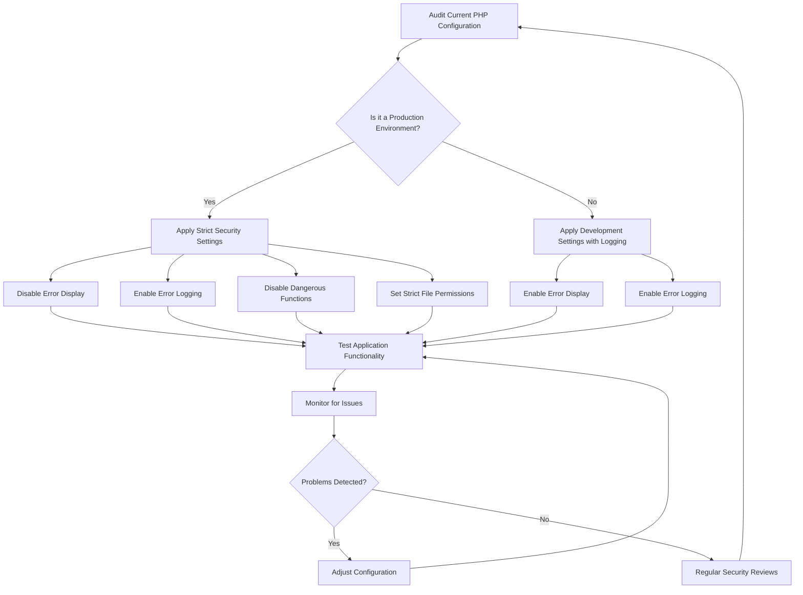

# PHP Configuration Security

## Introduction

PHP configuration plays a crucial role in the security of your web applications. Proper configuration helps protect against common vulnerabilities, unauthorized access, and data breaches. In this guide, we'll explore essential PHP configuration settings that enhance security, showing you how to implement them with practical examples.

Understanding and implementing secure PHP configurations is a fundamental step in developing robust web applications. Even the most well-written code can be compromised if PHP itself isn't configured securely on your server.

## Why PHP Configuration Security Matters

Before diving into specific settings, let's understand why PHP configuration security is essential:

1. **Default settings aren't always secure** - PHP's default configuration prioritizes compatibility and ease of use over security
2. **Different environments need different configurations** - Development and production environments should have different security settings
3. **Configuration affects all applications** - Insecure PHP settings can compromise even well-written applications
4. **Many attacks target misconfiguration** - Attackers often look for common configuration weaknesses

## Essential php.ini Security Settings

PHP's main configuration file is typically called `php.ini`. Here are key security settings you should adjust:

### 1. Disable Dangerous Functions

PHP includes functions that can be dangerous if misused. You should disable functions you don't need, especially those that allow system access.

```php
// In php.ini
disable_functions = exec,passthru,shell_exec,system,proc_open,popen,curl_exec,curl_multi_exec,parse_ini_file,show_source
```

**Explanation**: This prevents PHP scripts from executing system commands, which is a common attack vector.

### 2. Limit File System Access

Restrict where PHP can read from and write to on your file system:

```php
// In php.ini
open_basedir = /var/www/html/:/tmp/
```

**Explanation**: This limits PHP's access to only the specified directories, preventing attackers from accessing sensitive system files.

### 3. Hide PHP Information

Don't reveal PHP version information to potential attackers:

```php
// In php.ini
expose_php = Off
```

**Before (with expose_php = On)**:
HTTP Response Headers would include:
```
X-Powered-By: PHP/8.1.2
```

**After (with expose_php = Off)**:
The PHP version information is no longer included in headers.

### 4. Control Error Reporting

In production, hide detailed error messages from users:

```php
// In php.ini for development
display_errors = On
display_startup_errors = On
error_reporting = E_ALL

// In php.ini for production
display_errors = Off
display_startup_errors = Off
error_reporting = E_ALL
log_errors = On
error_log = /path/to/error.log
```

**Explanation**: Detailed error messages can reveal sensitive information about your application structure and database. In production, log errors instead of displaying them.

### 5. Secure Session Management

Configure sessions securely:

```php
// In php.ini
session.use_strict_mode = 1
session.use_only_cookies = 1
session.cookie_httponly = 1
session.cookie_secure = 1
session.cookie_samesite = "Strict"
session.gc_maxlifetime = 1440
```

**Explanation**:
- `use_strict_mode`: Only accepts valid session IDs generated by PHP
- `use_only_cookies`: Prevents session IDs in URLs
- `cookie_httponly`: Makes cookies inaccessible to JavaScript
- `cookie_secure`: Sends cookies only over HTTPS
- `cookie_samesite`: Prevents cross-site request forgery
- `gc_maxlifetime`: Sets session timeout (in seconds)

## Implementing Security with .htaccess

If you're using Apache, you can enhance PHP security with `.htaccess` file configurations:

```apache
# Disable PHP execution in uploads directory
<Directory "/var/www/html/uploads">
    php_flag engine off
</Directory>

# Set PHP configuration values
php_flag display_errors off
php_flag log_errors on
php_value error_log /path/to/error.log
```

## PHP-FPM Configuration Security

If you're using PHP-FPM (FastCGI Process Manager), there are additional security considerations:

```ini
; In php-fpm.conf or pool configuration
user = www-data
group = www-data
listen.owner = www-data
listen.group = www-data
listen.mode = 0660
```

**Explanation**: This ensures PHP-FPM processes run with appropriate permissions, reducing the risk of privilege escalation attacks.

## Checking Your PHP Configuration

You can create a simple PHP script to check your current configuration settings:

```php
<?php
// save as phpinfo.php
phpinfo();
?>
```

**Warning**: This script displays sensitive information. Use it only temporarily for configuration checks, and remove it immediately after use.

Alternatively, use a safer approach for checking specific settings:

```php
<?php
// save as check-config.php
$important_settings = [
    'display_errors',
    'expose_php',
    'open_basedir',
    'disable_functions',
    'allow_url_fopen',
    'allow_url_include'
];

echo "<h1>PHP Security Settings</h1>";
echo "<table border='1'>";
echo "<tr><th>Setting</th><th>Current Value</th><th>Recommended</th></tr>";

foreach ($important_settings as $setting) {
    echo "<tr>";
    echo "<td>$setting</td>";
    echo "<td>" . ini_get($setting) . "</td>";
    
    $recommended = "";
    switch ($setting) {
        case 'display_errors': $recommended = "Off"; break;
        case 'expose_php': $recommended = "Off"; break;
        case 'open_basedir': $recommended = "/var/www/html/:/tmp/"; break;
        case 'disable_functions': $recommended = "exec,passthru,shell_exec,system..."; break;
        case 'allow_url_fopen': $recommended = "Off"; break;
        case 'allow_url_include': $recommended = "Off"; break;
    }
    
    echo "<td>$recommended</td>";
    echo "</tr>";
}

echo "</table>";
?>
```

**Output Example**:


## Security Configuration Workflow

The following diagram illustrates a recommended workflow for securing PHP configuration:



## Common PHP Configuration Vulnerabilities

Be aware of these common configuration-related vulnerabilities:

1. **Remote File Inclusion** - Enabled by `allow_url_include = On`
2. **Information Disclosure** - Caused by `display_errors = On` in production
3. **Command Execution** - Possible when dangerous functions aren't disabled
4. **Directory Traversal** - More likely without `open_basedir` restrictions
5. **Session Hijacking** - Risk increases with insecure session settings

## Practical Example: Securing a WordPress Installation

Let's apply these concepts to securing a WordPress installation:

1. Create a custom `php.ini` file in your WordPress root directory:

```php
// Custom php.ini for WordPress
display_errors = Off
log_errors = On
error_log = /path/to/wordpress-errors.log
allow_url_include = Off
allow_url_fopen = Off
disable_functions = exec,passthru,shell_exec,system,proc_open,popen
open_basedir = /var/www/wordpress/:/tmp/
max_execution_time = 30
memory_limit = 64M
file_uploads = On
upload_max_filesize = 10M
post_max_size = 10M
session.use_only_cookies = 1
session.cookie_httponly = 1
session.cookie_secure = 1
```

2. Create a `.htaccess` file with additional protections:

```apache
# Protect wp-config.php
<Files wp-config.php>
    Order Allow,Deny
    Deny from all
</Files>

# Protect .htaccess
<Files .htaccess>
    Order Allow,Deny
    Deny from all
</Files>

# Disable PHP execution in uploads directory
<Directory "/var/www/wordpress/wp-content/uploads">
    php_flag engine off
</Directory>
```

## Summary

Proper PHP configuration is a fundamental aspect of web application security. In this guide, we've covered:

- Essential `php.ini` security settings
- Session security configuration
- Using `.htaccess` for additional protection
- PHP-FPM security considerations
- Methods to check your current configuration
- A practical example for WordPress security

Remember that security is an ongoing process. Regularly review your PHP configuration settings, stay updated on security best practices, and adjust your settings as your application's needs evolve.

## Additional Resources

- [PHP Security Manual](https://www.php.net/manual/en/security.php)
- [OWASP PHP Security Cheat Sheet](https://cheatsheetseries.owasp.org/cheatsheets/PHP_Configuration_Cheat_Sheet.html)
- [PHP Security Consortium](http://phpsec.org/projects/guide/)

## Exercises

1. Create a PHP script that checks for common security misconfigurations on your server.
2. Set up different PHP configuration files for development and production environments.
3. Configure PHP-FPM with secure pool settings for a multi-site environment.
4. Implement proper error logging for a PHP application without exposing sensitive information.
5. Use the `open_basedir` directive to restrict file system access for a specific web application.