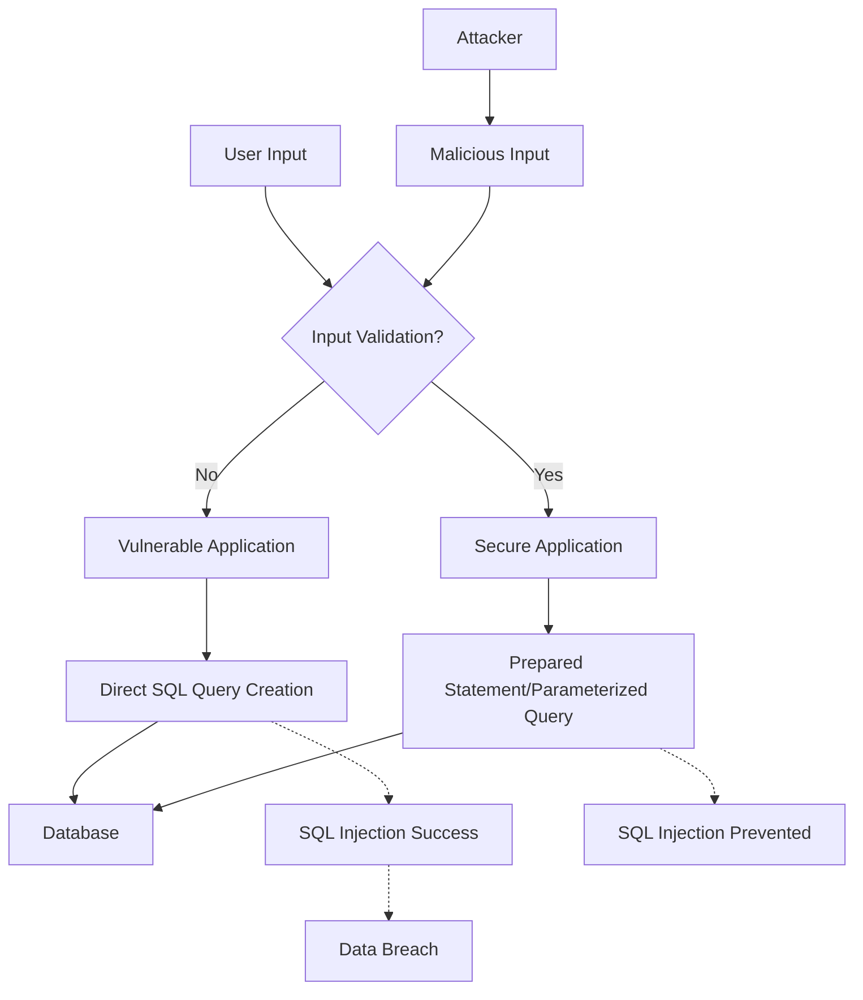

# PHP SQL Injection

## Introduction

SQL Injection is one of the most common and dangerous web application vulnerabilities. It occurs when an attacker can insert or "inject" malicious SQL code into queries that your application sends to its database. For PHP developers working with databases, understanding this vulnerability is essential for building secure applications.

In this tutorial, we'll explore:
- What SQL injection is and how it works
- Common types of SQL injection attacks
- How to identify vulnerable code
- Best practices to prevent SQL injection
- Practical examples with secure alternatives

## What is SQL Injection?

SQL Injection is a code injection technique where an attacker inserts ("injects") malicious SQL statements into entry fields in a web application. These malicious statements can read sensitive data, modify database data, execute administration operations, and in some cases even issue commands to the operating system.

### How SQL Injection Works

Consider this simple PHP code that retrieves a user from a database:

```php
// Vulnerable code
$username = $_GET['username'];
$query = "SELECT * FROM users WHERE username = '$username'";
$result = mysqli_query($connection, $query);
```

This code takes the `username` parameter directly from a GET request and inserts it into an SQL query without any validation or sanitization. If a legitimate user provides `john` as the username, the query becomes:

```sql
SELECT * FROM users WHERE username = 'john'
```

However, an attacker could input something like: `' OR '1'='1`

This would transform the query into:

```sql
SELECT * FROM users WHERE username = '' OR '1'='1'
```

Since `'1'='1'` is always true, this query returns all records from the users table, potentially exposing sensitive information about all users.

## Types of SQL Injection Attacks

### 1. Classic (In-band) SQL Injection

This is the most common type where attackers can receive direct responses from the database.

#### Error-based Injection
Attackers force the database to generate an error that might reveal information about the database structure.

Example attack input:
```
' OR (SELECT 1 FROM nonexistent_table) = '1
```

#### Union-based Injection
Attackers use the UNION SQL operator to combine the results of two or more SELECT statements into a single result.

Example attack input:
```
' UNION SELECT username, password FROM users; --
```

### 2. Blind SQL Injection

In blind SQL injection, the attacker doesn't receive direct feedback from the database.

#### Boolean-based Blind
The attacker asks the database true/false questions and determines the answer based on the application's response.

Example attack input:
```
' OR (SELECT SUBSTRING(username,1,1) FROM users WHERE id=1)='a
```

#### Time-based Blind
The attacker uses database functions that delay responses to determine if a condition is true or false.

Example attack input:
```
' OR IF((SELECT 1 FROM users WHERE username='admin'), SLEEP(5), 0); --
```

## Identifying Vulnerable Code

Look for PHP code that:

1. Directly uses user input in SQL queries
2. Lacks proper input validation
3. Doesn't use prepared statements or parameterized queries
4. Relies only on simple escaping functions

Vulnerable patterns include:

```php
// Direct concatenation of user input
$query = "SELECT * FROM products WHERE category = '" . $_GET['category'] . "'";

// Using variables without validation
$id = $_POST['product_id'];
$query = "DELETE FROM products WHERE id = $id";

// Unescaped user input in queries
$search = $_GET['search'];
$query = "SELECT * FROM articles WHERE title LIKE '%$search%'";
```

## Prevention Techniques

### 1. Use Prepared Statements with Parameterized Queries

Prepared statements separate SQL code from data, ensuring user input is never treated as part of the SQL command.

```php
// Using MySQLi with prepared statements
$stmt = $mysqli->prepare("SELECT * FROM users WHERE username = ?");
$stmt->bind_param("s", $username); // 's' specifies the parameter type => 'string'
$stmt->execute();
$result = $stmt->get_result();

// Using PDO with prepared statements
$stmt = $pdo->prepare("SELECT * FROM users WHERE username = :username");
$stmt->bindParam(':username', $username, PDO::PARAM_STR);
$stmt->execute();
$result = $stmt->fetchAll();
```

### 2. Input Validation

Always validate user input before using it in your application:

```php
// Validate that an ID is actually an integer
$id = filter_input(INPUT_GET, 'id', FILTER_VALIDATE_INT);
if ($id === false) {
    // Handle invalid input
    die("Invalid ID parameter");
}

// Now you can safely use $id in your query
$stmt = $pdo->prepare("SELECT * FROM products WHERE id = :id");
$stmt->bindParam(':id', $id, PDO::PARAM_INT);
$stmt->execute();
```

### 3. Escaping User Input

If you can't use prepared statements, at least escape the input (not recommended as the primary defense):

```php
// Using MySQLi
$username = mysqli_real_escape_string($connection, $_POST['username']);
$query = "SELECT * FROM users WHERE username = '$username'";

// Using PDO
$username = $pdo->quote($_POST['username']);
$query = "SELECT * FROM users WHERE username = $username";
```

### 4. Use ORM Libraries

Object-Relational Mapping (ORM) libraries like Doctrine, Eloquent (Laravel), or Propel often include protection against SQL injection:

```php
// Example using Laravel's Eloquent ORM
$users = User::where('email', $email)->get();

// Example using Doctrine ORM
$users = $entityManager->getRepository(User::class)->findBy(['email' => $email]);
```

## Real-world Example: Login System

Let's compare vulnerable and secure implementations of a simple login system:

### Vulnerable Implementation

```php
// Vulnerable login system
function loginUser($username, $password) {
    global $conn;
    
    $query = "SELECT * FROM users WHERE username = '$username' AND password = '$password'";
    $result = mysqli_query($conn, $query);
    
    if (mysqli_num_rows($result) > 0) {
        return true; // Login successful
    }
    
    return false; // Login failed
}

// Usage:
if (loginUser($_POST['username'], $_POST['password'])) {
    echo "Login successful!";
} else {
    echo "Invalid credentials!";
}
```

Issues with this code:
- Direct insertion of user input into the SQL query
- No validation of inputs
- Plaintext password storage (a separate security issue)

### Secure Implementation

```php
// Secure login system using prepared statements and password hashing
function loginUser($username, $password) {
    global $pdo;
    
    // Prepare the SQL statement
    $stmt = $pdo->prepare("SELECT id, password FROM users WHERE username = :username");
    $stmt->bindParam(':username', $username, PDO::PARAM_STR);
    $stmt->execute();
    
    $user = $stmt->fetch(PDO::FETCH_ASSOC);
    
    // Verify the password if user exists
    if ($user && password_verify($password, $user['password'])) {
        return true; // Login successful
    }
    
    return false; // Login failed
}

// Usage:
if (loginUser($_POST['username'], $_POST['password'])) {
    echo "Login successful!";
} else {
    echo "Invalid credentials!";
}
```

Improvements:
- Uses prepared statements to prevent SQL injection
- Employs password hashing with `password_verify()` for secure password verification
- Separates SQL code from user input

## Visual Representation of SQL Injection

Here's a diagram showing how SQL injection works:



## Common Attack Vectors and Prevention

Here's a table showing common SQL injection patterns and how to prevent them:

| Attack Vector | Example Input | Prevention Technique |
|--------------|---------------|----------------------|
| Basic SQL Injection | `' OR '1'='1` | Use prepared statements |
| Comment-based Injection | `admin'--` | Parameterized queries |
| Union-based Injection | `' UNION SELECT username,password FROM users--` | Input validation and prepared statements |
| Batch Queries | `'; DROP TABLE users;--` | Database permissions and prepared statements |
| Time-based Blind Injection | `' OR IF(1=1,SLEEP(5),0)--` | Timeouts and prepared statements |

## Best Practices Summary

1. **Always use prepared statements with parameterized queries**
2. **Implement strict input validation** for all user-supplied data
3. **Apply the principle of least privilege** to database accounts
4. **Use ORM frameworks** when possible
5. **Keep your database systems updated** with security patches
6. **Implement a Web Application Firewall (WAF)** as an additional layer of defense
7. **Use error handling** that doesn't expose database information
8. **Apply HTTPS** to prevent traffic interception
9. **Regularly test your applications** for SQL injection vulnerabilities

## Practical Exercise: Securing a Search Form

Here's a practical exercise to help reinforce what you've learned:

1. Identify the vulnerability in this code:
```php
// Search products
$search = $_GET['q'];
$query = "SELECT * FROM products WHERE name LIKE '%$search%' OR description LIKE '%$search%'";
$result = mysqli_query($connection, $query);
```

2. Rewrite it using prepared statements:
```php
// Secure search implementation
$search = $_GET['q'];
$searchPattern = "%$search%";

$stmt = $pdo->prepare("SELECT * FROM products WHERE name LIKE :pattern OR description LIKE :pattern");
$stmt->bindParam(':pattern', $searchPattern, PDO::PARAM_STR);
$stmt->execute();
$result = $stmt->fetchAll();
```

3. For an extra challenge, enhance the security further by:
   - Adding input validation
   - Limiting the number of results
   - Adding logging for suspicious inputs

## Conclusion

SQL injection remains one of the most prevalent and dangerous vulnerabilities in web applications. By understanding how these attacks work and implementing proper security measures like prepared statements, input validation, and following security best practices, you can protect your PHP applications and your users' data from these threats.

Remember:
- Never trust user input
- Always separate code from data
- Use prepared statements consistently
- Apply multiple layers of defense

## Additional Resources

- [OWASP SQL Injection Prevention Cheat Sheet](https://cheatsheetseries.owasp.org/cheatsheets/SQL_Injection_Prevention_Cheat_Sheet.html)
- [PHP Manual: mysqli_prepare](https://www.php.net/manual/en/mysqli.prepare.php)
- [PHP Manual: PDO Prepared Statements](https://www.php.net/manual/en/pdo.prepared-statements.php)
- [SQL Injection Attack Simulator for Training](https://portswigger.net/web-security/sql-injection)

## Practice Exercises

1. Create a secure product catalog that retrieves products by category using prepared statements
2. Build a user registration system with proper input validation and SQL injection protection
3. Write a function that can sanitize an array of input values for safe SQL usage
4. Audit existing code to identify and fix potential SQL injection vulnerabilities
5. Implement a security test suite that tries common SQL injection patterns against your application