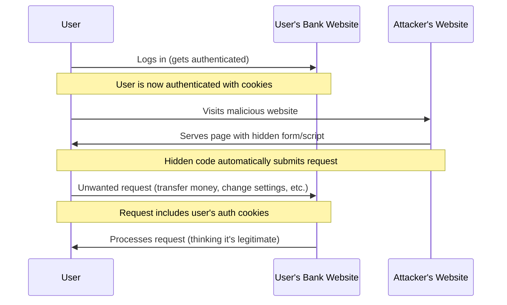

# PHP CSRF Protection

## Introduction

Cross-Site Request Forgery (CSRF) is a common web security vulnerability that allows attackers to trick users into performing unwanted actions on websites where they're already authenticated. As a PHP developer, understanding and implementing CSRF protection is essential for building secure web applications.

In this tutorial, you'll learn:
- What CSRF attacks are and how they work
- Why CSRF protection is crucial for web applications
- How to implement CSRF protection in PHP applications
- Best practices for handling CSRF tokens

## What is a CSRF Attack?

A Cross-Site Request Forgery attack occurs when a malicious website, email, or application causes a user's web browser to perform an unwanted action on a site where the user is currently authenticated. 

Let's visualize how a CSRF attack works:



### Example Attack Scenario

Imagine a user is logged into their online banking portal. Without logging out, they open another tab and visit a malicious website. This website contains code that automatically sends a request to transfer money from the user's account:

```html
<!-- Malicious form on attacker's website -->
<html>
  <body onload="document.forms[0].submit()">
    <form action="https://bank.example.com/transfer" method="POST">
      <input type="hidden" name="recipient" value="attacker-account" />
      <input type="hidden" name="amount" value="1000" />
    </form>
  </body>
</html>
```

When this page loads, it automatically submits a request to the bank's transfer endpoint. Since the user is still authenticated with the bank, the browser includes their authentication cookies, and the bank processes the request as legitimate.

## Why CSRF Protection Matters

CSRF attacks can lead to:
- Unauthorized transactions
- Changed user passwords or email addresses
- Data theft or manipulation
- Account compromise

Implementing CSRF protection is essential for:
- Protecting your users' accounts and data
- Meeting security compliance requirements
- Building trust in your application
- Preventing potential financial or reputational damage

## How to Implement CSRF Protection in PHP

The most common approach to protect against CSRF attacks is using tokens. A CSRF token is a unique, random value generated for each user session that must be included with each sensitive request. Here's a step-by-step approach to implement CSRF protection in PHP:

### Step 1: Generate a CSRF Token

First, you need to generate a secure, random token and store it in the user's session:

```php
// Start a session if it's not already started
if (session_status() === PHP_SESSION_NONE) {
    session_start();
}

// Generate a CSRF token if one doesn't exist
if (!isset($_SESSION['csrf_token'])) {
    $_SESSION['csrf_token'] = bin2hex(random_bytes(32));
}

$csrf_token = $_SESSION['csrf_token'];
```

### Step 2: Include the Token in Forms

Add the CSRF token as a hidden field in all your forms:

```php
<form method="POST" action="process_form.php">
    <!-- Your form fields -->
    <input type="text" name="username" placeholder="Username">
    <input type="password" name="password" placeholder="Password">
    
    <!-- CSRF token hidden field -->
    <input type="hidden" name="csrf_token" value="<?php echo $csrf_token; ?>">
    
    <button type="submit">Submit</button>
</form>
```

### Step 3: Validate the Token on Form Submission

When processing form submissions, verify that the submitted token matches the one stored in the session:

```php
// Start session
session_start();

// Check if the token exists and matches
if (!isset($_POST['csrf_token']) || !isset($_SESSION['csrf_token']) || 
    $_POST['csrf_token'] !== $_SESSION['csrf_token']) {
    // Token is invalid - handle the error
    die('CSRF token validation failed. Form submission rejected.');
}

// Token is valid, process the form
// Your form processing code here
echo "Form processed successfully!";
```

### Step 4: Add CSRF Protection for AJAX Requests

For AJAX requests, you can include the CSRF token in the request headers:

```javascript
// JavaScript for including CSRF token in AJAX requests
const csrfToken = '<?php echo $csrf_token; ?>';

// Example AJAX request with fetch
fetch('your-endpoint.php', {
    method: 'POST',
    headers: {
        'Content-Type': 'application/json',
        'X-CSRF-Token': csrfToken
    },
    body: JSON.stringify({
        // your data
    })
})
.then(response => response.json())
.then(data => console.log(data))
.catch(error => console.error('Error:', error));
```

On the server side, validate the token from the header:

```php
// PHP code to validate CSRF token from AJAX request
session_start();

// Get the CSRF token from the request header
$csrf_token = $_SERVER['HTTP_X_CSRF_TOKEN'] ?? '';

// Validate the token
if (!isset($_SESSION['csrf_token']) || $csrf_token !== $_SESSION['csrf_token']) {
    // Return error response
    header('Content-Type: application/json');
    http_response_code(403);
    echo json_encode(['error' => 'CSRF token validation failed']);
    exit;
}

// Process the request
// Your code here
```

## Creating a Reusable CSRF Protection Class

For larger applications, it's beneficial to create a reusable class to handle CSRF protection:

```php
<?php
class CSRFProtection {
    /**
     * Generate a CSRF token and store it in the session
     */
    public static function generateToken() {
        if (session_status() === PHP_SESSION_NONE) {
            session_start();
        }
        
        if (!isset($_SESSION['csrf_token'])) {
            $_SESSION['csrf_token'] = bin2hex(random_bytes(32));
        }
        
        return $_SESSION['csrf_token'];
    }
    
    /**
     * Return the current CSRF token
     */
    public static function getToken() {
        return isset($_SESSION['csrf_token']) ? $_SESSION['csrf_token'] : self::generateToken();
    }
    
    /**
     * Generate HTML for a CSRF token hidden input
     */
    public static function tokenField() {
        $token = self::getToken();
        return '<input type="hidden" name="csrf_token" value="' . htmlspecialchars($token) . '">';
    }
    
    /**
     * Validate a submitted CSRF token
     */
    public static function validateToken($submittedToken) {
        if (session_status() === PHP_SESSION_NONE) {
            session_start();
        }
        
        if (!isset($_SESSION['csrf_token']) || !$submittedToken) {
            return false;
        }
        
        return hash_equals($_SESSION['csrf_token'], $submittedToken);
    }
}
?>
```

### Example Usage of the CSRF Class

In your form page:

```php
<?php
require_once 'CSRFProtection.php';
$token = CSRFProtection::getToken();
?>

<form method="POST" action="process.php">
    <input type="text" name="email" placeholder="Email">
    <?php echo CSRFProtection::tokenField(); ?>
    <button type="submit">Subscribe</button>
</form>
```

In your form processing script:

```php
<?php
require_once 'CSRFProtection.php';

// Check the CSRF token
if (!CSRFProtection::validateToken($_POST['csrf_token'] ?? '')) {
    // Invalid token
    http_response_code(403);
    die('CSRF protection triggered. Form submission rejected.');
}

// Token is valid, process the form
$email = $_POST['email'] ?? '';
// Process the subscription...
echo "Thank you for subscribing!";
?>
```

## Real-World Example: Secure Contact Form

Let's build a complete example of a secure contact form with CSRF protection:

### contact.php (Form Page)

```php
<?php
require_once 'CSRFProtection.php';
$token = CSRFProtection::getToken();

// Check if form was submitted and processed successfully
$success = false;
$error = false;

if (isset($_GET['success']) && $_GET['success'] === '1') {
    $success = true;
}
?>

<!DOCTYPE html>
<html lang="en">
<head>
    <meta charset="UTF-8">
    <meta name="viewport" content="width=device-width, initial-scale=1.0">
    <title>Secure Contact Form</title>
    <style>
        body { font-family: Arial, sans-serif; max-width: 600px; margin: 0 auto; padding: 20px; }
        .form-group { margin-bottom: 15px; }
        label { display: block; margin-bottom: 5px; }
        input, textarea { width: 100%; padding: 8px; box-sizing: border-box; }
        button { padding: 10px 15px; background: #4CAF50; color: white; border: none; cursor: pointer; }
        .success { color: green; background: #E8F5E9; padding: 10px; border-radius: 5px; }
        .error { color: red; background: #FFEBEE; padding: 10px; border-radius: 5px; }
    </style>
</head>
<body>
    <h1>Contact Us</h1>
    
    <?php if ($success): ?>
        <div class="success">Your message has been sent successfully!</div>
    <?php endif; ?>
    
    <?php if ($error): ?>
        <div class="error">There was an error sending your message. Please try again.</div>
    <?php endif; ?>
    
    <form method="POST" action="process_contact.php">
        <div class="form-group">
            <label for="name">Your Name:</label>
            <input type="text" id="name" name="name" required>
        </div>
        
        <div class="form-group">
            <label for="email">Email Address:</label>
            <input type="email" id="email" name="email" required>
        </div>
        
        <div class="form-group">
            <label for="message">Message:</label>
            <textarea id="message" name="message" rows="5" required></textarea>
        </div>
        
        <?php echo CSRFProtection::tokenField(); ?>
        
        <button type="submit">Send Message</button>
    </form>
</body>
</html>
```

### process_contact.php (Form Processing)

```php
<?php
require_once 'CSRFProtection.php';

// Validate CSRF token
if (!CSRFProtection::validateToken($_POST['csrf_token'] ?? '')) {
    // CSRF validation failed
    http_response_code(403);
    die('CSRF protection triggered. Form submission rejected.');
}

// Get form data
$name = $_POST['name'] ?? '';
$email = $_POST['email'] ?? '';
$message = $_POST['message'] ?? '';

// Validate form data (basic validation)
if (empty($name) || empty($email) || empty($message)) {
    die('Please fill in all required fields.');
}

if (!filter_var($email, FILTER_VALIDATE_EMAIL)) {
    die('Please enter a valid email address.');
}

// In a real application, you would process the form data
// For example, send an email or save to a database
// Here we'll just simulate success

// Redirect back to the form with success message
header('Location: contact.php?success=1');
exit;
?>
```

## Best Practices for CSRF Protection

To ensure your CSRF protection is effective, follow these best practices:

1. **Use a cryptographically strong random token**: Always use functions like `random_bytes()` or `openssl_random_pseudo_bytes()` to generate tokens.

2. **Compare tokens using safe comparison**: Use `hash_equals()` for token comparison to prevent timing attacks.

3. **Regenerate tokens**: For highly sensitive applications, consider regenerating tokens after each valid form submission.

4. **Set appropriate cookie security flags**: Use the `HttpOnly`, `Secure`, and `SameSite` flags for your session cookies:

```php
// Start a secure session
ini_set('session.cookie_httponly', 1);
ini_set('session.cookie_secure', 1);
ini_set('session.cookie_samesite', 'Lax');
session_start();
```

5. **Implement expiration for tokens**: Consider making tokens expire after a certain period:

```php
// Generate a token with expiration time
if (!isset($_SESSION['csrf_token']) || time() > $_SESSION['csrf_token_expiry']) {
    $_SESSION['csrf_token'] = bin2hex(random_bytes(32));
    $_SESSION['csrf_token_expiry'] = time() + 3600; // Expires in 1 hour
}
```

6. **Implement CSRF protection for all sensitive operations**: Any action that changes state (like user settings, posting content, etc.) should be protected.

7. **Use frameworks with built-in CSRF protection**: Many PHP frameworks like Laravel, Symfony, and CodeIgniter provide built-in CSRF protection mechanisms.

## Using PHP Frameworks for CSRF Protection

Most modern PHP frameworks provide built-in CSRF protection. Here are examples of how to use them:

### Laravel CSRF Protection

Laravel automatically generates CSRF tokens for your application. In forms:

```html
<form method="POST" action="/profile">
    @csrf
    <!-- Form fields -->
    <button type="submit">Update Profile</button>
</form>
```

For AJAX requests, you can include the token in the meta tag and headers:

```html
<meta name="csrf-token" content="{{ csrf_token() }}">

<script>
    $.ajaxSetup({
        headers: {
            'X-CSRF-TOKEN': $('meta[name="csrf-token"]').attr('content')
        }
    });
</script>
```

### Symfony CSRF Protection

Symfony provides CSRF protection through its Forms component:

```php
use Symfony\Component\Form\Extension\Core\Type\SubmitType;
use Symfony\Component\Form\Extension\Core\Type\TextType;

$form = $this->createFormBuilder()
    ->add('name', TextType::class)
    ->add('email', TextType::class)
    ->add('save', SubmitType::class, ['label' => 'Submit'])
    ->getForm();
```

The form automatically includes a CSRF token.

## Common CSRF Protection Pitfalls

Be aware of these common issues when implementing CSRF protection:

1. **Forgetting to validate tokens**: Always validate tokens on form submission.

2. **Using predictable tokens**: Never use predictable or sequential values for tokens.

3. **Storing tokens in local storage**: Tokens should be stored in session cookies, not in localStorage or sessionStorage.

4. **Not protecting AJAX requests**: Remember to include token validation for AJAX endpoints.

5. **Sharing tokens across subdomains**: Different subdomains should use different tokens.

6. **Ignoring token expiration**: Implement token expiration for enhanced security.

## Summary

CSRF protection is an essential security measure for any PHP web application that processes user input. By implementing CSRF tokens, you can protect your users from malicious attacks that attempt to trick them into performing unwanted actions.

In this tutorial, you've learned:
- How CSRF attacks work and why they're dangerous
- How to implement basic CSRF protection using tokens
- How to create a reusable CSRF protection class
- Best practices for robust CSRF security
- How to use built-in CSRF protection in popular PHP frameworks

Always remember: Security is an ongoing process, not a one-time implementation. Regularly review and update your security measures to keep your applications safe from evolving threats.

## Additional Resources

- [OWASP CSRF Prevention Cheat Sheet](https://cheatsheetseries.owasp.org/cheatsheets/Cross-Site_Request_Forgery_Prevention_Cheat_Sheet.html)
- [PHP Security Best Practices](https://phptherightway.com/#security)
- [The PHP Security Checklist](https://www.sqreen.com/checklists/php-security-checklist)

## Exercises

1. Implement the `CSRFProtection` class in a small PHP project and test it with a simple form.
2. Modify the CSRF class to include token expiration and regeneration.
3. Create a secure AJAX-based form that includes CSRF protection.
4. Analyze an existing PHP application for potential CSRF vulnerabilities and implement protection.
5. Implement CSRF protection in a multi-page web application, ensuring token persistence across pages.