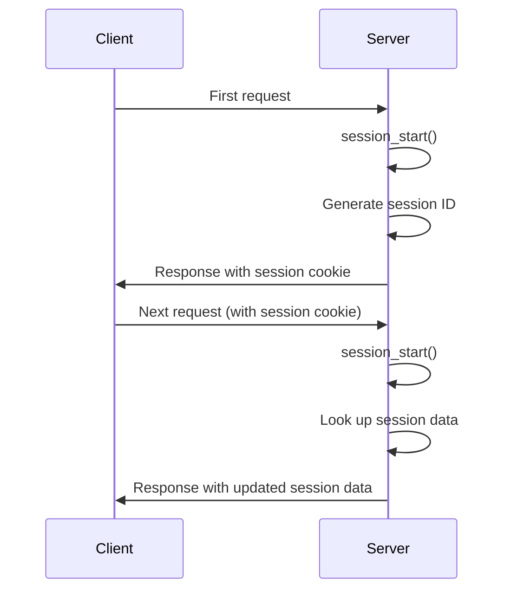

# PHP Session Security

## Introduction

Sessions are a fundamental concept in web development that allow websites to maintain state and remember information about users as they navigate through different pages. In PHP, sessions provide a way to store user data across multiple page requests, making them essential for features like user authentication, shopping carts, and personalized user experiences.

However, sessions can also become a significant security vulnerability if not implemented correctly. Since sessions often store sensitive user information, they are a prime target for attackers. This guide will explore the various security risks associated with PHP sessions and provide practical techniques to secure your session management.

## Understanding PHP Sessions

Before we dive into security considerations, let's quickly review how PHP sessions work.

```php
// Start a new session or resume an existing one
session_start();

// Store data in the session
$_SESSION['username'] = 'john_doe';
$_SESSION['user_id'] = 123;

// Retrieve data from the session
echo "Welcome back, " . $_SESSION['username'];
```

When `session_start()` is called, PHP generates a unique session ID (typically stored in a cookie called PHPSESSID) and creates a file on the server to store session data. This session ID is sent back and forth between the client and server to identify the user's session.



## Common Session Security Vulnerabilities

### 1. Session Hijacking

Session hijacking occurs when an attacker steals a user's session ID and uses it to impersonate the user.

**Example of vulnerable code:**

```php
// Starting a session without secure settings
session_start();

if (isset($_POST['username']) && isset($_POST['password'])) {
    // Authenticate user (assume this works correctly)
    $_SESSION['user_id'] = 123;
    $_SESSION['is_admin'] = true;
}
```

In this example, if the session ID is intercepted (through network sniffing, XSS, etc.), an attacker could use it to gain admin access.

### 2. Session Fixation

Session fixation happens when an attacker sets a user's session ID to one they know, then waits for the user to log in.

**Vulnerable scenario:**

```php
// Notice we don't regenerate the session ID after login
session_start();

if (isset($_POST['username']) && isset($_POST['password'])) {
    // Authenticate user
    $_SESSION['authenticated'] = true;
    // No session ID regeneration!
}
```

### 3. Cross-Site Scripting (XSS) and Session Data

XSS can be used to steal session cookies if they're not properly protected.

**Vulnerable code:**

```php
// Session cookie with insufficient protection
session_start();

// Outputting user input without sanitization
echo "Welcome, " . $_GET['name'];
```

## Best Practices for PHP Session Security

### 1. Configure Secure Session Settings

Update your PHP settings (in php.ini or using `ini_set()`) to enhance session security:

```php
// Set secure session settings before starting the session
ini_set('session.cookie_httponly', 1); // Prevent JavaScript access to session cookie
ini_set('session.use_only_cookies', 1); // Only use cookies for session handling
ini_set('session.cookie_secure', 1);    // Send cookies only over HTTPS
ini_set('session.cookie_samesite', 'Strict'); // Prevent CSRF attacks

// Then start the session
session_start();
```

### 2. Regenerate Session IDs

Always regenerate session IDs during critical state changes:

```php
// Secure login process
session_start();

if (verify_credentials($_POST['username'], $_POST['password'])) {
    // Regenerate session ID to prevent session fixation
    session_regenerate_id(true);
    
    $_SESSION['user_id'] = get_user_id($_POST['username']);
    $_SESSION['authenticated'] = true;
    $_SESSION['last_activity'] = time();
}
```

### 3. Implement Session Timeouts

Set both idle and absolute timeouts for sessions:

```php
session_start();

// Idle timeout (e.g., 30 minutes)
$idle_timeout = 1800; // 30 minutes in seconds

if (isset($_SESSION['last_activity']) && (time() - $_SESSION['last_activity'] > $idle_timeout)) {
    // User has been inactive for too long
    session_unset();
    session_destroy();
    header("Location: login.php?timeout=1");
    exit;
}

// Update last activity time
$_SESSION['last_activity'] = time();

// Absolute timeout (e.g., 24 hours)
$absolute_timeout = 86400; // 24 hours in seconds

if (isset($_SESSION['created']) && (time() - $_SESSION['created'] > $absolute_timeout)) {
    // Session has existed for too long
    session_unset();
    session_destroy();
    header("Location: login.php?timeout=2");
    exit;
}

// If this is a new session
if (!isset($_SESSION['created'])) {
    $_SESSION['created'] = time();
}
```

### 4. Validate Session Data

Always validate session data before using it:

```php
session_start();

// Function to check if user is logged in and has proper permissions
function is_authenticated_admin() {
    if (!isset($_SESSION['authenticated']) || $_SESSION['authenticated'] !== true) {
        return false;
    }
    
    if (!isset($_SESSION['user_role']) || $_SESSION['user_role'] !== 'admin') {
        return false;
    }
    
    // Additional checks can be added here
    
    return true;
}

// Usage
if (is_authenticated_admin()) {
    // Show admin content
} else {
    // Redirect to login page
    header("Location: login.php?access=denied");
    exit;
}
```

### 5. Secure Session Termination

Properly destroy sessions when users log out:

```php
function secure_logout() {
    // Clear session data
    $_SESSION = array();
    
    // Get session cookie parameters
    $params = session_get_cookie_params();
    
    // Delete the session cookie
    setcookie(session_name(), '', time() - 42000,
        $params["path"], $params["domain"],
        $params["secure"], $params["httponly"]
    );
    
    // Destroy the session
    session_destroy();
    
    // Redirect to login page
    header("Location: login.php?logout=success");
    exit;
}

// Usage
if (isset($_GET['logout'])) {
    secure_logout();
}
```

### 6. Store Session Data Securely

Consider using custom session handlers for sensitive applications:

```php
// Example of a custom session handler using a database
class DatabaseSessionHandler implements SessionHandlerInterface
{
    private $db;
    
    public function __construct($db) {
        $this->db = $db;
    }
    
    public function open($savePath, $sessionName) {
        return true;
    }
    
    public function close() {
        return true;
    }
    
    public function read($id) {
        $stmt = $this->db->prepare("SELECT data FROM sessions WHERE id = ? AND expires > ?");
        $stmt->bind_param("si", $id, time());
        $stmt->execute();
        $stmt->bind_result($data);
        
        if ($stmt->fetch()) {
            return $data;
        }
        
        return '';
    }
    
    public function write($id, $data) {
        $expires = time() + ini_get('session.gc_maxlifetime');
        $stmt = $this->db->prepare("REPLACE INTO sessions (id, data, expires) VALUES (?, ?, ?)");
        $stmt->bind_param("ssi", $id, $data, $expires);
        return $stmt->execute();
    }
    
    public function destroy($id) {
        $stmt = $this->db->prepare("DELETE FROM sessions WHERE id = ?");
        $stmt->bind_param("s", $id);
        return $stmt->execute();
    }
    
    public function gc($maxlifetime) {
        $stmt = $this->db->prepare("DELETE FROM sessions WHERE expires < ?");
        $stmt->bind_param("i", time());
        return $stmt->execute();
    }
}

// Usage
$db = new mysqli("localhost", "username", "password", "database");
$handler = new DatabaseSessionHandler($db);
session_set_save_handler($handler, true);
session_start();
```

This approach gives you more control over how session data is stored and managed.

### 7. Use Strong Session IDs

PHP 7+ generally creates strong session IDs by default, but you can configure the settings:

```php
// Configure session ID settings
ini_set('session.sid_length', 48);      // Longer session IDs
ini_set('session.sid_bits_per_character', 6); // More entropy per character

session_start();
```

## Real-World Example: Secure Login System

Here's a more complete example of a secure login system incorporating the principles discussed:

```php
<?php
// Configure secure session settings
ini_set('session.cookie_httponly', 1);
ini_set('session.use_only_cookies', 1);
ini_set('session.cookie_secure', 1); // Use this in production with HTTPS
ini_set('session.cookie_samesite', 'Strict');
ini_set('session.gc_maxlifetime', 1800); // 30 minutes

// Start the session
session_start();

// Function to securely hash passwords
function hash_password($password) {
    return password_hash($password, PASSWORD_ARGON2ID, [
        'memory_cost' => 65536, // 64MB
        'time_cost' => 4,
        'threads' => 3,
    ]);
}

// Function to verify user credentials
function verify_credentials($username, $password) {
    // In a real application, you would fetch this from a database
    // This is just for demonstration
    $users = [
        'admin' => [
            'id' => 1,
            'password_hash' => hash_password('secure_password'),
            'role' => 'admin'
        ],
        'user' => [
            'id' => 2,
            'password_hash' => hash_password('user_password'),
            'role' => 'user'
        ]
    ];
    
    if (!isset($users[$username])) {
        return false;
    }
    
    return password_verify($password, $users[$username]['password_hash']) ? $users[$username] : false;
}

// Handle login attempt
if ($_SERVER['REQUEST_METHOD'] === 'POST' && isset($_POST['action']) && $_POST['action'] === 'login') {
    $username = filter_input(INPUT_POST, 'username', FILTER_SANITIZE_STRING);
    $password = $_POST['password'] ?? ''; // Don't sanitize passwords
    
    if ($user = verify_credentials($username, $password)) {
        // Regenerate session ID to prevent session fixation
        session_regenerate_id(true);
        
        // Set session variables
        $_SESSION['user_id'] = $user['id'];
        $_SESSION['username'] = $username;
        $_SESSION['role'] = $user['role'];
        $_SESSION['authenticated'] = true;
        $_SESSION['last_activity'] = time();
        $_SESSION['created'] = time();
        
        // Log the successful login attempt
        error_log("User {$username} logged in successfully");
        
        // Redirect to dashboard
        header("Location: dashboard.php");
        exit;
    } else {
        // Log the failed login attempt
        error_log("Failed login attempt for username: {$username}");
        $error = "Invalid username or password";
    }
}

// Handle logout
if (isset($_GET['action']) && $_GET['action'] === 'logout') {
    // Clear session data
    $_SESSION = array();
    
    // Delete the session cookie
    if (ini_get("session.use_cookies")) {
        $params = session_get_cookie_params();
        setcookie(session_name(), '', time() - 42000,
            $params["path"], $params["domain"],
            $params["secure"], $params["httponly"]
        );
    }
    
    // Destroy the session
    session_destroy();
    
    // Redirect to login page
    header("Location: login.php?logout=success");
    exit;
}
?>

<!DOCTYPE html>
<html>
<head>
    <title>Secure Login Form</title>
    <meta name="viewport" content="width=device-width, initial-scale=1.0">
</head>
<body>
    <h1>Secure Login</h1>
    
    <?php if (isset($error)): ?>
        <div style="color: red;"><?php echo htmlspecialchars($error); ?></div>
    <?php endif; ?>
    
    <?php if (isset($_GET['logout']) && $_GET['logout'] === 'success'): ?>
        <div style="color: green;">You have been successfully logged out.</div>
    <?php endif; ?>
    
    <form method="post" action="login.php">
        <div>
            <label for="username">Username:</label>
            <input type="text" id="username" name="username" required>
        </div>
        <div>
            <label for="password">Password:</label>
            <input type="password" id="password" name="password" required>
        </div>
        <input type="hidden" name="action" value="login">
        <button type="submit">Login</button>
    </form>
</body>
</html>
```

## Session Security Checklist

Use this checklist to ensure your PHP applications maintain secure session management:

- [x] Set secure session cookies (HttpOnly, Secure, SameSite)
- [x] Regenerate session IDs after login and privilege changes
- [x] Implement both idle and absolute session timeouts
- [x] Validate and sanitize all user inputs before storing in session
- [x] Properly destroy sessions on logout
- [x] Consider using a custom session handler for sensitive applications
- [x] Store session files in a secure location outside the web root
- [x] Use HTTPS for all pages that use sessions
- [x] Implement CSRF protection for forms
- [x] Log session-related security events
- [x] Regularly test session security as part of your security assessments

## Summary

Securing PHP sessions is crucial for protecting your web applications and user data. By implementing the techniques discussed in this guide, you can significantly reduce the risk of session-based attacks such as session hijacking, session fixation, and cross-site scripting.

Remember that session security is just one aspect of a comprehensive web application security strategy. Always stay up-to-date with the latest security best practices and regularly audit your code for potential vulnerabilities.

## Additional Resources

- [PHP Manual: Session Security](https://www.php.net/manual/en/session.security.php)
- [OWASP Session Management Cheat Sheet](https://cheatsheetseries.owasp.org/cheatsheets/Session_Management_Cheat_Sheet.html)
- [PHP Security Best Practices](https://phpsecurity.readthedocs.io/en/latest/index.html)

## Practice Exercises

1. **Session Timeout Implementation**: Extend the session management code to include both idle and absolute timeouts with configurable values.

2. **Custom Session Handler**: Create a custom session handler that stores session data in encrypted form in a database.

3. **Session Debugging Tool**: Write a small PHP script that displays all current session settings and provides recommendations for more secure configurations.

4. **CSRF Protection**: Implement a CSRF token system that works alongside PHP sessions to protect forms from cross-site request forgery attacks.

5. **Session Hijacking Detection**: Develop a simple system that can detect potential session hijacking attempts by tracking IP addresses and user agents.