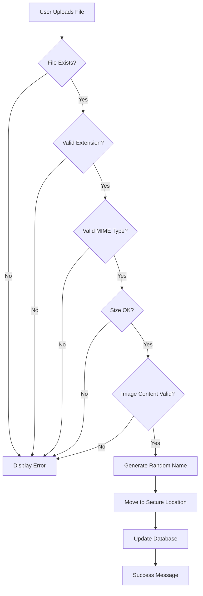

# PHP File Upload Security

## Introduction

File uploads are a common requirement in many web applications, allowing users to share documents, images, and other media. However, without proper security measures, file uploads can introduce significant vulnerabilities to your application. In this guide, we'll explore how to implement secure file upload functionality in PHP while protecting against common security threats.

## Why File Upload Security Matters

Unsecured file uploads can lead to several security risks:

1. **Server-side code execution**: If attackers upload malicious PHP scripts, they could potentially execute code on your server
2. **Cross-site scripting (XSS)**: Uploading HTML or JavaScript files might enable attackers to inject malicious scripts
3. **File system attacks**: Improper handling of file paths could allow access to sensitive parts of your server
4. **Denial of service**: Uploading extremely large files might exhaust server resources

## Basic File Upload in PHP

Let's first look at how basic file uploads work in PHP:

```php
<?php
if(isset($_POST["submit"])) {
    $target_dir = "uploads/";
    $target_file = $target_dir . basename($_FILES["fileToUpload"]["name"]);
    
    if (move_uploaded_file($_FILES["fileToUpload"]["tmp_name"], $target_file)) {
        echo "The file ". htmlspecialchars(basename($_FILES["fileToUpload"]["name"])). " has been uploaded.";
    } else {
        echo "Sorry, there was an error uploading your file.";
    }
}
?>

<form action="upload.php" method="post" enctype="multipart/form-data">
    Select file to upload:
    <input type="file" name="fileToUpload" id="fileToUpload">
    <input type="submit" value="Upload File" name="submit">
</form>
```

This basic example works, but it's highly insecure! Let's explore how to make it safer.

## Essential Security Measures

### 1. Validate File Types

One of the most important security measures is validating file types to prevent uploading malicious scripts:

```php
<?php
// Define allowed file extensions
$allowed_extensions = ['jpg', 'jpeg', 'png', 'gif', 'pdf', 'doc', 'docx'];

// Get file extension
$file_extension = strtolower(pathinfo($_FILES["fileToUpload"]["name"], PATHINFO_EXTENSION));

// Check if extension is allowed
if(!in_array($file_extension, $allowed_extensions)) {
    echo "Sorry, only JPG, JPEG, PNG, GIF, PDF, DOC & DOCX files are allowed.";
    exit();
}
```

### 2. Verify MIME Type

File extensions can be spoofed, so it's important to also check the actual MIME type:

```php
<?php
// Define allowed MIME types
$allowed_mime_types = ['image/jpeg', 'image/png', 'image/gif', 'application/pdf', 
                        'application/msword', 'application/vnd.openxmlformats-officedocument.wordprocessingml.document'];

// Check MIME type
$finfo = new finfo(FILEINFO_MIME_TYPE);
$file_mime = $finfo->file($_FILES["fileToUpload"]["tmp_name"]);

if(!in_array($file_mime, $allowed_mime_types)) {
    echo "Invalid file type detected.";
    exit();
}
```

### 3. Limit File Size

Prevent denial of service attacks by limiting file sizes:

```php
<?php
// Set maximum file size (2MB in this example)
$max_file_size = 2 * 1024 * 1024; // 2MB in bytes

if($_FILES["fileToUpload"]["size"] > $max_file_size) {
    echo "Sorry, your file is too large. Maximum file size is 2MB.";
    exit();
}
```

### 4. Generate Random File Names

To prevent overwriting existing files and to avoid predictable file paths:

```php
<?php
// Generate random filename while preserving extension
$new_filename = md5(uniqid() . time()) . '.' . $file_extension;
$target_file = $target_dir . $new_filename;
```

### 5. Create a Safe Upload Directory

```php
<?php
// Set upload directory outside web root if possible
$target_dir = "../secure_uploads/";

// Create directory if it doesn't exist
if(!is_dir($target_dir)) {
    mkdir($target_dir, 0750, true);
}

// Add .htaccess file to prevent direct access or execution
$htaccess_content = "Options -Indexes -ExecCGI
AddHandler default-handler .php .phtml .php3 .php4 .php5 .php7 .pht
RemoveHandler .php .phtml .php3 .php4 .php5 .php7 .pht";
file_put_contents($target_dir . '.htaccess', $htaccess_content);
```

## Complete Secure Upload Example

Let's put everything together into a comprehensive, secure file upload system:

```php
<?php
// Initialize error array
$errors = [];

if(isset($_POST["submit"])) {
    // Configuration
    $target_dir = "../secure_uploads/";
    $allowed_extensions = ['jpg', 'jpeg', 'png', 'gif', 'pdf'];
    $allowed_mime_types = ['image/jpeg', 'image/png', 'image/gif', 'application/pdf'];
    $max_file_size = 2 * 1024 * 1024; // 2MB
    
    // Create upload directory if it doesn't exist
    if(!is_dir($target_dir)) {
        mkdir($target_dir, 0750, true);
        // Add .htaccess for extra security
        $htaccess = "Options -Indexes -ExecCGI
AddHandler default-handler .php .phtml .php3";
        file_put_contents($target_dir . '.htaccess', $htaccess);
    }
    
    // Check if file was uploaded without errors
    if(isset($_FILES["fileToUpload"]) && $_FILES["fileToUpload"]["error"] == 0) {
        $file_tmp = $_FILES["fileToUpload"]["tmp_name"];
        $file_name = basename($_FILES["fileToUpload"]["name"]);
        $file_size = $_FILES["fileToUpload"]["size"];
        $file_extension = strtolower(pathinfo($file_name, PATHINFO_EXTENSION));
        
        // 1. Check file extension
        if(!in_array($file_extension, $allowed_extensions)) {
            $errors[] = "Invalid file extension. Allowed types: " . implode(', ', $allowed_extensions);
        }
        
        // 2. Verify MIME type
        $finfo = new finfo(FILEINFO_MIME_TYPE);
        $file_mime = $finfo->file($file_tmp);
        if(!in_array($file_mime, $allowed_mime_types)) {
            $errors[] = "Invalid file type detected.";
        }
        
        // 3. Check file size
        if($file_size > $max_file_size) {
            $errors[] = "File is too large. Maximum size: " . ($max_file_size / 1024 / 1024) . "MB";
        }
        
        // 4. Additional content checks for images
        if(strpos($file_mime, 'image/') === 0) {
            // Verify it's actually a valid image
            if(!getimagesize($file_tmp)) {
                $errors[] = "Invalid image file.";
            }
        }
        
        // If no errors, proceed with upload
        if(empty($errors)) {
            // Generate random filename
            $new_filename = md5(uniqid() . time()) . '.' . $file_extension;
            $target_file = $target_dir . $new_filename;
            
            // Move the file to destination
            if(move_uploaded_file($file_tmp, $target_file)) {
                echo "<div class='success'>File uploaded successfully. Stored as: " . htmlspecialchars($new_filename) . "</div>";
                
                // For database storage (example)
                $original_filename = htmlspecialchars($file_name);
                $stored_filename = $new_filename;
                $file_type = $file_mime;
                $upload_date = date('Y-m-d H:i:s');
                
                // Here you would typically save this information to a database
                // saveFileInfoToDatabase($original_filename, $stored_filename, $file_type, $file_size, $upload_date);
            } else {
                echo "<div class='error'>Error moving uploaded file.</div>";
            }
        } else {
            echo "<div class='error'><ul>";
            foreach($errors as $error) {
                echo "<li>" . $error . "</li>";
            }
            echo "</ul></div>";
        }
    } else {
        // Handle upload errors based on error code
        $upload_error_codes = [
            1 => "The uploaded file exceeds the upload_max_filesize directive in php.ini",
            2 => "The uploaded file exceeds the MAX_FILE_SIZE directive in the HTML form",
            3 => "The uploaded file was only partially uploaded",
            4 => "No file was uploaded",
            6 => "Missing a temporary folder",
            7 => "Failed to write file to disk",
            8 => "A PHP extension stopped the file upload"
        ];
        
        $error_code = $_FILES["fileToUpload"]["error"];
        if($error_code != 4) { // Only show error if it's not "No file was uploaded"
            echo "<div class='error'>Upload failed: " . 
                  ($upload_error_codes[$error_code] ?? "Unknown error") . "</div>";
        }
    }
}
?>

<!DOCTYPE html>
<html>
<head>
    <title>Secure File Upload</title>
    <style>
        .error { color: red; border: 1px solid red; padding: 10px; margin: 10px 0; }
        .success { color: green; border: 1px solid green; padding: 10px; margin: 10px 0; }
    </style>
</head>
<body>
    <h2>Secure File Upload Form</h2>
    <form action="<?php echo htmlspecialchars($_SERVER["PHP_SELF"]); ?>" method="post" enctype="multipart/form-data">
        <label for="fileToUpload">Select file to upload:</label><br>
        <input type="file" name="fileToUpload" id="fileToUpload"><br>
        <small>Allowed file types: JPG, JPEG, PNG, GIF, PDF. Max size: 2MB</small><br><br>
        <input type="submit" value="Upload File" name="submit">
    </form>
</body>
</html>
```

This example includes:
- Extension and MIME type validation
- File size limitations
- Random filename generation
- Proper error handling
- Secure storage location
- Additional image verification

## Common Upload Vulnerabilities and Mitigations

Let's explore some common vulnerabilities and how to mitigate them:

### Double Extension Attacks

Attackers might try to upload files with names like `image.jpg.php` to bypass simple extension checks.

**Mitigation:**
```php
// Remove all but the last extension
$filename = $_FILES['fileToUpload']['name'];
$filename_parts = explode('.', $filename);
$file_extension = strtolower(end($filename_parts));
```

### Null Byte Injection

In older PHP versions, attackers could use null bytes to truncate filenames (e.g., `malicious.php%00.jpg`).

**Mitigation:**
```php
// Sanitize filename to remove null bytes
$safe_filename = str_replace(chr(0), '', $filename);
```

### File Content Analysis

Check the actual content of the file, especially for images:

```php
// For images, verify they're valid
$image_info = getimagesize($_FILES["fileToUpload"]["tmp_name"]);
if($image_info === false) {
    echo "Uploaded file is not a valid image.";
    exit();
}
```

## Security Workflow Diagram

Here's a visual representation of a secure file upload workflow:



## Best Practices Summary

1. **Validate file extensions** - Whitelist only the extensions you need
2. **Check MIME types** - Don't trust the extension alone
3. **Limit file sizes** - Prevent denial of service attacks
4. **Randomize filenames** - Avoid predictable file paths
5. **Store files outside web root** - Or use .htaccess to restrict access
6. **Scan file contents** - Additional verification for images and other files
7. **Implement proper error handling** - Don't reveal too much information
8. **Use separate servers for uploads** - For high-security applications
9. **Set proper permissions** - Limit who can access uploaded files
10. **Consider using a CDN** - Offload file storage to specialized services

## Processing Uploaded Images Securely

If your application handles image uploads, consider processing them to further enhance security:

```php
<?php
// After validating and moving the uploaded image:
$uploaded_file = $target_dir . $new_filename;

// Create a new image from the uploaded file based on type
switch($file_mime) {
    case 'image/jpeg':
        $source = imagecreatefromjpeg($uploaded_file);
        break;
    case 'image/png':
        $source = imagecreatefrompng($uploaded_file);
        break;
    case 'image/gif':
        $source = imagecreatefromgif($uploaded_file);
        break;
    default:
        $source = false;
}

if($source !== false) {
    // Get dimensions
    $width = imagesx($source);
    $height = imagesy($source);
    
    // Create a new true color image
    $processed = imagecreatetruecolor($width, $height);
    
    // Copy and resize
    imagecopyresampled($processed, $source, 0, 0, 0, 0, $width, $height, $width, $height);
    
    // Save the processed image (overwrites original)
    imagejpeg($processed, $uploaded_file, 90); // 90 is quality
    
    // Free up memory
    imagedestroy($source);
    imagedestroy($processed);
    
    echo "Image processed and saved.";
}
```

This processing step strips any potential embedded malicious code while preserving the image.

## Server Configuration

To enhance file upload security at the server level:

1. **Configure php.ini settings**:
   ```
   upload_max_filesize = 10M
   post_max_size = 10M
   max_file_uploads = 5
   ```

2. **Set appropriate timeout limits**:
   ```
   max_input_time = 300
   max_execution_time = 300
   ```

3. **Use mod_security** with upload rules (Apache):
   ```
   SecRule FILES_NAMES "\.ph(p|ps|tml|p3|p4|p5|p7|ar)$" \
     "id:1234,phase:2,deny,status:403,msg:'PHP file upload attempt'"
   ```

## Real-World Implementation: Image Gallery

Here's a practical example of a secure image gallery system:

```php
<?php
// config.php
define('UPLOAD_DIR', '../secure_uploads/');
define('THUMBNAIL_DIR', '../secure_uploads/thumbs/');
define('MAX_FILE_SIZE', 5 * 1024 * 1024); // 5MB
define('ALLOWED_TYPES', ['image/jpeg', 'image/png', 'image/gif']);
define('ALLOWED_EXTENSIONS', ['jpg', 'jpeg', 'png', 'gif']);

// Database connection
$db = new PDO('mysql:host=localhost;dbname=gallery', 'username', 'password');

// upload.php
require_once 'config.php';

// Create necessary directories
if(!is_dir(UPLOAD_DIR)) mkdir(UPLOAD_DIR, 0750, true);
if(!is_dir(THUMBNAIL_DIR)) mkdir(THUMBNAIL_DIR, 0750, true);

// Process upload
if($_SERVER['REQUEST_METHOD'] === 'POST' && isset($_FILES['image'])) {
    $errors = [];
    $file = $_FILES['image'];
    
    // Basic validation
    $file_extension = strtolower(pathinfo($file['name'], PATHINFO_EXTENSION));
    $finfo = new finfo(FILEINFO_MIME_TYPE);
    $file_mime = $finfo->file($file['tmp_name']);
    
    if($file['error'] !== UPLOAD_ERR_OK) {
        $errors[] = "Upload error: " . $file['error'];
    }
    if($file['size'] > MAX_FILE_SIZE) {
        $errors[] = "File too large. Max size: " . MAX_FILE_SIZE / 1024 / 1024 . "MB";
    }
    if(!in_array($file_extension, ALLOWED_EXTENSIONS)) {
        $errors[] = "Invalid file extension";
    }
    if(!in_array($file_mime, ALLOWED_TYPES)) {
        $errors[] = "Invalid file type";
    }
    
    // Verify it's a valid image
    $image_info = @getimagesize($file['tmp_name']);
    if($image_info === false) {
        $errors[] = "Invalid image file";
    }
    
    if(empty($errors)) {
        // Generate unique filename
        $new_filename = md5(uniqid() . $file['name'] . time()) . '.' . $file_extension;
        $destination = UPLOAD_DIR . $new_filename;
        
        // Move file to destination
        if(move_uploaded_file($file['tmp_name'], $destination)) {
            // Create thumbnail
            create_thumbnail($destination, THUMBNAIL_DIR . $new_filename, 200);
            
            // Save to database
            $title = filter_input(INPUT_POST, 'title', FILTER_SANITIZE_STRING) ?: 'Untitled';
            $description = filter_input(INPUT_POST, 'description', FILTER_SANITIZE_STRING) ?: '';
            
            $stmt = $db->prepare('INSERT INTO images (filename, original_name, title, description, mime_type, upload_date) 
                                  VALUES (?, ?, ?, ?, ?, NOW())');
            $stmt->execute([$new_filename, $file['name'], $title, $description, $file_mime]);
            
            $response = ['success' => true, 'message' => 'Image uploaded successfully'];
        } else {
            $response = ['success' => false, 'message' => 'Failed to move uploaded file'];
        }
    } else {
        $response = ['success' => false, 'errors' => $errors];
    }
    
    header('Content-Type: application/json');
    echo json_encode($response);
    exit;
}

// Helper function to create thumbnail
function create_thumbnail($source, $destination, $max_width) {
    list($width, $height) = getimagesize($source);
    
    // Calculate new dimensions
    $ratio = $max_width / $width;
    $new_width = $max_width;
    $new_height = $height * $ratio;
    
    // Create new image
    $source_image = imagecreatefromjpeg($source);
    $thumbnail = imagecreatetruecolor($new_width, $new_height);
    
    // Resize
    imagecopyresampled($thumbnail, $source_image, 0, 0, 0, 0, $new_width, $new_height, $width, $height);
    
    // Save thumbnail
    imagejpeg($thumbnail, $destination, 80);
    
    // Free memory
    imagedestroy($source_image);
    imagedestroy($thumbnail);
    
    return true;
}
```

## Summary

Securing file uploads in PHP requires a multi-layered approach:

1. **Validate all user input** - Never trust user-submitted content
2. **Check file types multiple ways** - Extension, MIME type, and content analysis
3. **Control where files are stored** - Use secure locations with proper permissions
4. **Process uploaded files** - Strip potential embedded malicious code
5. **Implement proper error handling** - Provide feedback without revealing vulnerabilities
6. **Consider server-level protection** - Configure PHP and web server settings appropriately

By implementing these security measures, you can allow users to upload files while minimizing the risk to your application and server.

## Additional Resources

1. [OWASP File Upload Cheat Sheet](https://owasp.org/www-community/vulnerabilities/Unrestricted_File_Upload)
2. [PHP Manual: Handling File Uploads](https://www.php.net/manual/en/features.file-upload.php)
3. [PHP.ini Security Directives](https://www.php.net/manual/en/ini.sect.safe-mode.php)

## Exercises

1. **Exercise 1**: Create a secure file upload system that stores files in a database (BLOB) instead of the filesystem.
2. **Exercise 2**: Implement a virus scanning functionality using ClamAV or a similar tool for uploaded files.
3. **Exercise 3**: Build a document management system with different security levels based on file types.
4. **Exercise 4**: Create a secure image resizing and conversion utility that processes uploaded images.
5. **Exercise 5**: Design a user avatar upload system with proper validation and processing.