# PHP Password Hashing

## Introduction

Password security is a critical aspect of any web application. When users trust your application with their credentials, you have a responsibility to store them securely. Plain text password storage is extremely dangerous - if your database is compromised, all user accounts are immediately at risk.

This is where password hashing comes in. Hashing transforms a password into a fixed-length string of characters that cannot be reversed back to the original password. PHP provides built-in functions that make secure password hashing straightforward to implement.

In this tutorial, you'll learn:
- What password hashing is and why it's important
- How to use PHP's password hashing functions
- Best practices for implementing password hashing
- How to verify passwords against stored hashes

## Understanding Password Hashing

Before diving into code, let's understand what password hashing actually is.

### What is Password Hashing?

Password hashing is a one-way transformation of a password into a fixed-length string (the hash). Unlike encryption, which is reversible, hashing is designed to be irreversible. Even if attackers gain access to your database, they cannot convert hashes back to the original passwords.

```mermaid
graph LR
    A[User Password] -->|Hash Function| B[Password Hash]
    B -->|Cannot Reverse| C[❌]
```



### Why Hash Passwords?

1. **Security**: If your database is compromised, attackers only see hashes, not actual passwords
2. **Privacy**: Your development team cannot see user passwords
3. **Compliance**: Many regulations (GDPR, HIPAA, etc.) require proper password storage

### How Hashing Works in PHP

Modern password hashing in PHP uses these key concepts:

1. **Hash Algorithms**: Different methods to generate hashes (bcrypt, Argon2, etc.)
2. **Salt**: Random data added to the password before hashing to prevent dictionary attacks
3. **Work Factor**: A parameter that makes the hashing process more computationally intensive to slow down brute-force attacks

## PHP's Password Hashing API

PHP offers a simple set of functions for password hashing since PHP 5.5. This API handles all the complex details like salting and work factor adjustments automatically.

### Creating a Password Hash

The `password_hash()` function is used to generate a secure hash:

```php
// The simple way - using default algorithm (currently bcrypt)
$password = "user_password123";
$hash = password_hash($password, PASSWORD_DEFAULT);

echo "The hashed password: " . $hash;
```

**Output:**
```
The hashed password: $2y$10$AbC123dEf456gHi789jKl.uvWxYz1234567890abcdefghijklm
```

Notice that each time you run this code, you'll get a different hash even for the same password. This is because a random salt is automatically generated each time.

You can also specify options, particularly the "cost" parameter which determines how computationally intensive the hashing will be:

```php
// With custom cost factor (higher is more secure but slower)
$options = [
    'cost' => 12  // Default is 10
];

$hash = password_hash($password, PASSWORD_DEFAULT, $options);
```

### Verifying a Password

When a user logs in, you need to verify their password against the stored hash. For this, use the `password_verify()` function:

```php
// Simulating a login attempt
$stored_hash = '$2y$10$AbC123dEf456gHi789jKl.uvWxYz1234567890abcdefghijklm'; // From database
$user_input = "user_password123";  // From login form

if (password_verify($user_input, $stored_hash)) {
    echo "Password is valid!";
} else {
    echo "Invalid password.";
}
```

**Output:**
```
Password is valid!
```

### Available Hashing Algorithms

PHP provides several predefined password hashing algorithms:

1. `PASSWORD_DEFAULT`: Currently uses bcrypt, but may change in future PHP versions
2. `PASSWORD_BCRYPT`: Uses the bcrypt algorithm (Blowfish)
3. `PASSWORD_ARGON2I`: Uses the Argon2i algorithm (PHP 7.2+)
4. `PASSWORD_ARGON2ID`: Uses the Argon2id algorithm (PHP 7.3+)

For most applications, using `PASSWORD_DEFAULT` is recommended, as it will automatically update to stronger algorithms in future PHP versions.

## Practical Implementation

Let's implement a complete user registration and login system using proper password hashing.

### User Registration Example

```php
<?php
function registerUser($username, $password) {
    // In a real application, validate input first
    
    // Hash the password
    $password_hash = password_hash($password, PASSWORD_DEFAULT);
    
    // Store in database (example using PDO)
    try {
        $pdo = new PDO('mysql:host=localhost;dbname=myapp', 'username', 'password');
        $pdo->setAttribute(PDO::ATTR_ERRMODE, PDO::ERRMODE_EXCEPTION);
        
        $stmt = $pdo->prepare('INSERT INTO users (username, password_hash) VALUES (?, ?)');
        $stmt->execute([$username, $password_hash]);
        
        return true;
    } catch (PDOException $e) {
        // Handle error appropriately
        return false;
    }
}

// Example usage
if ($_SERVER['REQUEST_METHOD'] === 'POST') {
    $username = $_POST['username'] ?? '';
    $password = $_POST['password'] ?? '';
    
    if (registerUser($username, $password)) {
        echo "User registered successfully!";
    } else {
        echo "Registration failed.";
    }
}
?>

<!-- Simple registration form -->
<form method="post">
    Username: <input type="text" name="username" required><br>
    Password: <input type="password" name="password" required><br>
    <input type="submit" value="Register">
</form>
```

### User Login Example

```php
<?php
function loginUser($username, $password) {
    try {
        $pdo = new PDO('mysql:host=localhost;dbname=myapp', 'username', 'password');
        $pdo->setAttribute(PDO::ATTR_ERRMODE, PDO::ERRMODE_EXCEPTION);
        
        $stmt = $pdo->prepare('SELECT id, username, password_hash FROM users WHERE username = ?');
        $stmt->execute([$username]);
        $user = $stmt->fetch(PDO::FETCH_ASSOC);
        
        if ($user && password_verify($password, $user['password_hash'])) {
            // Password is correct
            
            // Consider password rehash if needed
            if (password_needs_rehash($user['password_hash'], PASSWORD_DEFAULT)) {
                $newHash = password_hash($password, PASSWORD_DEFAULT);
                // Update the hash in the database
                $updateStmt = $pdo->prepare('UPDATE users SET password_hash = ? WHERE id = ?');
                $updateStmt->execute([$newHash, $user['id']]);
            }
            
            // Start session, set user data, etc.
            session_start();
            $_SESSION['user_id'] = $user['id'];
            $_SESSION['username'] = $user['username'];
            
            return true;
        }
        
        return false;
    } catch (PDOException $e) {
        // Handle error appropriately
        return false;
    }
}

// Example usage
if ($_SERVER['REQUEST_METHOD'] === 'POST') {
    $username = $_POST['username'] ?? '';
    $password = $_POST['password'] ?? '';
    
    if (loginUser($username, $password)) {
        echo "Login successful!";
    } else {
        echo "Invalid username or password.";
    }
}
?>

<!-- Simple login form -->
<form method="post">
    Username: <input type="text" name="username" required><br>
    Password: <input type="password" name="password" required><br>
    <input type="submit" value="Login">
</form>
```

## Best Practices for Password Hashing

### 1. Never Store Plain Text Passwords

This should be obvious, but it's worth emphasizing. Never store passwords in plain text, regardless of how insignificant you think your application is.

### 2. Use PHP's Built-in Functions

Avoid writing your own hashing functions. PHP's password functions are designed by security experts and automatically handle salting and algorithm selection.

```php
// DO THIS:
$hash = password_hash($password, PASSWORD_DEFAULT);

// DON'T DO THIS:
$hash = md5($password); // Insecure!
$hash = sha1($password); // Also insecure!
```

### 3. Keep the Cost Factor Appropriate

Higher cost factors make hashing more secure but also slower. Find a balance:

```php
// Benchmark to find optimal cost
$timeTarget = 0.05; // 50 milliseconds

$cost = 8;
do {
    $cost++;
    $start = microtime(true);
    password_hash("test", PASSWORD_BCRYPT, ["cost" => $cost]);
    $end = microtime(true);
} while (($end - $start) < $timeTarget);

echo "Appropriate cost found: " . $cost;
```

### 4. Use `password_needs_rehash()` to Upgrade Hashes

When PHP updates its default algorithm or when you want to increase security, use this function:

```php
if (password_needs_rehash($stored_hash, PASSWORD_DEFAULT)) {
    // Rehash using the new parameters
    $newHash = password_hash($password, PASSWORD_DEFAULT);
    // Update in database
}
```

### 5. Use Prepared Statements

Always use prepared statements when interacting with the database to prevent SQL injection:

```php
$stmt = $pdo->prepare('SELECT * FROM users WHERE username = ?');
$stmt->execute([$username]);
```

## Common Mistakes to Avoid

1. **Using obsolete hash functions**: MD5 and SHA1 are not suitable for password hashing
2. **Not using salts**: If you're using manual hashing (not recommended), always add unique salts
3. **Using low cost factors**: Don't set cost too low in production environments
4. **Truncating password hashes**: Make sure your database field is long enough (at least 60 characters for bcrypt)

## Handling Password Updates

When users want to change their password, verify the old password before allowing the change:

```php
function updatePassword($userId, $currentPassword, $newPassword) {
    // Get the current hash from the database
    $currentHash = fetchUserHashFromDatabase($userId);
    
    // Verify current password
    if (!password_verify($currentPassword, $currentHash)) {
        return false; // Current password is incorrect
    }
    
    // Hash the new password
    $newHash = password_hash($newPassword, PASSWORD_DEFAULT);
    
    // Update in database
    updateUserHashInDatabase($userId, $newHash);
    
    return true;
}
```

## Summary

Proper password hashing is essential for application security. PHP provides a robust, easy-to-use API that handles the complexities of secure password hashing for you.

Key takeaways:
- Always hash passwords using PHP's `password_hash()` function
- Verify passwords with `password_verify()`
- Use `PASSWORD_DEFAULT` algorithm for future compatibility
- Regularly check for needed hash updates with `password_needs_rehash()`
- Never store passwords in plain text or use outdated hashing methods

By implementing these practices, you can ensure that your users' passwords are stored securely, even if your database is compromised.

## Additional Resources

- [PHP Password Hashing Manual](https://www.php.net/manual/en/book.password.php)
- [OWASP Password Storage Cheat Sheet](https://cheatsheetseries.owasp.org/cheatsheets/Password_Storage_Cheat_Sheet.html)
- [PHP Security Guide](https://phpsecurity.readthedocs.io/en/latest/)

## Exercises

1. Create a password strength checker function that verifies if a password meets security requirements (length, complexity, etc.)
2. Implement a complete registration and login system using the techniques from this tutorial
3. Create a function that checks if stored password hashes need to be updated to a newer algorithm or cost factor
4. Build a password reset functionality that securely handles forgotten passwords using tokens and hashing