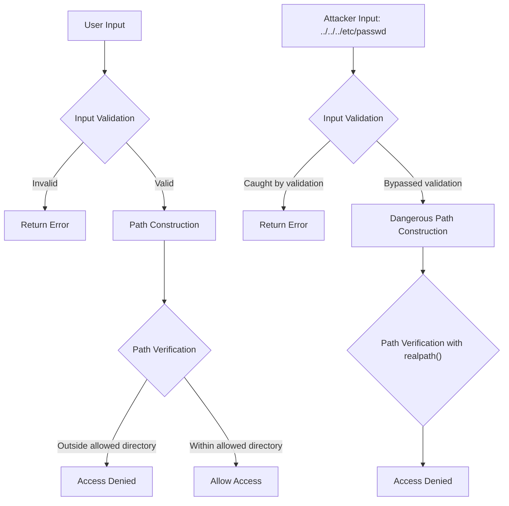

# PHP Directory Security

## Introduction

When developing PHP applications, working with directories and files is a common task. However, improper handling of directory operations can lead to serious security vulnerabilities. Directory-related security issues can allow attackers to access sensitive files, manipulate your application's behavior, or even gain control of your server.

In this guide, we'll explore various techniques for securing directory operations in PHP. You'll learn how to prevent directory traversal attacks, implement proper permission controls, and follow best practices when interacting with the file system.

## Understanding Directory Security Risks

Before diving into security measures, let's understand the common risks associated with directory operations in PHP:

### Directory Traversal Attacks

Directory traversal (also known as path traversal) is an attack that allows malicious users to access files and directories outside of the intended directory. Attackers use special sequences like `../` to navigate up directory levels.

#### Example of Vulnerable Code:

```php
// VULNERABLE CODE - DO NOT USE
$file = $_GET['filename'];
include('/var/www/files/' . $file);

// An attacker could use: ?filename=../../../etc/passwd
```

### Unauthorized Directory Listing

If directory listing is enabled on your web server, attackers can view the contents of directories when no index file is present, potentially exposing sensitive files.

### Insufficient File Permissions

Incorrect file and directory permissions can lead to security issues. Overly permissive settings might allow unauthorized modifications, while overly restrictive settings could prevent your application from functioning correctly.

## Preventing Directory Traversal Attacks

### 1. Validate and Sanitize Input

Always validate and sanitize user input before using it in file or directory operations:

```php
// Sanitizing file input
$filename = $_GET['filename'];

// Validate that the filename contains only allowed characters
if (!preg_match('/^[a-zA-Z0-9_\-\.]+$/', $filename)) {
    die("Invalid filename");
}

// Now it's safer to use
include('/var/www/files/' . $filename);
```

### 2. Use basename() to Extract Filename

The `basename()` function removes directory components, helping prevent directory traversal:

```php
$filename = basename($_GET['filename']);
// Even if input is "../../../etc/passwd", basename() returns "passwd"
include('/var/www/files/' . $filename);
```

### 3. Use realpath() for Path Verification

The `realpath()` function resolves all symbolic links and relative path references to return the absolute canonical path:

```php
$userInput = $_GET['filename'];
$baseDir = '/var/www/files/';
$requestedFile = realpath($baseDir . $userInput);

// Verify the requested file is within the allowed directory
if ($requestedFile === false || strpos($requestedFile, $baseDir) !== 0) {
    die("Access denied");
} else {
    include($requestedFile);
}
```

## Secure Directory Management

### 1. Proper Directory Permissions

Set appropriate permissions for your directories:

```php
// Example of setting secure directory permissions
// 0755 = Owner: read/write/execute, Group: read/execute, Others: read/execute
chmod('/var/www/uploads', 0755);

// For directories containing sensitive data, restrict further
// 0750 = Owner: read/write/execute, Group: read/execute, Others: no access
chmod('/var/www/sensitive_data', 0750);
```

### 2. Disable Directory Listing

Add an `.htaccess` file to directories you want to protect:

```
# .htaccess file
Options -Indexes
```

Or configure it globally in your Apache configuration:

```
<Directory /var/www/html>
    Options -Indexes
</Directory>
```

### 3. Create a Secure Upload Directory

When allowing file uploads, implement multiple security measures:

```php
// Secure file upload example
function secureUpload($uploadedFile) {
    $uploadDir = '/var/www/uploads/';
    
    // 1. Create upload directory if it doesn't exist
    if (!file_exists($uploadDir)) {
        mkdir($uploadDir, 0750, true);
    }
    
    // 2. Generate a random filename to prevent overwriting
    $filename = md5(uniqid(rand(), true)) . '.jpg';
    
    // 3. Validate file type (example for images)
    $allowedTypes = ['image/jpeg', 'image/png', 'image/gif'];
    if (!in_array($uploadedFile['type'], $allowedTypes)) {
        return "Invalid file type";
    }
    
    // 4. Move the file to the upload directory
    $destination = $uploadDir . $filename;
    if (move_uploaded_file($uploadedFile['tmp_name'], $destination)) {
        // Set secure permissions for the uploaded file
        chmod($destination, 0640); // Owner: read/write, Group: read, Others: no access
        return "Upload successful";
    } else {
        return "Upload failed";
    }
}

// Usage
if (isset($_FILES['userfile'])) {
    echo secureUpload($_FILES['userfile']);
}
```

## Directory Traversal Visualization

Here's a diagram illustrating how directory traversal attacks work and how to prevent them:



## Best Practices for PHP Directory Security

### 1. Implement a Safe File Access Function

Create a reusable function for secure file access:

```php
/**
 * Safely access files within an allowed directory
 * 
 * @param string $filename The requested filename
 * @param string $baseDir The allowed base directory
 * @return string|false The file contents or false on error
 */
function safeGetFileContents($filename, $baseDir = '/var/www/files/') {
    // Remove any null bytes which can be used to trick some functions
    $filename = str_replace("\0", '', $filename);
    
    // Only allow alphanumeric characters, hyphens, underscores and periods
    if (!preg_match('/^[a-zA-Z0-9_\-\.]+$/', $filename)) {
        return false;
    }
    
    // Get the real path and verify it's within the allowed directory
    $filepath = realpath($baseDir . $filename);
    if ($filepath === false || strpos($filepath, realpath($baseDir)) !== 0) {
        return false;
    }
    
    // Check if file exists and is readable
    if (!is_file($filepath) || !is_readable($filepath)) {
        return false;
    }
    
    // Finally, get and return the file contents
    return file_get_contents($filepath);
}

// Usage
$content = safeGetFileContents($_GET['file']);
if ($content !== false) {
    echo $content;
} else {
    echo "File not found or access denied";
}
```

### 2. Use PHP's Built-in Stream Wrappers with Caution

PHP's stream wrappers (like `php://`) can be dangerous if not properly handled:

```php
// DANGEROUS - DO NOT USE
include("php://filter/convert.base64-encode/resource=" . $_GET['file']);

// Instead, limit operations to specific files:
$allowedFiles = ['config.php', 'functions.php'];
$requestedFile = $_GET['file'];

if (in_array($requestedFile, $allowedFiles)) {
    include($requestedFile);
} else {
    die("Access denied");
}
```

### 3. Implement Runtime Directory Configuration

Store directory paths in configuration files rather than hardcoding them:

```php
// config.php
return [
    'upload_dir' => '/var/www/uploads/',
    'template_dir' => '/var/www/templates/',
    'cache_dir' => '/var/www/cache/',
];

// In your application
$config = include('config.php');
$uploadDir = $config['upload_dir'];

// Use the configured directory
if (file_exists($uploadDir) && is_writable($uploadDir)) {
    // Perform operations
}
```

## Real-World Examples

### Example 1: Secure File Browser

This example implements a simple but secure file browser limited to a specific directory:

```php
<?php
// Secure file browser example

// Define the base directory (ALWAYS use an absolute path)
$baseDir = '/var/www/public_files/';

// Get the requested directory, defaulting to the base directory
$requestedDir = isset($_GET['dir']) ? $_GET['dir'] : '';

// Build the full path
$fullPath = $baseDir . $requestedDir;

// Resolve the real path
$realPath = realpath($fullPath);

// Security check: Ensure the path is within the base directory
if ($realPath === false || strpos($realPath, realpath($baseDir)) !== 0) {
    die("Access denied");
}

// Ensure it's a directory
if (!is_dir($realPath)) {
    die("Not a valid directory");
}

// List files and directories
$items = scandir($realPath);

// Display the file browser
echo "<h1>File Browser</h1>";
echo "<p>Current directory: " . htmlspecialchars($requestedDir) . "</p>";
echo "<ul>";

// Show parent directory link if we're in a subdirectory
if ($requestedDir !== '') {
    $parentDir = dirname($requestedDir);
    echo "<li><a href='?dir=" . htmlspecialchars($parentDir) . "'>..</a> (Parent Directory)</li>";
}

// List all files and directories
foreach ($items as $item) {
    if ($item === '.' || $item === '..') continue;
    
    $itemPath = $realPath . '/' . $item;
    if (is_dir($itemPath)) {
        // It's a directory, create a link to browse it
        $linkPath = ($requestedDir === '') ? $item : $requestedDir . '/' . $item;
        echo "<li><a href='?dir=" . htmlspecialchars($linkPath) . "'>" . htmlspecialchars($item) . "/</a></li>";
    } else {
        // It's a file, display its name
        echo "<li>" . htmlspecialchars($item) . "</li>";
    }
}

echo "</ul>";
?>
```

### Example 2: Secure Log File Viewer

This script allows viewing log files while preventing access to other system files:

```php
<?php
// Secure log file viewer

// Define the logs directory
$logsDir = '/var/www/logs/';

// Available log files (whitelist approach)
$availableLogs = [
    'access.log',
    'error.log',
    'app.log'
];

// Get requested log
$requestedLog = isset($_GET['log']) ? $_GET['log'] : 'access.log';

// Security check: Ensure the requested log is in our whitelist
if (!in_array($requestedLog, $availableLogs)) {
    die("Invalid log file requested");
}

// Build the full path
$logPath = $logsDir . $requestedLog;

// Check if the file exists and is readable
if (!file_exists($logPath) || !is_readable($logPath)) {
    die("Log file not accessible");
}

// Display form to select log file
echo "<form method='get'>";
echo "<label for='log'>Select log file: </label>";
echo "<select name='log' id='log'>";

foreach ($availableLogs as $log) {
    $selected = ($log === $requestedLog) ? 'selected' : '';
    echo "<option value='" . htmlspecialchars($log) . "' $selected>" . htmlspecialchars($log) . "</option>";
}

echo "</select>";
echo "<button type='submit'>View Log</button>";
echo "</form>";

// Display the log content (last 100 lines for performance)
echo "<h2>Showing last 100 lines of: " . htmlspecialchars($requestedLog) . "</h2>";
echo "<pre>";

// Read last 100 lines (this is more efficient than reading the entire file)
$lines = [];
$fp = fopen($logPath, 'r');
while (!feof($fp)) {
    $line = fgets($fp);
    if ($line) {
        $lines[] = $line;
        if (count($lines) > 100) {
            array_shift($lines); // Remove the oldest line
        }
    }
}
fclose($fp);

// Output the lines
echo htmlspecialchars(implode('', $lines));
echo "</pre>";
?>
```

## Summary

Securing directory operations in PHP is crucial for protecting your application and server from various attacks. By implementing the techniques covered in this guide, you can significantly reduce the risk of directory traversal attacks and unauthorized file access.

Remember these key points:

1. **Always validate and sanitize user input** before using it in file/directory operations
2. **Use PHP's built-in functions** like `basename()` and `realpath()` for path safety
3. **Implement proper directory and file permissions**
4. **Disable directory listing** where not needed
5. **Create secure upload mechanisms** for user-provided files
6. **Use a whitelist approach** for file access when possible
7. **Store directory paths in configuration files** rather than hardcoding them

By following these best practices, you'll create more secure PHP applications that protect both your data and your users.

## Additional Resources

- [PHP Manual: Security](https://www.php.net/manual/en/security.php)
- [OWASP: Path Traversal](https://owasp.org/www-community/attacks/Path_Traversal)
- [PHP File Permissions Calculator](https://chmod-calculator.com/)

## Exercises

1. **Basic Security Check**: Review an existing PHP project and identify potential directory security vulnerabilities.
2. **Secure File Upload**: Implement a secure file upload system that validates file types, renames files, and sets proper permissions.
3. **Path Sanitization**: Create a function that safely sanitizes and validates file paths to prevent directory traversal attacks.
4. **Directory Browser**: Extend the file browser example to include file type detection and preview capabilities while maintaining security.
5. **Configuration System**: Implement a secure configuration system that stores directory paths outside of the web root.