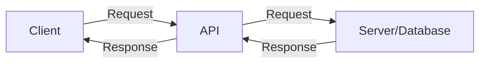

# PHP API Basics

## Introduction

Application Programming Interfaces (APIs) have become the backbone of modern web development, allowing applications to communicate with each other seamlessly. In this tutorial, we'll explore how to work with APIs using PHP, a popular server-side scripting language. Whether you want to create your own API or consume existing ones, understanding these fundamentals will set you on the path to building powerful, interconnected applications.

## What is an API?

An API (Application Programming Interface) is a set of rules and protocols that allows one software application to interact with another. Think of it as a messenger that takes your request, tells the system what you want to do, and returns the response back to you.



In the context of web development, APIs typically:
- Accept HTTP requests 
- Process the requests on the server
- Return data (usually in JSON or XML format)
- Follow standardized protocols (like REST, SOAP, or GraphQL)

## HTTP Basics for API Development

Before diving into PHP-specific implementations, let's understand the HTTP methods that form the foundation of API communication:

| Method | Purpose | Example Use Case |
|--------|---------|-----------------|
| GET | Retrieve data | Fetching user profiles |
| POST | Create new records | Adding a new product |
| PUT | Update existing records | Updating user information |
| DELETE | Remove records | Deleting a comment |
| PATCH | Partially update records | Updating only a user's email |

## Setting Up a Basic PHP API

Let's start by creating a simple RESTful API that returns JSON data:

```php
<?php
// Set header to indicate we're returning JSON
header('Content-Type: application/json');

// Get the request method
$method = $_SERVER['REQUEST_METHOD'];

// Define a simple endpoint structure
$endpoint = isset($_GET['endpoint']) ? $_GET['endpoint'] : '';

// Basic routing
switch ($endpoint) {
    case 'users':
        handleUsers($method);
        break;
    case 'products':
        handleProducts($method);
        break;
    default:
        // Return 404 if endpoint not found
        http_response_code(404);
        echo json_encode(['error' => 'Endpoint not found']);
        break;
}

// Handler for the "users" endpoint
function handleUsers($method) {
    switch ($method) {
        case 'GET':
            // Example data - in a real app, this would come from a database
            $users = [
                ['id' => 1, 'name' => 'John Doe', 'email' => 'john@example.com'],
                ['id' => 2, 'name' => 'Jane Smith', 'email' => 'jane@example.com']
            ];
            echo json_encode($users);
            break;
        case 'POST':
            // Get POST data
            $data = json_decode(file_get_contents('php://input'), true);
            
            // Validate data (simplified)
            if (!isset($data['name']) || !isset($data['email'])) {
                http_response_code(400);
                echo json_encode(['error' => 'Name and email are required']);
                return;
            }
            
            // In a real app, you would save to database
            // Return success message with created user
            http_response_code(201); // Created
            echo json_encode([
                'message' => 'User created successfully',
                'user' => $data
            ]);
            break;
        default:
            http_response_code(405); // Method Not Allowed
            echo json_encode(['error' => 'Method not allowed']);
            break;
    }
}

// Similar function would exist for products endpoint
function handleProducts($method) {
    // Implementation for products endpoint
}
?>
```

### How to Use This API

You can access this API using:
- GET: `http://yourserver.com/api.php?endpoint=users`
- POST: Send a request to `http://yourserver.com/api.php?endpoint=users` with JSON body like:
  ```json
  {
    "name": "New User",
    "email": "newuser@example.com"
  }
  ```

## Consuming APIs with PHP

Now that we understand how to create a basic API, let's learn how to consume external APIs using PHP.

### Using cURL for API Requests

cURL is a powerful library that allows you to make HTTP requests from PHP:

```php
<?php
// Function to make an API request using cURL
function makeApiRequest($url, $method = 'GET', $data = null) {
    // Initialize cURL session
    $ch = curl_init();
    
    // Set the URL
    curl_setopt($ch, CURLOPT_URL, $url);
    
    // Return the response instead of outputting it
    curl_setopt($ch, CURLOPT_RETURNTRANSFER, true);
    
    // Set request method
    if ($method === 'POST') {
        curl_setopt($ch, CURLOPT_POST, true);
        if ($data) {
            curl_setopt($ch, CURLOPT_POSTFIELDS, json_encode($data));
        }
    } elseif ($method !== 'GET') {
        curl_setopt($ch, CURLOPT_CUSTOMREQUEST, $method);
        if ($data) {
            curl_setopt($ch, CURLOPT_POSTFIELDS, json_encode($data));
        }
    }
    
    // Set headers for JSON
    curl_setopt($ch, CURLOPT_HTTPHEADER, [
        'Content-Type: application/json',
        'Accept: application/json'
    ]);
    
    // Execute the request
    $response = curl_exec($ch);
    
    // Check for errors
    if (curl_errno($ch)) {
        $error = curl_error($ch);
        curl_close($ch);
        return ['error' => $error];
    }
    
    // Get HTTP status code
    $httpCode = curl_getinfo($ch, CURLINFO_HTTP_CODE);
    
    // Close cURL session
    curl_close($ch);
    
    // Parse JSON response
    $responseData = json_decode($response, true);
    
    return [
        'status' => $httpCode,
        'data' => $responseData
    ];
}

// Example: Get users from our API
$usersResponse = makeApiRequest('http://yourserver.com/api.php?endpoint=users');

// Example: Create a new user
$newUser = [
    'name' => 'Alice Johnson',
    'email' => 'alice@example.com'
];
$createResponse = makeApiRequest(
    'http://yourserver.com/api.php?endpoint=users', 
    'POST', 
    $newUser
);

// Display the responses
echo "GET Users Response:
";
print_r($usersResponse);

echo "
POST Create User Response:
";
print_r($createResponse);
?>
```

### Example Output

```
GET Users Response:
Array
(
    [status] => 200
    [data] => Array
        (
            [0] => Array
                (
                    [id] => 1
                    [name] => John Doe
                    [email] => john@example.com
                )
            [1] => Array
                (
                    [id] => 2
                    [name] => Jane Smith
                    [email] => jane@example.com
                )
        )
)

POST Create User Response:
Array
(
    [status] => 201
    [data] => Array
        (
            [message] => User created successfully
            [user] => Array
                (
                    [name] => Alice Johnson
                    [email] => alice@example.com
                )
        )
)
```

## Working with Third-Party APIs

Many services provide APIs that you can integrate into your applications. Let's see an example of fetching data from a public API:

```php
<?php
// Function from our previous example
function makeApiRequest($url, $method = 'GET', $data = null) {
    // Implementation from above
}

// Example: Get weather data from a public API
$weatherApiUrl = 'https://api.openweathermap.org/data/2.5/weather?q=London&appid=YOUR_API_KEY&units=metric';
$weatherData = makeApiRequest($weatherApiUrl);

if (isset($weatherData['error'])) {
    echo "Error: " . $weatherData['error'];
} else {
    $weather = $weatherData['data'];
    
    echo "Current weather in {$weather['name']}:
";
    echo "Temperature: {$weather['main']['temp']}°C
";
    echo "Conditions: {$weather['weather'][0]['description']}
";
    echo "Humidity: {$weather['main']['humidity']}%
";
}
?>
```

## API Authentication

Most APIs require authentication to protect their resources. Here are common authentication methods:

### API Key Authentication

```php
<?php
// Adding an API key to the request headers
function makeApiRequestWithKey($url, $apiKey, $method = 'GET', $data = null) {
    $ch = curl_init();
    curl_setopt($ch, CURLOPT_URL, $url);
    curl_setopt($ch, CURLOPT_RETURNTRANSFER, true);
    
    // Set request method
    if ($method === 'POST') {
        curl_setopt($ch, CURLOPT_POST, true);
        if ($data) {
            curl_setopt($ch, CURLOPT_POSTFIELDS, json_encode($data));
        }
    }
    
    // Add the API key to headers
    curl_setopt($ch, CURLOPT_HTTPHEADER, [
        'Content-Type: application/json',
        'Accept: application/json',
        'X-API-Key: ' . $apiKey  // Common header for API keys
    ]);
    
    $response = curl_exec($ch);
    $httpCode = curl_getinfo($ch, CURLINFO_HTTP_CODE);
    curl_close($ch);
    
    return [
        'status' => $httpCode,
        'data' => json_decode($response, true)
    ];
}

// Example usage
$apiKey = 'your_api_key_here';
$response = makeApiRequestWithKey('https://api.example.com/data', $apiKey);
?>
```

### OAuth Authentication

OAuth is more complex but provides better security for user data:

```php
<?php
// Simplified OAuth 2.0 token request
function getOAuthToken($clientId, $clientSecret, $tokenUrl) {
    $ch = curl_init();
    curl_setopt($ch, CURLOPT_URL, $tokenUrl);
    curl_setopt($ch, CURLOPT_RETURNTRANSFER, true);
    curl_setopt($ch, CURLOPT_POST, true);
    
    // OAuth credentials
    $credentials = base64_encode($clientId . ':' . $clientSecret);
    
    curl_setopt($ch, CURLOPT_HTTPHEADER, [
        'Authorization: Basic ' . $credentials,
        'Content-Type: application/x-www-form-urlencoded'
    ]);
    
    curl_setopt($ch, CURLOPT_POSTFIELDS, 'grant_type=client_credentials');
    
    $response = curl_exec($ch);
    curl_close($ch);
    
    return json_decode($response, true);
}

// Get token
$tokenData = getOAuthToken(
    'your_client_id',
    'your_client_secret',
    'https://api.example.com/oauth/token'
);

// Use the token for API requests
if (isset($tokenData['access_token'])) {
    $ch = curl_init();
    curl_setopt($ch, CURLOPT_URL, 'https://api.example.com/protected-resource');
    curl_setopt($ch, CURLOPT_RETURNTRANSFER, true);
    curl_setopt($ch, CURLOPT_HTTPHEADER, [
        'Authorization: Bearer ' . $tokenData['access_token'],
        'Accept: application/json'
    ]);
    
    $response = curl_exec($ch);
    curl_close($ch);
    
    $data = json_decode($response, true);
    print_r($data);
}
?>
```

## Best Practices for PHP API Development

When developing or consuming APIs with PHP, follow these best practices:

1. **Use Appropriate HTTP Status Codes**
   - 200: OK (successful request)
   - 201: Created (resource successfully created)
   - 400: Bad Request (client error)
   - 401: Unauthorized (authentication required)
   - 404: Not Found (resource doesn't exist)
   - 500: Internal Server Error (server issue)

2. **Error Handling and Validation**
   ```php
   <?php
   // Example of proper error response
   function sendErrorResponse($message, $code = 400) {
       http_response_code($code);
       echo json_encode(['error' => $message]);
       exit;
   }
   
   // Validate input
   $data = json_decode(file_get_contents('php://input'), true);
   if (!isset($data['name']) || empty($data['name'])) {
       sendErrorResponse('Name is required', 400);
   }
   ?>
   ```

3. **Rate Limiting**
   Implement rate limiting to prevent abuse:
   ```php
   <?php
   // Simple rate limiting using sessions
   session_start();
   
   $maxRequests = 100; // Max requests per hour
   $timeWindow = 3600; // 1 hour in seconds
   
   if (!isset($_SESSION['api_requests'])) {
       $_SESSION['api_requests'] = [
           'count' => 0,
           'reset_time' => time() + $timeWindow
       ];
   }
   
   // Reset counter if time window has passed
   if (time() > $_SESSION['api_requests']['reset_time']) {
       $_SESSION['api_requests'] = [
           'count' => 0,
           'reset_time' => time() + $timeWindow
       ];
   }
   
   // Increment request counter
   $_SESSION['api_requests']['count']++;
   
   // Check if limit exceeded
   if ($_SESSION['api_requests']['count'] > $maxRequests) {
       http_response_code(429); // Too Many Requests
       echo json_encode([
           'error' => 'Rate limit exceeded',
           'reset_time' => $_SESSION['api_requests']['reset_time']
       ]);
       exit;
   }
   
   // Continue with API processing...
   ?>
   ```

4. **Documentation**
   Always document your API endpoints, parameters, and responses.

## Popular PHP API Frameworks

While you can build APIs from scratch as shown in our examples, several PHP frameworks make API development easier:

1. **Laravel** - Features a built-in API system with authentication, rate limiting, and resource transformations
2. **Symfony** - Offers API Platform, a powerful tool for building hypermedia and GraphQL APIs
3. **Slim** - A micro-framework perfect for building lightweight APIs
4. **Lumen** - Laravel's micro-framework specifically designed for APIs

## Summary

In this tutorial, we've covered the fundamentals of working with APIs in PHP, including:

- Basic concepts of APIs and RESTful design
- Creating a simple PHP API that handles different HTTP methods
- Consuming external APIs using cURL
- Implementing authentication for API requests
- Best practices for secure and efficient API development

These foundational skills will help you build robust API-driven applications and integrate with third-party services effectively.

## Exercises

1. Extend the basic API we created to include a "products" endpoint with GET, POST, PUT, and DELETE methods.
2. Modify the API to read and store data in a SQLite or MySQL database instead of using hardcoded arrays.
3. Implement JWT (JSON Web Token) authentication for your API.
4. Create a simple front-end interface that consumes your PHP API using JavaScript fetch or axios.
5. Integrate with a public API (like weather, news, or social media) and build a small application that displays the data.

## Additional Resources

- [PHP Official Documentation](https://www.php.net/manual/en/index.php)
- [RESTful API Design Best Practices](https://restfulapi.net/)
- [JSON in PHP](https://www.php.net/manual/en/book.json.php)
- [cURL Documentation](https://www.php.net/manual/en/book.curl.php)
- [Postman](https://www.postman.com/) - A useful tool for testing APIs