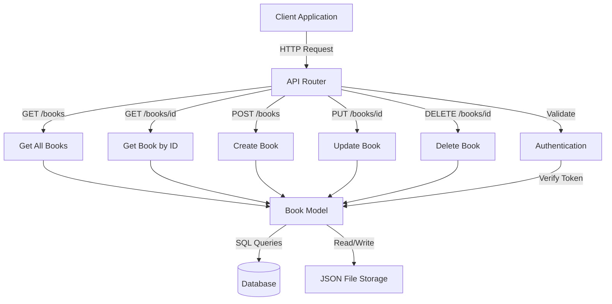

# PHP REST API

## Introduction

A REST API (Representational State Transfer Application Programming Interface) is a set of rules and conventions for building and interacting with web services. REST APIs use HTTP methods to perform operations on resources, typically represented in formats like JSON or XML.

In this tutorial, you'll learn how to create and consume REST APIs using PHP. REST APIs are essential for modern web development, enabling your applications to communicate with other services and allowing others to interact with your application programmatically.

## Understanding REST Principles

Before diving into code, let's understand the core principles of REST:

1. **Resources**: Everything is a resource, identified by a unique URL
2. **HTTP Methods**: Use standard HTTP methods (GET, POST, PUT, DELETE) for operations
3. **Stateless**: Each request contains all information needed to complete it
4. **Representation**: Resources can have multiple representations (JSON, XML, etc.)

REST APIs typically follow these conventions for CRUD operations:

| Operation | HTTP Method      | URL Pattern                       | Description                         |
|-----------|------------------|-----------------------------------|-------------------------------------|
| Create    | `POST`           | `/resources`                      | Create a new resource               |
| Read      | `GET`            | `/resources` or `/resources/{id}` | Get all resources or a specific one |
| Update    | `PUT` or `PATCH` | `/resources/{id}`                 | Update an existing resource         |
| Delete    | `DELETE`         | `/resources/{id}`                 | Delete a resource                   |

## Setting Up a Basic REST API in PHP

Let's create a simple REST API for managing a collection of books.

### Project Structure

```
book-api/
├── index.php          # Main API entry point
├── config/
│   └── database.php   # Database connection
├── models/
│   └── Book.php       # Book model
└── data/
    └── books.json     # For file-based storage (optional)
```

### Creating the Entry Point (index.php)

```php
<?php
// Allow cross-origin requests
header("Access-Control-Allow-Origin: *");
header("Content-Type: application/json; charset=UTF-8");
header("Access-Control-Allow-Methods: GET, POST, PUT, DELETE");
header("Access-Control-Allow-Headers: Content-Type, Access-Control-Allow-Headers, Authorization, X-Requested-With");

// Get request method
$method = $_SERVER['REQUEST_METHOD'];

// Get the request path
$request_uri = explode('/', trim($_SERVER['REQUEST_URI'], '/'));
$api = array_shift($request_uri); // Remove the first segment (usually 'api')
$resource = array_shift($request_uri); // Get the resource name (e.g., 'books')
$id = array_shift($request_uri); // Get the ID if provided

// Include our book model
require_once 'models/Book.php';
$book = new Book();

// Route the request based on HTTP method and resource
switch($method) {
    case 'GET':
        if ($resource === 'books') {
            if ($id) {
                // Get a specific book
                $response = $book->get($id);
            } else {
                // Get all books
                $response = $book->getAll();
            }
        } else {
            // Invalid resource
            http_response_code(404);
            $response = ['message' => 'Resource not found'];
        }
        break;
        
    case 'POST':
        if ($resource === 'books') {
            // Create a new book
            $data = json_decode(file_get_contents("php://input"), true);
            $response = $book->create($data);
        } else {
            http_response_code(404);
            $response = ['message' => 'Resource not found'];
        }
        break;
        
    case 'PUT':
        if ($resource === 'books' && $id) {
            // Update a book
            $data = json_decode(file_get_contents("php://input"), true);
            $response = $book->update($id, $data);
        } else {
            http_response_code(400);
            $response = ['message' => 'Bad request'];
        }
        break;
        
    case 'DELETE':
        if ($resource === 'books' && $id) {
            // Delete a book
            $response = $book->delete($id);
        } else {
            http_response_code(400);
            $response = ['message' => 'Bad request'];
        }
        break;
        
    default:
        http_response_code(405);
        $response = ['message' => 'Method not allowed'];
        break;
}

// Return response as JSON
echo json_encode($response);
?>
```

### Creating the Book Model (models/Book.php)

Let's create a simple file-based storage model (for simplicity):

```php
<?php
class Book {
    private $data_file = 'data/books.json';
    
    public function __construct() {
        // Create the data file if it doesn't exist
        if (!file_exists($this->data_file)) {
            file_put_contents($this->data_file, json_encode([]));
        }
    }
    
    private function getData() {
        return json_decode(file_get_contents($this->data_file), true);
    }
    
    private function saveData($data) {
        file_put_contents($this->data_file, json_encode($data, JSON_PRETTY_PRINT));
    }
    
    public function getAll() {
        return $this->getData();
    }
    
    public function get($id) {
        $books = $this->getData();
        
        foreach ($books as $book) {
            if ($book['id'] == $id) {
                return $book;
            }
        }
        
        http_response_code(404);
        return ['message' => 'Book not found'];
    }
    
    public function create($data) {
        if (!isset($data['title']) || !isset($data['author'])) {
            http_response_code(400);
            return ['message' => 'Missing required fields (title, author)'];
        }
        
        $books = $this->getData();
        
        // Generate a new ID
        $id = count($books) > 0 ? max(array_column($books, 'id')) + 1 : 1;
        
        $new_book = [
            'id' => $id,
            'title' => $data['title'],
            'author' => $data['author'],
            'published_year' => $data['published_year'] ?? null,
            'genre' => $data['genre'] ?? null,
            'created_at' => date('Y-m-d H:i:s')
        ];
        
        $books[] = $new_book;
        $this->saveData($books);
        
        http_response_code(201); // 201 Created
        return $new_book;
    }
    
    public function update($id, $data) {
        $books = $this->getData();
        $found = false;
        
        foreach ($books as $key => $book) {
            if ($book['id'] == $id) {
                $found = true;
                $books[$key] = array_merge($book, $data);
                $books[$key]['updated_at'] = date('Y-m-d H:i:s');
                break;
            }
        }
        
        if (!$found) {
            http_response_code(404);
            return ['message' => 'Book not found'];
        }
        
        $this->saveData($books);
        return $books[$key];
    }
    
    public function delete($id) {
        $books = $this->getData();
        $found = false;
        
        foreach ($books as $key => $book) {
            if ($book['id'] == $id) {
                $found = true;
                unset($books[$key]);
                break;
            }
        }
        
        if (!$found) {
            http_response_code(404);
            return ['message' => 'Book not found'];
        }
        
        $this->saveData(array_values($books)); // Re-index the array
        return ['message' => 'Book deleted successfully'];
    }
}
?>
```

## Using a Database (Optional)

For a production environment, you'll likely want to use a database instead of file storage. Here's how you could modify the Book model to use MySQL:

### Database Configuration (config/database.php)

```php
<?php
class Database {
    private $host = "localhost";
    private $db_name = "bookstore";
    private $username = "root";
    private $password = "";
    public $conn;
    
    public function getConnection() {
        $this->conn = null;
        
        try {
            $this->conn = new PDO("mysql:host=" . $this->host . ";dbname=" . $this->db_name, $this->username, $this->password);
            $this->conn->setAttribute(PDO::ATTR_ERRMODE, PDO::ERRMODE_EXCEPTION);
        } catch(PDOException $e) {
            echo "Connection error: " . $e->getMessage();
        }
        
        return $this->conn;
    }
}
?>
```

### Book Model with Database (models/Book.php)

```php
<?php
require_once 'config/database.php';

class Book {
    private $conn;
    private $table = 'books';
    
    public function __construct() {
        $database = new Database();
        $this->conn = $database->getConnection();
    }
    
    public function getAll() {
        $query = "SELECT * FROM " . $this->table;
        $stmt = $this->conn->prepare($query);
        $stmt->execute();
        
        return $stmt->fetchAll(PDO::FETCH_ASSOC);
    }
    
    public function get($id) {
        $query = "SELECT * FROM " . $this->table . " WHERE id = ?";
        $stmt = $this->conn->prepare($query);
        $stmt->bindParam(1, $id);
        $stmt->execute();
        
        $book = $stmt->fetch(PDO::FETCH_ASSOC);
        
        if (!$book) {
            http_response_code(404);
            return ['message' => 'Book not found'];
        }
        
        return $book;
    }
    
    public function create($data) {
        if (!isset($data['title']) || !isset($data['author'])) {
            http_response_code(400);
            return ['message' => 'Missing required fields (title, author)'];
        }
        
        $query = "INSERT INTO " . $this->table . " 
                (title, author, published_year, genre, created_at) 
                VALUES (?, ?, ?, ?, ?)";
        
        $stmt = $this->conn->prepare($query);
        
        // Sanitize and bind data
        $title = htmlspecialchars(strip_tags($data['title']));
        $author = htmlspecialchars(strip_tags($data['author']));
        $published_year = isset($data['published_year']) ? htmlspecialchars(strip_tags($data['published_year'])) : null;
        $genre = isset($data['genre']) ? htmlspecialchars(strip_tags($data['genre'])) : null;
        $created_at = date('Y-m-d H:i:s');
        
        $stmt->bindParam(1, $title);
        $stmt->bindParam(2, $author);
        $stmt->bindParam(3, $published_year);
        $stmt->bindParam(4, $genre);
        $stmt->bindParam(5, $created_at);
        
        if ($stmt->execute()) {
            $id = $this->conn->lastInsertId();
            http_response_code(201);
            
            return [
                'id' => $id,
                'title' => $title,
                'author' => $author,
                'published_year' => $published_year,
                'genre' => $genre,
                'created_at' => $created_at
            ];
        }
        
        http_response_code(503);
        return ['message' => 'Unable to create book'];
    }
    
    public function update($id, $data) {
        // First check if the book exists
        $check_query = "SELECT id FROM " . $this->table . " WHERE id = ?";
        $check_stmt = $this->conn->prepare($check_query);
        $check_stmt->bindParam(1, $id);
        $check_stmt->execute();
        
        if ($check_stmt->rowCount() === 0) {
            http_response_code(404);
            return ['message' => 'Book not found'];
        }
        
        // Build the update query dynamically based on provided fields
        $fields = [];
        $values = [];
        
        foreach($data as $key => $value) {
            if ($key !== 'id' && $key !== 'created_at') {
                $fields[] = "$key = ?";
                $values[] = htmlspecialchars(strip_tags($value));
            }
        }
        
        $fields[] = "updated_at = ?";
        $values[] = date('Y-m-d H:i:s');
        
        // Add id at the end for the WHERE clause
        $values[] = $id;
        
        $query = "UPDATE " . $this->table . " SET " . implode(", ", $fields) . " WHERE id = ?";
        $stmt = $this->conn->prepare($query);
        
        if ($stmt->execute($values)) {
            return $this->get($id);
        }
        
        http_response_code(503);
        return ['message' => 'Unable to update book'];
    }
    
    public function delete($id) {
        // First check if the book exists
        $check_query = "SELECT id FROM " . $this->table . " WHERE id = ?";
        $check_stmt = $this->conn->prepare($check_query);
        $check_stmt->bindParam(1, $id);
        $check_stmt->execute();
        
        if ($check_stmt->rowCount() === 0) {
            http_response_code(404);
            return ['message' => 'Book not found'];
        }
        
        $query = "DELETE FROM " . $this->table . " WHERE id = ?";
        $stmt = $this->conn->prepare($query);
        $stmt->bindParam(1, $id);
        
        if ($stmt->execute()) {
            return ['message' => 'Book deleted successfully'];
        }
        
        http_response_code(503);
        return ['message' => 'Unable to delete book'];
    }
}
?>
```

### Database Schema

```sql
CREATE TABLE books (
    id INT NOT NULL AUTO_INCREMENT PRIMARY KEY,
    title VARCHAR(255) NOT NULL,
    author VARCHAR(255) NOT NULL,
    published_year INT,
    genre VARCHAR(100),
    created_at DATETIME NOT NULL,
    updated_at DATETIME
);
```

## Consuming the API

Now let's see how to consume our REST API using PHP.

### Using cURL to Make API Requests

```php
<?php
// Function to make API requests
function callAPI($method, $url, $data = false) {
    $curl = curl_init();
    
    switch ($method) {
        case "GET":
            curl_setopt($curl, CURLOPT_URL, $url);
            break;
        case "POST":
            curl_setopt($curl, CURLOPT_URL, $url);
            curl_setopt($curl, CURLOPT_POST, 1);
            if ($data)
                curl_setopt($curl, CURLOPT_POSTFIELDS, json_encode($data));
            break;
        case "PUT":
            curl_setopt($curl, CURLOPT_URL, $url);
            curl_setopt($curl, CURLOPT_CUSTOMREQUEST, "PUT");
            if ($data)
                curl_setopt($curl, CURLOPT_POSTFIELDS, json_encode($data));
            break;
        case "DELETE":
            curl_setopt($curl, CURLOPT_URL, $url);
            curl_setopt($curl, CURLOPT_CUSTOMREQUEST, "DELETE");
            break;
    }
    
    // Options
    curl_setopt($curl, CURLOPT_RETURNTRANSFER, true);
    curl_setopt($curl, CURLOPT_HTTPHEADER, [
        'Content-Type: application/json',
        'Accept: application/json'
    ]);
    curl_setopt($curl, CURLOPT_TIMEOUT, 30);
    
    // Execute the request
    $response = curl_exec($curl);
    $err = curl_error($curl);
    
    curl_close($curl);
    
    if ($err) {
        return "cURL Error: " . $err;
    } else {
        return json_decode($response, true);
    }
}

// Base API URL
$api_url = "http://localhost/book-api/api/books";

// Example 1: Get all books
$books = callAPI('GET', $api_url);
print_r($books);

// Example 2: Get a specific book
$book = callAPI('GET', $api_url . '/1');
print_r($book);

// Example 3: Create a new book
$new_book = [
    'title' => 'The Great Gatsby',
    'author' => 'F. Scott Fitzgerald',
    'published_year' => 1925,
    'genre' => 'Novel'
];
$created_book = callAPI('POST', $api_url, $new_book);
print_r($created_book);

// Example 4: Update a book
$update_data = [
    'genre' => 'Classic Literature'
];
$updated_book = callAPI('PUT', $api_url . '/1', $update_data);
print_r($updated_book);

// Example 5: Delete a book
$delete_result = callAPI('DELETE', $api_url . '/1');
print_r($delete_result);
?>
```

## Authentication for Your REST API

For most real-world APIs, you'll want to add authentication. Here's a simple token-based authentication system:

### 1. Create an Authentication Middleware

Create a file named `auth.php`:

```php
<?php
function authenticate() {
    // Check if the API key is provided in the headers
    $headers = getallheaders();
    $api_key = isset($headers['X-API-Key']) ? $headers['X-API-Key'] : null;
    
    // You would typically verify this against a database
    // For this example, we'll use a hardcoded key
    $valid_key = 'your_secret_api_key';
    
    if (!$api_key || $api_key !== $valid_key) {
        http_response_code(401); // Unauthorized
        echo json_encode(['message' => 'Unauthorized access']);
        exit;
    }
    
    // If we get here, authentication was successful
    return true;
}
?>
```

### 2. Update index.php to Use Authentication

```php
<?php
// Include authentication middleware
require_once 'auth.php';

// Allow cross-origin requests
header("Access-Control-Allow-Origin: *");
header("Content-Type: application/json; charset=UTF-8");
header("Access-Control-Allow-Methods: GET, POST, PUT, DELETE");
header("Access-Control-Allow-Headers: Content-Type, Access-Control-Allow-Headers, Authorization, X-Requested-With, X-API-Key");

// Handle preflight OPTIONS request
if ($_SERVER['REQUEST_METHOD'] === 'OPTIONS') {
    http_response_code(200);
    exit;
}

// Authenticate the request (except for public endpoints)
authenticate();

// Rest of your API code as before
// ...
?>
```

### 3. Update API Client to Include Authentication

```php
<?php
function callAPI($method, $url, $data = false) {
    $curl = curl_init();
    
    // API Key
    $api_key = 'your_secret_api_key';
    
    switch ($method) {
        case "GET":
            curl_setopt($curl, CURLOPT_URL, $url);
            break;
        case "POST":
            curl_setopt($curl, CURLOPT_URL, $url);
            curl_setopt($curl, CURLOPT_POST, 1);
            if ($data)
                curl_setopt($curl, CURLOPT_POSTFIELDS, json_encode($data));
            break;
        case "PUT":
            curl_setopt($curl, CURLOPT_URL, $url);
            curl_setopt($curl, CURLOPT_CUSTOMREQUEST, "PUT");
            if ($data)
                curl_setopt($curl, CURLOPT_POSTFIELDS, json_encode($data));
            break;
        case "DELETE":
            curl_setopt($curl, CURLOPT_URL, $url);
            curl_setopt($curl, CURLOPT_CUSTOMREQUEST, "DELETE");
            break;
    }
    
    // Options
    curl_setopt($curl, CURLOPT_RETURNTRANSFER, true);
    curl_setopt($curl, CURLOPT_HTTPHEADER, [
        'Content-Type: application/json',
        'Accept: application/json',
        'X-API-Key: ' . $api_key
    ]);
    curl_setopt($curl, CURLOPT_TIMEOUT, 30);
    
    // Execute the request
    $response = curl_exec($curl);
    $err = curl_error($curl);
    
    curl_close($curl);
    
    if ($err) {
        return "cURL Error: " . $err;
    } else {
        return json_decode($response, true);
    }
}
?>
```

## Error Handling Best Practices

Proper error handling is crucial for API development. Here are some best practices:

```php
<?php
// Example error handling function
function sendError($code, $message, $details = null) {
    http_response_code($code);
    
    $response = [
        'error' => true,
        'message' => $message
    ];
    
    if ($details) {
        $response['details'] = $details;
    }
    
    echo json_encode($response);
    exit;
}

// Example usage
try {
    // Attempt some database operation
    // ...
    
    // If there's an error
    if ($errorCondition) {
        sendError(400, 'Bad request', ['field' => 'title', 'issue' => 'Title is required']);
    }
} catch (PDOException $e) {
    // Log the error (don't expose details to users in production)
    error_log($e->getMessage());
    sendError(500, 'An internal server error occurred');
}
?>
```

## API Versioning

As your API evolves, you'll want to implement versioning to prevent breaking changes:

```
api/v1/books
api/v2/books
```

You can implement this by modifying your routing:

```php
<?php
// Get the request path
$request_uri = explode('/', trim($_SERVER['REQUEST_URI'], '/'));
$api = array_shift($request_uri); // Usually 'api'
$version = array_shift($request_uri); // e.g., 'v1'
$resource = array_shift($request_uri); // e.g., 'books'
$id = array_shift($request_uri); // The ID if provided

// Based on version, include different model files
if ($version === 'v1') {
    require_once 'models/v1/Book.php';
} else if ($version === 'v2') {
    require_once 'models/v2/Book.php';
} else {
    // Default to the latest version
    require_once 'models/v2/Book.php';
}
?>
```

## API Documentation

Here's an example of how you might document your API using OpenAPI/Swagger:

```yaml
openapi: 3.0.0
info:
  title: Book API
  description: A simple REST API for managing books
  version: 1.0.0
servers:
  - url: http://localhost/book-api/api
    description: Development server
paths:
  /books:
    get:
      summary: Returns a list of books
      responses:
        '200':
          description: A JSON array of book objects
          content:
            application/json:
              schema:
                type: array
                items:
                  $ref: '#/components/schemas/Book'
    post:
      summary: Creates a new book
      requestBody:
        required: true
        content:
          application/json:
            schema:
              $ref: '#/components/schemas/BookInput'
      responses:
        '201':
          description: Created
          content:
            application/json:
              schema:
                $ref: '#/components/schemas/Book'
  /books/{id}:
    get:
      summary: Returns a book by ID
      parameters:
        - name: id
          in: path
          required: true
          schema:
            type: integer
      responses:
        '200':
          description: A book object
          content:
            application/json:
              schema:
                $ref: '#/components/schemas/Book'
        '404':
          description: Book not found
    put:
      summary: Updates a book
      parameters:
        - name: id
          in: path
          required: true
          schema:
            type: integer
      requestBody:
        required: true
        content:
          application/json:
            schema:
              $ref: '#/components/schemas/BookInput'
      responses:
        '200':
          description: Updated book object
          content:
            application/json:
              schema:
                $ref: '#/components/schemas/Book'
        '404':
          description: Book not found
    delete:
      summary: Deletes a book
      parameters:
        - name: id
          in: path
          required: true
          schema:
            type: integer
      responses:
        '200':
          description: Deletion confirmation
          content:
            application/json:
              schema:
                type: object
                properties:
                  message:
                    type: string
        '404':
          description: Book not found
components:
  schemas:
    Book:
      type: object
      properties:
        id:
          type: integer
        title:
          type: string
        author:
          type: string
        published_year:
          type: integer
        genre:
          type: string
        created_at:
          type: string
          format: date-time
        updated_at:
          type: string
          format: date-time
      required:
        - id
        - title
        - author
    BookInput:
      type: object
      properties:
        title:
          type: string
        author:
          type: string
        published_year:
          type: integer
        genre:
          type: string
      required:
        - title
        - author
```

## REST API Architecture Diagram

Here's a visual representation of a PHP REST API architecture:



## Summary

In this tutorial, you've learned:

1. **REST Principles**: The foundations of RESTful API design including resources, HTTP methods, statelessness, and representations
2. **Building a PHP REST API**: How to structure a REST API, handle HTTP methods, and process requests and responses
3. **Data Storage Options**: Using both file-based storage and databases to persist API data
4. **API Consumption**: How to use PHP to consume REST APIs through cURL
5. **Authentication**: Adding secure access to your API using token-based authentication
6. **Error Handling**: Best practices for consistent error responses
7. **Versioning**: How to maintain backward compatibility as your API evolves
8. **Documentation**: Using OpenAPI/Swagger for clear API documentation

## Exercises

1. Extend the Book API to add searching and filtering capabilities (e.g., `/books?author=Fitzgerald`)
2. Add pagination to the "get all books" endpoint (e.g., `/books?page=1&limit=10`)
3. Implement a reviews endpoint that allows users to add reviews to books (e.g., `POST /books/{id}/reviews`)
4. Create a user registration and login system with JWT authentication
5. Add rate limiting to prevent API abuse

## Additional Resources

- [PHP cURL Documentation](https://www.php.net/manual/en/book.curl.php)
- [JSON in PHP](https://www.php.net/manual/en/book.json.php)
- [PDO Database Access](https://www.php.net/manual/en/book.pdo.php)
- [REST API Design Best Practices](https://restfulapi.net/)
- [OpenAPI Specification](https://swagger.io/specification/)
- [JSON Web Tokens (JWT)](https://jwt.io/)