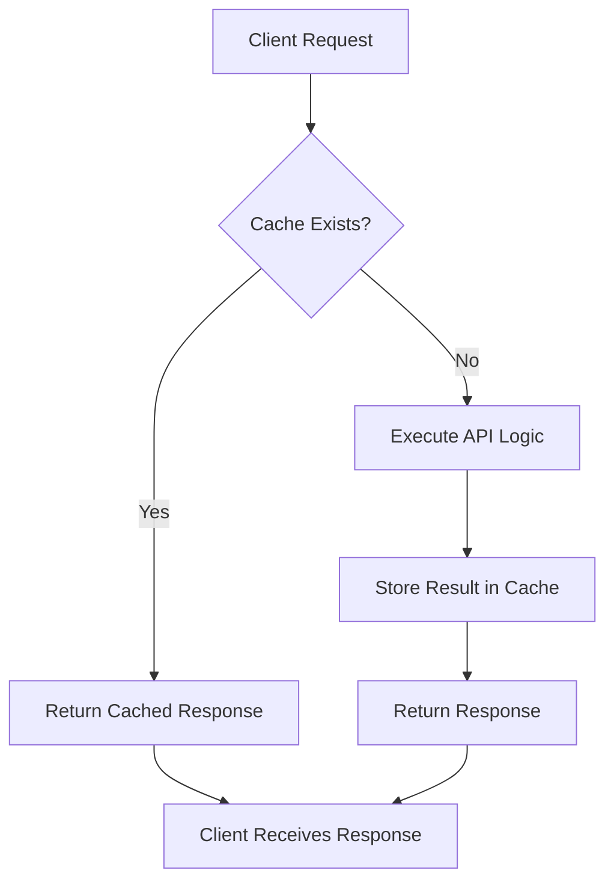

# PHP API Caching

## Introduction

When building APIs in PHP, performance is a critical consideration, especially as your application scales. One of the most effective ways to improve API performance is through **caching**. Caching stores the results of expensive operations (like database queries or external API calls) so they can be quickly retrieved later without repeating the original operation.

In this tutorial, we'll explore various caching techniques for PHP APIs, from simple file-based approaches to more advanced solutions using Redis or Memcached. By the end, you'll understand how to implement caching to make your PHP APIs faster and more efficient.

## Why Cache Your API?

Before diving into implementation details, let's understand why caching is essential:

1. **Improved Response Time**: Cached responses can be delivered much faster than dynamically generated ones
2. **Reduced Server Load**: Fewer resource-intensive operations mean less strain on your server
3. **Better Scalability**: Your API can handle more requests with the same hardware
4. **Lower Costs**: Reduced resource usage can translate to lower hosting costs
5. **Enhanced User Experience**: Faster APIs mean happier users and clients

## Basic Caching Concepts

Let's visualize the basic flow of API caching:



The key components of any caching system are:

- **Cache Storage**: Where cached data is kept (files, memory, database)
- **Cache Key**: Unique identifier for each cached item
- **TTL (Time To Live)**: How long items remain valid in the cache
- **Cache Invalidation**: Methods to clear or update cached data when needed

## Simple File-Based Caching

Let's start with a basic file-based caching implementation:

```php
class SimpleFileCache {
    private $cacheDir;
    
    public function __construct($cacheDir = 'cache') {
        $this->cacheDir = $cacheDir;
        if (!is_dir($this->cacheDir)) {
            mkdir($this->cacheDir, 0755, true);
        }
    }
    
    public function get($key) {
        $filename = $this->getCacheFilename($key);
        
        if (!file_exists($filename)) {
            return null;
        }
        
        $content = file_get_contents($filename);
        $cacheData = json_decode($content, true);
        
        // Check if cache is expired
        if (time() > $cacheData['expires']) {
            $this->delete($key);
            return null;
        }
        
        return $cacheData['data'];
    }
    
    public function set($key, $data, $ttl = 3600) {
        $filename = $this->getCacheFilename($key);
        $cacheData = [
            'expires' => time() + $ttl,
            'data' => $data
        ];
        
        file_put_contents($filename, json_encode($cacheData));
    }
    
    public function delete($key) {
        $filename = $this->getCacheFilename($key);
        if (file_exists($filename)) {
            unlink($filename);
        }
    }
    
    private function getCacheFilename($key) {
        return $this->cacheDir . '/' . md5($key) . '.cache';
    }
}
```

### Example Usage in an API Endpoint

Let's see how to use this file cache in a simple API endpoint:

```php
// api.php
require_once 'SimpleFileCache.php';

// Set headers for JSON API
header('Content-Type: application/json');

// Initialize cache
$cache = new SimpleFileCache();

// Generate cache key based on request parameters
$cacheKey = 'products_' . md5(json_encode($_GET));

// Try to get data from cache
$data = $cache->get($cacheKey);

if ($data === null) {
    // Cache miss - fetch data from database
    // (Simulated database query)
    $products = [
        ['id' => 1, 'name' => 'Laptop', 'price' => 999.99],
        ['id' => 2, 'name' => 'Smartphone', 'price' => 499.99],
        ['id' => 3, 'name' => 'Tablet', 'price' => 299.99]
    ];
    
    // Filter products based on query parameters (simplified example)
    if (isset($_GET['min_price'])) {
        $minPrice = floatval($_GET['min_price']);
        $products = array_filter($products, function($product) use ($minPrice) {
            return $product['price'] >= $minPrice;
        });
    }
    
    $data = [
        'status' => 'success',
        'timestamp' => time(),
        'products' => array_values($products)
    ];
    
    // Store in cache for 10 minutes
    $cache->set($cacheKey, $data, 600);
    
    // Add header to indicate cache miss
    header('X-Cache: MISS');
} else {
    // Add header to indicate cache hit
    header('X-Cache: HIT');
}

// Output the data
echo json_encode($data);
```

### Example Request and Response

**Request:**
```
GET /api.php?min_price=400
```

**Response (First time - Cache Miss):**
```json
{
  "status": "success",
  "timestamp": 1645543214,
  "products": [
    {"id": 1, "name": "Laptop", "price": 999.99},
    {"id": 2, "name": "Smartphone", "price": 499.99}
  ]
}
```
Headers: `X-Cache: MISS`

**Response (Subsequent requests - Cache Hit):**
Same JSON output with header: `X-Cache: HIT`

## Advanced Caching with PSR-16 (Simple Cache)

For more robust applications, it's better to use standardized caching interfaces like PSR-16. Here's an example using the popular Symfony Cache component:

First, install the required package:

```bash
composer require symfony/cache
```

Now, let's implement a more advanced API with PSR-16 caching:

```php
// advanced-api.php
require_once 'vendor/autoload.php';

use Symfony\Component\Cache\Adapter\FilesystemAdapter;
use Symfony\Component\Cache\Psr16Cache;

// Set headers for JSON API
header('Content-Type: application/json');

// Initialize PSR-16 cache
$cache = new Psr16Cache(new FilesystemAdapter());

// Define endpoint and parameters
$endpoint = $_GET['endpoint'] ?? 'products';
$params = $_GET;
unset($params['endpoint']); // Remove endpoint from cache key params

// Generate cache key
$cacheKey = $endpoint . '_' . md5(json_encode($params));

// Try to get from cache
$data = $cache->get($cacheKey);

if ($data === null) {
    // Cache miss - fetch data
    switch ($endpoint) {
        case 'products':
            $data = fetchProducts($params);
            break;
        case 'categories':
            $data = fetchCategories($params);
            break;
        default:
            http_response_code(404);
            $data = ['error' => 'Endpoint not found'];
    }
    
    // Cache for 5 minutes (only if it's a valid response)
    if (!isset($data['error'])) {
        $cache->set($cacheKey, $data, 300);
    }
    
    header('X-Cache: MISS');
} else {
    header('X-Cache: HIT');
}

echo json_encode($data);

// Simulated data fetching functions
function fetchProducts($params) {
    // In a real application, this would query a database
    $products = [
        ['id' => 1, 'name' => 'Laptop', 'price' => 999.99, 'category_id' => 1],
        ['id' => 2, 'name' => 'Smartphone', 'price' => 499.99, 'category_id' => 1],
        ['id' => 3, 'name' => 'Tablet', 'price' => 299.99, 'category_id' => 1],
        ['id' => 4, 'name' => 'Headphones', 'price' => 99.99, 'category_id' => 2],
        ['id' => 5, 'name' => 'Keyboard', 'price' => 49.99, 'category_id' => 3]
    ];
    
    // Apply filters
    if (isset($params['category_id'])) {
        $catId = intval($params['category_id']);
        $products = array_filter($products, function($p) use ($catId) {
            return $p['category_id'] == $catId;
        });
    }
    
    return [
        'status' => 'success',
        'timestamp' => time(),
        'count' => count($products),
        'products' => array_values($products)
    ];
}

function fetchCategories($params) {
    // Simulated categories data
    $categories = [
        ['id' => 1, 'name' => 'Electronics'],
        ['id' => 2, 'name' => 'Audio'],
        ['id' => 3, 'name' => 'Accessories']
    ];
    
    return [
        'status' => 'success',
        'timestamp' => time(),
        'categories' => $categories
    ];
}
```

## Caching with Redis

For high-performance applications, Redis is an excellent choice for caching. It's an in-memory data store that offers much faster performance than file-based caching.

First, install the Redis PHP extension and the Predis library:

```bash
# Install Redis server
apt-get install redis-server

# Install PHP Redis extension
pecl install redis

# Or alternatively, use Predis via Composer
composer require predis/predis
```

Now, let's implement Redis caching:

```php
// redis-api.php
require_once 'vendor/autoload.php';

// Set headers for JSON API
header('Content-Type: application/json');

// Initialize Redis connection
$redis = new Redis();
$redis->connect('127.0.0.1', 6379);

// Generate cache key based on request URI and query parameters
$cacheKey = 'api:' . md5($_SERVER['REQUEST_URI']);

// Try to get data from Redis
$cachedData = $redis->get($cacheKey);

if ($cachedData === false) {
    // Cache miss - generate the data
    
    // Simulate API processing time
    usleep(500000); // 500ms delay to simulate database query
    
    // Mock data for this example
    $data = [
        'status' => 'success',
        'cached' => false,
        'timestamp' => time(),
        'data' => [
            'users' => [
                ['id' => 1, 'name' => 'John Doe', 'email' => 'john@example.com'],
                ['id' => 2, 'name' => 'Jane Smith', 'email' => 'jane@example.com'],
                ['id' => 3, 'name' => 'Bob Johnson', 'email' => 'bob@example.com']
            ]
        ]
    ];
    
    // Convert to JSON
    $jsonData = json_encode($data);
    
    // Store in Redis with a 2-minute expiration
    $redis->setex($cacheKey, 120, $jsonData);
    
    header('X-Cache: MISS');
} else {
    $jsonData = $cachedData;
    header('X-Cache: HIT');
}

// Output the JSON data
echo $jsonData;
```

## Conditional Caching and Cache Invalidation

In real-world applications, caching needs to be more sophisticated. Sometimes you need to invalidate caches when data changes:

```php
// conditional-cache.php
require_once 'vendor/autoload.php';

use Symfony\Component\Cache\Adapter\FilesystemAdapter;
use Symfony\Component\Cache\Psr16Cache;

// Set headers for JSON API
header('Content-Type: application/json');

// Initialize cache
$cache = new Psr16Cache(new FilesystemAdapter());

// Get request method and endpoint
$method = $_SERVER['REQUEST_METHOD'];
$endpoint = $_GET['endpoint'] ?? 'products';

// Only cache GET requests
if ($method === 'GET') {
    $params = $_GET;
    unset($params['endpoint']);
    
    // Generate cache key
    $cacheKey = $endpoint . '_' . md5(json_encode($params));
    
    // Try to get from cache
    $data = $cache->get($cacheKey);
    
    if ($data !== null) {
        header('X-Cache: HIT');
        echo json_encode($data);
        exit;
    }
    
    header('X-Cache: MISS');
}

// Process the request (cache miss or non-GET request)
switch ($method) {
    case 'GET':
        if ($endpoint === 'products') {
            $data = fetchProducts($_GET);
            // Cache the result (5 minutes)
            $cache->set($cacheKey, $data, 300);
        } else {
            http_response_code(404);
            $data = ['error' => 'Endpoint not found'];
        }
        break;
        
    case 'POST':
        // Create a new product
        $data = createProduct(json_decode(file_get_contents('php://input'), true));
        
        // Invalidate all product caches
        invalidateProductCaches($cache);
        break;
        
    case 'PUT':
        // Update a product
        $data = updateProduct($_GET['id'] ?? null, json_decode(file_get_contents('php://input'), true));
        
        // Invalidate all product caches
        invalidateProductCaches($cache);
        break;
        
    case 'DELETE':
        // Delete a product
        $data = deleteProduct($_GET['id'] ?? null);
        
        // Invalidate all product caches
        invalidateProductCaches($cache);
        break;
        
    default:
        http_response_code(405);
        $data = ['error' => 'Method not allowed'];
}

echo json_encode($data);

// Cache invalidation function
function invalidateProductCaches($cache) {
    // In a real application, you would store cache keys in a list
    // Here we'll use a pattern-based approach (requires Redis or similar for practical use)
    
    // For demonstration, we'll just output what would happen
    header('X-Cache-Invalidation: All product caches have been invalidated');
}

// Other functions (fetchProducts, createProduct, etc.) would be implemented here
```

## HTTP Caching Headers

Another important aspect of API caching is using proper HTTP cache headers to allow client-side and proxy caching:

```php
// http-cache.php
$etag = md5(json_encode($data));
$lastModified = gmdate('D, d M Y H:i:s', $data['timestamp']) . ' GMT';

// Check If-None-Match header (ETag)
if (isset($_SERVER['HTTP_IF_NONE_MATCH']) && $_SERVER['HTTP_IF_NONE_MATCH'] === $etag) {
    http_response_code(304); // Not Modified
    exit;
}

// Check If-Modified-Since header
if (isset($_SERVER['HTTP_IF_MODIFIED_SINCE']) && strtotime($_SERVER['HTTP_IF_MODIFIED_SINCE']) >= $data['timestamp']) {
    http_response_code(304); // Not Modified
    exit;
}

// Set cache headers
header('ETag: ' . $etag);
header('Last-Modified: ' . $lastModified);
header('Cache-Control: public, max-age=3600'); // Cache for 1 hour

// Output the data
echo json_encode($data);
```

## Best Practices for API Caching

1. **Use Appropriate TTL Values**: Set expiration times based on how frequently your data changes
2. **Include Versioning in Cache Keys**: Add API version to cache keys to prevent issues during updates
3. **Cache at Multiple Levels**: Implement caching at different levels (database query, API response, HTTP)
4. **Monitor Cache Performance**: Track hit rates and response times to optimize your caching strategy
5. **Plan for Cache Invalidation**: Have a strategy for updating or clearing cached data when necessary
6. **Consider Cache Warming**: Pre-populate caches for frequently accessed resources
7. **Use Stale-While-Revalidate**: Serve stale content while fetching fresh data in the background

## Implementing Cache Tags for Selective Invalidation

For more granular cache control, you can implement cache tags:

```php
// Using Symfony Cache with tags
use Symfony\Component\Cache\Adapter\TagAwareAdapter;
use Symfony\Component\Cache\Adapter\FilesystemAdapter;

$cache = new TagAwareAdapter(new FilesystemAdapter());

// Cache with tags
$item = $cache->getItem('product_list');
if (!$item->isHit()) {
    $item->set($productData);
    $item->tag(['products', 'list']);
    $cache->save($item);
}

// Later, invalidate only specific tags
$cache->invalidateTags(['products']);
```

## Real-World Example: API with Complete Caching Strategy

Let's put everything together with a complete example of an API endpoint with caching:

```php
<?php
// complete-api-cache.php
require_once 'vendor/autoload.php';

use Symfony\Component\Cache\Adapter\RedisAdapter;
use Symfony\Component\Cache\Adapter\TagAwareAdapter;

// Set headers for JSON API
header('Content-Type: application/json');

// Create Redis connection
$redis = new Redis();
$redis->connect('127.0.0.1', 6379);

// Create cache adapter with tags support
$cachePool = new TagAwareAdapter(new RedisAdapter($redis));

// Get request parameters
$requestUri = $_SERVER['REQUEST_URI'];
$method = $_SERVER['REQUEST_METHOD'];
$requestData = json_decode(file_get_contents('php://input'), true) ?? [];

// Process the request
try {
    switch ($method) {
        case 'GET':
            // Handle GET request with caching
            handleGetRequest($cachePool, $requestUri);
            break;
            
        case 'POST':
            // Handle POST request (create)
            handlePostRequest($cachePool, $requestData);
            break;
            
        case 'PUT':
            // Handle PUT request (update)
            $id = $_GET['id'] ?? null;
            if (!$id) {
                throw new Exception('ID is required for updates');
            }
            handlePutRequest($cachePool, $id, $requestData);
            break;
            
        case 'DELETE':
            // Handle DELETE request
            $id = $_GET['id'] ?? null;
            if (!$id) {
                throw new Exception('ID is required for deletion');
            }
            handleDeleteRequest($cachePool, $id);
            break;
            
        default:
            http_response_code(405);
            echo json_encode(['error' => 'Method not allowed']);
    }
} catch (Exception $e) {
    http_response_code(400);
    echo json_encode(['error' => $e->getMessage()]);
}

// Function to handle GET requests with caching
function handleGetRequest($cache, $requestUri) {
    // Generate a cache key based on the full request URI
    $cacheKey = 'api_' . md5($requestUri);
    
    // Try to get item from cache
    $cacheItem = $cache->getItem($cacheKey);
    
    if ($cacheItem->isHit()) {
        // We have a cache hit
        $data = $cacheItem->get();
        header('X-Cache: HIT');
        
        // Set ETag for HTTP caching
        $etag = md5(json_encode($data));
        header('ETag: "' . $etag . '"');
        
        // Check if the client sent an If-None-Match header matching our ETag
        if (isset($_SERVER['HTTP_IF_NONE_MATCH'])) {
            $clientEtag = str_replace('"', '', $_SERVER['HTTP_IF_NONE_MATCH']);
            if ($clientEtag === $etag) {
                http_response_code(304); // Not Modified
                exit;
            }
        }
    } else {
        // Cache miss - fetch data from database
        $data = fetchDataFromDatabase($requestUri);
        
        // Set cache item with tags for easier invalidation
        $cacheItem->set($data);
        
        // Add appropriate tags based on the request
        if (strpos($requestUri, '/products') === 0) {
            $cacheItem->tag(['products']);
            
            // Add product ID tag if it's a specific product
            if (preg_match('/\/products\/(\d+)/', $requestUri, $matches)) {
                $cacheItem->tag(['product-' . $matches[1]]);
            }
        }
        
        // Set expiration time (5 minutes)
        $cacheItem->expiresAfter(300);
        
        // Save to cache
        $cache->save($cacheItem);
        
        header('X-Cache: MISS');
        
        // Set ETag for HTTP caching
        $etag = md5(json_encode($data));
        header('ETag: "' . $etag . '"');
    }
    
    // Set Cache-Control headers
    header('Cache-Control: public, max-age=300');
    
    // Output the data
    echo json_encode($data);
}

// Function to handle POST requests with cache invalidation
function handlePostRequest($cache, $requestData) {
    // Validate request data
    if (empty($requestData)) {
        throw new Exception('No data provided');
    }
    
    // Insert into database
    $result = insertIntoDatabase($requestData);
    
    // Invalidate relevant cache tags
    $cache->invalidateTags(['products']);
    
    // Return success response
    http_response_code(201); // Created
    echo json_encode([
        'status' => 'success',
        'message' => 'Resource created',
        'id' => $result['id']
    ]);
}

// Functions to handle PUT and DELETE would follow similar patterns with appropriate cache invalidation

// Mock database functions (in a real app, these would interact with a database)
function fetchDataFromDatabase($requestUri) {
    // Simulate a slow database query
    usleep(500000); // 500ms delay
    
    // Parse the request to determine what data to return
    if (strpos($requestUri, '/products') === 0) {
        // Check if it's a specific product or the product list
        if (preg_match('/\/products\/(\d+)/', $requestUri, $matches)) {
            $productId = $matches[1];
            return [
                'id' => $productId,
                'name' => 'Product ' . $productId,
                'price' => rand(10, 1000) / 10,
                'timestamp' => time()
            ];
        } else {
            // Return product list
            $products = [];
            for ($i = 1; $i <= 10; $i++) {
                $products[] = [
                    'id' => $i,
                    'name' => 'Product ' . $i,
                    'price' => rand(10, 1000) / 10
                ];
            }
            return [
                'products' => $products,
                'count' => count($products),
                'timestamp' => time()
            ];
        }
    }
    
    // Default response if no specific handler
    return [
        'error' => 'Not found',
        'timestamp' => time()
    ];
}

function insertIntoDatabase($data) {
    // Simulate database insert
    return [
        'success' => true,
        'id' => rand(100, 999)
    ];
}
```

## Summary

Caching is an essential technique for building high-performance PHP APIs. In this tutorial, we've covered:

1. **Basic caching concepts** and why they're important for APIs
2. **Simple file-based caching** for smaller applications
3. **PSR-16 caching** with Symfony Cache for standardized implementations
4. **Redis caching** for high-performance applications
5. **Cache invalidation strategies** to keep your data fresh
6. **HTTP caching headers** to enable client-side and proxy caching
7. **Cache tags** for more granular cache control
8. A **complete API example** with a robust caching strategy

By implementing these caching techniques, you can significantly improve the performance and scalability of your PHP APIs.

## Additional Resources

- [Symfony Cache Component Documentation](https://symfony.com/doc/current/components/cache.html)
- [Redis Documentation](https://redis.io/documentation)
- [HTTP Caching - MDN Web Docs](https://developer.mozilla.org/en-US/docs/Web/HTTP/Caching)
- [PSR-16: Common Interface for Caching Libraries](https://www.php-fig.org/psr/psr-16/)

## Exercises

1. Implement a simple file-based cache for an existing API endpoint.
2. Modify the caching implementation to use Redis instead of files.
3. Add proper HTTP cache headers to your API responses.
4. Implement a tag-based cache invalidation strategy for a CRUD API.
5. Create a benchmark script to compare the performance of your API with and without caching.