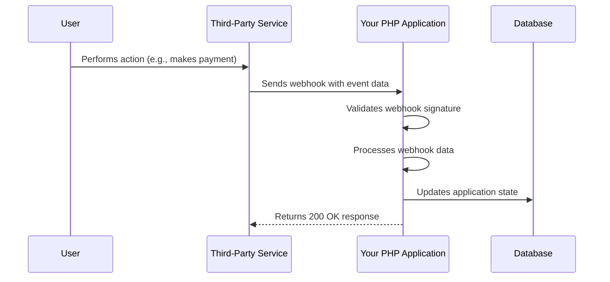

# PHP Webhook Handling

## Introduction

Webhooks are a powerful way for applications to communicate with each other in real-time. Unlike traditional APIs where your application needs to repeatedly poll for new information, webhooks use a "push" model where external services send data to your application whenever specific events occur.

In this tutorial, you'll learn how to implement webhook handlers in PHP to receive and process data from third-party services like payment processors, version control systems, or CRM platforms.

## What Are Webhooks?

Webhooks are HTTP callbacks that are triggered by specific events in a source system and sent to a URL of your choosing. Think of webhooks as "user-defined HTTP callbacks" that let external services notify your application when something happens.



## Setting Up a Basic Webhook Endpoint

Let's create a simple PHP script that can receive webhook data:

```php
<?php
// webhook.php

// Get the raw POST data
$rawData = file_get_contents('php://input');

// Log the received webhook for debugging
error_log('Webhook received: ' . $rawData);

// Parse the JSON payload
$payload = json_decode($rawData, true);

// Basic validation
if (!$payload) {
    http_response_code(400);
    echo json_encode(['error' => 'Invalid JSON payload']);
    exit;
}

// Process the webhook data
// For this example, we'll just acknowledge receipt
http_response_code(200);
echo json_encode(['status' => 'success', 'message' => 'Webhook received']);
```

### How It Works:

1. We use `file_get_contents('php://input')` to capture the raw POST data sent to our endpoint
2. We log the data for debugging purposes
3. We parse the JSON payload into a PHP array
4. We return a 200 OK response to acknowledge receipt

## Webhook Security: Validating Signatures

Security is crucial when implementing webhooks. Most third-party services will send a signature along with the webhook payload that you can use to verify the authenticity of the request.

Here's an example of how to validate a webhook signature from a service like Stripe:

```php
<?php
// secure_webhook.php

// Your webhook secret (should be stored securely, not hardcoded)
$webhookSecret = 'whsec_your_webhook_secret';

// Get the raw POST data
$rawData = file_get_contents('php://input');

// Get the signature from the headers
$signature = $_SERVER['HTTP_STRIPE_SIGNATURE'] ?? '';

// Verify the signature
$signatureValid = false;

try {
    // Get timestamp and signatures from the header
    $signatureParts = explode(',', $signature);
    $timestamp = null;
    $providedSignature = null;
    
    foreach ($signatureParts as $part) {
        if (strpos($part, 't=') === 0) {
            $timestamp = substr($part, 2);
        } elseif (strpos($part, 'v1=') === 0) {
            $providedSignature = substr($part, 3);
        }
    }
    
    if (!$timestamp || !$providedSignature) {
        throw new Exception('Incomplete signature data');
    }
    
    // Create the expected signature
    $signedPayload = $timestamp . '.' . $rawData;
    $expectedSignature = hash_hmac('sha256', $signedPayload, $webhookSecret);
    
    // Check if signatures match using a constant-time comparison
    $signatureValid = hash_equals($expectedSignature, $providedSignature);
    
} catch (Exception $e) {
    error_log('Webhook signature verification failed: ' . $e->getMessage());
}

if (!$signatureValid) {
    http_response_code(403);
    echo json_encode(['error' => 'Invalid signature']);
    exit;
}

// Proceed with processing the valid webhook data
$payload = json_decode($rawData, true);

// Process based on event type
$eventType = $payload['type'] ?? 'unknown';
processWebhookEvent($eventType, $payload);

// Acknowledge receipt
http_response_code(200);
echo json_encode(['status' => 'success']);

// Function to handle different event types
function processWebhookEvent($eventType, $payload) {
    switch ($eventType) {
        case 'payment_intent.succeeded':
            // Handle successful payment
            error_log('Processing successful payment: ' . $payload['data']['object']['id']);
            // Update database, send confirmation email, etc.
            break;
            
        case 'customer.subscription.updated':
            // Handle subscription update
            error_log('Processing subscription update: ' . $payload['data']['object']['id']);
            // Update user's subscription status
            break;
            
        default:
            // Handle unknown event type
            error_log('Received unknown event type: ' . $eventType);
    }
}
```

### Key Security Considerations:

1. **Validate the signature**: Always verify that the webhook came from the expected source
2. **Use constant-time comparison**: The `hash_equals()` function prevents timing attacks
3. **Store secrets securely**: Don't hardcode webhook secrets in your code
4. **Return appropriate status codes**: Return 403 for invalid signatures

## Implementing a Complete Webhook Handler

Now let's build a more complete webhook handler class that you can use in your projects:

```php
<?php
// WebhookHandler.php

class WebhookHandler {
    private $secret;
    private $rawData;
    private $payload;
    private $eventHandlers = [];
    
    /**
     * Create a new webhook handler
     * 
     * @param string $secret The webhook secret
     */
    public function __construct($secret) {
        $this->secret = $secret;
        $this->rawData = file_get_contents('php://input');
        $this->payload = json_decode($this->rawData, true);
    }
    
    /**
     * Register an event handler
     * 
     * @param string $eventType The event type to handle
     * @param callable $callback The callback function
     * @return $this
     */
    public function on($eventType, callable $callback) {
        $this->eventHandlers[$eventType] = $callback;
        return $this;
    }
    
    /**
     * Validate the webhook signature
     * 
     * @param string $signatureHeader The signature header
     * @param string $signaturePrefix The prefix used in the signature (e.g., 'v1=')
     * @param string $timestampPrefix The prefix used for the timestamp (e.g., 't=')
     * @return bool Whether the signature is valid
     */
    public function validateSignature($signatureHeader, $signaturePrefix = 'v1=', $timestampPrefix = 't=') {
        $signatureParts = explode(',', $signatureHeader);
        $timestamp = null;
        $providedSignature = null;
        
        foreach ($signatureParts as $part) {
            $part = trim($part);
            if (strpos($part, $timestampPrefix) === 0) {
                $timestamp = substr($part, strlen($timestampPrefix));
            } elseif (strpos($part, $signaturePrefix) === 0) {
                $providedSignature = substr($part, strlen($signaturePrefix));
            }
        }
        
        if (!$timestamp || !$providedSignature) {
            return false;
        }
        
        // Protect against replay attacks by checking timestamp
        $now = time();
        if ($now - $timestamp > 300) { // 5 minute tolerance
            return false;
        }
        
        $signedPayload = $timestamp . '.' . $this->rawData;
        $expectedSignature = hash_hmac('sha256', $signedPayload, $this->secret);
        
        return hash_equals($expectedSignature, $providedSignature);
    }
    
    /**
     * Process the webhook
     * 
     * @param string $signatureHeader The signature header
     * @param string $eventTypeKey The key in the payload that contains the event type
     * @return bool Whether processing was successful
     */
    public function process($signatureHeader = null, $eventTypeKey = 'type') {
        // Validate payload
        if (!$this->payload) {
            $this->respondWithError(400, 'Invalid JSON payload');
            return false;
        }
        
        // Validate signature if provided
        if ($signatureHeader && !$this->validateSignature($signatureHeader)) {
            $this->respondWithError(403, 'Invalid signature');
            return false;
        }
        
        // Get event type
        $eventType = $this->payload[$eventTypeKey] ?? 'unknown';
        
        // Log the event
        error_log("Processing webhook event: {$eventType}");
        
        // Call the appropriate handler
        if (isset($this->eventHandlers[$eventType])) {
            try {
                call_user_func($this->eventHandlers[$eventType], $this->payload);
                $this->respondWithSuccess();
                return true;
            } catch (Exception $e) {
                $this->respondWithError(500, 'Error processing webhook: ' . $e->getMessage());
                return false;
            }
        } else if (isset($this->eventHandlers['*'])) {
            // Call the default handler
            try {
                call_user_func($this->eventHandlers['*'], $this->payload);
                $this->respondWithSuccess();
                return true;
            } catch (Exception $e) {
                $this->respondWithError(500, 'Error processing webhook: ' . $e->getMessage());
                return false;
            }
        } else {
            $this->respondWithError(422, 'No handler for event type: ' . $eventType);
            return false;
        }
    }
    
    /**
     * Respond with a success message
     * 
     * @param array $data Additional data to include in the response
     */
    private function respondWithSuccess($data = []) {
        http_response_code(200);
        echo json_encode(array_merge(['status' => 'success'], $data));
    }
    
    /**
     * Respond with an error message
     * 
     * @param int $code HTTP status code
     * @param string $message Error message
     */
    private function respondWithError($code, $message) {
        http_response_code($code);
        echo json_encode(['status' => 'error', 'message' => $message]);
    }
    
    /**
     * Get the parsed payload
     * 
     * @return array The webhook payload
     */
    public function getPayload() {
        return $this->payload;
    }
}
```

### Using the WebhookHandler Class

Here's an example of how to use this class to handle webhooks from a payment processor:

```php
<?php
// payment_webhook.php
require_once 'WebhookHandler.php';

// Load configuration (consider using environment variables)
$webhookSecret = 'your_webhook_secret_here';

// Create a new webhook handler
$handler = new WebhookHandler($webhookSecret);

// Register event handlers
$handler->on('payment.succeeded', function($payload) {
    // Get payment details
    $paymentId = $payload['data']['id'];
    $amount = $payload['data']['amount'];
    $currency = $payload['data']['currency'];
    
    // Update order status in database
    $orderId = $payload['data']['metadata']['order_id'] ?? null;
    if ($orderId) {
        updateOrderStatus($orderId, 'paid');
        sendPaymentConfirmation($orderId);
    }
    
    // Log the payment
    error_log("Payment {$paymentId} succeeded: {$amount} {$currency}");
});

$handler->on('payment.failed', function($payload) {
    // Handle failed payment
    $paymentId = $payload['data']['id'];
    $orderId = $payload['data']['metadata']['order_id'] ?? null;
    $failureReason = $payload['data']['failure_message'] ?? 'Unknown reason';
    
    if ($orderId) {
        updateOrderStatus($orderId, 'payment_failed');
        notifyCustomerAboutFailedPayment($orderId, $failureReason);
    }
    
    error_log("Payment {$paymentId} failed: {$failureReason}");
});

// Default handler for all other events
$handler->on('*', function($payload) {
    // Just log the event
    $eventType = $payload['type'] ?? 'unknown';
    error_log("Received unhandled webhook event: {$eventType}");
});

// Process the webhook
$signatureHeader = $_SERVER['HTTP_PAYMENT_SIGNATURE'] ?? null;
$handler->process($signatureHeader);

// Helper functions (implementation depends on your application)
function updateOrderStatus($orderId, $status) {
    // Update order status in database
    // Example: $db->query("UPDATE orders SET status = ? WHERE id = ?", [$status, $orderId]);
}

function sendPaymentConfirmation($orderId) {
    // Send confirmation email to customer
    // Example: $mailer->sendTemplate('payment_confirmation', $customerEmail, ['orderId' => $orderId]);
}

function notifyCustomerAboutFailedPayment($orderId, $reason) {
    // Notify customer about failed payment
    // Example: $mailer->sendTemplate('payment_failed', $customerEmail, ['orderId' => $orderId, 'reason' => $reason]);
}
```

## Real-World Example: GitHub Webhook

Let's implement a webhook handler for GitHub events to automatically deploy your website when changes are pushed to a specific branch:

```php
<?php
// github_webhook.php
require_once 'WebhookHandler.php';

// Configuration
$webhookSecret = 'your_github_webhook_secret';
$repositoryPath = '/var/www/html/my-website';
$branch = 'main';

// Create webhook handler
$handler = new WebhookHandler($webhookSecret);

// Handle push events
$handler->on('push', function($payload) use ($repositoryPath, $branch) {
    // Check if the push is to the branch we care about
    $ref = $payload['ref'] ?? '';
    if ($ref !== "refs/heads/{$branch}") {
        error_log("Ignoring push to {$ref}, only deploying from {$branch}");
        return;
    }
    
    // Get repository information
    $repository = $payload['repository']['full_name'] ?? 'unknown';
    
    // Log the deployment start
    error_log("Starting deployment for {$repository} from {$branch}");
    
    // Execute deployment commands
    $commands = [
        "cd {$repositoryPath}",
        "git fetch --all",
        "git reset --hard origin/{$branch}",
        "composer install --no-dev",
        "npm install",
        "npm run build",
        "php artisan migrate --force" // If using Laravel
    ];
    
    $output = [];
    $command = implode(' && ', $commands);
    exec($command . ' 2>&1', $output, $returnCode);
    
    // Log the result
    if ($returnCode === 0) {
        error_log("Deployment successful for {$repository}");
        error_log(implode("
", $output));
    } else {
        error_log("Deployment failed for {$repository} with code {$returnCode}");
        error_log(implode("
", $output));
    }
});

// Process the webhook
$signatureHeader = $_SERVER['HTTP_X_HUB_SIGNATURE_256'] ?? null;
$handler->process($signatureHeader, 'event');
```

## Best Practices for Webhook Handling

When implementing webhooks in your PHP applications, follow these best practices:

1. **Respond quickly**: Process webhooks asynchronously when possible to respond to the sender quickly.
2. **Implement retries**: Most services will retry webhooks if they don't receive a 2xx response, but you should also implement your own retry logic for critical operations.
3. **Validate all incoming data**: Never trust external input without validation.
4. **Store raw payloads**: Save the original webhook data for debugging and auditability.
5. **Use idempotency keys**: Ensure you can safely process the same webhook multiple times without causing duplicate effects.
6. **Monitor webhook traffic**: Set up logging and monitoring to track webhook activity.
7. **Test webhook endpoints**: Use tools like Postman or webhook.site to test your endpoints.

## Implementing Asynchronous Processing

For high-volume webhooks, it's best to acknowledge receipt immediately and process the data asynchronously:

```php
<?php
// async_webhook.php

// Get the raw webhook data
$rawData = file_get_contents('php://input');
$signature = $_SERVER['HTTP_X_WEBHOOK_SIGNATURE'] ?? '';

// Store the webhook for later processing
$webhookId = storeWebhook($rawData, $signature);

// Respond immediately
http_response_code(202); // Accepted
echo json_encode(['status' => 'queued', 'webhook_id' => $webhookId]);

// Function to store webhook data in a queue or database
function storeWebhook($data, $signature) {
    // Generate a unique ID
    $id = uniqid('wh_', true);
    
    // Store in database (example implementation)
    // $db->query("INSERT INTO webhook_queue (id, data, signature, created_at) VALUES (?, ?, ?, NOW())", 
    //    [$id, $data, $signature]);
    
    // Or write to a file for processing by a worker
    $webhookData = [
        'id' => $id,
        'signature' => $signature,
        'data' => $data,
        'timestamp' => time()
    ];
    
    file_put_contents(
        __DIR__ . '/webhooks/' . $id . '.json',
        json_encode($webhookData)
    );
    
    return $id;
}
```

This approach lets you respond quickly to the sender while processing webhooks in the background using a cron job, queue worker, or other asynchronous processing mechanism.

## Common Webhook Challenges and Solutions

### Challenge 1: Handling Duplicate Webhooks

Sometimes services send the same webhook multiple times, which can cause duplicate processing.

**Solution**: Use idempotency keys (usually provided in the webhook payload) to track which webhooks you've already processed:

```php
<?php
// Check if we've already processed this webhook
$eventId = $payload['id'] ?? null;
if ($eventId && hasBeenProcessed($eventId)) {
    // Already processed this event
    http_response_code(200);
    echo json_encode(['status' => 'already_processed']);
    exit;
}

// Process the webhook...

// Mark as processed
if ($eventId) {
    markAsProcessed($eventId);
}

// Helper functions
function hasBeenProcessed($eventId) {
    // Check if event ID exists in your database
    // Example: return $db->query("SELECT 1 FROM processed_webhooks WHERE event_id = ?", [$eventId])->rowCount() > 0;
}

function markAsProcessed($eventId) {
    // Store the event ID in your database
    // Example: $db->query("INSERT INTO processed_webhooks (event_id, processed_at) VALUES (?, NOW())", [$eventId]);
}
```

### Challenge 2: Testing Webhooks Locally

Testing webhooks locally can be challenging since external services need a public URL to send data to.

**Solution**: Use tools like ngrok, localtunnel, or webhook.site to expose your local server to the internet:

```bash
# Install ngrok
npm install -g ngrok

# Expose your local PHP server (assuming it's running on port 8000)
ngrok http 8000
```

This will give you a public URL that you can use for webhook testing.

## Summary

Webhooks provide a powerful way for your PHP applications to receive real-time updates from third-party services. By following the best practices outlined in this tutorial, you can implement secure, reliable webhook handlers that process data efficiently.

Key takeaways:
1. Webhooks use a "push" model where services send data to your application when events occur
2. Always validate webhook signatures to ensure the requests are genuine
3. Respond quickly and process webhooks asynchronously when possible
4. Implement idempotency to handle duplicate webhooks safely
5. Use a structured approach with event-based handlers for maintainable code

## Exercises

1. Create a simple webhook receiver that logs all incoming data to a file
2. Implement signature validation for webhooks from a service of your choice (Stripe, GitHub, PayPal, etc.)
3. Modify the `WebhookHandler` class to use a database for storing processed webhook IDs
4. Create a webhook handler for a specific use case, such as processing payment notifications or deployment automation
5. Implement an asynchronous webhook processing system using a queue

## Additional Resources

- [What are Webhooks? A Simple Guide](https://sendgrid.com/blog/whats-webhook/)
- [GitHub Webhooks Documentation](https://docs.github.com/en/developers/webhooks-and-events/webhooks)
- [Stripe Webhooks Guide](https://stripe.com/docs/webhooks)
- [PayPal Webhooks Integration](https://developer.paypal.com/docs/api-basics/notifications/webhooks/)
- [Testing Webhooks with ngrok](https://ngrok.com/docs)
- [PHP Queue Libraries for Asynchronous Processing](https://github.com/php-enqueue/enqueue-dev)