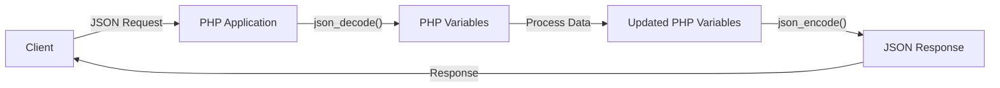

# PHP JSON Handling

## Introduction

JSON (JavaScript Object Notation) has become the standard format for data exchange in modern web applications and APIs. As a PHP developer, understanding how to effectively work with JSON is essential for building robust applications that communicate with other services, store configuration data, or implement RESTful APIs.

This guide will walk you through PHP's built-in JSON functions, common patterns for handling JSON data, and practical examples that you can apply in your own projects. By the end of this tutorial, you'll be comfortable working with JSON in your PHP applications.

## What is JSON?

JSON is a lightweight data-interchange format that is easy for humans to read and write and easy for machines to parse and generate. It's based on a subset of JavaScript but is language-independent, making it ideal for data exchange between systems written in different programming languages.

JSON supports several data types:
- Objects (key-value pairs)
- Arrays
- Strings
- Numbers
- Booleans (`true` or `false`)
- Null

Here's an example of a JSON object:

```json
{
  "name": "John Doe",
  "age": 30,
  "isActive": true,
  "skills": ["PHP", "JavaScript", "MySQL"],
  "address": {
    "city": "New York",
    "zipCode": "10001"
  }
}
```

## PHP's JSON Functions

PHP provides several built-in functions to work with JSON. The two most important are:

- `json_encode()`: Converts PHP variables to JSON format
- `json_decode()`: Converts JSON to PHP variables

Let's explore these functions in detail.

### Encoding PHP to JSON

The `json_encode()` function converts PHP variables (arrays, objects, etc.) into JSON strings.

#### Basic Usage

```php
<?php
// A PHP associative array
$user = [
    'name' => 'John Doe',
    'age' => 30,
    'isActive' => true,
    'skills' => ['PHP', 'JavaScript', 'MySQL']
];

// Convert to JSON
$jsonUser = json_encode($user);

// Output the JSON string
echo $jsonUser;
?>
```

Output:
```
{"name":"John Doe","age":30,"isActive":true,"skills":["PHP","JavaScript","MySQL"]}
```

#### Formatting Options

You can make the JSON output more readable by using the `JSON_PRETTY_PRINT` option:

```php
<?php
$user = [
    'name' => 'John Doe',
    'age' => 30,
    'isActive' => true
];

// Pretty print the JSON
$jsonUser = json_encode($user, JSON_PRETTY_PRINT);

echo $jsonUser;
?>
```

Output:
```json
{
    "name": "John Doe",
    "age": 30,
    "isActive": true
}
```

#### Other Useful Options

PHP offers several other options for `json_encode()`:

- `JSON_NUMERIC_CHECK`: Converts numeric strings to numbers
- `JSON_UNESCAPED_UNICODE`: Keeps Unicode characters as is (instead of \uXXXX)
- `JSON_UNESCAPED_SLASHES`: Doesn't escape forward slashes
- `JSON_FORCE_OBJECT`: Forces arrays to be encoded as objects

Example with multiple options:

```php
<?php
$data = [
    'text' => 'Hello World!',
    'path' => '/api/users',
    'numbers' => ['1', '2', '3'],
    'specialChar' => '€'
];

$json = json_encode($data, 
    JSON_PRETTY_PRINT | 
    JSON_NUMERIC_CHECK | 
    JSON_UNESCAPED_SLASHES | 
    JSON_UNESCAPED_UNICODE
);

echo $json;
?>
```

Output:
```json
{
    "text": "Hello World!",
    "path": "/api/users",
    "numbers": [1, 2, 3],
    "specialChar": "€"
}
```

### Decoding JSON to PHP

The `json_decode()` function parses JSON strings and converts them into PHP variables.

#### Basic Usage

```php
<?php
// A JSON string
$jsonString = '{"name":"John Doe","age":30,"isActive":true,"skills":["PHP","JavaScript","MySQL"]}';

// Convert JSON to PHP variable
$user = json_decode($jsonString);

// Access object properties
echo "Name: " . $user->name . "
";
echo "Age: " . $user->age . "
";
echo "First skill: " . $user->skills[0] . "
";
?>
```

Output:
```
Name: John Doe
Age: 30
First skill: PHP
```

#### Converting to Associative Arrays

By default, `json_decode()` converts JSON objects to PHP objects. If you prefer associative arrays, pass `true` as the second parameter:

```php
<?php
$jsonString = '{"name":"John Doe","age":30,"isActive":true}';

// Convert to associative array
$user = json_decode($jsonString, true);

// Access array elements
echo "Name: " . $user['name'] . "
";
echo "Age: " . $user['age'] . "
";
?>
```

Output:
```
Name: John Doe
Age: 30
```

#### Handling Nested Data

JSON often contains nested objects and arrays. PHP handles these naturally:

```php
<?php
$jsonString = '{"name":"John","address":{"city":"New York","zip":"10001"},"hobbies":["reading","swimming"]}';

$person = json_decode($jsonString, true);

echo "City: " . $person['address']['city'] . "
";
echo "First hobby: " . $person['hobbies'][0] . "
";
?>
```

Output:
```
City: New York
First hobby: reading
```

## Error Handling with JSON

JSON encoding or decoding can sometimes fail. It's important to handle these errors properly in your applications.

### Checking for JSON Errors

PHP provides `json_last_error()` and `json_last_error_msg()` to check for JSON errors:

```php
<?php
// Invalid JSON (missing closing brace)
$invalidJson = '{"name":"John","age":30';

$data = json_decode($invalidJson);

if (json_last_error() !== JSON_ERROR_NONE) {
    echo "JSON Error: " . json_last_error_msg();
} else {
    echo "JSON is valid!";
}
?>
```

Output:
```
JSON Error: Syntax error
```

### Common JSON Errors

Here are some common JSON errors you might encounter:

- `JSON_ERROR_DEPTH`: Maximum stack depth exceeded
- `JSON_ERROR_STATE_MISMATCH`: Invalid or malformed JSON
- `JSON_ERROR_CTRL_CHAR`: Unexpected control character found
- `JSON_ERROR_SYNTAX`: Syntax error, malformed JSON
- `JSON_ERROR_UTF8`: Malformed UTF-8 characters

A more comprehensive error handling function:

```php
<?php
function isValidJson($string) {
    json_decode($string);
    $error = json_last_error();
    
    if ($error === JSON_ERROR_NONE) {
        return true;
    }
    
    $errorMessages = [
        JSON_ERROR_DEPTH => 'Maximum stack depth exceeded',
        JSON_ERROR_STATE_MISMATCH => 'Invalid or malformed JSON',
        JSON_ERROR_CTRL_CHAR => 'Unexpected control character found',
        JSON_ERROR_SYNTAX => 'Syntax error, malformed JSON',
        JSON_ERROR_UTF8 => 'Malformed UTF-8 characters'
    ];
    
    return isset($errorMessages[$error]) 
        ? $errorMessages[$error] 
        : 'Unknown JSON error';
}

// Test the function
$testJson = '{"name": "John",}';  // Invalid JSON (extra comma)
$result = isValidJson($testJson);

echo is_string($result) ? "Error: $result" : "JSON is valid!";
?>
```

Output:
```
Error: Syntax error, malformed JSON
```

## Working with JSON in API Development

When building PHP APIs, you'll frequently handle JSON data in requests and responses. Let's look at some practical examples.

### Creating a Simple JSON API Endpoint

```php
<?php
// Set content type to JSON
header('Content-Type: application/json');

// Sample data
$products = [
    ['id' => 1, 'name' => 'Laptop', 'price' => 999.99],
    ['id' => 2, 'name' => 'Smartphone', 'price' => 499.99],
    ['id' => 3, 'name' => 'Tablet', 'price' => 299.99]
];

// Create response
$response = [
    'status' => 'success',
    'count' => count($products),
    'data' => $products
];

// Send JSON response
echo json_encode($response, JSON_PRETTY_PRINT);
?>
```

Output:
```json
{
    "status": "success",
    "count": 3,
    "data": [
        {
            "id": 1,
            "name": "Laptop",
            "price": 999.99
        },
        {
            "id": 2,
            "name": "Smartphone",
            "price": 499.99
        },
        {
            "id": 3,
            "name": "Tablet",
            "price": 299.99
        }
    ]
}
```

### Handling JSON POST Requests

Here's how to receive and handle JSON data sent to your API:

```php
<?php
// Set content type to JSON
header('Content-Type: application/json');

// Get JSON input
$jsonInput = file_get_contents('php://input');

// Parse JSON
$data = json_decode($jsonInput, true);

// Check for valid JSON
if ($data === null && json_last_error() !== JSON_ERROR_NONE) {
    $response = [
        'status' => 'error',
        'message' => 'Invalid JSON provided'
    ];
    
    http_response_code(400); // Bad request
    echo json_encode($response);
    exit;
}

// Process the data
$name = $data['name'] ?? 'Guest';
$email = $data['email'] ?? 'No email provided';

// Create response
$response = [
    'status' => 'success',
    'message' => "Hello, $name! We received your data.",
    'receivedData' => [
        'name' => $name,
        'email' => $email
    ]
];

// Send response
echo json_encode($response, JSON_PRETTY_PRINT);
?>
```

To test this endpoint, you would send a POST request with a JSON body:

```json
{
    "name": "Jane Smith",
    "email": "jane@example.com"
}
```

And receive a response like:

```json
{
    "status": "success",
    "message": "Hello, Jane Smith! We received your data.",
    "receivedData": {
        "name": "Jane Smith",
        "email": "jane@example.com"
    }
}
```

## JSON Data Flow in a PHP Application

Let's visualize the typical JSON data flow in a PHP API application:



## Best Practices for JSON Handling in PHP

1. **Always validate JSON input:**
   - Use `json_decode()` with error checking to ensure valid JSON.
   - Implement input validation for the decoded data.

2. **Set proper HTTP headers:**
   - Use `header('Content-Type: application/json')` for JSON responses.
   - Set appropriate status codes for success/error scenarios.

3. **Handle errors gracefully:**
   - Return structured error responses with meaningful messages.
   - Include error codes that clients can understand.

4. **Consider JSON encoding options:**
   - Use `JSON_PRETTY_PRINT` for debugging but omit it in production for smaller responses.
   - Use `JSON_UNESCAPED_UNICODE` when working with international characters.

5. **Watch for performance with large datasets:**
   - For large JSON structures, consider using streaming parsers.
   - Be mindful of memory usage when encoding/decoding large arrays.

6. **Secure your JSON data:**
   - Sanitize all inputs before processing.
   - Be careful not to expose sensitive data in JSON responses.

## Practical Example: Building a Complete JSON API Endpoint

Let's build a complete example of a product management API endpoint:

```php
<?php
// product_api.php

// Set content type to JSON
header('Content-Type: application/json');

// Database connection (simplified for example)
function getDbConnection() {
    // In a real application, return an actual database connection
    return true;
}

// Get products from database (mock function)
function getProducts() {
    return [
        ['id' => 1, 'name' => 'Laptop', 'price' => 999.99, 'stock' => 50],
        ['id' => 2, 'name' => 'Smartphone', 'price' => 499.99, 'stock' => 100],
        ['id' => 3, 'name' => 'Tablet', 'price' => 299.99, 'stock' => 75]
    ];
}

// Add a product (mock function)
function addProduct($product) {
    // In a real application, insert into database
    // Return the new product with an ID
    $product['id'] = 4; // Mock ID assignment
    return $product;
}

// Handle request based on method
$method = $_SERVER['REQUEST_METHOD'];

try {
    $db = getDbConnection();
    
    switch ($method) {
        case 'GET':
            // Retrieve products
            $products = getProducts();
            $response = [
                'status' => 'success',
                'count' => count($products),
                'data' => $products
            ];
            echo json_encode($response);
            break;
            
        case 'POST':
            // Add a new product
            $jsonInput = file_get_contents('php://input');
            $productData = json_decode($jsonInput, true);
            
            // Validate JSON input
            if ($productData === null && json_last_error() !== JSON_ERROR_NONE) {
                throw new Exception('Invalid JSON provided', 400);
            }
            
            // Validate required fields
            if (empty($productData['name']) || !isset($productData['price'])) {
                throw new Exception('Product name and price are required', 400);
            }
            
            // Add the product
            $newProduct = addProduct($productData);
            
            // Send response
            $response = [
                'status' => 'success',
                'message' => 'Product added successfully',
                'data' => $newProduct
            ];
            
            http_response_code(201); // Created
            echo json_encode($response);
            break;
            
        default:
            // Method not allowed
            throw new Exception('Method not allowed', 405);
    }
} catch (Exception $e) {
    // Handle errors
    $statusCode = $e->getCode() ?: 500;
    http_response_code($statusCode);
    
    $response = [
        'status' => 'error',
        'message' => $e->getMessage()
    ];
    
    echo json_encode($response);
}
?>
```

### Using the API

**GET Request (retrieve products):**
```
GET /product_api.php HTTP/1.1
Host: example.com
```

Response:
```json
{
    "status": "success",
    "count": 3,
    "data": [
        {"id": 1, "name": "Laptop", "price": 999.99, "stock": 50},
        {"id": 2, "name": "Smartphone", "price": 499.99, "stock": 100},
        {"id": 3, "name": "Tablet", "price": 299.99, "stock": 75}
    ]
}
```

**POST Request (add a product):**
```
POST /product_api.php HTTP/1.1
Host: example.com
Content-Type: application/json

{
    "name": "Wireless Headphones",
    "price": 149.99,
    "stock": 200
}
```

Response:
```json
{
    "status": "success",
    "message": "Product added successfully",
    "data": {
        "name": "Wireless Headphones",
        "price": 149.99,
        "stock": 200,
        "id": 4
    }
}
```

## Working with JSON Files in PHP

Besides API communication, JSON is also commonly used for configuration files and data storage.

### Reading JSON from a File

```php
<?php
// Read JSON file content
$jsonFile = file_get_contents('config.json');

// Convert to PHP array
$config = json_decode($jsonFile, true);

if ($config === null && json_last_error() !== JSON_ERROR_NONE) {
    die('Error parsing configuration file');
}

// Use the configuration
echo "App name: " . $config['app_name'] . "
";
echo "Debug mode: " . ($config['debug'] ? 'On' : 'Off') . "
";
?>
```

### Writing JSON to a File

```php
<?php
// Sample configuration data
$config = [
    'app_name' => 'My PHP Application',
    'version' => '1.0.0',
    'debug' => true,
    'database' => [
        'host' => 'localhost',
        'user' => 'dbuser',
        'password' => 'dbpass',
        'name' => 'myapp_db'
    ]
];

// Convert to JSON
$jsonConfig = json_encode($config, JSON_PRETTY_PRINT);

// Save to file
if (file_put_contents('config.json', $jsonConfig)) {
    echo "Configuration saved successfully!";
} else {
    echo "Error saving configuration file";
}
?>
```

## Summary

In this guide, we've covered the essential aspects of handling JSON in PHP:

- Using `json_encode()` to convert PHP variables to JSON
- Using `json_decode()` to parse JSON into PHP variables
- Error handling for JSON operations
- Building JSON API endpoints for receiving and sending data
- Reading and writing JSON files
- Best practices for JSON handling in PHP applications

JSON handling is a fundamental skill for modern PHP development, especially when building APIs or interacting with third-party services. By mastering these techniques, you'll be well-equipped to build robust, interoperable web applications.

## Additional Resources

- [PHP JSON Functions Documentation](https://www.php.net/manual/en/ref.json.php)
- [JSON.org](https://www.json.org/json-en.html) - The official JSON specification
- [RFC 8259](https://tools.ietf.org/html/rfc8259) - The JSON Data Interchange Format standard

## Exercises

1. **Basic JSON Handling:**
   Create a PHP script that takes a JSON string containing user information and displays it in an HTML table.

2. **API Client:**
   Build a PHP function that consumes a public JSON API (like [JSONPlaceholder](https://jsonplaceholder.typicode.com/)) and displays the results.

3. **Configuration System:**
   Create a simple configuration system using JSON files that allows reading and writing application settings.

4. **Form to JSON:**
   Create an HTML form that submits data to a PHP script, which then converts the form data to JSON and displays it.

5. **JSON Validator:**
   Build a PHP form that allows users to paste JSON and validates whether it's properly formatted, with helpful error messages for invalid JSON.