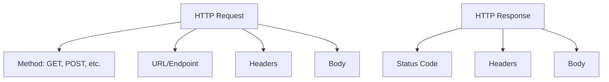

# PHP HTTP Requests

## Introduction

HTTP (Hypertext Transfer Protocol) requests are a fundamental part of modern web development, especially when building applications that need to communicate with APIs or other web services. In PHP, there are several ways to make HTTP requests to external servers and services, allowing your application to send data, retrieve information, and interact with various web resources.

This guide will walk you through the essentials of making HTTP requests in PHP, from basic concepts to practical implementations. Whether you're building a simple application that needs to fetch data from an API or developing a complex system that integrates with multiple web services, understanding HTTP requests in PHP is crucial.

## HTTP Request Basics

Before diving into the code, let's understand the basic HTTP request methods:

1. **GET** - Used to request data from a specified resource
2. **POST** - Used to submit data to be processed to a specified resource
3. **PUT** - Used to update a resource
4. **DELETE** - Used to delete a specified resource
5. **PATCH** - Used to apply partial modifications to a resource
6. **HEAD** - Similar to GET but retrieves only HTTP headers
7. **OPTIONS** - Returns the HTTP methods supported by the server

Each request type serves a specific purpose in RESTful API design and web communication.

### HTTP Request Structure

A typical HTTP request consists of:

1. A request method (GET, POST, etc.)
2. The URL or endpoint
3. Headers (metadata about the request)
4. Body (optional, contains data being sent)



## Making HTTP Requests in PHP

PHP offers several methods to make HTTP requests. We'll explore the most common approaches:

### 1. Using file_get_contents()

The simplest way to make a GET request in PHP is using the `file_get_contents()` function with a URL.

```php
<?php
// Basic GET request
$url = 'https://jsonplaceholder.typicode.com/posts/1';
$response = file_get_contents($url);

// Display the response
echo $response;
```

**Output:**
```json
{
  "userId": 1,
  "id": 1,
  "title": "sunt aut facere repellat provident occaecati excepturi optio reprehenderit",
  "body": "quia et suscipit
suscipit recusandae consequuntur expedita et cum
reprehenderit molestiae ut ut quas totam
nostrum rerum est autem sunt rem eveniet architecto"
}
```

To add more control and send custom headers with `file_get_contents()`, you can use a stream context:

```php
<?php
$url = 'https://jsonplaceholder.typicode.com/posts/1';
$options = [
    'http' => [
        'method' => 'GET',
        'header' => [
            'User-Agent: PHP Request',
            'Accept: application/json'
        ]
    ]
];

$context = stream_context_create($options);
$response = file_get_contents($url, false, $context);

echo $response;
```

However, `file_get_contents()` has limitations, especially for complex requests or when you need to handle responses more thoroughly.

### 2. Using cURL (Client URL Library)

cURL is a more powerful and flexible library for making HTTP requests in PHP. It supports all HTTP methods, custom headers, authentication, and much more.

#### Basic GET Request with cURL

```php
<?php
// Initialize cURL session
$ch = curl_init();

// Set the URL
curl_setopt($ch, CURLOPT_URL, 'https://jsonplaceholder.typicode.com/posts/1');

// Return the response instead of outputting it
curl_setopt($ch, CURLOPT_RETURNTRANSFER, true);

// Execute the request
$response = curl_exec($ch);

// Check for errors
if(curl_errno($ch)) {
    echo 'Error: ' . curl_error($ch);
} else {
    // Print the response
    echo $response;
}

// Close the cURL session
curl_close($ch);
```

#### POST Request with cURL

```php
<?php
// Initialize cURL session
$ch = curl_init();

// Set the URL
curl_setopt($ch, CURLOPT_URL, 'https://jsonplaceholder.typicode.com/posts');

// Set the request method to POST
curl_setopt($ch, CURLOPT_POST, true);

// Set the POST data
$postData = [
    'title' => 'foo',
    'body' => 'bar',
    'userId' => 1
];
curl_setopt($ch, CURLOPT_POSTFIELDS, json_encode($postData));

// Set headers
curl_setopt($ch, CURLOPT_HTTPHEADER, [
    'Content-Type: application/json',
    'Accept: application/json'
]);

// Return the response instead of outputting it
curl_setopt($ch, CURLOPT_RETURNTRANSFER, true);

// Execute the request
$response = curl_exec($ch);

// Check for errors
if(curl_errno($ch)) {
    echo 'Error: ' . curl_error($ch);
} else {
    // Print the response
    echo $response;
}

// Close the cURL session
curl_close($ch);
```

**Output:**
```json
{
  "title": "foo",
  "body": "bar",
  "userId": 1,
  "id": 101
}
```

#### PUT Request with cURL

```php
<?php
// Initialize cURL session
$ch = curl_init();

// Set the URL
curl_setopt($ch, CURLOPT_URL, 'https://jsonplaceholder.typicode.com/posts/1');

// Set the request method to PUT
curl_setopt($ch, CURLOPT_CUSTOMREQUEST, 'PUT');

// Set the PUT data
$putData = [
    'id' => 1,
    'title' => 'Updated Title',
    'body' => 'This post has been updated',
    'userId' => 1
];
curl_setopt($ch, CURLOPT_POSTFIELDS, json_encode($putData));

// Set headers
curl_setopt($ch, CURLOPT_HTTPHEADER, [
    'Content-Type: application/json',
    'Accept: application/json'
]);

// Return the response instead of outputting it
curl_setopt($ch, CURLOPT_RETURNTRANSFER, true);

// Execute the request
$response = curl_exec($ch);

// Check for errors
if(curl_errno($ch)) {
    echo 'Error: ' . curl_error($ch);
} else {
    // Print the response
    echo $response;
}

// Close the cURL session
curl_close($ch);
```

#### DELETE Request with cURL

```php
<?php
// Initialize cURL session
$ch = curl_init();

// Set the URL
curl_setopt($ch, CURLOPT_URL, 'https://jsonplaceholder.typicode.com/posts/1');

// Set the request method to DELETE
curl_setopt($ch, CURLOPT_CUSTOMREQUEST, 'DELETE');

// Return the response instead of outputting it
curl_setopt($ch, CURLOPT_RETURNTRANSFER, true);

// Execute the request
$response = curl_exec($ch);

// Check for errors
if(curl_errno($ch)) {
    echo 'Error: ' . curl_error($ch);
} else {
    // Print the response
    echo $response;
    
    // Get the HTTP status code
    $httpCode = curl_getinfo($ch, CURLINFO_HTTP_CODE);
    echo "
Status code: " . $httpCode;
}

// Close the cURL session
curl_close($ch);
```

### 3. Using Guzzle HTTP Client

For more complex applications, the Guzzle HTTP client is a modern PHP HTTP client that makes it easy to send HTTP requests and trivial to integrate with web services.

First, you need to install Guzzle using Composer:

```bash
composer require guzzlehttp/guzzle
```

Then, you can use it in your PHP code:

```php
<?php
require 'vendor/autoload.php';

use GuzzleHttp\Client;
use GuzzleHttp\Exception\RequestException;

// Create a client with a base URI
$client = new Client(['base_uri' => 'https://jsonplaceholder.typicode.com/']);

// Send a GET request
try {
    $response = $client->request('GET', 'posts/1');
    
    echo "Status Code: " . $response->getStatusCode() . "
";
    echo "Body: " . $response->getBody() . "
";
} catch (RequestException $e) {
    echo "Error: " . $e->getMessage() . "
";
}
```

#### POST Request with Guzzle

```php
<?php
require 'vendor/autoload.php';

use GuzzleHttp\Client;
use GuzzleHttp\Exception\RequestException;

$client = new Client(['base_uri' => 'https://jsonplaceholder.typicode.com/']);

try {
    $response = $client->request('POST', 'posts', [
        'json' => [
            'title' => 'foo',
            'body' => 'bar',
            'userId' => 1
        ],
        'headers' => [
            'Accept' => 'application/json'
        ]
    ]);
    
    echo "Status Code: " . $response->getStatusCode() . "
";
    echo "Body: " . $response->getBody() . "
";
} catch (RequestException $e) {
    echo "Error: " . $e->getMessage() . "
";
}
```

## Handling HTTP Responses

When making HTTP requests, it's essential to properly handle the responses:

### Status Codes

HTTP status codes indicate whether a specific HTTP request has been successfully completed:

- **1xx (Informational)**: The request was received, continuing process
- **2xx (Success)**: The request was successfully received, understood, and accepted
- **3xx (Redirection)**: Further action needs to be taken to complete the request
- **4xx (Client Error)**: The request contains bad syntax or cannot be fulfilled
- **5xx (Server Error)**: The server failed to fulfill a valid request

### Parsing Response Content

PHP provides functions to parse different response formats:

#### JSON Responses

```php
<?php
$url = 'https://jsonplaceholder.typicode.com/posts/1';
$response = file_get_contents($url);

// Parse JSON to PHP array/object
$data = json_decode($response, true); // true for associative array, false for object

// Access the data
echo "Title: " . $data['title'] . "
";
echo "Body: " . $data['body'] . "
";
```

#### XML Responses

```php
<?php
// Assuming we have an XML response
$xmlString = file_get_contents('https://some-api.com/xml-endpoint');

// Create a SimpleXML object
$xml = simplexml_load_string($xmlString);

// Access the data
echo "First Element: " . $xml->element1 . "
";
echo "Second Element: " . $xml->element2 . "
";
```

## Real-World Examples

### 1. Fetching Weather Data from an API

```php
<?php
function getWeather($city) {
    // Note: You would need a real API key from a weather service
    $apiKey = 'your_api_key';
    $url = "https://api.weatherapi.com/v1/current.json?key={$apiKey}&q={$city}";
    
    $ch = curl_init();
    curl_setopt($ch, CURLOPT_URL, $url);
    curl_setopt($ch, CURLOPT_RETURNTRANSFER, true);
    
    $response = curl_exec($ch);
    
    if(curl_errno($ch)) {
        return "Error: " . curl_error($ch);
    }
    
    curl_close($ch);
    
    $data = json_decode($response, true);
    
    if(isset($data['error'])) {
        return "API Error: " . $data['error']['message'];
    }
    
    // Format and return the weather information
    return [
        'location' => $data['location']['name'] . ', ' . $data['location']['country'],
        'temperature' => $data['current']['temp_c'] . '°C / ' . $data['current']['temp_f'] . '°F',
        'condition' => $data['current']['condition']['text'],
        'humidity' => $data['current']['humidity'] . '%',
        'wind' => $data['current']['wind_kph'] . ' km/h'
    ];
}

// Example usage
$weatherData = getWeather('London');
print_r($weatherData);
```

### 2. Posting Data to a RESTful API

```php
<?php
function createUser($userData) {
    $url = 'https://api.example.com/users';
    
    $ch = curl_init();
    curl_setopt($ch, CURLOPT_URL, $url);
    curl_setopt($ch, CURLOPT_POST, true);
    curl_setopt($ch, CURLOPT_POSTFIELDS, json_encode($userData));
    curl_setopt($ch, CURLOPT_RETURNTRANSFER, true);
    curl_setopt($ch, CURLOPT_HTTPHEADER, [
        'Content-Type: application/json',
        'Authorization: Bearer your_api_token'
    ]);
    
    $response = curl_exec($ch);
    $httpCode = curl_getinfo($ch, CURLINFO_HTTP_CODE);
    
    if(curl_errno($ch)) {
        return [
            'success' => false,
            'error' => curl_error($ch)
        ];
    }
    
    curl_close($ch);
    
    return [
        'success' => ($httpCode >= 200 && $httpCode < 300),
        'response' => json_decode($response, true),
        'status_code' => $httpCode
    ];
}

// Example usage
$userData = [
    'name' => 'John Doe',
    'email' => 'john.doe@example.com',
    'role' => 'user'
];

$result = createUser($userData);
print_r($result);
```

### 3. Building a Simple API Client Class

```php
<?php
class ApiClient {
    private $baseUrl;
    private $apiKey;
    
    public function __construct($baseUrl, $apiKey = null) {
        $this->baseUrl = rtrim($baseUrl, '/');
        $this->apiKey = $apiKey;
    }
    
    public function get($endpoint, $params = []) {
        return $this->request('GET', $endpoint, $params);
    }
    
    public function post($endpoint, $data) {
        return $this->request('POST', $endpoint, [], $data);
    }
    
    public function put($endpoint, $data) {
        return $this->request('PUT', $endpoint, [], $data);
    }
    
    public function delete($endpoint) {
        return $this->request('DELETE', $endpoint);
    }
    
    private function request($method, $endpoint, $params = [], $data = null) {
        // Build URL with query parameters
        $url = $this->baseUrl . '/' . ltrim($endpoint, '/');
        if (!empty($params)) {
            $url .= '?' . http_build_query($params);
        }
        
        // Initialize cURL
        $ch = curl_init($url);
        
        // Set common options
        curl_setopt($ch, CURLOPT_RETURNTRANSFER, true);
        
        // Set headers
        $headers = ['Accept: application/json'];
        if ($this->apiKey) {
            $headers[] = 'Authorization: Bearer ' . $this->apiKey;
        }
        
        // Set method-specific options
        switch ($method) {
            case 'POST':
                curl_setopt($ch, CURLOPT_POST, true);
                if ($data) {
                    curl_setopt($ch, CURLOPT_POSTFIELDS, json_encode($data));
                    $headers[] = 'Content-Type: application/json';
                }
                break;
            case 'PUT':
                curl_setopt($ch, CURLOPT_CUSTOMREQUEST, 'PUT');
                if ($data) {
                    curl_setopt($ch, CURLOPT_POSTFIELDS, json_encode($data));
                    $headers[] = 'Content-Type: application/json';
                }
                break;
            case 'DELETE':
                curl_setopt($ch, CURLOPT_CUSTOMREQUEST, 'DELETE');
                break;
            default: // GET
                break;
        }
        
        curl_setopt($ch, CURLOPT_HTTPHEADER, $headers);
        
        // Execute request
        $response = curl_exec($ch);
        $statusCode = curl_getinfo($ch, CURLINFO_HTTP_CODE);
        
        if (curl_errno($ch)) {
            $error = curl_error($ch);
            curl_close($ch);
            throw new Exception("API Request Error: {$error}");
        }
        
        curl_close($ch);
        
        // Parse and return response
        $responseData = json_decode($response, true);
        
        return [
            'status_code' => $statusCode,
            'data' => $responseData
        ];
    }
}

// Example usage
try {
    $apiClient = new ApiClient('https://jsonplaceholder.typicode.com', 'your_api_key');
    
    // GET request
    $posts = $apiClient->get('posts', ['_limit' => 5]);
    
    // POST request
    $newPost = $apiClient->post('posts', [
        'title' => 'New Post',
        'body' => 'This is the content of the new post',
        'userId' => 1
    ]);
    
    print_r($posts);
    print_r($newPost);
} catch (Exception $e) {
    echo $e->getMessage();
}
```

## Best Practices for HTTP Requests in PHP

1. **Use Try-Catch Blocks**: Always wrap your HTTP requests in try-catch blocks to handle exceptions properly.

2. **Set Timeouts**: Configure connection and response timeouts to prevent your application from hanging indefinitely.

```php
// For cURL:
curl_setopt($ch, CURLOPT_CONNECTTIMEOUT, 10); // Connection timeout in seconds
curl_setopt($ch, CURLOPT_TIMEOUT, 30); // Response timeout in seconds

// For Guzzle:
$client = new Client([
    'connect_timeout' => 10,
    'timeout' => 30
]);
```

3. **Handle Rate Limiting**: Many APIs implement rate limiting. Be sure to respect these limits and implement backoff strategies.

4. **Cache Responses**: Cache API responses when appropriate to reduce the number of requests and improve performance.

5. **Use HTTPS**: Always use HTTPS for secure communication.

6. **Validate Input**: Sanitize and validate all input parameters before sending them in requests.

7. **Implement Error Handling**: Don't just check if a request succeeded; implement proper error handling.

8. **Log Requests and Responses**: For debugging purposes, log both requests and responses.

## Common HTTP Request Headers

Understanding and properly setting HTTP headers is crucial for API interactions:

- **Content-Type**: Specifies the media type of the request body (e.g., `application/json`)
- **Accept**: Indicates which content types the client can process (e.g., `application/json`)
- **Authorization**: Contains credentials for authenticating a user with a server
- **User-Agent**: Identifies the client application or browser
- **Cache-Control**: Directives for caching mechanisms
- **Cookie**: Contains stored HTTP cookies
- **X-* Headers**: Custom headers often used by specific APIs

## Summary

In this tutorial, we've covered the fundamentals of making HTTP requests in PHP:

1. We learned about different HTTP methods (GET, POST, PUT, DELETE) and when to use them
2. We explored three ways to make HTTP requests in PHP:
   - Using `file_get_contents()` for simple requests
   - Using the cURL library for more complex requests
   - Using the Guzzle HTTP client for modern applications
3. We discussed how to handle HTTP responses, including status codes and parsing response data
4. We looked at real-world examples of API interactions
5. We reviewed best practices for making HTTP requests in PHP applications

HTTP requests are the backbone of API interaction in PHP applications. Whether you're building a simple app that fetches data from a third-party service or developing a complex system that communicates with multiple APIs, understanding how to make and handle HTTP requests effectively is essential.

## Additional Resources

- [PHP cURL Documentation](https://www.php.net/manual/en/book.curl.php)
- [Guzzle Documentation](https://docs.guzzlephp.org/)
- [HTTP Status Codes](https://developer.mozilla.org/en-US/docs/Web/HTTP/Status)
- [RESTful API Design Best Practices](https://restfulapi.net/)

## Exercises

1. Create a simple weather dashboard that fetches and displays weather data from a public API.
2. Build a basic REST API client that can perform CRUD operations on a test API.
3. Implement a caching mechanism for API responses to improve performance.
4. Create a function that handles pagination for API endpoints that return large data sets.
5. Build a simple HTTP request logger that logs all outgoing requests and incoming responses.