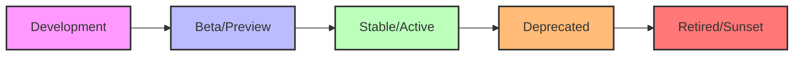

# PHP API Versioning

## Introduction

When building APIs with PHP, one critical aspect that's often overlooked until it becomes a problem is **API versioning**. As your API evolves, you'll need to make changes - adding features, fixing bugs, or improving performance. However, many clients may already be using your existing API, and breaking changes could disrupt their applications.

API versioning solves this challenge by allowing you to introduce changes while maintaining backward compatibility. It provides a structured way to evolve your API over time while ensuring existing clients continue to function correctly.

In this guide, you'll learn:
- Why API versioning is necessary
- Different versioning strategies in PHP APIs
- How to implement each strategy with code examples
- Best practices for managing API versions effectively

## Why Version Your PHP API?

Before diving into implementation details, let's understand why versioning is crucial:

1. **Backward Compatibility**: Changes to your API shouldn't break existing client applications.
2. **Innovation Freedom**: Versioning lets you improve your API without being constrained by legacy requirements.
3. **Controlled Transitions**: Clients can migrate to newer API versions at their own pace.
4. **Documentation Clarity**: Each version can have specific documentation, avoiding confusion.

Consider this scenario: you've built a product API that returns basic product information. Later, you decide to include additional fields like inventory status and pricing tiers. Without versioning, existing clients might break when encountering unexpected fields or structure changes.

## API Versioning Strategies

There are several approaches to versioning PHP APIs. Let's explore the most common ones:

### 1. URI Path Versioning

This approach includes the version number directly in the URL path.

**Example Implementation:**

```php
// index.php (Entry point for your API)
<?php
$requestUri = $_SERVER['REQUEST_URI'];
$path = parse_url($requestUri, PHP_URL_PATH);
$segments = explode('/', trim($path, '/'));

// Check if the first segment is 'api' and the second is a version
if ($segments[0] === 'api' && preg_match('/^v(\d+)$/', $segments[1], $matches)) {
    $version = $matches[1];
    $resource = $segments[2] ?? '';
    
    // Route to the appropriate version handler
    switch ($version) {
        case '1':
            require_once 'api/v1/router.php';
            break;
        case '2':
            require_once 'api/v2/router.php';
            break;
        default:
            // Default to the latest version or return an error
            http_response_code(400);
            echo json_encode(['error' => 'Invalid API version']);
            exit;
    }
} else {
    http_response_code(404);
    echo json_encode(['error' => 'API endpoint not found']);
    exit;
}
```

**Client Usage:**
```
GET /api/v1/products
GET /api/v2/products
```

**Advantages:**
- Very explicit and visible
- Easy to understand for API consumers
- Simple to implement on the server

**Disadvantages:**
- Version is tightly coupled with the resource URI
- URL changes when migrating to a new version

### 2. Query Parameter Versioning

This method adds the version as a query parameter in the URL.

**Example Implementation:**

```php
// index.php
<?php
$requestUri = $_SERVER['REQUEST_URI'];
$path = parse_url($requestUri, PHP_URL_PATH);
$query = [];
parse_str(parse_url($requestUri, PHP_URL_QUERY), $query);

$version = $query['version'] ?? '1'; // Default to version 1

// Route to the appropriate version handler
switch ($version) {
    case '1':
        require_once 'api/v1/router.php';
        break;
    case '2':
        require_once 'api/v2/router.php';
        break;
    default:
        http_response_code(400);
        echo json_encode(['error' => 'Invalid API version']);
        exit;
}
```

**Client Usage:**
```
GET /api/products?version=1
GET /api/products?version=2
```

**Advantages:**
- Keeps the resource URI clean
- Easy to default to the latest version

**Disadvantages:**
- Less visible than URI versioning
- Could be accidentally omitted by clients

### 3. HTTP Header Versioning

This approach uses a custom HTTP header to specify the API version.

**Example Implementation:**

```php
// index.php
<?php
$headers = getallheaders();
$version = $headers['Accept-Version'] ?? '1'; // Default to version 1

// Route to the appropriate version handler
switch ($version) {
    case '1':
        require_once 'api/v1/router.php';
        break;
    case '2':
        require_once 'api/v2/router.php';
        break;
    default:
        http_response_code(400);
        echo json_encode(['error' => 'Invalid API version']);
        exit;
}
```

**Client Usage:**
```
GET /api/products
Accept-Version: 1

GET /api/products
Accept-Version: 2
```

**Advantages:**
- Keeps the URL clean and focused on resources
- Follows the HTTP protocol's extensibility
- Separates versioning concerns from the URI

**Disadvantages:**
- Less visible and harder to test
- Requires clients to set custom headers

### 4. Accept Header Versioning (Content Negotiation)

This leverages the HTTP Accept header to request a specific version.

**Example Implementation:**

```php
// index.php
<?php
$headers = getallheaders();
$acceptHeader = $headers['Accept'] ?? '';

// Check for version in Accept header
// Example: "application/vnd.myapi.v2+json"
if (preg_match('/application\/vnd\.myapi\.v(\d+)\+json/', $acceptHeader, $matches)) {
    $version = $matches[1];
} else {
    $version = '1'; // Default to version 1
}

// Route to the appropriate version handler
switch ($version) {
    case '1':
        require_once 'api/v1/router.php';
        break;
    case '2':
        require_once 'api/v2/router.php';
        break;
    default:
        http_response_code(400);
        echo json_encode(['error' => 'Invalid API version']);
        exit;
}
```

**Client Usage:**
```
GET /api/products
Accept: application/vnd.myapi.v1+json

GET /api/products
Accept: application/vnd.myapi.v2+json
```

**Advantages:**
- Most RESTful approach
- Uses HTTP's built-in content negotiation
- Keeps URLs focused on resources, not versioning

**Disadvantages:**
- Complex to implement and explain to API consumers
- Difficult to test in a browser directly

## Practical Implementation with a Router

Now let's implement a more realistic example using a simple router pattern:

```php
// api/v1/router.php
<?php
$resource = $segments[2] ?? '';
$method = $_SERVER['REQUEST_METHOD'];
$id = $segments[3] ?? null;

switch ($resource) {
    case 'products':
        require_once 'controllers/ProductController.php';
        $controller = new ProductControllerV1();
        
        if ($method === 'GET') {
            if ($id) {
                $controller->getProduct($id);
            } else {
                $controller->getAllProducts();
            }
        } elseif ($method === 'POST') {
            $controller->createProduct(json_decode(file_get_contents('php://input'), true));
        }
        break;
        
    // Other resources
    default:
        http_response_code(404);
        echo json_encode(['error' => 'Resource not found']);
        exit;
}

// api/v2/router.php would have similar structure but point to v2 controllers
```

### Product Controller Example (V1 vs V2)

```php
// api/v1/controllers/ProductController.php
<?php
class ProductControllerV1 {
    public function getAllProducts() {
        // V1 implementation - returns basic product data
        $products = [
            ['id' => 1, 'name' => 'Product 1', 'price' => 19.99],
            ['id' => 2, 'name' => 'Product 2', 'price' => 29.99]
        ];
        
        echo json_encode(['products' => $products]);
    }
    
    public function getProduct($id) {
        // V1 implementation - get single product
    }
    
    public function createProduct($data) {
        // V1 implementation - create product
    }
}

// api/v2/controllers/ProductController.php
<?php
class ProductControllerV2 {
    public function getAllProducts() {
        // V2 implementation - returns enhanced product data
        $products = [
            [
                'id' => 1, 
                'name' => 'Product 1', 
                'price' => 19.99,
                'inventory' => [
                    'in_stock' => true,
                    'count' => 42
                ],
                'categories' => ['electronics', 'gadgets']
            ],
            [
                'id' => 2, 
                'name' => 'Product 2', 
                'price' => 29.99,
                'inventory' => [
                    'in_stock' => false,
                    'count' => 0
                ],
                'categories' => ['accessories']
            ]
        ];
        
        echo json_encode(['products' => $products]);
    }
    
    // Other methods with V2 implementation
}
```

## Implementing Versioning with a Framework

If you're using a PHP framework, implementing API versioning becomes even simpler. Here's an example using Laravel:

```php
// routes/api.php
<?php

// V1 Routes
Route::prefix('v1')->group(function () {
    Route::get('/products', 'Api\V1\ProductController@index');
    Route::get('/products/{id}', 'Api\V1\ProductController@show');
    Route::post('/products', 'Api\V1\ProductController@store');
});

// V2 Routes
Route::prefix('v2')->group(function () {
    Route::get('/products', 'Api\V2\ProductController@index');
    Route::get('/products/{id}', 'Api\V2\ProductController@show');
    Route::post('/products', 'Api\V2\ProductController@store');
});
```

## Version Lifecycle Management

Beyond implementation, managing the lifecycle of API versions is crucial:



### Recommended Practices for Version Lifecycle:

1. **Communicate Changes Early**: Announce new versions and deprecation schedules well in advance.
2. **Documentation**: Maintain separate documentation for each active API version.
3. **Deprecation Notices**: Include deprecation warnings in responses from older API versions.
4. **Migration Guides**: Provide clear guides for transitioning between versions.
5. **Support Window**: Define a clear timeframe for how long each version will be supported.

**Example Deprecation Header:**

```php
// When using a deprecated API version
if ($version === '1') {
    header('X-API-Deprecated: This API version will be discontinued on 2023-12-31. Please migrate to v2.');
}
```

## Best Practices for PHP API Versioning

1. **Don't Version Everything**: Only create a new version when making breaking changes.
2. **Backward Compatibility**: Try to maintain backward compatibility wherever possible.
3. **Semantic Versioning**: Consider using semantic versioning principles (MAJOR.MINOR.PATCH).
4. **Documentation**: Comprehensive documentation for each version is essential.
5. **Consistent Error Handling**: Use consistent error formats across versions.
6. **Rate Limiting**: Apply rate limits consistently across versions.
7. **Authentication**: Keep authentication mechanisms consistent if possible.

## Handling Common Versioning Challenges

### Challenge 1: Database Changes

When your API versions require different database structures, consider these approaches:

```php
// Example of adapter pattern for different database schemas
class ProductRepositoryV1 {
    public function getProduct($id) {
        // Query using v1 schema
        $query = "SELECT id, name, price FROM products WHERE id = ?";
        // Execute query and return data
    }
}

class ProductRepositoryV2 {
    public function getProduct($id) {
        // Query using v2 schema with additional fields
        $query = "SELECT p.id, p.name, p.price, i.count as inventory_count 
                 FROM products p 
                 LEFT JOIN inventory i ON p.id = i.product_id 
                 WHERE p.id = ?";
        // Execute query and return enhanced data
    }
}
```

### Challenge 2: Shared Code

Avoid duplication by sharing code between versions where appropriate:

```php
// BaseProductController.php
<?php
abstract class BaseProductController {
    protected function validateProductData($data) {
        // Common validation logic used across versions
    }
    
    protected function logActivity($action, $productId) {
        // Common logging functionality
    }
}

// V1ProductController.php
<?php
class V1ProductController extends BaseProductController {
    // V1 specific implementations
}

// V2ProductController.php
<?php
class V2ProductController extends BaseProductController {
    // V2 specific implementations
}
```

## Summary

API versioning is an essential practice when developing PHP APIs that will evolve over time. The key points to remember are:

1. Choose a versioning strategy that fits your application needs and client expectations
2. Implement clean separation between different API versions
3. Maintain clear documentation for each version
4. Plan for the entire lifecycle of your API versions
5. Communicate changes and deprecation schedules clearly to your users

By implementing proper versioning from the beginning, you'll save yourself and your API consumers significant headaches as your API grows and changes over time.

## Additional Resources

- [REST API Versioning Best Practices](https://restfulapi.net/versioning/)
- [Laravel API Versioning](https://laravel.com/docs/routing#route-group-prefixes)
- [Symfony API Platform Versioning](https://api-platform.com/docs/core/filters/#api-versioning)

## Exercises

1. **Basic Implementation**: Create a simple PHP API with two versions using URI path versioning.
2. **Framework Exercise**: If you're using Laravel or Symfony, implement API versioning using the framework's routing capabilities.
3. **Migration Exercise**: Create documentation explaining how a client should migrate from v1 to v2 of your sample API.
4. **Advanced Challenge**: Implement a system that can serve multiple API versions from the same codebase using design patterns like Strategy or Adapter.