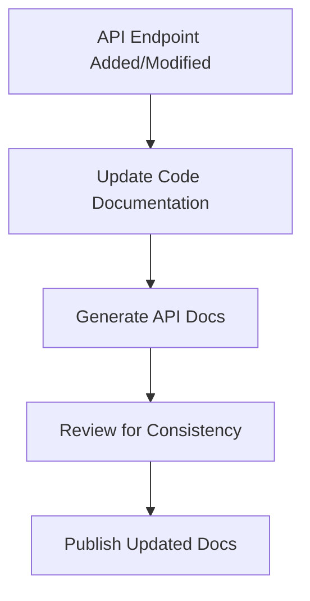
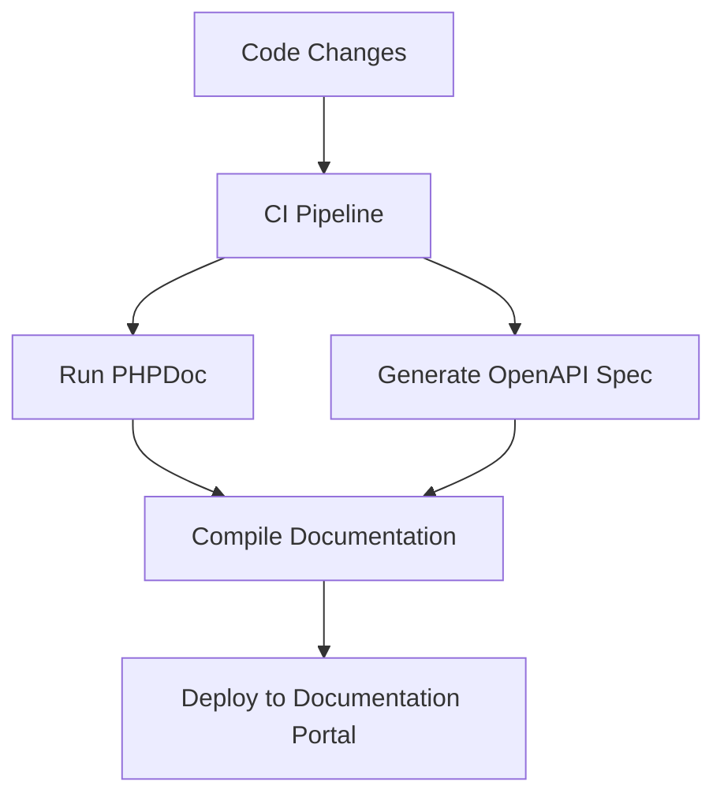

# PHP API Documentation

## Introduction

Creating a well-designed API is only half the battle when developing PHP applications. Without proper documentation, even the most elegant API can go unused or cause frustration among developers. This guide will walk you through the process of creating comprehensive, clear, and useful documentation for your PHP APIs.

Good API documentation serves as both a reference and a tutorial, helping developers understand not just how to use your API, but why and when to use different endpoints and features. Whether you're building a public API or one for internal use, solid documentation is essential for adoption and developer satisfaction.

## Why Documentation Matters

Before diving into the how, let's understand why API documentation is crucial:

1. **Reduces onboarding time** for new developers
2. **Decreases support requests** by answering common questions
3. **Increases adoption** of your API
4. **Improves user experience** for developers consuming your API
5. **Serves as a design contract** between API providers and consumers

## Documentation Components

A comprehensive PHP API documentation typically includes:

### 1. Overview and Getting Started

This section should provide a high-level introduction to your API:

```php
/**
 * BookStore API
 * 
 * This API provides access to the BookStore database, allowing
 * developers to retrieve book information, manage inventory,
 * and process orders.
 * 
 * Base URL: https://api.bookstore.example/v1
 * 
 * Authentication: API Key (passed via X-API-Key header)
 */
```

### 2. Authentication

Explain how users should authenticate with your API:

```php
// Example authentication code
$apiKey = 'your_api_key_here';
$ch = curl_init('https://api.bookstore.example/v1/books');
curl_setopt($ch, CURLOPT_RETURNTRANSFER, true);
curl_setopt($ch, CURLOPT_HTTPHEADER, [
    'X-API-Key: ' . $apiKey,
    'Content-Type: application/json'
]);
$response = curl_exec($ch);
```

### 3. Endpoints Documentation

For each endpoint, document:

- URL and HTTP method
- Request parameters
- Request body (if applicable)
- Response format
- Error codes
- Example requests and responses

Here's an example of endpoint documentation:

```php
/**
 * Get Book Details
 * 
 * Retrieves detailed information about a specific book by its ID.
 * 
 * Method: GET
 * URL: /books/{id}
 * 
 * Parameters:
 *   - id (required): The unique identifier of the book
 * 
 * Response: Book object containing:
 *   - id: string
 *   - title: string
 *   - author: string
 *   - isbn: string
 *   - published_date: string (YYYY-MM-DD)
 *   - genre: string
 *   - price: number
 * 
 * Example Request:
 *   GET /books/12345
 * 
 * Example Response:
 *   {
 *     "id": "12345",
 *     "title": "PHP API Development",
 *     "author": "Jane Developer",
 *     "isbn": "978-3-16-148410-0",
 *     "published_date": "2023-05-15",
 *     "genre": "Programming",
 *     "price": 29.99
 *   }
 * 
 * Error Codes:
 *   - 404: Book not found
 *   - 401: Unauthorized
 *   - 500: Server error
 */
```

## Documentation Tools for PHP APIs

Several tools can help you generate and maintain API documentation:

### PHPDoc for Inline Documentation

PHPDoc is a standard for documenting PHP code using DocBlocks. It uses a syntax similar to JavaDoc:

```php
/**
 * Retrieves book details by ID
 *
 * @param int $id The book's unique identifier
 * @return array Book details as associative array
 * @throws NotFoundException If book doesn't exist
 * @throws DatabaseException If database connection fails
 */
public function getBook($id) {
    // Implementation code
}
```

### Swagger/OpenAPI

OpenAPI (formerly known as Swagger) is a specification for machine-readable API documentation. You can use the `swagger-php` library to generate OpenAPI documentation from annotations in your code:

```php
/**
 * @OA\Get(
 *     path="/books/{id}",
 *     summary="Get book by ID",
 *     @OA\Parameter(
 *         name="id",
 *         in="path",
 *         required=true,
 *         description="Book ID",
 *         @OA\Schema(type="integer")
 *     ),
 *     @OA\Response(
 *         response=200,
 *         description="Success",
 *         @OA\JsonContent(ref="#/components/schemas/Book")
 *     ),
 *     @OA\Response(
 *         response=404,
 *         description="Book not found"
 *     )
 * )
 */
public function getBook($id) {
    // Implementation code
}
```

To install `swagger-php`:

```bash
composer require zircote/swagger-php
```

To generate the OpenAPI documentation:

```bash
./vendor/bin/openapi src -o openapi.json
```

## API Documentation Best Practices

### 1. Keep Documentation Updated

Out-of-date documentation is worse than no documentation. Set up processes to update documentation whenever your API changes:

```php
/**
 * TODO: Update this documentation when implementing pagination in sprint 5
 */
```

### 2. Use Consistent Formatting

Maintain consistency in your documentation style:



### 3. Include Examples

Provide real-world examples for every endpoint:

```php
// Example: Search for books by genre
$ch = curl_init('https://api.bookstore.example/v1/books?genre=mystery');
curl_setopt($ch, CURLOPT_RETURNTRANSFER, true);
curl_setopt($ch, CURLOPT_HTTPHEADER, [
    'X-API-Key: your_api_key_here',
    'Content-Type: application/json'
]);
$response = curl_exec($ch);
$books = json_decode($response, true);

// Process the books
foreach ($books as $book) {
    echo $book['title'] . ' by ' . $book['author'] . "
";
}
```

### 4. Document Error Handling

Clearly document all possible error responses:

```php
/**
 * Error Responses
 * 
 * This API uses standard HTTP status codes:
 * 
 * - 200: Success
 * - 400: Bad Request (invalid parameters)
 * - 401: Unauthorized (invalid or missing API key)
 * - 404: Resource Not Found
 * - 429: Too Many Requests (rate limit exceeded)
 * - 500: Server Error
 * 
 * Error Response Format:
 * {
 *   "error": {
 *     "code": "ERROR_CODE",
 *     "message": "Human-readable error message",
 *     "details": {} // Optional additional information
 *   }
 * }
 */
```

## Building an API Documentation Portal

For larger APIs, consider creating a dedicated documentation portal. Here's how to structure it:

1. **Interactive Documentation**:
   - Use Swagger UI to provide interactive endpoints
   - Allow developers to test API calls directly from the documentation

2. **Getting Started Guides**:
   - Provide step-by-step tutorials for common use cases
   - Include authentication setup instructions

3. **SDK Documentation**:
   - If you provide client libraries, document them thoroughly
   - Include installation and basic usage examples

### Example Code: Setting Up Swagger UI

```php
// In your composer.json
{
    "require": {
        "zircote/swagger-php": "^3.2",
        "swagger-api/swagger-ui": "^3.52"
    }
}

// Run composer update
// Then copy the Swagger UI dist folder to your public directory
```

Then create an HTML file that loads Swagger UI:

```html
<!DOCTYPE html>
<html lang="en">
<head>
    <meta charset="UTF-8">
    <title>BookStore API Documentation</title>
    <link rel="stylesheet" type="text/css" href="swagger-ui/swagger-ui.css" />
</head>
<body>
    <div id="swagger-ui"></div>
    <script src="swagger-ui/swagger-ui-bundle.js"></script>
    <script>
        window.onload = function() {
            SwaggerUIBundle({
                url: "/openapi.json",
                dom_id: '#swagger-ui',
                deepLinking: true,
                presets: [
                    SwaggerUIBundle.presets.apis,
                    SwaggerUIBundle.SwaggerUIStandalonePreset
                ]
            });
        }
    </script>
</body>
</html>
```

## Automating Documentation Generation

Automate your documentation process to ensure it stays up-to-date:



You can use tools like GitHub Actions or GitLab CI to automate this workflow:

```yaml
# .github/workflows/api-docs.yml
name: Generate API Documentation

on:
  push:
    branches: [ main ]
    paths:
      - 'src/**/*.php'

jobs:
  build-docs:
    runs-on: ubuntu-latest
    steps:
      - uses: actions/checkout@v2
      - name: Setup PHP
        uses: shivammathur/setup-php@v2
        with:
          php-version: '8.1'
      - name: Install dependencies
        run: composer install
      - name: Generate OpenAPI specification
        run: ./vendor/bin/openapi src -o public/openapi.json
      - name: Deploy documentation
        # Add your deployment steps here
```

## Real-World Example: BookStore API Documentation

Let's look at a complete example for a fictional BookStore API:

```php
<?php
/**
 * BookStore API
 * 
 * @package BookStoreAPI
 * @version 1.0.0
 */

namespace BookStore\API;

/**
 * @OA\Info(
 *     title="BookStore API",
 *     version="1.0.0",
 *     description="API for accessing and managing books in the BookStore",
 *     @OA\Contact(
 *         email="support@bookstore.example",
 *         name="API Support"
 *     )
 * )
 */
class BooksController {
    /**
     * @OA\Get(
     *     path="/books",
     *     summary="List all books",
     *     @OA\Parameter(
     *         name="genre",
     *         in="query",
     *         description="Filter by genre",
     *         required=false,
     *         @OA\Schema(type="string")
     *     ),
     *     @OA\Parameter(
     *         name="page",
     *         in="query",
     *         description="Page number",
     *         required=false,
     *         @OA\Schema(type="integer", default=1)
     *     ),
     *     @OA\Response(
     *         response=200,
     *         description="List of books"
     *     )
     * )
     */
    public function listBooks($genre = null, $page = 1) {
        // Implementation
    }
    
    /**
     * @OA\Post(
     *     path="/books",
     *     summary="Add a new book",
     *     @OA\RequestBody(
     *         required=true,
     *         @OA\JsonContent(ref="#/components/schemas/BookCreate")
     *     ),
     *     @OA\Response(
     *         response=201,
     *         description="Book created"
     *     ),
     *     @OA\Response(
     *         response=400,
     *         description="Invalid input"
     *     )
     * )
     */
    public function addBook($bookData) {
        // Implementation
    }
}

/**
 * @OA\Schema(
 *     schema="Book",
 *     @OA\Property(property="id", type="integer"),
 *     @OA\Property(property="title", type="string"),
 *     @OA\Property(property="author", type="string"),
 *     @OA\Property(property="isbn", type="string"),
 *     @OA\Property(property="published_date", type="string", format="date"),
 *     @OA\Property(property="genre", type="string"),
 *     @OA\Property(property="price", type="number", format="float")
 * )
 */

/**
 * @OA\Schema(
 *     schema="BookCreate",
 *     @OA\Property(property="title", type="string"),
 *     @OA\Property(property="author", type="string"),
 *     @OA\Property(property="isbn", type="string"),
 *     @OA\Property(property="published_date", type="string", format="date"),
 *     @OA\Property(property="genre", type="string"),
 *     @OA\Property(property="price", type="number", format="float")
 * )
 */
```

## Documentation Testing

Don't forget to test your documentation! Here are some approaches:

1. **Automated Validation**: Use OpenAPI validators to ensure your specification is valid
2. **Code Example Testing**: Test all code examples to ensure they work
3. **User Testing**: Have developers unfamiliar with your API try to use it with only your documentation

```php
// Example: Testing code examples from documentation
public function testGetBookExample() {
    // Extract and run the example code from documentation
    $apiKey = 'test_key';
    $ch = curl_init('https://api.bookstore.example/v1/books/12345');
    curl_setopt($ch, CURLOPT_RETURNTRANSFER, true);
    curl_setopt($ch, CURLOPT_HTTPHEADER, [
        'X-API-Key: ' . $apiKey,
        'Content-Type: application/json'
    ]);
    
    // Mock the response for testing
    $mockResponse = $this->createMockResponse();
    
    // Assert the response contains expected fields
    $this->assertArrayHasKey('id', $mockResponse);
    $this->assertArrayHasKey('title', $mockResponse);
    // Additional assertions
}
```

## Summary

Creating comprehensive PHP API documentation is an investment that pays significant dividends in developer adoption, satisfaction, and reduced support costs. By following these best practices, you can create documentation that serves as both a reference and a guide for developers using your API.

Remember these key points:

1. Document all aspects of your API: authentication, endpoints, parameters, and responses
2. Use tools like PHPDoc and OpenAPI to automate documentation generation
3. Include plenty of examples and error handling information
4. Keep documentation updated with your API changes
5. Test your documentation to ensure accuracy

## Additional Resources

- [PHPDoc Documentation](https://docs.phpdoc.org/)
- [OpenAPI Specification](https://spec.openapis.org/oas/latest.html)
- [Swagger PHP Library](https://github.com/zircote/swagger-php)
- [API Documentation Best Practices](https://swagger.io/blog/api-documentation/best-practices-in-api-documentation/)

## Exercises

1. **Practice Project**: Create documentation for a simple REST API with at least three endpoints
2. **Tool Exploration**: Set up Swagger UI to display your API documentation
3. **Automation Exercise**: Configure a CI/CD pipeline to automatically update your documentation when your API code changes
4. **User Testing**: Have a colleague attempt to use your API using only your documentation, and collect feedback
5. **Error Documentation**: Create a comprehensive error documentation guide for your API

By mastering API documentation, you'll not only make your own APIs more usable but also develop a skill that's highly valued in professional PHP development.