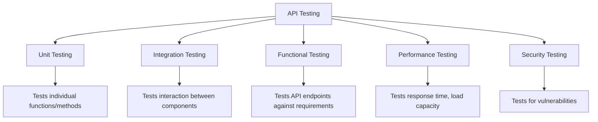

# PHP API Testing

## Introduction

Testing is a critical aspect of API development that ensures your API functions correctly, reliably, and efficiently. In this guide, we'll explore how to test PHP APIs, from basic manual testing to automated testing techniques. Whether you're building a simple REST API or a complex service, proper testing helps you catch bugs early, maintain code quality, and build confidence in your API's functionality.

## Why Test Your PHP API?

Testing your PHP API offers numerous benefits:

- **Bug Detection**: Identify issues before your API reaches production
- **Code Quality**: Improve the robustness and reliability of your code
- **Documentation**: Tests serve as living documentation of how your API should function
- **Confidence**: Safely refactor and add new features without breaking existing functionality
- **User Experience**: Ensure your API responds correctly to various inputs and edge cases

## Types of API Testing

Before diving into specific tools and techniques, let's understand the different types of API testing you might perform:



- **Unit Testing**: Tests individual functions or methods in isolation
- **Integration Testing**: Tests how different parts of your API work together
- **Functional Testing**: Tests API endpoints against expected requirements
- **Performance Testing**: Tests response time and load capacity
- **Security Testing**: Tests for vulnerabilities and security issues

## Setting Up Your Testing Environment

Before you start testing your PHP API, you'll need to set up a proper testing environment:

### 1. Install PHPUnit for Automated Testing

PHPUnit is the most popular testing framework for PHP applications.

```bash
# Install PHPUnit using Composer
composer require --dev phpunit/phpunit

# Create a phpunit.xml configuration file
<?xml version="1.0" encoding="UTF-8"?>
<phpunit bootstrap="vendor/autoload.php"
         colors="true"
         verbose="true">
    <testsuites>
        <testsuite name="API Test Suite">
            <directory>tests</directory>
        </testsuite>
    </testsuites>
</phpunit>
```

### 2. Set Up a Testing Database

Always use a separate database for testing to avoid affecting your development or production data.

```php
// In your test configuration file
define('DB_HOST', 'localhost');
define('DB_NAME', 'test_api_database');
define('DB_USER', 'test_user');
define('DB_PASS', 'test_password');
```

### 3. Install Postman for Manual Testing

[Postman](https://www.postman.com/) is a powerful tool for testing APIs manually. It provides a user-friendly interface for sending requests and analyzing responses.

## Manual API Testing with Postman

Postman allows you to test your API endpoints without writing code. Here's how to use it:

### Creating a Basic Request

1. Open Postman and create a new request
2. Select the HTTP method (GET, POST, PUT, DELETE, etc.)
3. Enter your API endpoint URL (e.g., `http://localhost:8000/api/users`)
4. Add any necessary headers or parameters
5. Click "Send" to make the request

### Example: Testing a User Creation Endpoint

Let's test a user creation endpoint:

1. Set the method to POST
2. Enter the URL: `http://localhost:8000/api/users`
3. Go to the "Body" tab, select "raw" and "JSON"
4. Enter the request body:

```json
{
  "name": "John Doe",
  "email": "john@example.com",
  "password": "securepassword123"
}
```

5. Click "Send" and analyze the response:

```json
{
  "status": "success",
  "message": "User created successfully",
  "data": {
    "id": 1,
    "name": "John Doe",
    "email": "john@example.com",
    "created_at": "2023-05-15T10:30:00Z"
  }
}
```

### Creating Postman Collections

Organize your API tests by creating collections:

1. Click "New Collection" in Postman
2. Name your collection (e.g., "User API Tests")
3. Add your requests to the collection
4. Save the collection for future use

Collections allow you to group related requests and run them together, making it easier to test your API comprehensively.

## Automated Testing with PHPUnit

While manual testing is useful, automated testing ensures consistent and repeatable verification of your API's functionality.

### Writing Your First API Test

Create a test file in your `tests` directory:

```php
// tests/UserApiTest.php
<?php

use PHPUnit\Framework\TestCase;

class UserApiTest extends TestCase
{
    private $baseUrl = 'http://localhost:8000/api';
    
    public function testGetAllUsers()
    {
        // Make a GET request to the users endpoint
        $response = file_get_contents($this->baseUrl . '/users');
        
        // Convert response to array
        $data = json_decode($response, true);
        
        // Assert that the response contains users
        $this->assertIsArray($data['data']);
        $this->assertGreaterThan(0, count($data['data']));
    }
    
    public function testCreateUser()
    {
        // Prepare the request data
        $userData = [
            'name' => 'Test User',
            'email' => 'test' . time() . '@example.com',
            'password' => 'password123'
        ];
        
        // Set up the request
        $options = [
            'http' => [
                'method' => 'POST',
                'header' => 'Content-Type: application/json',
                'content' => json_encode($userData)
            ]
        ];
        
        $context = stream_context_create($options);
        $response = file_get_contents($this->baseUrl . '/users', false, $context);
        
        // Convert response to array
        $data = json_decode($response, true);
        
        // Assertions
        $this->assertEquals('success', $data['status']);
        $this->assertEquals($userData['name'], $data['data']['name']);
        $this->assertEquals($userData['email'], $data['data']['email']);
    }
}
```

### Using Guzzle for HTTP Requests in Tests

The PHP HTTP client Guzzle makes API testing more elegant:

```bash
# Install Guzzle
composer require --dev guzzlehttp/guzzle
```

Rewrite the test using Guzzle:

```php
// tests/UserApiTest.php
<?php

use PHPUnit\Framework\TestCase;
use GuzzleHttp\Client;

class UserApiTest extends TestCase
{
    private $client;
    private $baseUri = 'http://localhost:8000/api';
    
    protected function setUp(): void
    {
        $this->client = new Client([
            'base_uri' => $this->baseUri,
            'http_errors' => false
        ]);
    }
    
    public function testGetAllUsers()
    {
        // Make a GET request
        $response = $this->client->get('/users');
        
        // Get response body and code
        $body = json_decode($response->getBody(), true);
        $statusCode = $response->getStatusCode();
        
        // Assertions
        $this->assertEquals(200, $statusCode);
        $this->assertIsArray($body['data']);
    }
    
    public function testCreateUser()
    {
        // Prepare the request data
        $userData = [
            'name' => 'Test User',
            'email' => 'test' . time() . '@example.com',
            'password' => 'password123'
        ];
        
        // Make a POST request
        $response = $this->client->post('/users', [
            'json' => $userData
        ]);
        
        // Get response body and code
        $body = json_decode($response->getBody(), true);
        $statusCode = $response->getStatusCode();
        
        // Assertions
        $this->assertEquals(201, $statusCode); // Assuming 201 Created status
        $this->assertEquals('success', $body['status']);
        $this->assertEquals($userData['name'], $body['data']['name']);
        $this->assertEquals($userData['email'], $body['data']['email']);
    }
}
```

### Testing API Authentication

Many APIs require authentication. Here's how to test an authenticated endpoint:

```php
public function testAuthenticatedEndpoint()
{
    // First, get a token
    $loginResponse = $this->client->post('/login', [
        'json' => [
            'email' => 'user@example.com',
            'password' => 'password123'
        ]
    ]);
    
    $loginBody = json_decode($loginResponse->getBody(), true);
    $token = $loginBody['data']['token'];
    
    // Now make an authenticated request
    $response = $this->client->get('/protected-resource', [
        'headers' => [
            'Authorization' => 'Bearer ' . $token
        ]
    ]);
    
    $body = json_decode($response->getBody(), true);
    $statusCode = $response->getStatusCode();
    
    // Assertions
    $this->assertEquals(200, $statusCode);
    $this->assertEquals('success', $body['status']);
}
```

## Testing API Validation and Error Handling

Well-designed APIs should validate input and return appropriate error messages. Let's test these scenarios:

```php
public function testInvalidUserCreation()
{
    // Missing required fields
    $userData = [
        'name' => 'Test User'
        // Missing email and password
    ];
    
    $response = $this->client->post('/users', [
        'json' => $userData
    ]);
    
    $body = json_decode($response->getBody(), true);
    $statusCode = $response->getStatusCode();
    
    // Assertions for validation error
    $this->assertEquals(422, $statusCode); // Unprocessable Entity
    $this->assertEquals('error', $body['status']);
    $this->assertArrayHasKey('errors', $body);
    $this->assertArrayHasKey('email', $body['errors']);
    $this->assertArrayHasKey('password', $body['errors']);
}

public function testDuplicateEmailValidation()
{
    // Create a user first
    $userData = [
        'name' => 'Test User',
        'email' => 'duplicate@example.com',
        'password' => 'password123'
    ];
    
    $this->client->post('/users', ['json' => $userData]);
    
    // Try to create another user with the same email
    $response = $this->client->post('/users', ['json' => $userData]);
    
    $body = json_decode($response->getBody(), true);
    $statusCode = $response->getStatusCode();
    
    // Assertions for duplicate email error
    $this->assertEquals(422, $statusCode);
    $this->assertEquals('error', $body['status']);
    $this->assertStringContainsString('email already exists', $body['message']);
}
```

## Integration Testing

Integration tests verify that different parts of your API work together correctly. Here's an example that tests a user creation flow followed by authentication:

```php
public function testUserCreationAndAuthentication()
{
    // 1. Create a new user
    $email = 'integration' . time() . '@example.com';
    $password = 'securepassword123';
    
    $userData = [
        'name' => 'Integration Test User',
        'email' => $email,
        'password' => $password
    ];
    
    $createResponse = $this->client->post('/users', [
        'json' => $userData
    ]);
    
    $createBody = json_decode($createResponse->getBody(), true);
    $userId = $createBody['data']['id'];
    
    // 2. Authenticate with the created user
    $loginResponse = $this->client->post('/login', [
        'json' => [
            'email' => $email,
            'password' => $password
        ]
    ]);
    
    $loginBody = json_decode($loginResponse->getBody(), true);
    
    // 3. Fetch user profile with the token
    $token = $loginBody['data']['token'];
    
    $profileResponse = $this->client->get('/users/' . $userId, [
        'headers' => [
            'Authorization' => 'Bearer ' . $token
        ]
    ]);
    
    $profileBody = json_decode($profileResponse->getBody(), true);
    
    // Assertions
    $this->assertEquals(200, $profileResponse->getStatusCode());
    $this->assertEquals($email, $profileBody['data']['email']);
    $this->assertEquals('Integration Test User', $profileBody['data']['name']);
}
```

## Test Database Management

For reliable tests, you need to control your test database state. Here's how to set up and tear down test data:

```php
<?php

use PHPUnit\Framework\TestCase;
use GuzzleHttp\Client;

class ApiDatabaseTest extends TestCase
{
    private $client;
    private $pdo;
    
    protected function setUp(): void
    {
        $this->client = new Client([
            'base_uri' => 'http://localhost:8000/api',
            'http_errors' => false
        ]);
        
        // Connect to test database
        $this->pdo = new PDO(
            'mysql:host=' . DB_HOST . ';dbname=' . DB_NAME,
            DB_USER,
            DB_PASS
        );
        
        // Set up test data
        $this->seedTestData();
    }
    
    protected function tearDown(): void
    {
        // Clean up test data
        $this->cleanTestData();
    }
    
    private function seedTestData()
    {
        // Insert test data
        $stmt = $this->pdo->prepare(
            "INSERT INTO users (name, email, password) 
             VALUES ('Test User', 'test@example.com', ?)"
        );
        
        $hashedPassword = password_hash('password123', PASSWORD_DEFAULT);
        $stmt->execute([$hashedPassword]);
    }
    
    private function cleanTestData()
    {
        // Clean up test data
        $this->pdo->exec("DELETE FROM users WHERE email = 'test@example.com'");
    }
    
    public function testUserAuthentication()
    {
        // Test with seeded user
        $response = $this->client->post('/login', [
            'json' => [
                'email' => 'test@example.com',
                'password' => 'password123'
            ]
        ]);
        
        $body = json_decode($response->getBody(), true);
        
        $this->assertEquals(200, $response->getStatusCode());
        $this->assertEquals('success', $body['status']);
        $this->assertArrayHasKey('token', $body['data']);
    }
}
```

## Mocking External Dependencies

When testing your API, you often need to mock external services to isolate your tests:

```php
<?php

use PHPUnit\Framework\TestCase;
use GuzzleHttp\Client;
use GuzzleHttp\Handler\MockHandler;
use GuzzleHttp\HandlerStack;
use GuzzleHttp\Psr7\Response;

class ExternalServiceTest extends TestCase
{
    public function testExternalServiceIntegration()
    {
        // Create a mock for the external API responses
        $mock = new MockHandler([
            new Response(200, [], json_encode([
                'weather' => 'sunny',
                'temperature' => 25
            ]))
        ]);
        
        $handlerStack = HandlerStack::create($mock);
        
        // Create a client with the mocked response
        $mockClient = new Client(['handler' => $handlerStack]);
        
        // Inject the mock client into your API service
        $weatherService = new WeatherService($mockClient);
        
        // Test your API with the mocked external service
        $result = $weatherService->getCurrentWeather('London');
        
        $this->assertEquals('sunny', $result['weather']);
        $this->assertEquals(25, $result['temperature']);
    }
}
```

## Continuous Integration for API Testing

Incorporate your API tests into a CI/CD pipeline to run them automatically:

### Example GitHub Actions Workflow

```yaml
name: API Tests

on:
  push:
    branches: [ main ]
  pull_request:
    branches: [ main ]

jobs:
  test:
    runs-on: ubuntu-latest
    
    services:
      mysql:
        image: mysql:5.7
        env:
          MYSQL_ROOT_PASSWORD: root
          MYSQL_DATABASE: test_db
        ports:
          - 3306:3306
        options: --health-cmd="mysqladmin ping" --health-interval=10s --health-timeout=5s --health-retries=3
    
    steps:
    - uses: actions/checkout@v2
    
    - name: Setup PHP
      uses: shivammathur/setup-php@v2
      with:
        php-version: '8.1'
        extensions: mbstring, intl, pdo_mysql
        coverage: xdebug
    
    - name: Install dependencies
      run: composer install --prefer-dist --no-progress
    
    - name: Set up test database
      run: php scripts/setup-test-db.php
    
    - name: Start PHP server
      run: php -S localhost:8000 -t public &
    
    - name: Run API tests
      run: vendor/bin/phpunit --testsuite api
```

## Best Practices for PHP API Testing

1. **Test in Isolation**: Each test should be independent and not rely on the state from other tests
2. **Cover All Endpoints**: Test each API endpoint with various inputs
3. **Test Edge Cases**: Don't just test the happy path; test invalid inputs, authorization failures, etc.
4. **Use Real HTTP Requests**: Test via HTTP to validate the full request/response cycle
5. **Maintain Test Data**: Have a strategy for creating and cleaning up test data
6. **Test Performance**: Include basic performance tests to catch slow endpoints
7. **Authenticate Properly**: Test endpoints with the correct authentication
8. **Validate Response Formats**: Check that responses match your API documentation
9. **Use Descriptive Test Names**: Name tests clearly to understand their purpose
10. **Group Related Tests**: Organize tests logically in test classes or suites

## Real-World Example: Building and Testing a Basic CRUD API

Let's create and test a simple product API:

### 1. API Implementation (ProductController.php)

```php
<?php
// app/Controllers/ProductController.php

namespace App\Controllers;

use App\Models\Product;

class ProductController
{
    public function getAll()
    {
        $products = Product::all();
        return [
            'status' => 'success',
            'data' => $products
        ];
    }
    
    public function getById($id)
    {
        $product = Product::find($id);
        
        if (!$product) {
            http_response_code(404);
            return [
                'status' => 'error',
                'message' => 'Product not found'
            ];
        }
        
        return [
            'status' => 'success',
            'data' => $product
        ];
    }
    
    public function create($data)
    {
        // Validate input
        if (empty($data['name']) || empty($data['price'])) {
            http_response_code(422);
            return [
                'status' => 'error',
                'message' => 'Name and price are required',
                'errors' => [
                    'name' => empty($data['name']) ? 'Name is required' : null,
                    'price' => empty($data['price']) ? 'Price is required' : null
                ]
            ];
        }
        
        $product = Product::create([
            'name' => $data['name'],
            'description' => $data['description'] ?? null,
            'price' => $data['price'],
            'stock' => $data['stock'] ?? 0
        ]);
        
        http_response_code(201);
        return [
            'status' => 'success',
            'message' => 'Product created successfully',
            'data' => $product
        ];
    }
    
    public function update($id, $data)
    {
        $product = Product::find($id);
        
        if (!$product) {
            http_response_code(404);
            return [
                'status' => 'error',
                'message' => 'Product not found'
            ];
        }
        
        $product->update($data);
        
        return [
            'status' => 'success',
            'message' => 'Product updated successfully',
            'data' => $product
        ];
    }
    
    public function delete($id)
    {
        $product = Product::find($id);
        
        if (!$product) {
            http_response_code(404);
            return [
                'status' => 'error',
                'message' => 'Product not found'
            ];
        }
        
        $product->delete();
        
        http_response_code(204); // No Content
        return null;
    }
}
```

### 2. Test Implementation (ProductApiTest.php)

```php
<?php
// tests/ProductApiTest.php

use PHPUnit\Framework\TestCase;
use GuzzleHttp\Client;

class ProductApiTest extends TestCase
{
    private $client;
    
    protected function setUp(): void
    {
        $this->client = new Client([
            'base_uri' => 'http://localhost:8000/api',
            'http_errors' => false
        ]);
        
        // Clean up any test products before each test
        $this->cleanupTestProducts();
    }
    
    protected function tearDown(): void
    {
        // Clean up after tests
        $this->cleanupTestProducts();
    }
    
    private function cleanupTestProducts()
    {
        // Connect to test database
        $pdo = new PDO(
            'mysql:host=' . DB_HOST . ';dbname=' . DB_NAME,
            DB_USER,
            DB_PASS
        );
        
        // Delete test products
        $pdo->exec("DELETE FROM products WHERE name LIKE 'Test Product%'");
    }
    
    public function testCreateProduct()
    {
        $productData = [
            'name' => 'Test Product',
            'description' => 'This is a test product',
            'price' => 19.99,
            'stock' => 100
        ];
        
        $response = $this->client->post('/products', [
            'json' => $productData
        ]);
        
        $body = json_decode($response->getBody(), true);
        
        // Assertions
        $this->assertEquals(201, $response->getStatusCode());
        $this->assertEquals('success', $body['status']);
        $this->assertEquals($productData['name'], $body['data']['name']);
        $this->assertEquals($productData['price'], $body['data']['price']);
        
        return $body['data']['id']; // Return ID for use in later tests
    }
    
    /**
     * @depends testCreateProduct
     */
    public function testGetProduct($productId)
    {
        $response = $this->client->get('/products/' . $productId);
        
        $body = json_decode($response->getBody(), true);
        
        // Assertions
        $this->assertEquals(200, $response->getStatusCode());
        $this->assertEquals('success', $body['status']);
        $this->assertEquals($productId, $body['data']['id']);
        $this->assertEquals('Test Product', $body['data']['name']);
        
        return $productId;
    }
    
    /**
     * @depends testGetProduct
     */
    public function testUpdateProduct($productId)
    {
        $updateData = [
            'name' => 'Updated Test Product',
            'price' => 29.99
        ];
        
        $response = $this->client->put('/products/' . $productId, [
            'json' => $updateData
        ]);
        
        $body = json_decode($response->getBody(), true);
        
        // Assertions
        $this->assertEquals(200, $response->getStatusCode());
        $this->assertEquals('success', $body['status']);
        $this->assertEquals($updateData['name'], $body['data']['name']);
        $this->assertEquals($updateData['price'], $body['data']['price']);
        
        return $productId;
    }
    
    /**
     * @depends testUpdateProduct
     */
    public function testDeleteProduct($productId)
    {
        $response = $this->client->delete('/products/' . $productId);
        
        // Assertions for delete
        $this->assertEquals(204, $response->getStatusCode());
        
        // Verify product is gone
        $getResponse = $this->client->get('/products/' . $productId);
        $this->assertEquals(404, $getResponse->getStatusCode());
    }
    
    public function testGetAllProducts()
    {
        // Create a few test products first
        for ($i = 1; $i <= 3; $i++) {
            $this->client->post('/products', [
                'json' => [
                    'name' => "Test Product $i",
                    'price' => 10 + $i,
                    'stock' => $i * 10
                ]
            ]);
        }
        
        // Test getting all products
        $response = $this->client->get('/products');
        
        $body = json_decode($response->getBody(), true);
        
        // Assertions
        $this->assertEquals(200, $response->getStatusCode());
        $this->assertEquals('success', $body['status']);
        $this->assertIsArray($body['data']);
        
        // Filter only our test products
        $testProducts = array_filter($body['data'], function($product) {
            return strpos($product['name'], 'Test Product') === 0;
        });
        
        $this->assertCount(3, $testProducts);
    }
    
    public function testProductValidation()
    {
        // Missing required fields
        $response = $this->client->post('/products', [
            'json' => [
                'description' => 'Missing name and price'
            ]
        ]);
        
        $body = json_decode($response->getBody(), true);
        
        // Assertions
        $this->assertEquals(422, $response->getStatusCode());
        $this->assertEquals('error', $body['status']);
        $this->assertArrayHasKey('errors', $body);
        $this->assertArrayHasKey('name', $body['errors']);
        $this->assertArrayHasKey('price', $body['errors']);
    }
}
```

## Performance Testing

Performance testing ensures your API can handle the expected load:

```php
<?php
// tests/PerformanceTest.php

use PHPUnit\Framework\TestCase;
use GuzzleHttp\Client;

class PerformanceTest extends TestCase
{
    private $client;
    
    protected function setUp(): void
    {
        $this->client = new Client([
            'base_uri' => 'http://localhost:8000/api',
            'http_errors' => false
        ]);
    }
    
    public function testResponseTime()
    {
        $startTime = microtime(true);
        
        $response = $this->client->get('/products');
        
        $endTime = microtime(true);
        $responseTime = ($endTime - $startTime) * 1000; // Convert to milliseconds
        
        // Assert that the response time is under 200ms
        $this->assertLessThan(200, $responseTime);
    }
    
    public function testConcurrentRequests()
    {
        $promises = [];
        $client = new Client([
            'base_uri' => 'http://localhost:8000/api'
        ]);
        
        // Create 10 concurrent requests
        for ($i = 0; $i < 10; $i++) {
            $promises[] = $client->getAsync('/products');
        }
        
        $startTime = microtime(true);
        
        // Wait for all requests to complete
        $responses = \GuzzleHttp\Promise\Utils::unwrap($promises);
        
        $endTime = microtime(true);
        $totalTime = ($endTime - $startTime) * 1000; // Convert to milliseconds
        
        // Assert all responses are successful
        foreach ($responses as $response) {
            $this->assertEquals(200, $response->getStatusCode());
        }
        
        // Assert that the average response time is acceptable
        $averageTime = $totalTime / count($promises);
        $this->assertLessThan(500, $averageTime);
    }
}
```

## Summary

Effective API testing is crucial for building reliable PHP APIs. In this guide, we've covered:

1. **Types of API Testing**: Unit, integration, functional, performance, and security testing
2. **Manual Testing with Postman**: Creating requests, organizing collections, and testing API responses
3. **Automated Testing with PHPUnit**: Writing test cases for API endpoints, validating responses, and handling authentication
4. **Test Database Management**: Setting up test data and cleaning up after tests
5. **Mocking External Dependencies**: Isolating your API tests from external services
6. **Continuous Integration**: Running your tests automatically in a CI/CD pipeline
7. **Best Practices**: Tips for writing effective and maintainable API tests
8. **Real-World Example**: Building and testing a complete CRUD API

By incorporating these testing strategies into your PHP API development workflow, you'll build more reliable, robust APIs that meet your requirements and provide a better experience for your users.

## Additional Resources

### Tools
- [PHPUnit Documentation](https://phpunit.de/documentation.html)
- [Postman Learning Center](https://learning.postman.com/)
- [Guzzle HTTP Client](https://docs.guzzlephp.org/)
- [PHP-VCR for HTTP Request Recording](https://github.com/php-vcr/php-vcr)

### Articles and Tutorials
- [Laravel API Testing](https://laravel.com/docs/testing) (if you're using Laravel)
- [API Security Testing Checklist](https://github.com/shieldfy/API-Security-Checklist)
- [OWASP API Security Top 10](https://owasp.org/www-project-api-security/)

## Exercises

1. Create a simple PHP REST API with at least three endpoints (GET, POST, DELETE)
2. Write PHPUnit tests for each endpoint
3. Set up a Postman collection to test your API manually
4. Add validation to your API and write tests for error cases
5. Implement authentication and write tests for protected endpoints
6. Create a simple CI pipeline to run your tests automatically