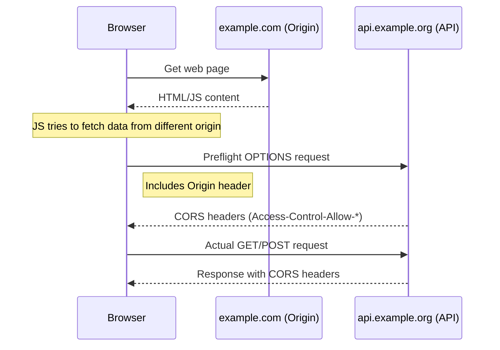

# PHP CORS Handling

## Introduction

When developing APIs with PHP, you'll inevitably encounter Cross-Origin Resource Sharing (CORS) issues. CORS is a security feature implemented by browsers to restrict web pages from making requests to a domain different from the one that served the original page. As a PHP developer, understanding and properly handling CORS is essential for creating accessible and secure APIs.

This guide will walk you through everything you need to know about CORS in PHP API development - from basic concepts to practical implementation strategies.

## What is CORS?

CORS (Cross-Origin Resource Sharing) is an HTTP-header based mechanism that allows a server to indicate any origins (domain, scheme, or port) other than its own from which a browser should permit loading resources.



### Key CORS Headers

Before diving into PHP implementation, let's understand the essential CORS headers:

1. **Access-Control-Allow-Origin**: Specifies which origins can access the resource
2. **Access-Control-Allow-Methods**: Indicates which HTTP methods are allowed
3. **Access-Control-Allow-Headers**: Lists headers that can be used in the request
4. **Access-Control-Allow-Credentials**: Indicates if request can include user credentials
5. **Access-Control-Max-Age**: Specifies how long preflight results can be cached

## Basic CORS Implementation in PHP

The simplest way to enable CORS in PHP is by adding the appropriate headers to your API responses:

```php
<?php
// Allow from any origin
header("Access-Control-Allow-Origin: *");
header("Access-Control-Allow-Methods: GET, POST, OPTIONS");
header("Access-Control-Allow-Headers: Content-Type");

// Handle preflight OPTIONS request
if ($_SERVER['REQUEST_METHOD'] === 'OPTIONS') {
    // Just exit with 200 OK status
    exit(0);
}

// Your actual API code here
$data = [
    'message' => 'This API supports CORS!',
    'status' => 'success'
];

// Return JSON response
header('Content-Type: application/json');
echo json_encode($data);
```

### Output
When accessing this API from a different origin, the browser will receive:
```json
{
    "message": "This API supports CORS!",
    "status": "success"
}
```

And the response headers will include the CORS headers:
```
Access-Control-Allow-Origin: *
Access-Control-Allow-Methods: GET, POST, OPTIONS
Access-Control-Allow-Headers: Content-Type
Content-Type: application/json
```

## CORS with Specific Origins

In production, allowing requests from any origin (`*`) is often too permissive. A more secure approach is to specify which origins are allowed:

```php
<?php
// Define allowed origins
$allowedOrigins = [
    'https://example.com',
    'https://app.example.com',
    'http://localhost:3000'
];

// Get the origin from the request headers
$origin = isset($_SERVER['HTTP_ORIGIN']) ? $_SERVER['HTTP_ORIGIN'] : '';

// Check if the origin is allowed
if (in_array($origin, $allowedOrigins)) {
    header("Access-Control-Allow-Origin: $origin");
    header("Access-Control-Allow-Methods: GET, POST, PUT, DELETE, OPTIONS");
    header("Access-Control-Allow-Headers: Content-Type, Authorization");
    header("Access-Control-Allow-Credentials: true");
}

// Handle preflight request
if ($_SERVER['REQUEST_METHOD'] === 'OPTIONS') {
    exit(0);
}

// Your API logic here
```

## Creating a Reusable CORS Middleware

For larger applications, it's better to create a reusable CORS middleware that can be applied to all your API endpoints:

```php
<?php
class CorsMiddleware {
    private $allowedOrigins;
    private $allowedMethods;
    private $allowedHeaders;
    private $allowCredentials;
    private $maxAge;

    public function __construct(
        array $allowedOrigins = ['*'],
        array $allowedMethods = ['GET', 'POST', 'PUT', 'DELETE', 'OPTIONS'],
        array $allowedHeaders = ['Content-Type', 'Authorization'],
        bool $allowCredentials = true,
        int $maxAge = 86400 // 24 hours
    ) {
        $this->allowedOrigins = $allowedOrigins;
        $this->allowedMethods = $allowedMethods;
        $this->allowedHeaders = $allowedHeaders;
        $this->allowCredentials = $allowCredentials;
        $this->maxAge = $maxAge;
    }

    public function handle() {
        $origin = isset($_SERVER['HTTP_ORIGIN']) ? $_SERVER['HTTP_ORIGIN'] : '';

        // Check if origin is allowed
        if ($this->allowedOrigins[0] === '*') {
            header('Access-Control-Allow-Origin: *');
        } elseif (in_array($origin, $this->allowedOrigins)) {
            header("Access-Control-Allow-Origin: $origin");
            if ($this->allowCredentials) {
                header("Access-Control-Allow-Credentials: true");
            }
        }

        // Set other CORS headers
        header('Access-Control-Allow-Methods: ' . implode(', ', $this->allowedMethods));
        header('Access-Control-Allow-Headers: ' . implode(', ', $this->allowedHeaders));
        header('Access-Control-Max-Age: ' . $this->maxAge);

        // Handle preflight request
        if ($_SERVER['REQUEST_METHOD'] === 'OPTIONS') {
            exit(0);
        }
    }
}

// Usage example
$cors = new CorsMiddleware(
    ['https://example.com', 'http://localhost:3000'],
    ['GET', 'POST', 'PUT', 'DELETE', 'OPTIONS'],
    ['Content-Type', 'Authorization', 'X-Requested-With']
);

$cors->handle();

// Your API logic follows...
```

## CORS with PHP Frameworks

Most PHP frameworks provide built-in CORS handling. Let's look at a few examples:

### Laravel

Laravel's CORS can be configured using the `fruitcake/laravel-cors` package:

```php
// Install via Composer
// composer require fruitcake/laravel-cors

// Configuration in config/cors.php
return [
    'paths' => ['api/*'],
    'allowed_methods' => ['*'],
    'allowed_origins' => ['https://example.com', 'http://localhost:3000'],
    'allowed_origins_patterns' => [],
    'allowed_headers' => ['*'],
    'exposed_headers' => [],
    'max_age' => 0,
    'supports_credentials' => false,
];
```

### Slim Framework

In Slim, you can add CORS middleware:

```php
use Slim\Factory\AppFactory;
use Psr\Http\Message\ServerRequestInterface as Request;
use Psr\Http\Server\RequestHandlerInterface as RequestHandler;
use Slim\Psr7\Response;

$app = AppFactory::create();

// CORS middleware
$app->add(function (Request $request, RequestHandler $handler) {
    $response = $handler->handle($request);
    return $response
        ->withHeader('Access-Control-Allow-Origin', 'https://example.com')
        ->withHeader('Access-Control-Allow-Headers', 'X-Requested-With, Content-Type, Accept, Origin, Authorization')
        ->withHeader('Access-Control-Allow-Methods', 'GET, POST, PUT, DELETE, PATCH, OPTIONS');
});

// Handle preflight requests
$app->options('/{routes:.+}', function (Request $request, Response $response) {
    return $response;
});

// Define your routes here
```

## Common CORS Issues and Solutions

### Issue 1: Preflight Requests Not Handled

**Problem**: The browser sends an OPTIONS request before the actual request, but your server doesn't handle it properly.

**Solution**: Add specific handling for OPTIONS requests:

```php
if ($_SERVER['REQUEST_METHOD'] === 'OPTIONS') {
    // Return 200 OK with CORS headers
    exit(0);
}
```

### Issue 2: Credentials Not Allowed

**Problem**: Your API requires cookies or authentication, but CORS blocks credentials.

**Solution**: Add the appropriate headers and ensure your origin is specific (not wildcard):

```php
header("Access-Control-Allow-Origin: https://example.com"); // Must be specific origin, not *
header("Access-Control-Allow-Credentials: true");
```

### Issue 3: Custom Headers Blocked

**Problem**: Your requests include custom headers that are being blocked.

**Solution**: Explicitly allow those headers:

```php
header("Access-Control-Allow-Headers: Content-Type, Authorization, X-Custom-Header");
```

## Testing CORS Configuration

You can verify your CORS implementation using these methods:

1. **Browser Developer Tools**: Check the Network tab for requests and their headers
2. **curl**: Test preflight requests manually:

```bash
curl -X OPTIONS -H "Origin: https://example.com" -H "Access-Control-Request-Method: GET" https://api.example.org/endpoint -v
```

3. **Online CORS Testers**: Use services like `https://cors-test.codehappy.dev/`

## Security Considerations

While implementing CORS, keep these security points in mind:

1. **Avoid using wildcards in production**: Don't use `Access-Control-Allow-Origin: *` for APIs that handle sensitive data
2. **Validate origins carefully**: Only allow trusted domains in your allowed origins list
3. **Limit exposed headers**: Only expose headers that are necessary for clients
4. **Be careful with credentials**: Enable `Access-Control-Allow-Credentials` only when necessary
5. **Consider timeouts**: Set appropriate `Access-Control-Max-Age` to balance security and performance

## Practical Example: Building a Complete API Endpoint with CORS

Let's tie everything together with a practical example of a RESTful API endpoint that handles CORS correctly:

```php
<?php
// config.php - Configuration settings
$config = [
    'cors' => [
        'allowed_origins' => ['https://example.com', 'http://localhost:3000'],
        'allowed_methods' => ['GET', 'POST', 'PUT', 'DELETE', 'OPTIONS'],
        'allowed_headers' => ['Content-Type', 'Authorization', 'X-Requested-With'],
        'allow_credentials' => true,
        'max_age' => 86400, // 24 hours
    ]
];

// cors.php - CORS middleware
function handleCors($config) {
    $corsConfig = $config['cors'];
    $origin = isset($_SERVER['HTTP_ORIGIN']) ? $_SERVER['HTTP_ORIGIN'] : '';
    
    if (in_array($origin, $corsConfig['allowed_origins'])) {
        header("Access-Control-Allow-Origin: $origin");
        if ($corsConfig['allow_credentials']) {
            header("Access-Control-Allow-Credentials: true");
        }
    }
    
    header('Access-Control-Allow-Methods: ' . implode(', ', $corsConfig['allowed_methods']));
    header('Access-Control-Allow-Headers: ' . implode(', ', $corsConfig['allowed_headers']));
    header('Access-Control-Max-Age: ' . $corsConfig['max_age']);
    
    // Handle preflight request
    if ($_SERVER['REQUEST_METHOD'] === 'OPTIONS') {
        header('Content-Length: 0');
        header('Content-Type: text/plain');
        exit(0);
    }
}

// api.php - Sample API endpoint
require_once 'config.php';
require_once 'cors.php';

// Handle CORS first
handleCors($config);

// Process the request based on method
switch ($_SERVER['REQUEST_METHOD']) {
    case 'GET':
        // Example: fetch users
        $users = [
            ['id' => 1, 'name' => 'John Doe'],
            ['id' => 2, 'name' => 'Jane Smith']
        ];
        $response = ['status' => 'success', 'data' => $users];
        break;
        
    case 'POST':
        // Example: create a new user
        $input = json_decode(file_get_contents('php://input'), true);
        $response = ['status' => 'success', 'message' => 'User created', 'data' => $input];
        break;
        
    default:
        $response = ['status' => 'error', 'message' => 'Unsupported method'];
        http_response_code(405);
}

// Send JSON response
header('Content-Type: application/json');
echo json_encode($response);
```

### Client-side Example

Here's how you might call this API from a JavaScript client:

```javascript
// Regular fetch
fetch('https://api.example.org/users', {
  method: 'GET',
  headers: {
    'Content-Type': 'application/json'
  }
})
.then(response => response.json())
.then(data => console.log(data))
.catch(error => console.error('Error:', error));

// Fetch with credentials
fetch('https://api.example.org/users', {
  method: 'POST',
  credentials: 'include', // Includes cookies
  headers: {
    'Content-Type': 'application/json',
    'Authorization': 'Bearer token123'
  },
  body: JSON.stringify({
    name: 'New User'
  })
})
.then(response => response.json())
.then(data => console.log(data))
.catch(error => console.error('Error:', error));
```

## Summary

Handling CORS in PHP API development is essential for building accessible and secure web services. In this guide, we've covered:

- The fundamentals of CORS and how it works
- Basic implementation of CORS headers in PHP
- Creating reusable CORS middleware
- Framework-specific CORS handling 
- Common CORS issues and their solutions
- Testing and security considerations
- A complete practical example

By properly implementing CORS, you ensure that your PHP APIs can be securely accessed by web applications from different origins, while maintaining appropriate security boundaries.

## Additional Resources

- [MDN Web Docs: CORS](https://developer.mozilla.org/en-US/docs/Web/HTTP/CORS)
- [PHP Manual: Header Function](https://www.php.net/manual/en/function.header.php)
- [CORS on REST API with PHP](https://stackoverflow.com/questions/8719276/cors-with-php-headers)
- [Fruitcake CORS Package for Laravel](https://github.com/fruitcake/laravel-cors)

## Exercises

1. **Basic CORS Implementation**: Create a simple PHP script that returns JSON data and allows CORS from any origin.
2. **Origin Validation**: Modify the script to only allow requests from specific origins of your choice.
3. **Preflight Handling**: Enhance your script to properly handle OPTIONS preflight requests.
4. **Middleware Creation**: Build a reusable CORS middleware class that can be configured with different options.
5. **Framework Integration**: If you're using a PHP framework like Laravel or Slim, implement CORS handling using the framework's recommended approach.