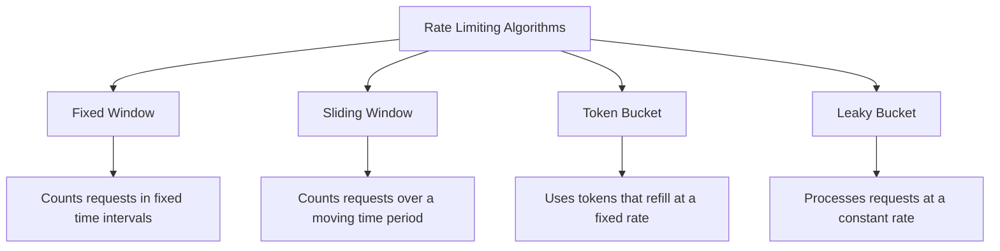
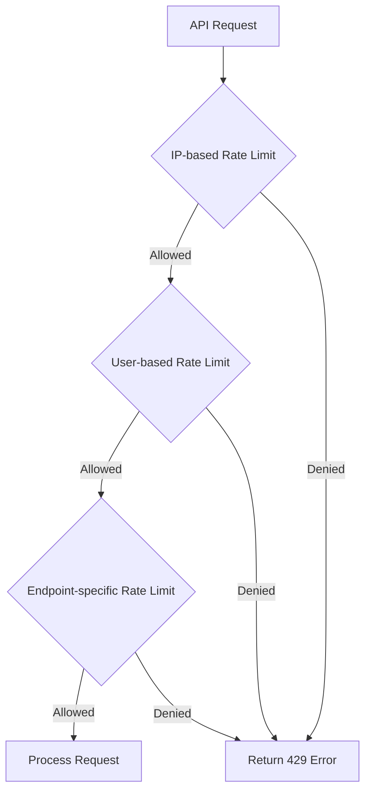

# PHP Rate Limiting

## Introduction

Rate limiting is a crucial technique in API development that restricts the number of requests a client can make to your API within a specified time period. By implementing rate limiting in your PHP applications, you can:

- Protect your servers from being overwhelmed by too many requests
- Prevent abuse or misuse of your API
- Ensure fair resource distribution among all users
- Reduce the risk of DDoS attacks
- Manage resource costs for your application

In this tutorial, we'll explore various approaches to implementing rate limiting in PHP APIs, from simple techniques to more advanced solutions.

## Understanding Rate Limiting Concepts

Before diving into code, let's understand the key concepts of rate limiting:

### Rate Limiting Terminology

- **Rate limit**: The maximum number of requests allowed within a time window
- **Time window**: The period over which requests are counted (e.g., per minute, per hour)
- **Request quota**: The number of requests a client is allowed to make
- **Throttling**: The process of limiting the rate of requests
- **Rate limit headers**: HTTP headers that inform clients about their limit status

### Common Rate Limiting Algorithms

1. **Fixed Window**: Count requests in fixed time intervals (e.g., 100 requests per minute)
2. **Sliding Window**: Count requests over a continuously moving time period
3. **Token Bucket**: Use tokens that are replenished at a fixed rate
4. **Leaky Bucket**: Process requests at a constant rate, queueing or dropping excess requests

Let's visualize the difference between these algorithms:



## Implementing Basic Rate Limiting in PHP

Let's start with a simple rate limiting implementation using PHP sessions and the fixed window algorithm.

### Simple Session-Based Rate Limiting

This is a straightforward approach suitable for small applications:

```php
<?php
// Start the session
session_start();

// Define rate limit parameters
$maxRequests = 10;              // Maximum requests allowed
$timeWindow = 60;               // Time window in seconds (1 minute)

// Initialize session variables if they don't exist
if (!isset($_SESSION['rate_limit'])) {
    $_SESSION['rate_limit'] = [
        'requests' => 0,
        'reset_time' => time() + $timeWindow
    ];
}

// Check if the time window has expired and reset if needed
if (time() > $_SESSION['rate_limit']['reset_time']) {
    $_SESSION['rate_limit'] = [
        'requests' => 0,
        'reset_time' => time() + $timeWindow
    ];
}

// Increment the request counter
$_SESSION['rate_limit']['requests']++;

// Check if the rate limit has been exceeded
if ($_SESSION['rate_limit']['requests'] > $maxRequests) {
    // Calculate when the rate limit will reset
    $retryAfter = $_SESSION['rate_limit']['reset_time'] - time();
    
    // Send rate limit headers
    header('HTTP/1.1 429 Too Many Requests');
    header('Retry-After: ' . $retryAfter);
    header('X-RateLimit-Limit: ' . $maxRequests);
    header('X-RateLimit-Remaining: 0');
    header('X-RateLimit-Reset: ' . $_SESSION['rate_limit']['reset_time']);
    
    // Send error message
    echo json_encode([
        'error' => 'Rate limit exceeded',
        'message' => 'Too many requests. Please try again later.',
        'retry_after' => $retryAfter
    ]);
    exit;
}

// Calculate remaining requests
$remainingRequests = $maxRequests - $_SESSION['rate_limit']['requests'];

// Send rate limit headers
header('X-RateLimit-Limit: ' . $maxRequests);
header('X-RateLimit-Remaining: ' . $remainingRequests);
header('X-RateLimit-Reset: ' . $_SESSION['rate_limit']['reset_time']);

// Continue with the API processing...
echo json_encode([
    'status' => 'success',
    'message' => 'API request successful',
    'rate_limit' => [
        'remaining' => $remainingRequests,
        'limit' => $maxRequests,
        'reset' => $_SESSION['rate_limit']['reset_time']
    ]
]);
?>
```

**Example Output (Success):**
```json
{
    "status": "success",
    "message": "API request successful",
    "rate_limit": {
        "remaining": 9,
        "limit": 10,
        "reset": 1614529820
    }
}
```

**Example Output (Rate Limited):**
```json
{
    "error": "Rate limit exceeded",
    "message": "Too many requests. Please try again later.",
    "retry_after": 45
}
```

While this simple approach works for basic applications, it has limitations:
- It only works for single-server applications
- It cannot distinguish between different clients (all users share the same limit)
- It doesn't persist between sessions

## Redis-Based Rate Limiting

For more robust rate limiting, we can use Redis, which provides better scalability and persistence:

### Installing Required Dependencies

First, make sure you have the Redis PHP extension installed:

```bash
# Install Redis server (Ubuntu/Debian)
sudo apt-get install redis-server

# Install PHP Redis extension
sudo apt-get install php-redis

# Or using PECL
pecl install redis
```

### Implementing Token Bucket Algorithm with Redis

The token bucket algorithm is more sophisticated and allows for burst traffic while still maintaining overall rate limits:

```php
<?php
/**
 * Redis-based Token Bucket Rate Limiter
 * 
 * This implementation uses the token bucket algorithm with Redis for storage.
 * It allows for burst traffic within limits.
 */

class RedisRateLimiter {
    private $redis;
    private $maxTokens;       // Maximum tokens in the bucket
    private $refillRate;      // Tokens added per second
    private $keyPrefix;       // Redis key prefix

    /**
     * Constructor
     * 
     * @param Redis $redis Redis connection
     * @param int $maxTokens Maximum tokens allowed in bucket
     * @param float $refillRate Token refill rate per second
     * @param string $keyPrefix Prefix for Redis keys
     */
    public function __construct($redis, $maxTokens = 10, $refillRate = 0.1, $keyPrefix = 'rate_limit:') {
        $this->redis = $redis;
        $this->maxTokens = $maxTokens;
        $this->refillRate = $refillRate;
        $this->keyPrefix = $keyPrefix;
    }

    /**
     * Check if a request is allowed for a given client
     * 
     * @param string $clientId Unique identifier for the client
     * @param int $tokensRequired Number of tokens required for this request
     * @return array Result with allowed status and rate limit info
     */
    public function checkRateLimit($clientId, $tokensRequired = 1) {
        // Keys for storing the bucket state in Redis
        $tokenKey = $this->keyPrefix . $clientId . ':tokens';
        $timestampKey = $this->keyPrefix . $clientId . ':timestamp';

        // Using Redis transaction to ensure atomicity
        $this->redis->multi();
        
        // Get current token count and last update timestamp
        $this->redis->get($tokenKey);
        $this->redis->get($timestampKey);
        
        $result = $this->redis->exec();
        list($currentTokens, $lastUpdateTime) = $result;
        
        // Initialize if first request
        if ($currentTokens === false || $lastUpdateTime === false) {
            $currentTokens = $this->maxTokens;
            $lastUpdateTime = time();
        } else {
            $currentTokens = (float) $currentTokens;
            $lastUpdateTime = (int) $lastUpdateTime;
        }

        // Calculate token refill since last request
        $now = time();
        $timePassed = $now - $lastUpdateTime;
        $newTokens = min($this->maxTokens, $currentTokens + ($timePassed * $this->refillRate));
        
        // Check if enough tokens are available
        if ($newTokens >= $tokensRequired) {
            // Consume tokens
            $newTokens -= $tokensRequired;
            $allowed = true;
        } else {
            // Not enough tokens, request denied
            $allowed = false;
        }
        
        // Calculate time until next token is available (if denied)
        $retryAfter = $allowed ? 0 : ceil(($tokensRequired - $newTokens) / $this->refillRate);

        // Update token count and timestamp in Redis
        $this->redis->multi();
        $this->redis->set($tokenKey, $newTokens);
        $this->redis->set($timestampKey, $now);
        $this->redis->expire($tokenKey, 86400);         // TTL: 1 day
        $this->redis->expire($timestampKey, 86400);     // TTL: 1 day
        $this->redis->exec();

        // Return result with rate limit information
        return [
            'allowed' => $allowed,
            'rate_limit' => [
                'tokens_remaining' => $newTokens,
                'limit' => $this->maxTokens,
                'retry_after' => $retryAfter,
                'tokens_required' => $tokensRequired
            ]
        ];
    }

    /**
     * Apply rate limiting headers to the response
     * 
     * @param array $rateLimit Rate limit info from checkRateLimit()
     * @return void
     */
    public function applyRateLimitHeaders($rateLimit) {
        header('X-RateLimit-Limit: ' . $rateLimit['limit']);
        header('X-RateLimit-Remaining: ' . $rateLimit['tokens_remaining']);
        
        if (!$rateLimit['allowed']) {
            header('HTTP/1.1 429 Too Many Requests');
            header('Retry-After: ' . $rateLimit['retry_after']);
        }
    }
}

// Example usage:
try {
    // Create Redis connection
    $redis = new Redis();
    $redis->connect('127.0.0.1', 6379);
    
    // Create rate limiter
    // 10 tokens max, refill rate of 1 token per second
    $rateLimiter = new RedisRateLimiter($redis, 10, 1);
    
    // Client identifier (use IP, API key, user ID, etc.)
    $clientId = $_SERVER['REMOTE_ADDR'];
    
    // Check if request is allowed
    $result = $rateLimiter->checkRateLimit($clientId);
    
    // Apply rate limit headers
    $rateLimiter->applyRateLimitHeaders($result['rate_limit']);
    
    if ($result['allowed']) {
        // Request is allowed, continue processing
        echo json_encode([
            'status' => 'success',
            'message' => 'API request successful',
            'rate_limit' => $result['rate_limit']
        ]);
    } else {
        // Request denied due to rate limiting
        echo json_encode([
            'error' => 'Rate limit exceeded',
            'message' => 'Too many requests. Please try again later.',
            'retry_after' => $result['rate_limit']['retry_after']
        ]);
    }
} catch (Exception $e) {
    // Handle connection errors
    header('HTTP/1.1 500 Internal Server Error');
    echo json_encode([
        'error' => 'Server error',
        'message' => 'Could not process request: ' . $e->getMessage()
    ]);
}
?>
```

## Implementing Different Rate Limit Tiers

In real-world applications, you might want to have different rate limits for different users or API keys. Here's how to implement tiered rate limiting:

```php
<?php
/**
 * Tiered Rate Limiter for different user types
 */
class TieredRateLimiter {
    private $redis;
    private $tiers;

    /**
     * Constructor
     * 
     * @param Redis $redis Redis connection
     * @param array $tiers Rate limit tiers configuration
     */
    public function __construct($redis, $tiers = []) {
        $this->redis = $redis;
        $this->tiers = $tiers ?: [
            'free' => ['rate' => 10, 'period' => 60],      // 10 requests per minute
            'basic' => ['rate' => 20, 'period' => 60],     // 20 requests per minute
            'premium' => ['rate' => 60, 'period' => 60],   // 60 requests per minute
            'unlimited' => ['rate' => 1000, 'period' => 60] // 1000 requests per minute
        ];
    }

    /**
     * Check if a request is allowed
     * 
     * @param string $clientId Unique identifier for client
     * @param string $tier Client's tier level
     * @return array Result with allowed status and rate limit info
     */
    public function checkLimit($clientId, $tier = 'free') {
        // Default to free tier if specified tier doesn't exist
        if (!isset($this->tiers[$tier])) {
            $tier = 'free';
        }

        $tierConfig = $this->tiers[$tier];
        $key = "rate_limit:{$tier}:{$clientId}";
        $now = time();
        $windowStart = $now - ($now % $tierConfig['period']);
        
        // Use Redis pipeline for better performance
        $this->redis->multi();
        $this->redis->get($key);
        $this->redis->ttl($key);
        $result = $this->redis->exec();
        
        list($requests, $ttl) = $result;
        $requests = (int) $requests ?: 0;
        
        // Check if over the limit
        if ($requests >= $tierConfig['rate']) {
            // Calculate retry after
            $retryAfter = ($ttl > 0) ? $ttl : $tierConfig['period'];
            
            return [
                'allowed' => false,
                'rate_limit' => [
                    'limit' => $tierConfig['rate'],
                    'remaining' => 0,
                    'reset' => $windowStart + $tierConfig['period'],
                    'retry_after' => $retryAfter,
                    'tier' => $tier
                ]
            ];
        }
        
        // Increment counter and set expiry
        $this->redis->multi();
        $this->redis->incr($key);
        
        // Set key expiry if it's new
        if ($requests == 0) {
            $this->redis->expireat($key, $windowStart + $tierConfig['period']);
        }
        
        $this->redis->exec();
        
        // Request is allowed
        return [
            'allowed' => true,
            'rate_limit' => [
                'limit' => $tierConfig['rate'],
                'remaining' => $tierConfig['rate'] - $requests - 1,
                'reset' => $windowStart + $tierConfig['period'],
                'tier' => $tier
            ]
        ];
    }
}

// Example usage:
try {
    // Connect to Redis
    $redis = new Redis();
    $redis->connect('127.0.0.1', 6379);
    
    // Define custom tiers (optional)
    $tiers = [
        'free' => ['rate' => 5, 'period' => 60],        // 5 requests per minute
        'basic' => ['rate' => 30, 'period' => 60],      // 30 requests per minute
        'premium' => ['rate' => 100, 'period' => 60],   // 100 requests per minute
        'enterprise' => ['rate' => 500, 'period' => 60] // 500 requests per minute
    ];
    
    $rateLimiter = new TieredRateLimiter($redis, $tiers);
    
    // Get client identifier (use IP, API key, user ID, etc.)
    $clientId = $_SERVER['REMOTE_ADDR'];
    
    // Determine client's tier (in a real app, you'd look this up in a database)
    $userTier = 'basic'; // Example: this user has a basic subscription
    
    // Check rate limit
    $result = $rateLimiter->checkLimit($clientId, $userTier);
    
    // Set rate limit headers
    header('X-RateLimit-Limit: ' . $result['rate_limit']['limit']);
    header('X-RateLimit-Remaining: ' . $result['rate_limit']['remaining']);
    header('X-RateLimit-Reset: ' . $result['rate_limit']['reset']);
    header('X-RateLimit-Tier: ' . $result['rate_limit']['tier']);
    
    if ($result['allowed']) {
        // Process the API request
        echo json_encode([
            'status' => 'success',
            'message' => 'API request processed successfully',
            'rate_limit' => $result['rate_limit']
        ]);
    } else {
        // Return rate limit exceeded error
        header('HTTP/1.1 429 Too Many Requests');
        header('Retry-After: ' . $result['rate_limit']['retry_after']);
        
        echo json_encode([
            'error' => 'Rate limit exceeded',
            'message' => 'You have exceeded your rate limit. Please try again later.',
            'rate_limit' => $result['rate_limit']
        ]);
    }
} catch (Exception $e) {
    // Handle errors
    header('HTTP/1.1 500 Internal Server Error');
    echo json_encode(['error' => $e->getMessage()]);
}
?>
```

## Using a PHP Framework for Rate Limiting

If you're using a PHP framework like Laravel or Symfony, you can leverage their built-in rate limiting capabilities.

### Rate Limiting in Laravel

Laravel provides an elegant way to implement rate limiting through middleware. Here's how to use it:

```php
<?php
// In your routes file (routes/api.php)
Route::middleware('auth:api')->group(function () {
    // Rate limit to 60 requests per minute
    Route::middleware('throttle:60,1')->group(function () {
        Route::get('/user', function () {
            return Auth::user();
        });
    });
    
    // Different rate limits for different endpoints
    Route::middleware('throttle:10,1')->group(function () {
        Route::post('/resource', 'ResourceController@store');
    });
});

// Specifying rate limits dynamically based on the user
Route::middleware(['auth:api', 'throttle:rate_limit,1'])->group(function () {
    Route::get('/dashboard', 'DashboardController@index');
});

// In App\Providers\AppServiceProvider
public function boot()
{
    // Define the rate_limit resolver
    RateLimiter::for('rate_limit', function (Request $request) {
        // Get the authenticated user
        $user = $request->user();
        
        // Return rate limit based on user's subscription
        switch ($user->subscription_tier) {
            case 'premium':
                return 100; // 100 requests per minute
            case 'basic':
                return 30;  // 30 requests per minute
            default:
                return 10;  // 10 requests per minute for free users
        }
    });
}
?>
```

### Rate Limiting in Symfony

Symfony provides rate limiting capabilities through its Rate Limiter component:

```php
<?php
// config/packages/rate_limiter.yaml
framework:
    rate_limiter:
        anonymous_api:
            # 30 requests per minute
            policy: 'fixed_window'
            limit: 30
            interval: '1 minute'
            
        authenticated_api:
            # 60 requests per minute
            policy: 'sliding_window'
            limit: 60
            interval: '1 minute'

// In your controller
use Symfony\Component\RateLimiter\RateLimiterFactory;

class ApiController
{
    private $anonymousLimiter;
    private $authenticatedLimiter;
    
    public function __construct(RateLimiterFactory $anonymousLimiter, RateLimiterFactory $authenticatedLimiter)
    {
        $this->anonymousLimiter = $anonymousLimiter;
        $this->authenticatedLimiter = $authenticatedLimiter;
    }
    
    public function index(Request $request)
    {
        // Choose limiter based on authentication status
        $limiter = $this->getUser() ? $this->authenticatedLimiter : $this->anonymousLimiter;
        
        // Create limiter for specific client
        $clientLimiter = $limiter->create($request->getClientIp());
        
        // Check if request can be fulfilled
        if (false === $clientLimiter->consume(1)->isAccepted()) {
            throw new TooManyRequestsHttpException();
        }
        
        // Process the request...
    }
}
?>
```

## Best Practices for API Rate Limiting

When implementing rate limiting in your PHP APIs, follow these best practices:

### 1. Use Clear Rate Limit Headers

Always include standard rate limit headers in your API responses:

```php
<?php
// Standard rate limit headers
header('X-RateLimit-Limit: ' . $limit);          // The maximum number of requests allowed
header('X-RateLimit-Remaining: ' . $remaining);  // Remaining requests in the current window
header('X-RateLimit-Reset: ' . $reset);          // Timestamp when the limit resets

// When limit is exceeded
header('HTTP/1.1 429 Too Many Requests');
header('Retry-After: ' . $retryAfter);           // Seconds until requests can be made again
?>
```

### 2. Implement Multiple Rate Limiting Strategies

Consider implementing multiple levels of rate limiting:



### 3. Use Distributed Storage for Rate Limiting

For applications running on multiple servers, use Redis or a similar distributed solution to store rate limit data.

### 4. Gradually Degrade Service Instead of Hard Limits

Consider implementing progressive throttling:

```php
<?php
// Example of progressive throttling
function getThrottleDelay($requestsOverLimit) {
    // Add exponential delay based on how far over the limit they are
    return min(30, pow(2, $requestsOverLimit / 10)); // Max delay of 30 seconds
}

// Example usage
$overLimit = $requestCount - $limit;
if ($overLimit > 0) {
    $delay = getThrottleDelay($overLimit);
    sleep($delay); // Slow down the response rather than denying it
}
?>
```

### 5. Provide Clear Documentation

Always document your rate limiting policies clearly for API users:

```php
/**
 * API Rate Limits
 * 
 * - Anonymous users: 30 requests per minute
 * - Basic tier: 60 requests per minute
 * - Premium tier: 120 requests per minute
 * 
 * Headers:
 * - X-RateLimit-Limit: Maximum number of requests per window
 * - X-RateLimit-Remaining: Remaining requests in current window
 * - X-RateLimit-Reset: Unix timestamp when the limit resets
 * 
 * When rate limit is exceeded:
 * - Status: 429 Too Many Requests
 * - Retry-After: Seconds until next request is allowed
 */
```

## Building a Complete Rate Limiting Middleware

Let's put everything together to create a reusable middleware that you can include in your PHP applications:

```php
<?php
/**
 * Rate Limiting Middleware
 * 
 * A complete, reusable rate limiting middleware for PHP applications.
 */
class RateLimitMiddleware {
    private $redis;
    private $options;
    private $identifierCallback;

    /**
     * Constructor
     * 
     * @param Redis $redis Redis connection
     * @param array $options Middleware options
     * @param callable $identifierCallback Function to get client identifier
     */
    public function __construct($redis, $options = [], $identifierCallback = null) {
        $this->redis = $redis;
        
        // Default options
        $defaultOptions = [
            'limit' => 60,            // Default requests per window
            'window' => 60,           // Default window size in seconds
            'algorithm' => 'sliding', // Default algorithm (fixed, sliding, token)
            'prefix' => 'rate_limit:' // Redis key prefix
        ];
        
        $this->options = array_merge($defaultOptions, $options);
        
        // Default identifier callback uses IP address
        $this->identifierCallback = $identifierCallback ?: function() {
            return $_SERVER['REMOTE_ADDR'];
        };
    }

    /**
     * Check if the request should be allowed
     * 
     * @return array Result with allowed status and rate limit info
     */
    public function check() {
        $clientId = call_user_func($this->identifierCallback);
        
        switch ($this->options['algorithm']) {
            case 'token':
                return $this->tokenBucketCheck($clientId);
            case 'sliding':
                return $this->slidingWindowCheck($clientId);
            case 'fixed':
            default:
                return $this->fixedWindowCheck($clientId);
        }
    }
    
    /**
     * Apply middleware to the request
     * 
     * @param callable $next Next middleware or request handler
     * @return mixed Response from next handler or 429 error
     */
    public function handle($next) {
        $result = $this->check();
        
        // Add rate limit headers
        header('X-RateLimit-Limit: ' . $result['rate_limit']['limit']);
        header('X-RateLimit-Remaining: ' . $result['rate_limit']['remaining']);
        header('X-RateLimit-Reset: ' . $result['rate_limit']['reset']);
        
        if (!$result['allowed']) {
            // Rate limit exceeded
            header('HTTP/1.1 429 Too Many Requests');
            header('Retry-After: ' . $result['rate_limit']['retry_after']);
            
            echo json_encode([
                'error' => 'Rate limit exceeded',
                'message' => 'Too many requests. Please try again later.',
                'retry_after' => $result['rate_limit']['retry_after']
            ]);
            
            return false;
        }
        
        // Continue to next middleware/handler
        return $next();
    }
    
    /**
     * Fixed window rate limiting algorithm
     */
    private function fixedWindowCheck($clientId) {
        $key = $this->options['prefix'] . $clientId;
        $limit = $this->options['limit'];
        $window = $this->options['window'];
        
        // Get current window and current count
        $currentWindow = floor(time() / $window);
        $windowKey = $key . ':' . $currentWindow;
        
        // Get current count
        $count = $this->redis->get($windowKey);
        $count = $count ? (int) $count : 0;
        
        // Check if over limit
        if ($count >= $limit) {
            // Calculate time until next window
            $resetTime = ($currentWindow + 1) * $window;
            $retryAfter = $resetTime - time();
            
            return [
                'allowed' => false,
                'rate_limit' => [
                    'limit' => $limit,
                    'remaining' => 0,
                    'reset' => $resetTime,
                    'retry_after' => $retryAfter
                ]
            ];
        }
        
        // Increment counter and set expiry
        $this->redis->multi();
        $this->redis->incr($windowKey);
        $this->redis->expire($windowKey, $window * 2); // Keep for 2 windows to handle edge cases
        $this->redis->exec();
        
        // Calculate reset time
        $resetTime = ($currentWindow + 1) * $window;
        
        return [
            'allowed' => true,
            'rate_limit' => [
                'limit' => $limit,
                'remaining' => $limit - $count - 1,
                'reset' => $resetTime,
                'retry_after' => 0
            ]
        ];
    }
    
    /**
     * Sliding window rate limiting algorithm
     */
    private function slidingWindowCheck($clientId) {
        $key = $this->options['prefix'] . $clientId;
        $limit = $this->options['limit'];
        $window = $this->options['window'];
        $now = time();
        
        // Remove old entries
        $this->redis->zremrangebyscore($key, 0, $now - $window);
        
        // Count requests in current window
        $count = $this->redis->zcard($key);
        
        // Check if over limit
        if ($count >= $limit) {
            // Get oldest timestamp in window
            $oldest = $this->redis->zrange($key, 0, 0);
            
            if (empty($oldest)) {
                $retryAfter = $window;
            } else {
                // Calculate when oldest will expire from window
                $retryAfter = ($oldest[0] + $window) - $now;
            }
            
            return [
                'allowed' => false,
                'rate_limit' => [
                    'limit' => $limit,
                    'remaining' => 0,
                    'reset' => $now + $retryAfter,
                    'retry_after' => $retryAfter
                ]
            ];
        }
        
        // Add current request to window with timestamp as score
        $this->redis->zadd($key, $now, $now . '-' . uniqid());
        
        // Set expiry on the entire sorted set
        $this->redis->expire($key, $window * 2);
        
        return [
            'allowed' => true,
            'rate_limit' => [
                'limit' => $limit,
                'remaining' => $limit - $count - 1,
                'reset' => $now + $window,
                'retry_after' => 0
            ]
        ];
    }
    
    /**
     * Token bucket rate limiting algorithm
     */
    private function tokenBucketCheck($clientId) {
        $key = $this->options['prefix'] . $clientId;
        $limit = $this->options['limit'];
        $refillRate = $limit / $this->options['window']; // Tokens per second
        
        // Get current tokens and last update time
        $this->redis->multi();
        $this->redis->hgetall($key);
        $result = $this->redis->exec();
        
        $bucketData = $result[0];
        $now = time();
        
        // Initialize if first request
        if (empty($bucketData)) {
            $tokens = $limit;
            $lastUpdate = $now;
        } else {
            $tokens = (float) $bucketData['tokens'];
            $lastUpdate = (int) $bucketData['last_update'];
            
            // Refill tokens based on time passed
            $elapsedTime = $now - $lastUpdate;
            $newTokens = $elapsedTime * $refillRate;
            $tokens = min($limit, $