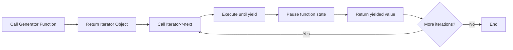

# PHP Generators

## Introduction

PHP Generators provide an elegant way to iterate through datasets without loading everything into memory at once. Introduced in PHP 5.5, generators offer a powerful alternative to creating and returning large arrays, especially when dealing with big data sets or resource-intensive operations.

Think of generators as special functions that "generate" values on-demand rather than computing and returning them all at once. This approach can significantly reduce memory usage and improve application performance.

## What Are Generators?

Generators are functions that can be paused and resumed, yielding values one at a time instead of returning a complete array. They allow you to create iterators with minimal code and without the overhead of implementing complex iterator classes.

### Traditional Approach vs. Generators

Let's compare the traditional approach with generators using a simple example:

#### Traditional Approach (Using Arrays)

```php
function getNumbers($max) {
    $numbers = [];
    for ($i = 1; $i <= $max; $i++) {
        $numbers[] = $i;
    }
    return $numbers;
}

// Using the function
foreach (getNumbers(1000000) as $number) {
    echo $number . " ";
    if ($number >= 10) break; // Just showing the first 10 numbers
}
// Output: 1 2 3 4 5 6 7 8 9 10

// Memory usage: High (creates an array with 1,000,000 elements)
```

#### Using Generators

```php
function getNumbers($max) {
    for ($i = 1; $i <= $max; $i++) {
        yield $i;
    }
}

// Using the generator
foreach (getNumbers(1000000) as $number) {
    echo $number . " ";
    if ($number >= 10) break; // Just showing the first 10 numbers
}
// Output: 1 2 3 4 5 6 7 8 9 10

// Memory usage: Minimal (generates values on-demand)
```

The traditional approach loads all values into memory first, while the generator produces values one at a time, significantly reducing memory usage.

## How Generators Work

Generators utilize the `yield` keyword, which is similar to `return` but with a crucial difference:

- `return` provides a value and terminates the function
- `yield` provides a value and pauses the function, saving its state for the next call

When a generator function is called, it returns an object implementing the Iterator interface, not the values themselves. Each time the iterator advances, the generator function executes until it reaches a `yield` statement, which provides the value to be returned.



## Basic Generator Syntax

Creating generators in PHP is straightforward:

```php
function simpleGenerator() {
    yield 'Value 1';
    yield 'Value 2';
    yield 'Value 3';
}

foreach (simpleGenerator() as $value) {
    echo $value . "
";
}

/* Output:
Value 1
Value 2
Value 3
*/
```

## Key Features of Generators

### 1. Memory Efficiency

Generators are extremely memory-efficient for large datasets:

```php
// A memory-intensive approach
function getFileLines_Array($file) {
    $lines = [];
    $handle = fopen($file, 'r');
    while (!feof($handle)) {
        $lines[] = fgets($handle);
    }
    fclose($handle);
    return $lines;
}

// A generator approach
function getFileLines_Generator($file) {
    $handle = fopen($file, 'r');
    while (!feof($handle)) {
        yield fgets($handle);
    }
    fclose($handle);
}

// Example usage
foreach (getFileLines_Generator('large_log_file.txt') as $line) {
    // Process each line one at a time
    echo substr($line, 0, 30) . "...
";
}
```

### 2. Generator Keys

Generators can produce key-value pairs using the `yield` keyword:

```php
function associativeGenerator() {
    yield 'key1' => 'Value 1';
    yield 'key2' => 'Value 2';
    yield 'key3' => 'Value 3';
}

foreach (associativeGenerator() as $key => $value) {
    echo "$key: $value
";
}

/* Output:
key1: Value 1
key2: Value 2
key3: Value 3
*/
```

### 3. Generator Delegation (yield from)

PHP 7 introduced `yield from`, which allows one generator to delegate to another generator or traversable object:

```php
function firstGenerator() {
    yield 'A';
    yield 'B';
}

function secondGenerator() {
    yield 'C';
    yield 'D';
}

function combinedGenerator() {
    yield from firstGenerator();
    yield from secondGenerator();
    yield 'E';
}

foreach (combinedGenerator() as $value) {
    echo $value . " ";
}
// Output: A B C D E
```

## Practical Examples

### Example 1: CSV File Processing

Using generators for processing large CSV files:

```php
function readCSV($file) {
    $handle = fopen($file, 'r');
    
    // Read the header row
    $header = fgetcsv($handle);
    
    while (($data = fgetcsv($handle)) !== false) {
        // Yield an associative array for each row
        yield array_combine($header, $data);
    }
    
    fclose($handle);
}

// Usage
foreach (readCSV('data.csv') as $row) {
    echo "Name: {$row['name']}, Email: {$row['email']}
";
}
```

### Example 2: Pagination Helper

Creating a pagination generator for database results:

```php
function paginate($query, $pageSize = 10) {
    $offset = 0;
    
    do {
        // Fetch only a single page at a time
        $stmt = $pdo->prepare("$query LIMIT :pageSize OFFSET :offset");
        $stmt->bindParam(':pageSize', $pageSize, PDO::PARAM_INT);
        $stmt->bindParam(':offset', $offset, PDO::PARAM_INT);
        $stmt->execute();
        
        $results = $stmt->fetchAll(PDO::FETCH_ASSOC);
        
        // If no more results, break the loop
        if (empty($results)) {
            break;
        }
        
        // Yield each result from the current page
        foreach ($results as $result) {
            yield $result;
        }
        
        // Move to the next page
        $offset += $pageSize;
        
    } while (true);
}

// Usage
foreach (paginate("SELECT * FROM users WHERE active = 1", 100) as $user) {
    // Process each user, only 100 at a time in memory
    echo "Processing user {$user['id']}: {$user['name']}
";
}
```

### Example 3: Building a Range Function

Creating a flexible range generator:

```php
function range_generator($start, $end, $step = 1) {
    if ($start < $end) {
        // Ascending
        for ($i = $start; $i <= $end; $i += $step) {
            yield $i;
        }
    } else {
        // Descending
        for ($i = $start; $i >= $end; $i -= $step) {
            yield $i;
        }
    }
}

// Generating even numbers from 0 to 10
foreach (range_generator(0, 10, 2) as $number) {
    echo $number . " ";
}
// Output: 0 2 4 6 8 10

// Countdown from 10 to 1
foreach (range_generator(10, 1) as $number) {
    echo $number . " ";
}
// Output: 10 9 8 7 6 5 4 3 2 1
```

## Advanced Generator Techniques

### Sending Values to Generators

PHP allows you to send values back to a generator using the `send()` method:

```php
function dataProcessor() {
    $input = yield "Ready for input";
    echo "Processing: $input
";
    
    $input2 = yield "Send another value";
    echo "Processing: $input2
";
    
    return "All done!";
}

$generator = dataProcessor();

// Start the generator
echo $generator->current() . "
"; // Outputs: Ready for input

// Send a value to the generator
echo $generator->send("First value") . "
"; // Processes "First value" and outputs: Send another value

// Send another value
$generator->send("Second value"); // Processes "Second value"

/* Output:
Ready for input
Processing: First value
Send another value
Processing: Second value
*/
```

### Error Handling in Generators

You can throw exceptions into generators using the `throw()` method:

```php
function errorHandlingGenerator() {
    try {
        yield "First value";
        yield "Second value";
    } catch (Exception $e) {
        echo "Caught exception: " . $e->getMessage() . "
";
        yield "Error handled";
    }
    
    yield "Continuing after error";
}

$generator = errorHandlingGenerator();

echo $generator->current() . "
"; // First value
$generator->next();
echo $generator->current() . "
"; // Second value

// Throw an exception into the generator
$generator->throw(new Exception("Something went wrong"));
echo $generator->current() . "
"; // Error handled

$generator->next();
echo $generator->current() . "
"; // Continuing after error

/* Output:
First value
Second value
Caught exception: Something went wrong
Error handled
Continuing after error
*/
```

## Performance Considerations

### Memory Usage Comparison

Let's compare memory usage between traditional arrays and generators:

```php
// Memory test function
function memoryTest($func, $name) {
    $startMemory = memory_get_usage();
    $func();
    $endMemory = memory_get_usage();
    
    echo "$name Memory Usage: " . ($endMemory - $startMemory) . " bytes
";
}

// Test with traditional array approach
memoryTest(function() {
    $array = [];
    for ($i = 0; $i < 1000000; $i++) {
        $array[] = $i;
    }
    $sum = 0;
    foreach ($array as $value) {
        $sum += $value;
    }
}, "Array");

// Test with generator approach
memoryTest(function() {
    $generator = function() {
        for ($i = 0; $i < 1000000; $i++) {
            yield $i;
        }
    };
    
    $sum = 0;
    foreach ($generator() as $value) {
        $sum += $value;
    }
}, "Generator");

/* Example Output:
Array Memory Usage: 33554656 bytes
Generator Memory Usage: 728 bytes
*/
```

## When to Use Generators

Generators are ideal in the following scenarios:

1. **Working with large datasets** that would consume too much memory if loaded all at once
2. **Reading large files** line by line
3. **Processing database results** in chunks
4. **Generating sequences** that follow a pattern
5. **Implementing custom iterators** with minimal boilerplate code

However, generators aren't always the best choice:

1. When you need **random access** to elements
2. When you need to **reuse the collection** multiple times (generators can only be iterated once)
3. When the **dataset is small** and memory usage isn't a concern

## Summary

PHP Generators provide an efficient way to iterate through large datasets without excessive memory usage. They offer a simple syntax with the `yield` keyword and allow for powerful data processing patterns.

Key takeaways:
- Generators produce values on-demand, saving memory
- They use the `yield` keyword to provide values one at a time
- They're ideal for large datasets, file processing, and database operations
- Advanced features include keys, delegation, and bidirectional communication

By mastering generators, you can write more efficient PHP code that handles large datasets with ease while minimizing resource usage.

## Additional Resources and Exercises

### Additional Resources
- [PHP Documentation on Generators](https://www.php.net/manual/en/language.generators.overview.php)
- [PHP Iterators Documentation](https://www.php.net/manual/en/spl.iterators.php)

### Exercises

1. **Basic Generator**: Create a generator function that yields the first n Fibonacci numbers.

2. **File Processing**: Write a generator that reads a log file and yields only the lines containing a specific error message.

3. **Database Pagination**: Implement a generator that fetches users from a database in batches of 50, yielding one user at a time.

4. **Data Transformation**: Create a generator pipeline that reads CSV data, transforms each row, and yields the processed result.

5. **Advanced Challenge**: Implement a generator that produces an infinite sequence of prime numbers. Then use it to find the first 100 prime numbers.