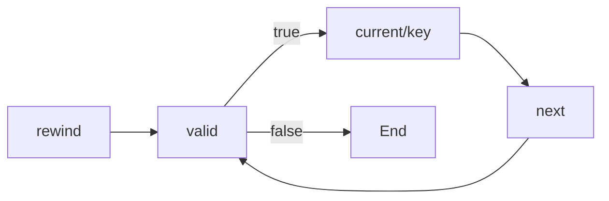

# PHP Iterators

## Introduction

In PHP programming, you'll often need to process collections of data - whether from databases, files, or other sources. While traditional loops and arrays work fine for small datasets, they can become problematic when dealing with large amounts of data because they load everything into memory at once.

This is where **PHP Iterators** come in. Iterators provide a powerful and memory-efficient way to traverse through data collections one item at a time, without needing to load the entire dataset into memory.

In this tutorial, we'll explore:
- What iterators are and why they're useful
- The Iterator interface in PHP
- Built-in iterator classes
- Creating custom iterators
- Real-world applications

## What Are PHP Iterators?

An iterator in PHP is an object that enables you to traverse through a collection of data, similar to how you would use a `foreach` loop with an array. However, iterators offer several advantages:

1. **Memory Efficiency**: Iterators can process large datasets without loading everything into memory
2. **Consistent Interface**: All iterators use the same methods for traversal
3. **Specialized Behavior**: Custom iterators can add filtering, transformation, or special traversal logic

In PHP, iterators are based on the `Iterator` interface, which is part of the Standard PHP Library (SPL).

## The Iterator Interface

At the heart of PHP's iterator system is the `Iterator` interface. This interface defines five essential methods that all iterator classes must implement:

```php
interface Iterator extends Traversable {
    public function current();    // Returns the current element
    public function key();        // Returns the key of the current element
    public function next();       // Moves forward to the next element
    public function rewind();     // Rewinds to the first element
    public function valid();      // Checks if current position is valid
}
```

Let's visualize how these methods work together:



When you use a `foreach` loop with an iterator, PHP automatically calls these methods in sequence:

1. `rewind()` - Called once at the beginning
2. `valid()` - Called to check if there are more elements
3. `current()` and `key()` - Called to get the current element and its key
4. `next()` - Called to move to the next element
5. Repeat steps 2-4 until `valid()` returns false

## Built-in Iterator Classes

PHP comes with several built-in iterator classes in the SPL. Let's explore some of the most commonly used ones:

### ArrayIterator

The `ArrayIterator` allows you to iterate over arrays and objects. It's one of the simplest iterators:

```php
<?php
// Creating an ArrayIterator
$fruits = ['apple', 'banana', 'cherry', 'date'];
$iterator = new ArrayIterator($fruits);

// Using the iterator
foreach ($iterator as $key => $fruit) {
    echo "$key: $fruit
";
}
?>
```

**Output:**
```
0: apple
1: banana
2: cherry
3: date
```

### DirectoryIterator

The `DirectoryIterator` lets you iterate through files and directories:

```php
<?php
// Creating a DirectoryIterator
$directory = new DirectoryIterator(__DIR__);

// Iterating through files in the current directory
foreach ($directory as $fileInfo) {
    if ($fileInfo->isFile()) {
        echo $fileInfo->getFilename() . " (Size: " . $fileInfo->getSize() . " bytes)
";
    }
}
?>
```

**Output:**
```
index.php (Size: 1250 bytes)
config.php (Size: 312 bytes)
style.css (Size: 4582 bytes)
```

### LimitIterator

The `LimitIterator` allows you to iterate over a limited subset of another iterator:

```php
<?php
// Creating an ArrayIterator with numbers 0-99
$numbers = new ArrayIterator(range(0, 99));

// Using LimitIterator to get numbers 10-19 (offset 10, count 10)
$limitedNumbers = new LimitIterator($numbers, 10, 10);

// Iterating through the limited set
foreach ($limitedNumbers as $key => $value) {
    echo "$key: $value
";
}
?>
```

**Output:**
```
10: 10
11: 11
12: 12
13: 13
14: 14
15: 15
16: 16
17: 17
18: 18
19: 19
```

## Creating Custom Iterators

One of the most powerful features of PHP iterators is the ability to create your own. Let's create a simple custom iterator that filters even numbers from an array:

```php
<?php
class EvenNumbersIterator implements Iterator {
    private $position = 0;
    private $array = [];

    public function __construct(array $array) {
        // Filter to keep only even numbers
        $this->array = array_filter($array, function($num) {
            return $num % 2 === 0;
        });
        // Re-index the array
        $this->array = array_values($this->array);
    }

    public function rewind() {
        $this->position = 0;
    }

    public function current() {
        return $this->array[$this->position];
    }

    public function key() {
        return $this->position;
    }

    public function next() {
        ++$this->position;
    }

    public function valid() {
        return isset($this->array[$this->position]);
    }
}

// Using our custom iterator
$numbers = range(1, 10);
$evenNumbers = new EvenNumbersIterator($numbers);

foreach ($evenNumbers as $key => $value) {
    echo "$key: $value
";
}
?>
```

**Output:**
```
0: 2
1: 4
2: 6
3: 8
4: 10
```

## Practical Real-World Examples

Let's explore some practical applications of iterators in real-world scenarios:

### Example 1: Reading Large CSV Files

When processing large CSV files, iterators can save memory by reading one line at a time:

```php
<?php
class CSVIterator implements Iterator {
    protected $file;
    protected $key = 0;
    protected $current;
    
    public function __construct($file) {
        $this->file = fopen($file, 'r');
    }
    
    public function __destruct() {
        fclose($this->file);
    }
    
    public function rewind() {
        rewind($this->file);
        $this->current = fgetcsv($this->file);
        $this->key = 0;
    }
    
    public function valid() {
        return $this->current !== false;
    }
    
    public function key() {
        return $this->key;
    }
    
    public function current() {
        return $this->current;
    }
    
    public function next() {
        $this->current = fgetcsv($this->file);
        $this->key++;
    }
}

// Usage:
$csv = new CSVIterator('large_data.csv');
foreach ($csv as $lineNum => $data) {
    echo "Line $lineNum: " . implode(', ', $data) . "
";
    
    // Process only the first 5 lines for demonstration
    if ($lineNum >= 4) break;
}
?>
```

**Output (example):**
```
Line 0: John, Doe, 35, Engineer
Line 1: Jane, Smith, 28, Designer
Line 2: Bob, Johnson, 42, Manager
Line 3: Alice, Williams, 31, Developer
Line 4: Charlie, Brown, 39, Analyst
```

### Example 2: Database Result Pagination

Iterators can help manage large database result sets by fetching rows as needed:

```php
<?php
class DatabaseIterator implements Iterator {
    private $position = 0;
    private $pdo;
    private $statement;
    private $current;
    private $pageSize;
    private $totalPages;
    private $currentPage = 0;
    
    public function __construct(PDO $pdo, $query, $pageSize = 10) {
        $this->pdo = $pdo;
        $this->pageSize = $pageSize;
        
        // Count total records
        $countQuery = "SELECT COUNT(*) FROM (" . $query . ") as count_query";
        $count = $this->pdo->query($countQuery)->fetchColumn();
        $this->totalPages = ceil($count / $pageSize);
        
        // Prepare the paginated query
        $this->statement = $this->pdo->prepare($query . " LIMIT :offset, :limit");
    }
    
    private function fetchPage() {
        $offset = $this->currentPage * $this->pageSize;
        $this->statement->bindValue(':offset', $offset, PDO::PARAM_INT);
        $this->statement->bindValue(':limit', $this->pageSize, PDO::PARAM_INT);
        $this->statement->execute();
        return $this->statement->fetchAll(PDO::FETCH_ASSOC);
    }
    
    public function rewind() {
        $this->position = 0;
        $this->currentPage = 0;
        $this->current = $this->fetchPage();
    }
    
    public function current() {
        $pagePosition = $this->position % $this->pageSize;
        return $this->current[$pagePosition];
    }
    
    public function key() {
        return $this->position;
    }
    
    public function next() {
        ++$this->position;
        $pagePosition = $this->position % $this->pageSize;
        
        // If we've reached the end of the current page, fetch the next page
        if ($pagePosition === 0) {
            ++$this->currentPage;
            if ($this->currentPage < $this->totalPages) {
                $this->current = $this->fetchPage();
            }
        }
    }
    
    public function valid() {
        $pagePosition = $this->position % $this->pageSize;
        return $this->currentPage < $this->totalPages && isset($this->current[$pagePosition]);
    }
}

// Example usage (pseudo-code, as we don't have a real database connection here):
/*
$pdo = new PDO('mysql:host=localhost;dbname=test', 'username', 'password');
$query = "SELECT * FROM users ORDER BY id";
$iterator = new DatabaseIterator($pdo, $query, 25);

foreach ($iterator as $key => $user) {
    echo "User #{$key}: {$user['name']} ({$user['email']})
";
}
*/
?>
```

### Example 3: Recursive Directory Traversal

The `RecursiveDirectoryIterator` and `RecursiveIteratorIterator` can be combined to traverse directories recursively:

```php
<?php
// Create a recursive directory iterator
$directory = new RecursiveDirectoryIterator(__DIR__, RecursiveDirectoryIterator::SKIP_DOTS);
$iterator = new RecursiveIteratorIterator($directory, RecursiveIteratorIterator::SELF_FIRST);

// Iterate through all files and directories recursively
foreach ($iterator as $info) {
    $indent = str_repeat('  ', $iterator->getDepth());
    $path = $info->getPathname();
    
    if ($info->isDir()) {
        echo "$indent📁 " . basename($path) . "/
";
    } else {
        echo "$indent📄 " . basename($path) . " (" . $info->getSize() . " bytes)
";
    }
}
?>
```

**Output:**
```
📁 project/
  📁 src/
    📄 index.php (1250 bytes)
    📄 config.php (312 bytes)
  📁 public/
    📄 style.css (4582 bytes)
    📄 script.js (2341 bytes)
  📁 vendor/
    📁 autoload/
      📄 autoload.php (521 bytes)
```

## Iterator Patterns and Best Practices

Here are some tips for working effectively with iterators:

1. **Choose the Right Iterator**: PHP has many built-in iterators for different purposes. Choose the one that best fits your needs.

2. **Memory Management**: Use iterators when dealing with large datasets to avoid memory issues.

3. **Chaining Iterators**: Multiple iterators can be combined (e.g., using `FilterIterator` with `DirectoryIterator`).

4. **Iterator Aggregates**: Implement `IteratorAggregate` instead of `Iterator` for a simpler approach when you can delegate iteration to another iterator.

```php
<?php
class MyCollection implements IteratorAggregate {
    private $items = [];
    
    public function add($item) {
        $this->items[] = $item;
    }
    
    public function getIterator() {
        return new ArrayIterator($this->items);
    }
}

$collection = new MyCollection();
$collection->add('Item 1');
$collection->add('Item 2');
$collection->add('Item 3');

foreach ($collection as $key => $value) {
    echo "$key: $value
";
}
?>
```

**Output:**
```
0: Item 1
1: Item 2
2: Item 3
```

## Summary

PHP Iterators provide a powerful mechanism for traversing data collections efficiently. They offer:

- Memory-efficient data processing
- A standardized interface for iteration
- Specialized iterator classes for different needs
- The ability to create custom iterators with specialized behavior

By leveraging iterators, you can write cleaner, more efficient code that can handle large datasets without overwhelming your server's memory.

Whether you're reading large files, processing database results, or traversing file systems, iterators offer the flexibility and performance needed for these tasks.

## Additional Resources and Exercises

### Resources
- [PHP Manual: Iterators](https://www.php.net/manual/en/spl.iterators.php)
- [PHP Standard Library (SPL)](https://www.php.net/manual/en/book.spl.php)

### Exercises

1. **Basic Iterator Practice**:
   Create a simple iterator that returns the squares of numbers from 1 to 10.

2. **FilterIterator Challenge**:
   Extend the `FilterIterator` class to create an iterator that only returns files with specific extensions (e.g., `.php`, `.txt`).

3. **Real-World Application**:
   Create an iterator that reads a large log file and filters entries based on a specific date range or error level.

4. **Iterator Chaining**:
   Combine multiple iterators to create a pipeline that:
   - Reads files from a directory
   - Filters only text files
   - Reads each file line by line
   - Filters lines containing a specific keyword

By mastering PHP Iterators, you'll have a powerful tool in your programming arsenal for handling data collections efficiently and elegantly!