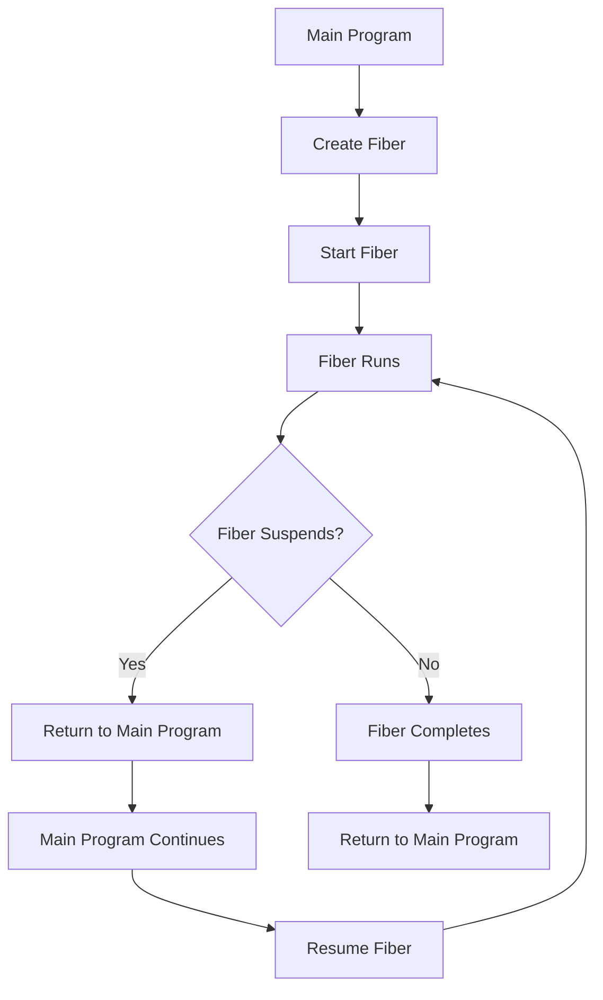

# PHP Fibers

## Introduction

PHP Fibers, introduced in PHP 8.1, represent a significant advancement in how PHP handles concurrency. Fibers provide a way to create lightweight, cooperative threads of execution that can be paused and resumed at specific points. This allows developers to write asynchronous code that looks and behaves like synchronous code, making concurrent programming in PHP much more intuitive and manageable.

Unlike traditional multi-threading, Fibers use a cooperative multitasking model where each Fiber voluntarily yields control back to the main program. This eliminates many common threading issues like race conditions and the need for locks, making concurrent programming safer and more accessible to PHP developers of all skill levels.

## Understanding Fibers

### What is a Fiber?

A Fiber is a lightweight context of execution that can be suspended (paused) and resumed at specific points. Unlike traditional functions that run from start to finish without interruption, a Fiber can pause its execution, return control to the caller, and later resume from exactly where it left off.

This capability is fundamental for building non-blocking, concurrent applications in PHP.

### How Fibers Work

Let's visualize the flow of execution with Fibers:



## Basic Usage of Fibers

### Creating and Starting a Fiber

Here's a simple example that demonstrates how to create and use a Fiber:

```php
<?php

// This function will run inside a Fiber
function countToThree(): void {
    echo "Fiber: Counting 1
";
    Fiber::suspend(); // Pause the Fiber
    
    echo "Fiber: Counting 2
";
    Fiber::suspend(); // Pause again
    
    echo "Fiber: Counting 3
";
}

// Create a new Fiber
$fiber = new Fiber('countToThree');

echo "Main: Before starting Fiber
";
$fiber->start(); // Start the Fiber

echo "Main: After first suspend
";
$fiber->resume(); // Resume the Fiber after first suspend

echo "Main: After second suspend
";
$fiber->resume(); // Resume the Fiber after second suspend

echo "Main: Fiber has completed
";
```

**Output:**
```
Main: Before starting Fiber
Fiber: Counting 1
Main: After first suspend
Fiber: Counting 2
Main: After second suspend
Fiber: Counting 3
Main: Fiber has completed
```

This example shows how the execution alternates between the main program and the Fiber. The Fiber runs until it suspends, then the main program continues. When the main program resumes the Fiber, it continues from exactly where it left off.

### Passing Data Between Fibers and Main Program

Fibers can also pass data back and forth between the main program and the Fiber:

```php
<?php

// Create a Fiber that processes values
$processor = new Fiber(function (): void {
    // Receive a value from the main program
    $value = Fiber::suspend('Ready for input');
    
    // Process the value and send back the result
    $result = $value * 2;
    $value = Fiber::suspend("Result: $result");
    
    // Process another value
    $result = $value * 3;
    echo "Final result: $result
";
});

// Start the Fiber
$response = $processor->start();
echo "Fiber says: $response
";

// Send value to the Fiber and get the result
$response = $processor->resume(21);
echo "Fiber says: $response
";

// Send another value to the Fiber
$processor->resume(7);
```

**Output:**
```
Fiber says: Ready for input
Fiber says: Result: 42
Final result: 21
```

In this example:
1. The Fiber immediately suspends and returns a message
2. The main program resumes the Fiber and sends the value 21
3. The Fiber processes this value (21 × 2 = 42) and suspends again
4. The main program receives this result and sends a new value (7)
5. The Fiber processes the new value (7 × 3 = 21) and completes

## Real-World Applications

### Asynchronous File Operations

One practical use of Fibers is to perform file operations without blocking the main application:

```php
<?php

function readFileAsync(string $filename): Fiber {
    return new Fiber(function() use ($filename) {
        echo "Starting to read $filename...
";
        
        // Simulate starting the file read operation
        Fiber::suspend("Reading in progress");
        
        // Simulate file contents
        $contents = "This is the content of $filename";
        
        // Return the result
        return $contents;
    });
}

// Start multiple file reads
$file1 = readFileAsync("document1.txt");
$file2 = readFileAsync("document2.txt");

// Start both operations
$status1 = $file1->start();
$status2 = $file2->start();

echo "File 1: $status1
";
echo "File 2: $status2
";
echo "Doing other work while files are being read...
";

// Complete the operations and get results
$content1 = $file1->resume();
$content2 = $file2->resume();

echo "File 1 content: $content1
";
echo "File 2 content: $content2
";
```

**Output:**
```
Starting to read document1.txt...
File 1: Reading in progress
Starting to read document2.txt...
File 2: Reading in progress
Doing other work while files are being read...
File 1 content: This is the content of document1.txt
File 2 content: This is the content of document2.txt
```

### Building an HTTP Client

Fibers are particularly useful for network operations. Here's a simplified example of how you might use Fibers to build a non-blocking HTTP client:

```php
<?php

class FiberHttpClient {
    public function request(string $url): Fiber {
        return new Fiber(function() use ($url) {
            echo "Starting request to $url
";
            
            // Simulate network I/O starting
            Fiber::suspend("Request initiated");
            
            // Simulate response
            $response = "HTTP/1.1 200 OK
Content-Type: text/html

<html><body>Response from $url</body></html>";
            
            return $response;
        });
    }
    
    public function multiRequest(array $urls): array {
        $fibers = [];
        $responses = [];
        
        // Start all requests
        foreach ($urls as $url) {
            $fiber = $this->request($url);
            $fiber->start();
            $fibers[$url] = $fiber;
        }
        
        echo "All requests initiated, application can do other work...
";
        
        // Complete all requests
        foreach ($fibers as $url => $fiber) {
            $responses[$url] = $fiber->resume();
        }
        
        return $responses;
    }
}

// Usage
$client = new FiberHttpClient();
$responses = $client->multiRequest([
    'https://example.com', 
    'https://example.org'
]);

foreach ($responses as $url => $response) {
    echo "Response from $url:
";
    echo substr($response, 0, 50) . "...

";
}
```

**Output:**
```
Starting request to https://example.com
Starting request to https://example.org
All requests initiated, application can do other work...
Response from https://example.com:
HTTP/1.1 200 OK
Content-Type: text/html

<html><bo...

Response from https://example.org:
HTTP/1.1 200 OK
Content-Type: text/html

<html><bo...
```

## Fibers vs. Traditional Approaches

### Comparison with Callbacks

Before Fibers, asynchronous programming often relied on callbacks, leading to what's sometimes called "callback hell":

```php
// Traditional callback approach
fetchData('endpoint1', function($result1) {
    processFirstResult($result1, function($processed1) {
        fetchData('endpoint2', function($result2) use ($processed1) {
            combinedResults($processed1, $result2, function($final) {
                echo "Final result: $final";
            });
        });
    });
});
```

With Fibers, the same code can be written in a more linear, synchronous-looking style:

```php
// Using Fibers
$fiber = new Fiber(function() {
    $result1 = fetchDataFiber('endpoint1');
    $processed1 = processFirstResultFiber($result1);
    $result2 = fetchDataFiber('endpoint2');
    $final = combinedResultsFiber($processed1, $result2);
    echo "Final result: $final";
});

$fiber->start();
```

### Integration with Event Loops

Fibers become even more powerful when combined with event loops like ReactPHP or Amp. Here's a conceptual example:

```php
<?php
// Conceptual example - actual implementation would vary based on the event loop library

$loop = new EventLoop();

function delay(int $ms): mixed {
    return Fiber::suspend(['type' => 'delay', 'ms' => $ms]);
}

$fiber = new Fiber(function() {
    echo "Starting long operation
";
    delay(1000); // Suspend for 1 second
    echo "Operation completed after 1 second
";
    
    delay(2000); // Suspend for 2 more seconds
    echo "Final stage completed after 2 more seconds
";
    
    return "All done!";
});

// Start the fiber
$fiber->start();

// Event loop would check for suspended fibers and resume them when ready
$loop->run();
```

## Best Practices and Considerations

### When to Use Fibers

Fibers are particularly useful for:
- I/O-bound operations (network requests, file operations)
- Creating cooperative concurrency patterns
- Implementing async/await patterns similar to other languages
- Simplifying complex asynchronous workflows

### When Not to Use Fibers

Fibers may not be the best choice for:
- CPU-intensive tasks (use separate processes instead)
- Simple synchronous operations
- When you need true parallelism (Fibers still run on a single thread)

### Error Handling

Proper error handling is crucial when working with Fibers:

```php
<?php

$fiber = new Fiber(function() {
    try {
        echo "Fiber running
";
        throw new Exception("Something went wrong!");
    } catch (Exception $e) {
        echo "Error in Fiber: " . $e->getMessage() . "
";
        return "Error handled gracefully";
    }
});

try {
    $result = $fiber->start();
    echo "Fiber result: $result
";
} catch (Throwable $e) {
    echo "Error caught in main program: " . $e->getMessage() . "
";
}
```

**Output:**
```
Fiber running
Error in Fiber: Something went wrong!
Fiber result: Error handled gracefully
```

## PHP Fiber API Reference

Here's a quick reference of the main methods available in the Fiber class:

| Method | Description |
|--------|-------------|
| `new Fiber(callable)` | Creates a new Fiber with the given callable function |
| `Fiber->start(...$args)` | Starts the Fiber and passes arguments to the callable |
| `Fiber->resume(...$args)` | Resumes a suspended Fiber and passes values to it |
| `Fiber::suspend($value)` | Suspends the current Fiber and optionally returns a value to the caller |
| `Fiber::getCurrent()` | Returns the current Fiber instance or null if not in a Fiber |
| `Fiber->isStarted()` | Returns whether the Fiber has been started |
| `Fiber->isRunning()` | Returns whether the Fiber is currently running |
| `Fiber->isSuspended()` | Returns whether the Fiber is currently suspended |
| `Fiber->isTerminated()` | Returns whether the Fiber has terminated |
| `Fiber->getReturn()` | Gets the return value of a terminated Fiber |

## Summary

PHP Fibers represent a significant advancement in PHP's concurrency capabilities. They provide a clean, intuitive way to write asynchronous code that looks synchronous, avoiding the complexity of callbacks and making concurrent programming more accessible.

Key benefits of Fibers include:
- Writing cleaner, more readable asynchronous code
- Implementing cooperative multitasking without the complexities of traditional threading
- Building responsive applications that efficiently handle I/O operations
- Creating custom concurrency patterns tailored to specific application needs

While Fibers don't provide true parallelism (they still operate within PHP's single-threaded model), they significantly improve how PHP applications can manage concurrent operations, especially for I/O-bound tasks.

## Exercises

1. **Basic Fiber**: Create a simple Fiber that counts from 1 to 5, suspending after each number.

2. **Data Communication**: Write a program that passes an array to a Fiber, which then processes each element and suspends after each one, returning the processed value.

3. **Error Handling**: Create a Fiber that might throw an exception and implement proper error handling both inside and outside the Fiber.

4. **Fiber Pool**: Implement a simple "Fiber Pool" class that manages multiple Fibers for concurrent operations with a maximum number of active Fibers.

5. **Real-world Application**: Build a simple web scraper that uses Fibers to concurrently fetch content from multiple URLs.

## Additional Resources

- [PHP Documentation for Fibers](https://www.php.net/manual/en/class.fiber.php)
- [PHP RFC: Fibers](https://wiki.php.net/rfc/fibers)
- [Concurrent PHP with Fibers](https://blog.kelunik.com/2021/03/04/building-fibers-in-php.html) by Niklas Keller
- [Reactivity by Symfony - Using Fibers](https://symfony.com/doc/current/reactivity.html)
- [Amphp - An event-driven concurrency framework for PHP](https://amphp.org/)

By incorporating Fibers into your PHP applications, you can create more responsive, efficient, and maintainable code for handling concurrent operations.