# PHP Async Programming

## Introduction

Asynchronous programming allows code to execute tasks in parallel rather than sequentially, which can significantly improve performance in I/O-bound applications like web services, API calls, and database operations. Traditionally, PHP has been synchronous and blocking by nature, but modern PHP offers several approaches to achieve asynchronous behavior.

In this guide, we'll explore how to implement asynchronous programming in PHP, when to use it, and the different tools and techniques available.

## Why Use Asynchronous Programming?

Before diving into implementation, let's understand why asynchronous programming matters:

1. **Improved Performance**: Execute multiple operations concurrently rather than waiting for each to complete before starting the next.
2. **Better Resource Utilization**: Keep the CPU busy while waiting for I/O operations.
3. **Enhanced User Experience**: Prevent long-running tasks from blocking the application.

Consider this diagram showing the difference between synchronous and asynchronous execution:

```mermaid
gantt
    title Synchronous vs Asynchronous Execution
    dateFormat  s
    axisFormat %S
    
    section Synchronous
    Task A           :a1, 0, 2s
    Task B           :a2, after a1, 2s
    Task C           :a3, after a2, 2s
    
    section Asynchronous
    Task A           :b1, 0, 2s
    Task B           :b2, 0, 2s
    Task C           :b3, 0, 2s
```



## Asynchronous Approaches in PHP

### 1. Using Promises and Callbacks

Promises represent a value that might be available now, in the future, or never. They're a cleaner alternative to callbacks for managing asynchronous operations.

#### Example: Basic Promise Implementation using Guzzle HTTP Client

```php
<?php
require 'vendor/autoload.php';

use GuzzleHttp\Client;
use GuzzleHttp\Promise;

// Create a client with a base URI
$client = new Client(['base_uri' => 'https://api.github.com/']);

// Initiate each request but don't block
$promises = [
    'user' => $client->getAsync('user'),
    'repos' => $client->getAsync('user/repos')
];

// Wait for the requests to complete, even if some of them fail
$results = Promise\Utils::settle($promises)->wait();

// Output the results
foreach ($results as $key => $result) {
    if ($result['state'] === 'fulfilled') {
        echo $key . " request succeeded!
";
        echo $result['value']->getBody() . "

";
    } else {
        echo $key . " request failed: " . $result['reason'] . "

";
    }
}
```

**Output:**
```
user request failed: Client error: 401 Unauthorized

repos request failed: Client error: 401 Unauthorized
```

Note: The actual output would contain JSON data if you provide valid GitHub credentials.

### 2. Using ReactPHP

ReactPHP is an event-driven, non-blocking I/O library that helps you build asynchronous applications.

#### Example: Simple Asynchronous HTTP Server

```php
<?php
require 'vendor/autoload.php';

use React\Http\HttpServer;
use React\Http\Message\Response;
use React\Socket\SocketServer;
use Psr\Http\Message\ServerRequestInterface;

$http = new HttpServer(function (ServerRequestInterface $request) {
    return new Response(
        200,
        ['Content-Type' => 'text/plain'],
        "Hello World!
"
    );
});

$socket = new SocketServer('127.0.0.1:8080');
$http->listen($socket);

echo "Server running at http://127.0.0.1:8080
";
```

To run this server:
```bash
php server.php
```

**Output:**
```
Server running at http://127.0.0.1:8080
```

If you visit http://127.0.0.1:8080 in your browser, you'll see "Hello World!".

### 3. Using Swoole

Swoole is a PHP extension written in C that enables asynchronous, parallel and high-performance networking capabilities.

#### Example: Swoole HTTP Server

```php
<?php
$http = new Swoole\HTTP\Server('127.0.0.1', 8080);

$http->on('request', function ($request, $response) {
    // Simulate an async task
    Swoole\Timer::after(1000, function() use ($response) {
        $response->header('Content-Type', 'text/plain');
        $response->end("Hello, Swoole!
");
    });
});

echo "Server running at http://127.0.0.1:8080
";
$http->start();
```

**Output:**
```
Server running at http://127.0.0.1:8080
```

When accessing the server, the response will be delayed by 1 second, but the server remains responsive to other requests during this time.

### 4. Using Fibers (PHP 8.1+)

Fibers, introduced in PHP 8.1, provide a way to create lightweight cooperative routines. They allow you to pause and resume execution, making them perfect for asynchronous operations.

#### Example: Basic Fiber Usage

```php
<?php
// Requires PHP 8.1+
$fiber = new Fiber(function(): void {
    $value = Fiber::suspend('fiber suspended');
    echo "Value received: $value
";
    echo "Fiber completed
";
});

$result = $fiber->start();
echo "Fiber suspended with value: $result
";

$fiber->resume('hello from main context');
?>
```

**Output:**
```
Fiber suspended with value: fiber suspended
Value received: hello from main context
Fiber completed
```

#### Example: Asynchronous API Calls with Fibers and cURL

```php
<?php
// Requires PHP 8.1+
function fetchUrl(string $url): Fiber {
    return new Fiber(function() use ($url) {
        $ch = curl_init($url);
        curl_setopt($ch, CURLOPT_RETURNTRANSFER, true);
        curl_setopt($ch, CURLOPT_FOLLOWLOCATION, true);
        
        $result = curl_exec($ch);
        $info = curl_getinfo($ch);
        curl_close($ch);
        
        Fiber::suspend([
            'url' => $url,
            'status' => $info['http_code'],
            'content' => $result
        ]);
    });
}

// List of URLs to fetch
$urls = [
    'https://www.php.net',
    'https://www.google.com',
    'https://www.github.com'
];

// Start all fibers
$fibers = [];
foreach ($urls as $url) {
    $fiber = fetchUrl($url);
    $fibers[$url] = $fiber;
    $fiber->start();
}

// Process the results
foreach ($fibers as $url => $fiber) {
    $result = $fiber->getReturn();
    echo "URL: {$result['url']}
";
    echo "Status: {$result['status']}
";
    echo "Content length: " . strlen($result['content']) . " bytes

";
}
?>
```

**Output:**
```
URL: https://www.php.net
Status: 200
Content length: 68249 bytes

URL: https://www.google.com
Status: 200
Content length: 19529 bytes

URL: https://www.github.com
Status: 200
Content length: 174578 bytes
```

Note: The actual content lengths will vary.

### 5. Using Parallel Extension

The Parallel extension provides a high-level abstraction for parallel processing in PHP.

#### Example: Parallel Execution

```php
<?php
// Requires the Parallel extension
$runtime = new \parallel\Runtime();

$future = $runtime->run(function(){
    // This will run in a separate thread
    sleep(2);
    return "Task completed in parallel!";
});

// Do other work here while the parallel task runs
echo "Main thread is continuing to work...
";
sleep(1);
echo "Still working in the main thread...
";

// Wait for and get the result from the parallel execution
$result = $future->value();
echo $result . "
";
?>
```

**Output:**
```
Main thread is continuing to work...
Still working in the main thread...
Task completed in parallel!
```

## Real-World Applications

### 1. Building a Concurrent Web Scraper

This example uses ReactPHP to scrape multiple websites concurrently:

```php
<?php
require 'vendor/autoload.php';

use React\EventLoop\Factory;
use React\Http\Browser;
use React\Promise;

$loop = Factory::create();
$browser = new Browser($loop);

// List of websites to scrape
$urls = [
    'https://www.php.net',
    'https://www.python.org',
    'https://www.javascript.com',
    'https://www.golang.org',
    'https://www.rust-lang.org'
];

$promises = [];
foreach ($urls as $url) {
    $promises[] = $browser
        ->get($url)
        ->then(
            function ($response) use ($url) {
                $body = (string) $response->getBody();
                preg_match('/<title>(.*?)<\/title>/i', $body, $matches);
                $title = $matches[1] ?? 'No title found';
                return [
                    'url' => $url,
                    'title' => $title,
                    'length' => strlen($body)
                ];
            },
            function ($error) use ($url) {
                return [
                    'url' => $url,
                    'error' => $error->getMessage()
                ];
            }
        );
}

Promise\all($promises)
    ->then(function ($results) {
        foreach ($results as $result) {
            if (isset($result['error'])) {
                echo "Error scraping {$result['url']}: {$result['error']}
";
            } else {
                echo "URL: {$result['url']}
";
                echo "Title: {$result['title']}
";
                echo "Page size: {$result['length']} bytes

";
            }
        }
    });

$loop->run();
```

### 2. Async Database Operations with Doctrine and ReactPHP

```php
<?php
require 'vendor/autoload.php';

use React\EventLoop\Factory;
use React\Promise\Deferred;
use Doctrine\DBAL\DriverManager;

$loop = Factory::create();

// Database connection parameters
$connectionParams = [
    'dbname' => 'mydb',
    'user' => 'user',
    'password' => 'password',
    'host' => 'localhost',
    'driver' => 'pdo_mysql',
];

// Connect to the database
$connection = DriverManager::getConnection($connectionParams);

// Function to fetch data asynchronously
function asyncQuery($connection, $sql, $params = []) {
    $deferred = new Deferred();
    
    global $loop;
    $loop->futureTick(function() use ($deferred, $connection, $sql, $params) {
        try {
            $stmt = $connection->prepare($sql);
            $stmt->execute($params);
            $result = $stmt->fetchAll();
            $deferred->resolve($result);
        } catch (\Exception $e) {
            $deferred->reject($e);
        }
    });
    
    return $deferred->promise();
}

// Perform multiple queries concurrently
$promises = [
    asyncQuery($connection, 'SELECT * FROM users LIMIT 10'),
    asyncQuery($connection, 'SELECT * FROM products LIMIT 10'),
    asyncQuery($connection, 'SELECT * FROM orders LIMIT 10')
];

\React\Promise\all($promises)->then(
    function($results) {
        list($users, $products, $orders) = $results;
        
        echo "Fetched " . count($users) . " users
";
        echo "Fetched " . count($products) . " products
";
        echo "Fetched " . count($orders) . " orders
";
        
        // Process the data further...
    },
    function($error) {
        echo "Error: " . $error->getMessage() . "
";
    }
);

$loop->run();
```

## Best Practices for Async PHP

1. **Choose the Right Tool**: Pick the approach that best fits your needs - ReactPHP, Swoole, Fibers, etc.
2. **Error Handling**: Always implement proper error handling for asynchronous operations.
3. **Avoid Blocking Operations**: Even in an async environment, a single blocking operation can halt everything.
4. **Resource Management**: Be cautious with resource usage, especially with many concurrent operations.
5. **Testing**: Test thoroughly to ensure your async code behaves as expected.

## When Not to Use Async Programming

Asynchronous programming isn't always the right solution:

1. **CPU-Intensive Tasks**: Async programming helps with I/O-bound operations, not CPU-bound ones.
2. **Simple Applications**: For simple CRUD applications with low traffic, the added complexity might not be worth it.
3. **No Performance Issues**: If your application is already fast enough, don't add unnecessary complexity.

## Summary

Asynchronous programming in PHP enables concurrent execution of operations, greatly improving performance for I/O-bound applications. We've explored various approaches including:

- Promises and callbacks
- ReactPHP
- Swoole
- Fibers (PHP 8.1+)
- Parallel extension

Each approach has its strengths and ideal use cases. Modern PHP offers robust options for implementing asynchronous programming, allowing developers to build high-performance, scalable applications.

## Exercises

1. **Basic**: Implement a simple script that fetches data from multiple APIs concurrently using Guzzle promises.
2. **Intermediate**: Build a command-line tool that downloads multiple files in parallel using ReactPHP.
3. **Advanced**: Create a web application that processes uploaded files asynchronously using Swoole or Fibers.

## Additional Resources

- [ReactPHP Documentation](https://reactphp.org/): Comprehensive guide to ReactPHP
- [Swoole Documentation](https://www.swoole.co.uk/): Learn more about Swoole extension
- [PHP Fibers RFC](https://wiki.php.net/rfc/fibers): Detailed information about PHP Fibers
- [Amphp](https://amphp.org/): Another excellent library for asynchronous PHP programming
- [Official PHP Documentation](https://www.php.net/manual/en/book.curl.php): Learn about core PHP functions used in async programming