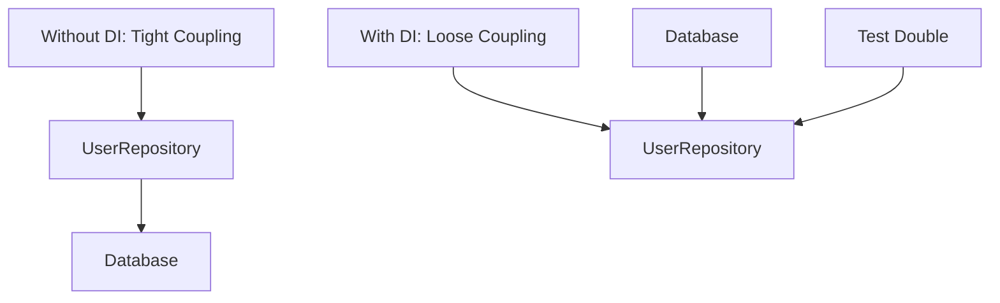

# PHP Dependency Injection

## Introduction

Dependency Injection (DI) is a design pattern that allows us to write more maintainable, testable, and flexible code by reducing tight coupling between components. It's a fundamental concept in modern PHP applications and frameworks like Laravel, Symfony, and Slim.

In simple terms, dependency injection means providing a component with its dependencies rather than letting the component create them itself. This might sound complex, but it's actually a straightforward concept that will dramatically improve your code quality once you understand it.

## Understanding the Problem

Before we dive into dependency injection, let's understand the problem it solves. Consider this code:

```php
class UserRepository {
    private $database;
    
    public function __construct() {
        $this->database = new Database('localhost', 'mydb', 'user', 'password');
    }
    
    public function findById($id) {
        return $this->database->query("SELECT * FROM users WHERE id = ?", [$id]);
    }
}

// Usage
$userRepository = new UserRepository();
$user = $userRepository->findById(1);
```

This code has several problems:

1. **Tight coupling**: The `UserRepository` class is tightly coupled to the `Database` class
2. **Hard to test**: We cannot easily replace the database with a mock during testing
3. **Difficult to reuse**: If we want to use a different database, we need to modify the class

## Implementing Dependency Injection

Let's refactor the code to use dependency injection:

```php
class UserRepository {
    private $database;
    
    public function __construct(Database $database) {
        $this->database = $database;
    }
    
    public function findById($id) {
        return $this->database->query("SELECT * FROM users WHERE id = ?", [$id]);
    }
}

// Usage
$database = new Database('localhost', 'mydb', 'user', 'password');
$userRepository = new UserRepository($database);
$user = $userRepository->findById(1);
```

**What changed?**

1. The `UserRepository` no longer creates its own database connection
2. The database dependency is "injected" through the constructor
3. The class is now more flexible and testable

## Types of Dependency Injection

There are three main types of dependency injection:

### 1. Constructor Injection

We've already seen constructor injection in our example above. Dependencies are provided through the constructor:

```php
class UserService {
    private $userRepository;
    private $logger;
    
    public function __construct(UserRepository $userRepository, Logger $logger) {
        $this->userRepository = $userRepository;
        $this->logger = $logger;
    }
    
    public function getUser($id) {
        $this->logger->info("Fetching user with ID: $id");
        return $this->userRepository->findById($id);
    }
}
```

**Advantages:**
- Dependencies are clearly defined
- Objects are fully initialized after construction
- Perfect for required dependencies

### 2. Setter Injection

Dependencies are provided through setter methods:

```php
class UserService {
    private $userRepository;
    private $logger;
    
    public function setUserRepository(UserRepository $userRepository) {
        $this->userRepository = $userRepository;
    }
    
    public function setLogger(Logger $logger) {
        $this->logger = $logger;
    }
    
    public function getUser($id) {
        if ($this->logger) {
            $this->logger->info("Fetching user with ID: $id");
        }
        return $this->userRepository->findById($id);
    }
}

// Usage
$userService = new UserService();
$userService->setUserRepository(new UserRepository($database));
$userService->setLogger(new Logger());
```

**Advantages:**
- More flexible than constructor injection
- Good for optional dependencies
- Dependencies can be changed at runtime

### 3. Interface Injection

The class implements an interface that enforces the injection method:

```php
interface LoggerAwareInterface {
    public function setLogger(Logger $logger);
}

class UserService implements LoggerAwareInterface {
    private $userRepository;
    private $logger;
    
    public function __construct(UserRepository $userRepository) {
        $this->userRepository = $userRepository;
    }
    
    public function setLogger(Logger $logger) {
        $this->logger = $logger;
    }
    
    public function getUser($id) {
        if ($this->logger) {
            $this->logger->info("Fetching user with ID: $id");
        }
        return $this->userRepository->findById($id);
    }
}
```

**Advantages:**
- Enforces a contract for dependency injection
- Makes the dependency requirements explicit

## Dependency Injection Containers

As applications grow, manually injecting dependencies becomes cumbersome. This is where Dependency Injection Containers (DIC) come in. A DIC is responsible for:

1. Creating objects
2. Managing their dependencies
3. Providing them when requested

Let's see a simple example of a DI container:

```php
class Container {
    private $services = [];
    
    public function register($name, $callback) {
        $this->services[$name] = $callback;
    }
    
    public function get($name) {
        if (!isset($this->services[$name])) {
            throw new Exception("Service '$name' not found");
        }
        
        // Get the service factory
        $factory = $this->services[$name];
        
        // Return the created service
        return $factory($this);
    }
}

// Usage
$container = new Container();

// Register services
$container->register('database', function($container) {
    return new Database('localhost', 'mydb', 'user', 'password');
});

$container->register('user_repository', function($container) {
    return new UserRepository($container->get('database'));
});

$container->register('logger', function($container) {
    return new Logger();
});

$container->register('user_service', function($container) {
    $service = new UserService($container->get('user_repository'));
    $service->setLogger($container->get('logger'));
    return $service;
});

// Get a service
$userService = $container->get('user_service');
$user = $userService->getUser(1);
```

This is a very simple example. In real applications, you would typically use established DI containers like PHP-DI, Symfony's DependencyInjection component, or Laravel's container.

## Real-World Example: A Simple Blog Application

Let's build a simple blog application that demonstrates dependency injection in a real-world context.

First, let's define our interfaces and classes:

```php
// Database interface
interface DatabaseInterface {
    public function query($sql, $params = []);
}

// MySQL implementation
class MySQLDatabase implements DatabaseInterface {
    public function __construct($host, $dbname, $user, $password) {
        // Connect to MySQL database
    }
    
    public function query($sql, $params = []) {
        // Execute query and return results
        echo "Executing MySQL query: $sql
";
        return ['Sample post data'];
    }
}

// SQLite implementation
class SQLiteDatabase implements DatabaseInterface {
    public function __construct($file) {
        // Connect to SQLite database
    }
    
    public function query($sql, $params = []) {
        // Execute query and return results
        echo "Executing SQLite query: $sql
";
        return ['Sample post data'];
    }
}

// Post repository
class PostRepository {
    private $database;
    
    public function __construct(DatabaseInterface $database) {
        $this->database = $database;
    }
    
    public function findAll() {
        return $this->database->query("SELECT * FROM posts");
    }
}

// Blog service
class BlogService {
    private $postRepository;
    
    public function __construct(PostRepository $postRepository) {
        $this->postRepository = $postRepository;
    }
    
    public function getAllPosts() {
        return $this->postRepository->findAll();
    }
}

// Setup with MySQL
$mysqlDatabase = new MySQLDatabase('localhost', 'blog', 'user', 'password');
$postRepository = new PostRepository($mysqlDatabase);
$blogService = new BlogService($postRepository);

echo "Using MySQL:
";
$posts = $blogService->getAllPosts();
print_r($posts);

// Switch to SQLite without changing any business logic
$sqliteDatabase = new SQLiteDatabase('blog.sqlite');
$postRepository = new PostRepository($sqliteDatabase);
$blogService = new BlogService($postRepository);

echo "
Using SQLite:
";
$posts = $blogService->getAllPosts();
print_r($posts);
```

**Output:**
```
Using MySQL:
Executing MySQL query: SELECT * FROM posts
Array
(
    [0] => Sample post data
)

Using SQLite:
Executing SQLite query: SELECT * FROM posts
Array
(
    [0] => Sample post data
)
```

This example demonstrates how dependency injection allows us to:
1. Switch implementations (MySQL to SQLite) without changing business logic
2. Write code against interfaces rather than concrete implementations
3. Create reusable components that are not tightly coupled

## Benefits of Dependency Injection

Here's a visual representation of how dependency injection transforms your application architecture:



The key benefits of dependency injection include:

1. **Testability**: You can easily substitute dependencies with mocks or stubs during testing.
2. **Maintainability**: Components are loosely coupled, making the codebase easier to understand and modify.
3. **Flexibility**: You can swap implementations without changing the dependent code.
4. **Reusability**: Components are more reusable across different parts of your application.
5. **Separation of concerns**: Each class can focus on its core responsibilities.

## Dependency Injection in Popular PHP Frameworks

Most modern PHP frameworks use dependency injection extensively:

### Laravel

Laravel has a powerful DI container built in:

```php
// Register a binding
app()->bind('DatabaseInterface', function ($app) {
    return new MySQLDatabase('localhost', 'mydb', 'user', 'password');
});

// Type-hinting in controllers automatically resolves dependencies
class PostController extends Controller
{
    public function index(PostRepository $repository)
    {
        $posts = $repository->findAll();
        return view('posts.index', ['posts' => $posts]);
    }
}
```

### Symfony

Symfony uses a comprehensive DI container with configuration via YAML, XML, or PHP:

```php
// services.yaml
services:
    database:
        class: MySQLDatabase
        arguments: ['localhost', 'mydb', 'user', 'password']
    
    post_repository:
        class: PostRepository
        arguments: ['@database']
```

## Common Pitfalls and Best Practices

### Pitfalls to Avoid

1. **Service Locator Anti-pattern**: Avoid using the container as a service locator (requesting services directly within your classes)
2. **Over-injection**: Injecting too many dependencies can make your class bloated
3. **Circular Dependencies**: When Class A depends on Class B, which depends on Class A

### Best Practices

1. **Depend on abstractions**: Type-hint interfaces rather than concrete implementations
2. **Use constructor injection for required dependencies**
3. **Use setter injection for optional dependencies**
4. **Keep your classes focused with a single responsibility**
5. **Consider using autowiring when available in your framework**

## Exercises

1. Refactor the following code to use dependency injection:

```php
class UserController {
    public function show($id) {
        $db = new Database('localhost', 'mydb', 'user', 'pass');
        $user = $db->query("SELECT * FROM users WHERE id = ?", [$id]);
        return json_encode($user);
    }
}
```

2. Create a simple dependency injection container from scratch that can register and resolve services.

3. Implement a blog application with dependency injection that can switch between different data sources (MySQL, SQLite, or even a file-based storage).

## Summary

Dependency injection is a powerful design pattern that enables you to write more maintainable, testable, and flexible PHP applications. By injecting dependencies instead of creating them internally, you decouple your components and make your code more modular.

Key takeaways:
- DI reduces tight coupling between components
- There are three main types: constructor, setter, and interface injection
- DI containers help manage dependencies in larger applications
- Modern PHP frameworks use DI extensively
- DI makes your code more testable and maintainable

## Additional Resources

1. [PHP-DI Documentation](https://php-di.org/doc/)
2. [Symfony Dependency Injection Component](https://symfony.com/doc/current/components/dependency_injection.html)
3. [Laravel Service Container](https://laravel.com/docs/container)
4. Book: "Dependency Injection in PHP" by Fabien Potencier
5. [PSR-11: Container Interface](https://www.php-fig.org/psr/psr-11/)

Happy coding with dependency injection!