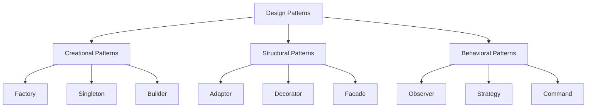

# PHP Design Patterns

## Introduction

Design patterns are reusable solutions to common problems that arise during software development. They represent best practices that have evolved over time as developers have encountered and solved similar problems. For PHP developers, understanding design patterns is a crucial step toward writing more maintainable, efficient, and scalable applications.

In this tutorial, we'll explore several key design patterns and how they can be implemented in PHP. Whether you're building a small website or a complex web application, these patterns will help you organize your code better and solve problems more effectively.

## Why Use Design Patterns?

Before diving into specific patterns, let's understand why design patterns are valuable:

- **Code Reusability**: Design patterns provide proven solutions that can be adapted and reused.
- **Maintainability**: They make your code easier to understand and modify.
- **Scalability**: Well-designed code using patterns is easier to expand and scale.
- **Communication**: They provide a common vocabulary for developers to discuss code architecture.

## Types of Design Patterns

Design patterns are typically categorized into three main groups:



## Creational Patterns

Creational patterns deal with object creation mechanisms, trying to create objects in a manner suitable to the situation.

### 1. Singleton Pattern

The Singleton pattern ensures a class has only one instance and provides a global point of access to it.

```php
class Database {
    private static $instance = null;
    private $connection;
    
    // Private constructor to prevent direct instantiation
    private function __construct() {
        $this->connection = new PDO('mysql:host=localhost;dbname=myapp', 'username', 'password');
    }
    
    // The main method to get the singleton instance
    public static function getInstance() {
        if (self::$instance === null) {
            self::$instance = new self();
        }
        return self::$instance;
    }
    
    public function query($sql) {
        return $this->connection->query($sql);
    }
    
    // Prevent cloning of the instance
    private function __clone() {}
    
    // Prevent unserialization of the instance
    private function __wakeup() {}
}

// Usage example
$db1 = Database::getInstance();
$db2 = Database::getInstance();

// Both variables contain the same instance
var_dump($db1 === $db2); // Outputs: bool(true)

// Using the database connection
$users = $db1->query("SELECT * FROM users");
```

**When to use it:**
- When you need exactly one instance of a class (like a database connection)
- When you want to control access to a shared resource

**Real-world application:** Database connections, configuration managers, and logging systems often use the Singleton pattern.

### 2. Factory Method Pattern

The Factory Method pattern defines an interface for creating an object but lets subclasses decide which class to instantiate.

```php
// Product interface
interface Logger {
    public function log($message);
}

// Concrete products
class FileLogger implements Logger {
    public function log($message) {
        echo "Logging to file: $message
";
        // Actual file logging code would go here
    }
}

class DatabaseLogger implements Logger {
    public function log($message) {
        echo "Logging to database: $message
";
        // Actual database logging code would go here
    }
}

// Creator class with factory method
class LoggerFactory {
    public function createLogger($type) {
        switch ($type) {
            case 'file':
                return new FileLogger();
            case 'database':
                return new DatabaseLogger();
            default:
                throw new Exception("Invalid logger type");
        }
    }
}

// Usage example
$factory = new LoggerFactory();

// Create a file logger
$fileLogger = $factory->createLogger('file');
$fileLogger->log('User logged in'); // Outputs: Logging to file: User logged in

// Create a database logger
$dbLogger = $factory->createLogger('database');
$dbLogger->log('Payment processed'); // Outputs: Logging to database: Payment processed
```

**When to use it:**
- When a class can't anticipate the type of objects it must create
- When you want to delegate responsibility to subclasses
- When you want to encapsulate object creation logic

**Real-world application:** Creating different types of form elements, API connectors, or various types of document exporters.

## Structural Patterns

Structural patterns are concerned with how classes and objects are composed to form larger structures.

### 3. Adapter Pattern

The Adapter pattern allows incompatible interfaces to work together by wrapping one object with another.

```php
// Target interface that the client expects
interface EmailService {
    public function sendEmail($to, $subject, $body);
}

// Existing (incompatible) service
class SMSService {
    public function sendSMS($number, $message) {
        echo "SMS sent to $number with message: $message
";
    }
}

// Adapter makes SMSService compatible with EmailService
class SMSServiceAdapter implements EmailService {
    private $smsService;
    
    public function __construct(SMSService $smsService) {
        $this->smsService = $smsService;
    }
    
    public function sendEmail($to, $subject, $body) {
        $message = "$subject: $body";
        $this->smsService->sendSMS($to, $message);
    }
}

// Client code that expects an EmailService
function notifyUser(EmailService $service, $contact, $subject, $message) {
    $service->sendEmail($contact, $subject, $message);
}

// Usage examples
$emailService = new SMSServiceAdapter(new SMSService());

// Client can use the SMS service through the adapter
notifyUser($emailService, '1234567890', 'Account Update', 'Your password has been changed');
// Outputs: SMS sent to 1234567890 with message: Account Update: Your password has been changed
```

**When to use it:**
- When you need to use an existing class with an incompatible interface
- When you want to reuse existing code that doesn't match the interface you need
- When you need to integrate with third-party libraries

**Real-world application:** Payment gateways, social media integrations, and legacy system integrations.

### 4. Decorator Pattern

The Decorator pattern attaches additional responsibilities to an object dynamically, providing a flexible alternative to subclassing.

```php
// Component interface
interface Notification {
    public function send($message);
}

// Concrete component
class EmailNotification implements Notification {
    private $email;
    
    public function __construct($email) {
        $this->email = $email;
    }
    
    public function send($message) {
        echo "Sending email to {$this->email}: $message
";
        return "Email sent";
    }
}

// Base decorator
abstract class NotificationDecorator implements Notification {
    protected $notification;
    
    public function __construct(Notification $notification) {
        $this->notification = $notification;
    }
}

// Concrete decorators
class SMSDecorator extends NotificationDecorator {
    private $phoneNumber;
    
    public function __construct(Notification $notification, $phoneNumber) {
        parent::__construct($notification);
        $this->phoneNumber = $phoneNumber;
    }
    
    public function send($message) {
        $result = $this->notification->send($message);
        echo "Sending SMS to {$this->phoneNumber}: $message
";
        return $result . " and SMS sent";
    }
}

class SlackDecorator extends NotificationDecorator {
    private $slackChannel;
    
    public function __construct(Notification $notification, $slackChannel) {
        parent::__construct($notification);
        $this->slackChannel = $slackChannel;
    }
    
    public function send($message) {
        $result = $this->notification->send($message);
        echo "Posting to Slack channel {$this->slackChannel}: $message
";
        return $result . " and Slack notification sent";
    }
}

// Usage example
$notification = new EmailNotification("user@example.com");
$result = $notification->send("Your order has been processed");
echo "Result: $result
";
// Outputs:
// Sending email to user@example.com: Your order has been processed
// Result: Email sent

// Decorate with SMS
$notification = new SMSDecorator($notification, "123-456-7890");
$result = $notification->send("Your order has been processed");
echo "Result: $result
";
// Outputs:
// Sending email to user@example.com: Your order has been processed
// Sending SMS to 123-456-7890: Your order has been processed
// Result: Email sent and SMS sent

// Decorate with Slack
$notification = new SlackDecorator($notification, "#orders");
$result = $notification->send("Your order has been processed");
echo "Result: $result
";
// Outputs:
// Sending email to user@example.com: Your order has been processed
// Sending SMS to 123-456-7890: Your order has been processed
// Posting to Slack channel #orders: Your order has been processed
// Result: Email sent and SMS sent and Slack notification sent
```

**When to use it:**
- When you need to add responsibilities to objects dynamically
- When you want to keep classes focused on one responsibility
- When extending functionality through subclassing is impractical

**Real-world application:** Building notification systems with multiple channels, adding features to UI components, or creating middleware pipelines.

## Behavioral Patterns

Behavioral patterns are concerned with algorithms and the assignment of responsibilities between objects.

### 5. Observer Pattern

The Observer pattern defines a one-to-many dependency between objects so that when one object changes state, all its dependents are notified automatically.

```php
// Subject interface
interface Subject {
    public function attach(Observer $observer);
    public function detach(Observer $observer);
    public function notify();
}

// Observer interface
interface Observer {
    public function update(Subject $subject);
}

// Concrete subject
class Newsletter implements Subject {
    private $observers = [];
    private $latestArticle = "";
    
    public function attach(Observer $observer) {
        $this->observers[] = $observer;
    }
    
    public function detach(Observer $observer) {
        $index = array_search($observer, $this->observers, true);
        if ($index !== false) {
            unset($this->observers[$index]);
        }
    }
    
    public function notify() {
        foreach ($this->observers as $observer) {
            $observer->update($this);
        }
    }
    
    public function publishArticle($article) {
        $this->latestArticle = $article;
        $this->notify();
    }
    
    public function getLatestArticle() {
        return $this->latestArticle;
    }
}

// Concrete observers
class EmailSubscriber implements Observer {
    private $email;
    
    public function __construct($email) {
        $this->email = $email;
    }
    
    public function update(Subject $subject) {
        if ($subject instanceof Newsletter) {
            $article = $subject->getLatestArticle();
            echo "Sending email to {$this->email} about new article: $article
";
        }
    }
}

class AppNotifier implements Observer {
    private $userId;
    
    public function __construct($userId) {
        $this->userId = $userId;
    }
    
    public function update(Subject $subject) {
        if ($subject instanceof Newsletter) {
            $article = $subject->getLatestArticle();
            echo "Sending push notification to user {$this->userId} about new article: $article
";
        }
    }
}

// Usage example
$newsletter = new Newsletter();

// Add subscribers
$emailSubscriber1 = new EmailSubscriber("user1@example.com");
$emailSubscriber2 = new EmailSubscriber("user2@example.com");
$appNotifier = new AppNotifier("12345");

$newsletter->attach($emailSubscriber1);
$newsletter->attach($emailSubscriber2);
$newsletter->attach($appNotifier);

// Publish new article - all subscribers get notified
$newsletter->publishArticle("10 Tips for Better PHP Code");
// Outputs:
// Sending email to user1@example.com about new article: 10 Tips for Better PHP Code
// Sending email to user2@example.com about new article: 10 Tips for Better PHP Code
// Sending push notification to user 12345 about new article: 10 Tips for Better PHP Code

// Remove one subscriber
$newsletter->detach($emailSubscriber1);

// Publish another article - only remaining subscribers get notified
$newsletter->publishArticle("Understanding Design Patterns in PHP");
// Outputs:
// Sending email to user2@example.com about new article: Understanding Design Patterns in PHP
// Sending push notification to user 12345 about new article: Understanding Design Patterns in PHP
```

**When to use it:**
- When changes to one object require changing others, and you don't know how many objects need to change
- When an object should be able to notify other objects without making assumptions about who these objects are
- When you need a one-to-many dependency between objects

**Real-world application:** Event handling systems, notification services, and publish-subscribe systems.

### 6. Strategy Pattern

The Strategy pattern defines a family of algorithms, encapsulates each one, and makes them interchangeable.

```php
// Strategy interface
interface PaymentStrategy {
    public function pay($amount);
}

// Concrete strategies
class CreditCardPayment implements PaymentStrategy {
    private $name;
    private $cardNumber;
    private $cvv;
    private $expiryDate;
    
    public function __construct($name, $cardNumber, $cvv, $expiryDate) {
        $this->name = $name;
        $this->cardNumber = $cardNumber;
        $this->cvv = $cvv;
        $this->expiryDate = $expiryDate;
    }
    
    public function pay($amount) {
        echo "Paying $amount using Credit Card (Card Number: " . 
             substr($this->cardNumber, -4) . ")
";
        return true;
    }
}

class PayPalPayment implements PaymentStrategy {
    private $email;
    private $password;
    
    public function __construct($email, $password) {
        $this->email = $email;
        $this->password = $password;
    }
    
    public function pay($amount) {
        echo "Paying $amount using PayPal (Email: {$this->email})
";
        return true;
    }
}

class BankTransferPayment implements PaymentStrategy {
    private $accountNumber;
    private $bankCode;
    
    public function __construct($accountNumber, $bankCode) {
        $this->accountNumber = $accountNumber;
        $this->bankCode = $bankCode;
    }
    
    public function pay($amount) {
        echo "Paying $amount using Bank Transfer (Account: {$this->accountNumber})
";
        return true;
    }
}

// Context
class ShoppingCart {
    private $items = [];
    
    public function addItem($item) {
        $this->items[] = $item;
    }
    
    public function calculateTotal() {
        $total = 0;
        foreach ($this->items as $item) {
            $total += $item['price'] * $item['quantity'];
        }
        return $total;
    }
    
    public function checkout(PaymentStrategy $paymentMethod) {
        $amount = $this->calculateTotal();
        return $paymentMethod->pay($amount);
    }
}

// Usage example
$cart = new ShoppingCart();

// Add some items to the cart
$cart->addItem(['name' => 'PHP Book', 'price' => 49.99, 'quantity' => 1]);
$cart->addItem(['name' => 'Web Hosting', 'price' => 15.00, 'quantity' => 12]);

// Pay with Credit Card
$creditCardPayment = new CreditCardPayment("John Doe", "1234567890123456", "123", "12/2025");
$cart->checkout($creditCardPayment);
// Outputs: Paying 229.99 using Credit Card (Card Number: 3456)

// Pay with PayPal
$payPalPayment = new PayPalPayment("john.doe@example.com", "password");
$cart->checkout($payPalPayment);
// Outputs: Paying 229.99 using PayPal (Email: john.doe@example.com)

// Pay with Bank Transfer
$bankTransferPayment = new BankTransferPayment("9876543210", "ABCDEF");
$cart->checkout($bankTransferPayment);
// Outputs: Paying 229.99 using Bank Transfer (Account: 9876543210)
```

**When to use it:**
- When you want to define a family of algorithms and make them interchangeable
- When you need to select an algorithm at runtime
- When you have multiple versions of an algorithm

**Real-world application:** Payment processing systems, sorting algorithms, and file compression strategies.

## Implementing Design Patterns in Real Projects

To effectively use design patterns in your PHP projects:

1. **Start Small**: Begin by identifying one or two patterns that solve current problems in your codebase.
2. **Don't Overengineer**: Use patterns only when they provide clear benefits.
3. **Combine Patterns**: Often, multiple patterns work together in a codebase.
4. **Document Usage**: Comment your code to explain which patterns you're using and why.

Here's an example of combining patterns in a real application:

```php
// A simple product management system combining Factory and Observer patterns

// Product interface (part of Factory pattern)
interface Product {
    public function getInfo();
    public function getPrice();
}

// Concrete products
class PhysicalProduct implements Product {
    private $name;
    private $price;
    private $weight;
    
    public function __construct($name, $price, $weight) {
        $this->name = $name;
        $this->price = $price;
        $this->weight = $weight;
    }
    
    public function getInfo() {
        return "Physical Product: {$this->name} (Weight: {$this->weight}kg)";
    }
    
    public function getPrice() {
        return $this->price;
    }
}

class DigitalProduct implements Product {
    private $name;
    private $price;
    private $fileSize;
    
    public function __construct($name, $price, $fileSize) {
        $this->name = $name;
        $this->price = $price;
        $this->fileSize = $fileSize;
    }
    
    public function getInfo() {
        return "Digital Product: {$this->name} (Size: {$this->fileSize}MB)";
    }
    
    public function getPrice() {
        return $this->price;
    }
}

// Product factory
class ProductFactory {
    public function createProduct($type, $data) {
        switch ($type) {
            case 'physical':
                return new PhysicalProduct($data['name'], $data['price'], $data['weight']);
            case 'digital':
                return new DigitalProduct($data['name'], $data['price'], $data['fileSize']);
            default:
                throw new Exception("Invalid product type");
        }
    }
}

// Observer pattern components
interface Observer {
    public function update($product);
}

class Inventory implements Observer {
    public function update($product) {
        echo "Inventory updated for: " . $product->getInfo() . "
";
    }
}

class Analytics implements Observer {
    public function update($product) {
        echo "Product metrics logged for: " . $product->getInfo() . "
";
    }
}

class ProductManager {
    private $observers = [];
    
    public function addObserver(Observer $observer) {
        $this->observers[] = $observer;
    }
    
    public function createProduct($factory, $type, $data) {
        $product = $factory->createProduct($type, $data);
        
        // Notify all observers about the new product
        foreach ($this->observers as $observer) {
            $observer->update($product);
        }
        
        return $product;
    }
}

// Usage example
$factory = new ProductFactory();
$productManager = new ProductManager();

// Add observers
$productManager->addObserver(new Inventory());
$productManager->addObserver(new Analytics());

// Create products
$laptop = $productManager->createProduct($factory, 'physical', [
    'name' => 'Laptop',
    'price' => 999.99,
    'weight' => 2.5
]);

$ebook = $productManager->createProduct($factory, 'digital', [
    'name' => 'PHP Design Patterns Guide',
    'price' => 19.99,
    'fileSize' => 15.4
]);

// Use the products
echo "Product 1: " . $laptop->getInfo() . " - $" . $laptop->getPrice() . "
";
echo "Product 2: " . $ebook->getInfo() . " - $" . $ebook->getPrice() . "
";

// Output:
// Inventory updated for: Physical Product: Laptop (Weight: 2.5kg)
// Product metrics logged for: Physical Product: Laptop (Weight: 2.5kg)
// Inventory updated for: Digital Product: PHP Design Patterns Guide (Size: 15.4MB)
// Product metrics logged for: Digital Product: PHP Design Patterns Guide (Size: 15.4MB)
// Product 1: Physical Product: Laptop (Weight: 2.5kg) - $999.99
// Product 2: Digital Product: PHP Design Patterns Guide (Size: 15.4MB) - $19.99
```

## Common PHP Frameworks and Design Patterns

Modern PHP frameworks like Laravel, Symfony, and CodeIgniter heavily utilize design patterns:

- **Laravel** uses the Repository pattern, Facade pattern, and Service Container (a dependency injection container).
- **Symfony** implements the Factory pattern, Observer pattern, and Dependency Injection pattern.
- **CodeIgniter** uses the MVC (Model-View-Controller) pattern and the Factory pattern.

Understanding these patterns will help you work more effectively with these frameworks.

## Summary

Design patterns are powerful tools in your PHP development arsenal. They provide tested solutions to common problems and help you write more maintainable, scalable code. We've covered several key patterns:

1. **Creational Patterns**: Singleton and Factory Method
2. **Structural Patterns**: Adapter and Decorator
3. **Behavioral Patterns**: Observer and Strategy

Remember that patterns should be used judiciously - they're tools, not rules. Always consider if a pattern truly solves your specific problem before implementing it.

## Exercises

1. Implement a Builder pattern to create a complex user profile object with many optional properties.
2. Create a Chain of Responsibility pattern to handle different types of user authentication (username/password, OAuth, Single Sign-On).
3. Refactor an existing piece of code to use one of the patterns covered in this tutorial.
4. Combine the Strategy pattern with the Factory pattern to create a system that can dynamically choose and create different tax calculation strategies based on a customer's country.

## Additional Resources

- [PHP Design Patterns on Refactoring Guru](https://refactoring.guru/design-patterns/php)
- [Head First Design Patterns](https://www.oreilly.com/library/view/head-first-design/0596007124/)
- [PHP: The Right Way](https://phptherightway.com/)
- [Laravel Design Patterns](https://laravel.com/docs/8.x/facades)
- [Symfony Components](https://symfony.com/components)

---

By learning and applying design patterns, you're taking a significant step toward becoming a more professional PHP developer. These patterns will help you write cleaner, more maintainable code and solve complex problems with established solutions.