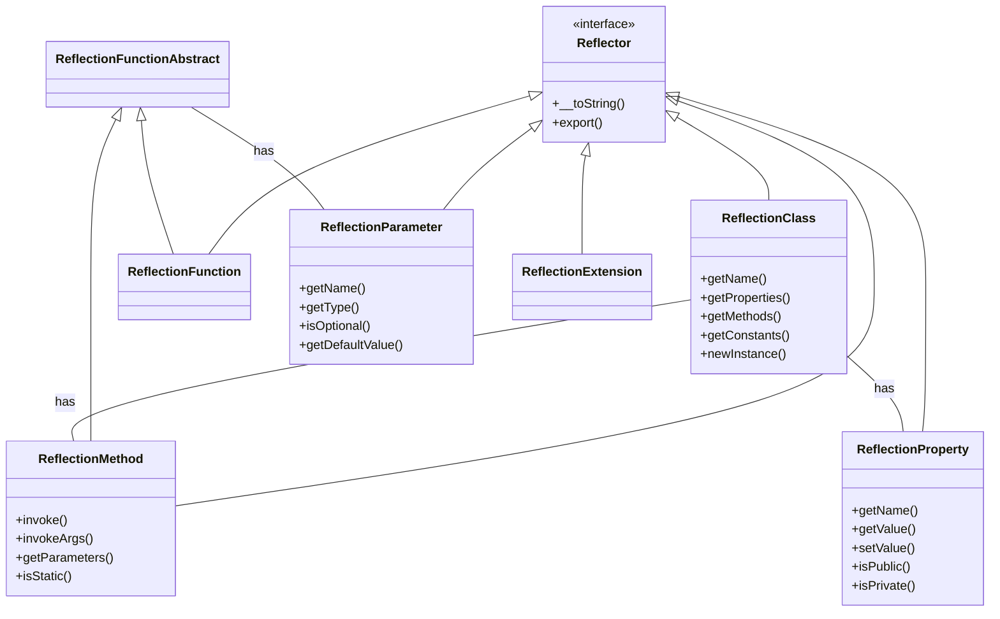

# PHP Reflection

## Introduction

Have you ever wondered how PHP frameworks like Laravel, Symfony, or PHPUnit work their magic? How they can automatically discover and execute your methods, validate parameters, or inject dependencies? The secret lies in a powerful feature called **PHP Reflection**.

PHP Reflection is an advanced feature that allows your code to examine and introspect itself at runtime. It's like giving your code a mirror to look at itself! With Reflection, you can:

- Inspect classes, interfaces, and traits
- Examine methods and their parameters
- Access properties regardless of their visibility
- Create instances of classes dynamically
- Invoke methods programmatically
- Analyze PHP extensions and functions

This capability is fundamental to many modern PHP applications and frameworks, enabling features like dependency injection, ORM mapping, and testing frameworks.

## Getting Started with Reflection

PHP's Reflection API consists of several classes found in the global namespace, all prefixed with `Reflection`. Let's start by examining a simple class using reflection:

```php
<?php
// Define a simple class
class Person {
    public $name;
    private $age;
    
    public function __construct(string $name, int $age) {
        $this->name = $name;
        $this->age = $age;
    }
    
    public function greet() {
        return "Hello, my name is {$this->name}!";
    }
    
    private function getAge() {
        return $this->age;
    }
}

// Using Reflection to examine the class
$reflectionClass = new ReflectionClass('Person');

// Get class name
echo "Class name: " . $reflectionClass->getName() . "
";

// Get methods
echo "Methods:
";
$methods = $reflectionClass->getMethods();
foreach ($methods as $method) {
    echo "  - " . $method->getName() . " (";
    echo $method->isPublic() ? "public" : ($method->isPrivate() ? "private" : "protected");
    echo ")
";
}

// Get properties
echo "Properties:
";
$properties = $reflectionClass->getProperties();
foreach ($properties as $property) {
    echo "  - " . $property->getName() . " (";
    echo $property->isPublic() ? "public" : ($property->isPrivate() ? "private" : "protected");
    echo ")
";
}
```

**Output:**
```
Class name: Person
Methods:
  - __construct (public)
  - greet (public)
  - getAge (private)
Properties:
  - name (public)
  - age (private)
```

As you can see, we were able to examine all the methods and properties of the `Person` class, even the private ones!

## Core Reflection Classes

The Reflection API consists of several classes:

- `ReflectionClass` - For examining classes
- `ReflectionMethod` - For examining methods
- `ReflectionProperty` - For examining properties
- `ReflectionParameter` - For examining function/method parameters
- `ReflectionFunction` - For examining functions
- `ReflectionExtension` - For examining PHP extensions
- And more!

Let's explore some of these in more detail.

## Examining Methods with ReflectionMethod

```php
<?php
class Calculator {
    public function add(int $a, int $b, float $multiplier = 1.0) {
        return ($a + $b) * $multiplier;
    }
}

// Create a reflection of the method
$reflectionMethod = new ReflectionMethod('Calculator', 'add');

// Get method information
echo "Method name: " . $reflectionMethod->getName() . "
";
echo "Is public: " . ($reflectionMethod->isPublic() ? "Yes" : "No") . "
";
echo "Number of parameters: " . $reflectionMethod->getNumberOfParameters() . "
";
echo "Number of required parameters: " . $reflectionMethod->getNumberOfRequiredParameters() . "
";

// Examine parameters
echo "Parameters:
";
$parameters = $reflectionMethod->getParameters();
foreach ($parameters as $param) {
    echo "  - " . $param->getName();
    echo " (type: " . ($param->getType() ? $param->getType()->getName() : "not specified") . ")";
    
    if ($param->isOptional()) {
        echo " [optional]";
        echo " [default: " . var_export($param->getDefaultValue(), true) . "]";
    }
    
    echo "
";
}

// Invoking the method dynamically
$calculator = new Calculator();
$result = $reflectionMethod->invoke($calculator, 5, 3);
echo "Result of add(5, 3): " . $result . "
";

// With optional parameter
$result = $reflectionMethod->invoke($calculator, 5, 3, 2.0);
echo "Result of add(5, 3, 2.0): " . $result . "
";
```

**Output:**
```
Method name: add
Is public: Yes
Number of parameters: 3
Number of required parameters: 2
Parameters:
  - a (type: int)
  - b (type: int)
  - multiplier (type: float) [optional] [default: 1.0]
Result of add(5, 3): 8
Result of add(5, 3, 2.0): 16
```

## Accessing Private Properties

One powerful feature of Reflection is the ability to access private and protected properties:

```php
<?php
class User {
    private $username = "admin";
    private $password = "secret123";
    
    public function getUsername() {
        return $this->username;
    }
}

$user = new User();

// Try to access directly - this would cause an error
// echo $user->password; // Error: Cannot access private property

// Use reflection to access the private property
$reflectionProperty = new ReflectionProperty('User', 'password');
$reflectionProperty->setAccessible(true); // This allows access to private/protected properties

// Get the value
$password = $reflectionProperty->getValue($user);
echo "Password: " . $password . "
";

// Change the value
$reflectionProperty->setValue($user, "newPassword456");
$newPassword = $reflectionProperty->getValue($user);
echo "New password: " . $newPassword . "
";
```

**Output:**
```
Password: secret123
New password: newPassword456
```

:::caution
While reflection gives you the power to access private members, use it responsibly! In most cases, if a property is private, it was designed that way for a reason.
:::

## Creating Objects Dynamically

Reflection can create new instances of classes, even if their constructors require parameters:

```php
<?php
class Product {
    private $id;
    private $name;
    private $price;
    
    public function __construct(int $id, string $name, float $price) {
        $this->id = $id;
        $this->name = $name;
        $this->price = $price;
    }
    
    public function getInfo() {
        return "Product #{$this->id}: {$this->name} - \${$this->price}";
    }
}

// Create a reflection class
$reflectionClass = new ReflectionClass('Product');

// Create a new instance with constructor parameters
$product = $reflectionClass->newInstance(1001, "Smartphone", 599.99);

// Output product info
echo $product->getInfo() . "
";

// Alternative way using newInstanceArgs
$params = [2002, "Laptop", 1299.99];
$anotherProduct = $reflectionClass->newInstanceArgs($params);
echo $anotherProduct->getInfo() . "
";
```

**Output:**
```
Product #1001: Smartphone - $599.99
Product #2002: Laptop - $1299.99
```

## Practical Applications of Reflection

Let's explore some real-world applications of PHP Reflection:

### 1. Building a Simple Dependency Injection Container

```php
<?php
class DependencyInjectionContainer {
    private $dependencies = [];
    
    public function register($className, $callback) {
        $this->dependencies[$className] = $callback;
    }
    
    public function resolve($className) {
        // If we have a registered dependency, use it
        if (isset($this->dependencies[$className])) {
            return $this->dependencies[$className]();
        }
        
        // Otherwise, try to auto-resolve
        $reflectionClass = new ReflectionClass($className);
        
        // If the class is abstract or an interface, we can't instantiate it
        if ($reflectionClass->isAbstract() || $reflectionClass->isInterface()) {
            throw new Exception("Cannot instantiate abstract class or interface: {$className}");
        }
        
        $constructor = $reflectionClass->getConstructor();
        
        // If no constructor, simply create a new instance
        if (is_null($constructor)) {
            return new $className();
        }
        
        // Get constructor parameters
        $parameters = $constructor->getParameters();
        $dependencies = [];
        
        // Resolve each parameter
        foreach ($parameters as $parameter) {
            // Get the parameter class hint
            $paramClass = $parameter->getType() && !$parameter->getType()->isBuiltin() 
                ? new ReflectionClass($parameter->getType()->getName()) 
                : null;
            
            // If no type hint or not a class, and parameter is optional, use default value
            if (is_null($paramClass)) {
                if ($parameter->isOptional()) {
                    $dependencies[] = $parameter->getDefaultValue();
                } else {
                    throw new Exception("Cannot resolve parameter: {$parameter->getName()}");
                }
            } else {
                // Recursively resolve the dependency
                $dependencies[] = $this->resolve($paramClass->getName());
            }
        }
        
        // Create a new instance with the resolved dependencies
        return $reflectionClass->newInstanceArgs($dependencies);
    }
}

// Example usage
class Database {
    public function query($sql) {
        echo "Executing query: {$sql}
";
    }
}

class UserRepository {
    private $database;
    
    public function __construct(Database $database) {
        $this->database = $database;
    }
    
    public function findById($id) {
        $this->database->query("SELECT * FROM users WHERE id = {$id}");
    }
}

class UserController {
    private $userRepository;
    
    public function __construct(UserRepository $userRepository) {
        $this->userRepository = $userRepository;
    }
    
    public function show($id) {
        echo "Getting user with ID: {$id}
";
        $this->userRepository->findById($id);
    }
}

// Create container
$container = new DependencyInjectionContainer();

// Resolve a controller with all its dependencies
$controller = $container->resolve(UserController::class);
$controller->show(123);
```

**Output:**
```
Getting user with ID: 123
Executing query: SELECT * FROM users WHERE id = 123
```

This simple container automatically resolved the entire dependency chain: `UserController` → `UserRepository` → `Database`.

### 2. Creating a Simple Annotation Parser

```php
<?php
/**
 * @Route("/users")
 */
class UserApi {
    /**
     * @Route("/list")
     * @Method("GET")
     */
    public function listUsers() {
        return "Listing users...";
    }
    
    /**
     * @Route("/{id}")
     * @Method("GET")
     */
    public function getUser($id) {
        return "Getting user: {$id}";
    }
    
    /**
     * @Route("/create")
     * @Method("POST")
     * @RequiresAuth
     */
    public function createUser() {
        return "Creating a user...";
    }
}

// Simple annotation parser
function parseAnnotations($docComment) {
    $annotations = [];
    
    // This regex extracts annotations in the format @Name(value)
    preg_match_all('/@(\w+)(?:\("([^"]+)"\)|(?:\(([^)]+)\))|)/', $docComment, $matches, PREG_SET_ORDER);
    
    foreach ($matches as $match) {
        $name = $match[1];
        $value = $match[2] ?? $match[3] ?? true;
        $annotations[$name] = $value;
    }
    
    return $annotations;
}

// Get the controller's base route
$reflectionClass = new ReflectionClass('UserApi');
$classAnnotations = parseAnnotations($reflectionClass->getDocComment());
$baseRoute = $classAnnotations['Route'] ?? '';

// Get all routes from methods
echo "API Routes:
";
$methods = $reflectionClass->getMethods();
foreach ($methods as $method) {
    $methodAnnotations = parseAnnotations($method->getDocComment());
    
    if (isset($methodAnnotations['Route'])) {
        $fullRoute = $baseRoute . $methodAnnotations['Route'];
        $httpMethod = $methodAnnotations['Method'] ?? 'ANY';
        $requiresAuth = isset($methodAnnotations['RequiresAuth']) ? 'Yes' : 'No';
        
        echo "- {$httpMethod} {$fullRoute} -> {$method->getName()}()
";
        echo "  Requires Authentication: {$requiresAuth}
";
    }
}
```

**Output:**
```
API Routes:
- GET /users/list -> listUsers()
  Requires Authentication: No
- GET /users/{id} -> getUser()
  Requires Authentication: No
- POST /users/create -> createUser()
  Requires Authentication: Yes
```

This example shows how frameworks might use reflection to parse annotations in PHPDoc comments to configure routes, middleware, and other aspects of your application.

## Visualizing Reflection

Let's visualize the relationship between the main Reflection classes:



## When to Use Reflection

Reflection is powerful but comes with some trade-offs:

### Advantages:
- Enables dynamic behavior at runtime
- Powers frameworks and libraries
- Helps with testing and debugging
- Enables meta-programming features

### Disadvantages:
- Performance overhead
- Can break encapsulation
- Code can be harder to understand
- May bypass security checks

Use Reflection when:
1. Building frameworks or libraries
2. Working with plugins or extensions
3. Creating testing utilities
4. Implementing advanced meta-programming features

Avoid Reflection when:
1. A simpler solution exists
2. Performance is critical
3. Code clarity is more important than flexibility

## Summary

PHP Reflection is a powerful feature that allows your code to examine and modify itself at runtime. We've explored:

- Inspecting classes, methods, and properties
- Accessing private and protected members
- Creating objects dynamically
- Real-world applications like dependency injection and annotation parsing

This introspection capability is what enables many advanced PHP frameworks and libraries to work their magic. As you continue your PHP journey, understanding Reflection will help you build more dynamic and flexible applications, as well as better understand how modern PHP frameworks operate under the hood.

## Exercises

Try these exercises to practice your Reflection skills:

1. Create a simple autoloader using ReflectionClass
2. Build a test runner that automatically discovers and runs test methods
3. Implement a validation system that uses reflection to check property types
4. Create a simple ORM that maps class properties to database columns
5. Build a serializer that can convert objects to JSON and back

## Additional Resources

- [PHP Documentation: Reflection](https://www.php.net/manual/en/book.reflection.php)
- [PHP Documentation: ReflectionClass](https://www.php.net/manual/en/class.reflectionclass.php)
- [PHP.net: PHP Type Declarations](https://www.php.net/manual/en/language.types.declarations.php)
- [PHP.net: PHPDoc Comments](https://www.php.net/manual/en/features.structured-documentation.php)