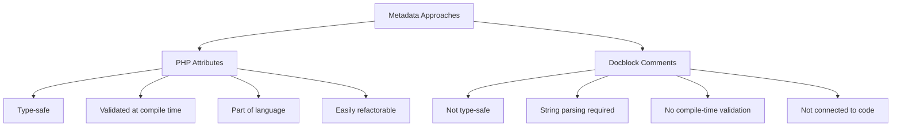

# PHP Attributes

## Introduction

PHP Attributes (also known as annotations in other languages) were introduced in PHP 8.0 as a way to add metadata to your code. Before PHP 8, developers often used docblock comments to add metadata to classes, methods, and properties. PHP Attributes provide a more structured and type-safe way to accomplish the same goal.

Attributes allow you to associate additional information with classes, methods, properties, and other code elements without affecting their runtime behavior directly. This metadata can later be accessed through reflection to modify how the code behaves in specific contexts.

## What Are PHP Attributes?

Attributes are special PHP constructs that can be attached to various code elements. They're defined using the `#[AttributeName]` syntax and can include parameters.

### Basic Syntax

```php
#[AttributeName]
class MyClass { }

class MyClass {
    #[AttributeName]
    public function myMethod() { }
    
    #[AttributeName]
    public $myProperty;
}
```

### Creating a Custom Attribute

To create a custom attribute, you need to define a class and annotate it with the `#[Attribute]` attribute:

```php
#[Attribute]
class MyAttribute
{
    private string $value;
    
    public function __construct(string $value)
    {
        $this->value = $value;
    }
    
    public function getValue(): string
    {
        return $this->value;
    }
}
```

### Using a Custom Attribute

After defining an attribute, you can use it throughout your code:

```php
#[MyAttribute('This is a class attribute')]
class MyClass
{
    #[MyAttribute('This is a method attribute')]
    public function myMethod()
    {
        return 'Hello World!';
    }
    
    #[MyAttribute('This is a property attribute')]
    public string $myProperty = 'Hello Property!';
}
```

## Attribute Targets

By default, attributes can be applied to any code element. However, you can restrict where your attributes can be used by specifying targets in the `Attribute` declaration:

```php
use Attribute;

#[Attribute(Attribute::TARGET_CLASS | Attribute::TARGET_METHOD)]
class OnlyForClassesAndMethods
{
}
```

The available targets are:
- `Attribute::TARGET_CLASS`
- `Attribute::TARGET_FUNCTION`
- `Attribute::TARGET_METHOD`
- `Attribute::TARGET_PROPERTY`
- `Attribute::TARGET_CLASS_CONSTANT`
- `Attribute::TARGET_PARAMETER`
- `Attribute::TARGET_ALL` (default)

## Attribute Flags

Attributes have additional flags to control their behavior:

```php
use Attribute;

// Attribute can be used multiple times on the same element
#[Attribute(Attribute::TARGET_ALL, Attribute::IS_REPEATABLE)]
class RepeatableAttribute
{
}
```

The key flags are:
- `Attribute::IS_REPEATABLE` - The attribute can be used multiple times on the same element

## Reading Attributes with Reflection

The real power of attributes comes when you access them at runtime using PHP's Reflection API:

```php
#[MyAttribute('Hello from class')]
class Demo
{
    #[MyAttribute('Hello from method')]
    public function hello()
    {
        return 'Hello World!';
    }
}

// Get all attributes from a class
$reflection = new ReflectionClass(Demo::class);
$attributes = $reflection->getAttributes();

foreach ($attributes as $attribute) {
    // Get the attribute name
    echo $attribute->getName() . PHP_EOL;
    
    // Instantiate the attribute
    $instance = $attribute->newInstance();
    
    // Access attribute properties
    echo $instance->getValue() . PHP_EOL;
}

// Output:
// MyAttribute
// Hello from class

// Get attributes from a method
$methodReflection = $reflection->getMethod('hello');
$methodAttributes = $methodReflection->getAttributes();

foreach ($methodAttributes as $attribute) {
    $instance = $attribute->newInstance();
    echo $instance->getValue() . PHP_EOL;
}

// Output:
// Hello from method
```

## Practical Example: Route Definition

Let's create a practical example using attributes to define routes in a simple web application:

```php
#[Attribute(Attribute::TARGET_METHOD)]
class Route
{
    private string $path;
    private string $method;
    
    public function __construct(string $path, string $method = 'GET')
    {
        $this->path = $path;
        $this->method = $method;
    }
    
    public function getPath(): string
    {
        return $this->path;
    }
    
    public function getMethod(): string
    {
        return $this->method;
    }
}

class UserController
{
    #[Route('/users', 'GET')]
    public function index()
    {
        return 'List of users';
    }
    
    #[Route('/users/{id}', 'GET')]
    public function show($id)
    {
        return "User with ID: $id";
    }
    
    #[Route('/users', 'POST')]
    public function store()
    {
        return 'Create a new user';
    }
}

// Simple router implementation
class Router
{
    public function registerControllerRoutes($controllerClass)
    {
        $controller = new $controllerClass();
        $reflection = new ReflectionClass($controllerClass);
        
        foreach ($reflection->getMethods() as $method) {
            $attributes = $method->getAttributes(Route::class);
            
            foreach ($attributes as $attribute) {
                $route = $attribute->newInstance();
                echo "Registered route: {$route->getMethod()} {$route->getPath()} to {$controllerClass}::{$method->getName()}" . PHP_EOL;
                
                // In a real router, you would store these routes
                // and match against the current request
            }
        }
    }
}

// Usage:
$router = new Router();
$router->registerControllerRoutes(UserController::class);

// Output:
// Registered route: GET /users to UserController::index
// Registered route: GET /users/{id} to UserController::show
// Registered route: POST /users to UserController::store
```

This example shows how attributes can simplify your code by allowing you to declare routes directly on the controller methods, making your code more maintainable and readable.

## Database ORM Example

Another common use case for attributes is defining database mappings in an ORM (Object-Relational Mapping) system:

```php
#[Attribute(Attribute::TARGET_CLASS)]
class Entity
{
    private string $table;
    
    public function __construct(string $table)
    {
        $this->table = $table;
    }
    
    public function getTable(): string
    {
        return $this->table;
    }
}

#[Attribute(Attribute::TARGET_PROPERTY)]
class Column
{
    private string $name;
    private string $type;
    private bool $nullable;
    
    public function __construct(
        string $name, 
        string $type = 'string', 
        bool $nullable = false
    ) {
        $this->name = $name;
        $this->type = $type;
        $this->nullable = $nullable;
    }
    
    public function getName(): string
    {
        return $this->name;
    }
    
    public function getType(): string
    {
        return $this->type;
    }
    
    public function isNullable(): bool
    {
        return $this->nullable;
    }
}

#[Entity('users')]
class User
{
    #[Column('id', 'integer')]
    private int $id;
    
    #[Column('name')]
    private string $name;
    
    #[Column('email')]
    private string $email;
    
    #[Column('bio', 'text', true)]
    private ?string $bio;
    
    // Getters and setters...
}

// Usage in a simple ORM
class EntityManager
{
    public function createTableSQL($entityClass): string
    {
        $reflection = new ReflectionClass($entityClass);
        
        // Get the entity attribute
        $entityAttributes = $reflection->getAttributes(Entity::class);
        if (empty($entityAttributes)) {
            throw new Exception("Class is not an entity: $entityClass");
        }
        
        $entity = $entityAttributes[0]->newInstance();
        $tableName = $entity->getTable();
        
        $columns = [];
        
        // Process each property with a Column attribute
        foreach ($reflection->getProperties() as $property) {
            $columnAttributes = $property->getAttributes(Column::class);
            
            if (!empty($columnAttributes)) {
                $column = $columnAttributes[0]->newInstance();
                
                $columnDef = "{$column->getName()} {$column->getType()}";
                if (!$column->isNullable()) {
                    $columnDef .= " NOT NULL";
                }
                
                $columns[] = $columnDef;
            }
        }
        
        // Build the CREATE TABLE statement
        $columnDefinitions = implode(', ', $columns);
        return "CREATE TABLE $tableName ($columnDefinitions)";
    }
}

// Generate SQL for the User entity
$entityManager = new EntityManager();
$sql = $entityManager->createTableSQL(User::class);
echo $sql . PHP_EOL;

// Output:
// CREATE TABLE users (id integer NOT NULL, name string NOT NULL, email string NOT NULL, bio text)
```

## Attributes vs. Docblock Comments

Before PHP 8.0, developers used docblock comments to add metadata:

```php
/**
 * @Entity("users")
 */
class User
{
    /**
     * @Column("id", type="integer")
     */
    private $id;
}
```

Comparing attributes to docblock comments:



## Benefits of PHP Attributes

1. **Type Safety**: Attributes are defined as classes, so they provide type hints and validation.
2. **IDE Support**: IDEs can provide better code completion and validation for attributes.
3. **Performance**: Parsing attributes can be faster than parsing docblock comments.
4. **Integration**: Attributes are integrated with PHP's type system and reflection API.

## Potential Downsides

1. **PHP 8.0+ Only**: Attributes require PHP 8.0 or higher.
2. **More Verbose**: Some simple annotations may look more verbose as attributes.
3. **Learning Curve**: New syntax to learn for PHP developers.

## Summary

PHP Attributes provide a powerful way to add metadata to your code elements. They offer advantages over traditional docblock comments, including type safety, IDE support, and better performance.

Key takeaways:
- Attributes are defined using the `#[AttributeName]` syntax
- Custom attributes are classes annotated with `#[Attribute]`
- Attributes can be targeted to specific code elements
- Reflection API is used to read attributes at runtime
- Attributes are excellent for frameworks, ORMs, and other tools that need metadata

## Exercise: Create a Validation Framework

As an exercise, try creating a simple validation framework using PHP Attributes:

1. Create attributes for common validations (Required, Email, MinLength, etc.)
2. Create a class to validate objects based on these attributes
3. Apply the attributes to a form submission class
4. Use reflection to validate the form submission

## Additional Resources

- [PHP Attributes Documentation](https://www.php.net/manual/en/language.attributes.php)
- [PHP Reflection API](https://www.php.net/manual/en/book.reflection.php)
- [PHP 8.0 Release Notes](https://www.php.net/releases/8.0/en.php)
- [Symfony Framework Attributes](https://symfony.com/doc/current/controller/attributes.html) (example of real-world implementation)