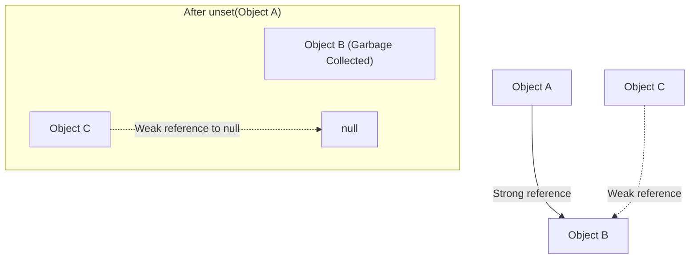

# PHP Weak References

## Introduction

In PHP, memory management is typically handled automatically through its garbage collection mechanism. However, as applications grow more complex, developers often need finer control over how objects reference each other. This is where **Weak References** come into play.

Introduced in PHP 7.4, the `WeakReference` class provides a way to reference an object without preventing that object from being garbage collected. This is a powerful feature for preventing memory leaks in complex applications where objects might reference each other in circular ways.

## What are Weak References?

A weak reference allows you to reference an object without increasing its reference count. In simpler terms, it lets you point to an object without forcing PHP to keep that object alive in memory.

### Regular References vs. Weak References

Let's understand the difference between regular (strong) references and weak references:

```php
// Regular reference example
$object = new stdClass();
$reference = $object; // This is a regular (strong) reference

// The object stays in memory because $reference keeps it alive
unset($object);
var_dump($reference); // Still accessible

// Output:
// object(stdClass)#1 (0) {}
```

In the example above, even though we unset `$object`, the instance remains in memory because `$reference` still points to it.

Now, let's see how weak references behave differently:

```php
// Weak reference example
$object = new stdClass();
$weakRef = WeakReference::create($object); // This is a weak reference

// Let's see what happens when we remove the original reference
unset($object);
var_dump($weakRef->get()); // The object is gone!

// Output:
// NULL
```

In this case, once we unset `$object`, the object is garbage collected because the weak reference doesn't prevent this from happening.

## Creating and Using Weak References

### Basic Usage

Creating a weak reference is straightforward using the static `create()` method:

```php
// Create an object
$myObject = new DateTime();

// Create a weak reference to it
$weakRef = WeakReference::create($myObject);

// Access the referenced object using get()
echo $weakRef->get()->format('Y-m-d'); // Outputs current date

// If the original object is destroyed, get() returns null
unset($myObject);
var_dump($weakRef->get()); // NULL
```

### Checking If the Object Still Exists

You can check if the referenced object still exists before trying to use it:

```php
$object = new stdClass();
$object->data = "Hello, world!";
$weakRef = WeakReference::create($object);

// Later in your code...
if ($weakRef->get() !== null) {
    echo $weakRef->get()->data; // Safe to access
} else {
    echo "The object no longer exists";
}
```

## Real-World Applications

Weak references solve specific problems in real-world applications. Let's look at some practical examples:

### 1. Breaking Circular References

One of the most common uses for weak references is breaking circular reference chains that could lead to memory leaks:

```php
class Parent {
    public $children = [];
    
    public function addChild(Child $child) {
        $this->children[] = $child;
    }
}

class Child {
    private $parent;
    
    public function setParent(Parent $parent) {
        $this->parent = WeakReference::create($parent); // Using weak reference
    }
    
    public function getParent() {
        return $this->parent->get();
    }
}

// Usage
$parent = new Parent();
$child = new Child();

$parent->addChild($child);
$child->setParent($parent);

// Now we can safely unset $parent without leaking memory
unset($parent);
// The Child object won't keep the Parent alive
```

Without the weak reference, this would create a circular reference: Parent references Child, and Child references Parent. This could prevent PHP's garbage collector from freeing the memory.

### 2. Caching Systems with Automatic Cleanup

Weak references are excellent for implementing caches that automatically clean up:

```php
class SimpleCache {
    private $cache = [];
    
    public function set($key, $value) {
        $this->cache[$key] = WeakReference::create($value);
    }
    
    public function get($key) {
        if (isset($this->cache[$key])) {
            $value = $this->cache[$key]->get();
            if ($value !== null) {
                return $value;
            }
            // Clean up stale reference
            unset($this->cache[$key]);
        }
        return null;
    }
}

// Usage
$cache = new SimpleCache();
$expensiveObject = new HeavyDataProcessor();

$cache->set('processor', $expensiveObject);

// Later in your code...
$processor = $cache->get('processor');
if ($processor) {
    $processor->process();
}

// If $expensiveObject is destroyed elsewhere, the cache won't keep it alive
unset($expensiveObject);
// Next time get('processor') is called, it will return null
```

### 3. Event Listeners and Observers

Weak references are ideal for implementing event systems that don't prevent listeners from being garbage collected:

```php
class EventDispatcher {
    private $listeners = [];
    
    public function addListener($event, $listener) {
        if (!isset($this->listeners[$event])) {
            $this->listeners[$event] = [];
        }
        $this->listeners[$event][] = WeakReference::create($listener);
    }
    
    public function dispatch($event, $data = null) {
        if (!isset($this->listeners[$event])) {
            return;
        }
        
        // Clean up stale listeners while dispatching
        foreach ($this->listeners[$event] as $key => $weakListener) {
            $listener = $weakListener->get();
            if ($listener === null) {
                unset($this->listeners[$event][$key]);
                continue;
            }
            $listener->handle($data);
        }
    }
}

// Usage example
class Logger {
    public function handle($data) {
        echo "Logged: " . json_encode($data) . "
";
    }
}

$dispatcher = new EventDispatcher();
$logger = new Logger();

$dispatcher->addListener('user.login', $logger);

// This works
$dispatcher->dispatch('user.login', ['user_id' => 123]);

// If the logger is destroyed, the event system won't keep it alive
unset($logger);

// This won't error, the listener just won't be called
$dispatcher->dispatch('user.login', ['user_id' => 456]);
```

## Understanding Memory Management

To visualize how weak references affect memory management, let's look at a simple diagram:



In the diagram above:
- Object A has a strong reference to Object B
- Object C has a weak reference to Object B
- When Object A is removed (unset), Object B is garbage collected
- Object C's weak reference now points to null

## Limitations and Considerations

While weak references are powerful, they have some limitations to be aware of:

1. **Performance Impact**: Weak references have a small overhead compared to regular references.

2. **PHP 7.4+ Only**: This feature is only available in PHP 7.4 and above.

3. **Not for All Use Cases**: Weak references aren't a replacement for proper object lifecycle management.

4. **Reference Checking**: Always check if the referenced object still exists using `get()` before using it.

5. **No Automatic Cleanup**: You need to handle cleanup of stale weak references in your data structures.

## Summary

PHP Weak References provide a powerful way to reference objects without preventing them from being garbage collected. This helps in:

- Breaking circular references
- Implementing auto-cleaning caches
- Creating event systems that don't cause memory leaks
- Generally improving memory management in complex applications

By understanding and properly using weak references, you can write more memory-efficient PHP applications that avoid common memory leak pitfalls.

## Further Resources and Exercises

### Resources
- [PHP Official Documentation on WeakReference](https://www.php.net/manual/en/class.weakreference.php)
- [PHP RFC: WeakReferences](https://wiki.php.net/rfc/weakrefs)

### Exercises

1. **Memory Leak Detector**: Create a simple script that demonstrates a circular reference memory leak, then fix it using weak references.

2. **Improved Cache**: Extend the SimpleCache example to include expiration times along with weak references.

3. **Observer Pattern**: Implement a complete observer pattern using weak references for the observers.

4. **Memory Usage Comparison**: Write a script that compares memory usage between an application using regular references and one using weak references for a complex object graph.