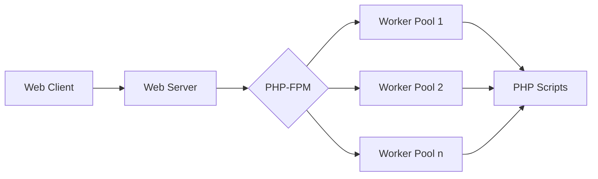

# PHP-FPM Configuration

## Introduction

PHP-FPM (FastCGI Process Manager) is an alternative PHP implementation designed to handle high-load websites more efficiently. Unlike traditional PHP setups, PHP-FPM runs as a dedicated service that manages worker processes to handle PHP requests, offering significant performance improvements and better resource management.

In this guide, we'll explore how to configure PHP-FPM to optimize your PHP applications, understand its key parameters, and implement best practices for different environments.

## What is PHP-FPM?

PHP-FPM is a FastCGI implementation for PHP with several advantages over traditional PHP processing methods:

- **Improved Performance**: Processes PHP requests faster than mod_php or CGI
- **Better Resource Management**: Controls the number of worker processes based on demand
- **Enhanced Security**: Runs with different user permissions for different pools
- **Dynamic Process Management**: Automatically adjusts worker count based on traffic



## Installing PHP-FPM

Before configuring PHP-FPM, you need to install it. The installation process varies based on your operating system:

### On Ubuntu/Debian:

```bash
sudo apt update
sudo apt install php-fpm
```

### On CentOS/RHEL:

```bash
sudo yum install epel-release
sudo yum install php-fpm
```

### On macOS (using Homebrew):

```bash
brew install php
```

After installation, you can verify that PHP-FPM is running with:

```bash
sudo systemctl status php-fpm
```

Expected output:
```
● php-fpm.service - The PHP FastCGI Process Manager
   Loaded: loaded (/lib/systemd/system/php-fpm.service; enabled; vendor preset: enabled)
   Active: active (running) since Mon 2023-10-16 14:25:10 UTC; 2min 30s ago
     Docs: man:php-fpm(8)
 Main PID: 1234 (php-fpm)
   Status: "Ready to handle connections"
```

## Understanding PHP-FPM Configuration Files

PHP-FPM uses two main types of configuration files:

1. **Main configuration file**: Usually located at `/etc/php/[version]/fpm/php-fpm.conf`
2. **Pool configuration files**: Located in `/etc/php/[version]/fpm/pool.d/` directory

The main configuration file sets global settings, while pool configuration files define specific settings for different application pools.

### Main Configuration File Structure

The main `php-fpm.conf` file typically contains:

```ini
[global]
pid = /run/php-fpm.pid
error_log = /var/log/php-fpm.log
include = /etc/php/7.4/fpm/pool.d/*.conf
```

This minimal configuration includes:
- `pid`: The path to the process ID file
- `error_log`: Location of the error log
- `include`: Path pattern for pool configuration files

## Creating and Configuring PHP-FPM Pools

Pools are groups of PHP-FPM worker processes that handle PHP requests. You can create multiple pools for different applications, allowing precise control over resource allocation.

### Basic Pool Configuration

Here's an example of a basic pool configuration file (`www.conf`):

```ini
[www]
user = www-data
group = www-data
listen = /run/php/php7.4-fpm.sock
listen.owner = www-data
listen.group = www-data
pm = dynamic
pm.max_children = 5
pm.start_servers = 2
pm.min_spare_servers = 1
pm.max_spare_servers = 3
```

Let's break down these settings:

- `[www]`: The pool name
- `user` and `group`: Define which user/group the PHP-FPM processes run as
- `listen`: Socket or IP:port where PHP-FPM will accept requests
- `listen.owner` and `listen.group`: Owner and group of the socket file
- `pm`: Process manager control method

## Process Manager (PM) Control Methods

PHP-FPM offers several process management methods:

### 1. Static

```ini
pm = static
pm.max_children = 10
```

With static PM, a fixed number of child processes are always running. This is good for consistent resource usage but may not handle traffic spikes well.

### 2. Dynamic (Recommended for most use cases)

```ini
pm = dynamic
pm.max_children = 50
pm.start_servers = 5
pm.min_spare_servers = 3
pm.max_spare_servers = 10
```

Dynamic PM adjusts the number of processes based on traffic:
- `pm.max_children`: Maximum number of child processes
- `pm.start_servers`: Number of child processes created at startup
- `pm.min_spare_servers`: Minimum number of idle server processes
- `pm.max_spare_servers`: Maximum number of idle server processes

### 3. On-demand

```ini
pm = ondemand
pm.max_children = 50
pm.process_idle_timeout = 10s
```

On-demand PM creates processes only when needed and terminates them after they're idle for `pm.process_idle_timeout` seconds. This conserves resources during low-traffic periods.

## Optimizing PHP-FPM Configuration

### Resource Limits

Control memory and CPU usage with these settings:

```ini
[www]
pm.max_children = 20
pm.max_requests = 500
php_admin_value[memory_limit] = 256M
request_terminate_timeout = 30s
```

- `pm.max_requests`: Maximum number of requests a process handles before recycling (helps prevent memory leaks)
- `php_admin_value[memory_limit]`: Memory limit per PHP process
- `request_terminate_timeout`: Maximum execution time for a request

### Calculating Optimal pm.max_children

A common formula for determining the optimal `pm.max_children` value:

```
pm.max_children = Total RAM dedicated to PHP-FPM / Average PHP process size
```

For example, if you have 4GB of RAM dedicated to PHP-FPM and each PHP process uses approximately 50MB:

```
pm.max_children = 4096MB / 50MB = 81.92 ≈ 80
```

### Performance Monitoring

Add status monitoring to track PHP-FPM performance:

```ini
[www]
pm.status_path = /status
```

This creates a URL endpoint that shows real-time statistics about your PHP-FPM pool. Access it via your web server at `/status`.

## Integrating PHP-FPM with Web Servers

### With Nginx

Create a server block in your Nginx configuration:

```nginx
server {
    listen 80;
    server_name example.com;
    root /var/www/html;

    location ~ \.php$ {
        include snippets/fastcgi-php.conf;
        fastcgi_pass unix:/run/php/php7.4-fpm.sock;
    }
}
```

### With Apache

For Apache, enable the FastCGI module and configure it:

```apache
<FilesMatch \.php$>
    SetHandler "proxy:unix:/run/php/php7.4-fpm.sock|fcgi://localhost"
</FilesMatch>
```

## Multiple Pools for Different Applications

One of PHP-FPM's strengths is the ability to create separate pools for different applications:

```ini
# /etc/php/7.4/fpm/pool.d/app1.conf
[app1]
user = app1user
group = app1group
listen = /run/php/php7.4-fpm-app1.sock
pm = dynamic
pm.max_children = 10
pm.start_servers = 2
pm.min_spare_servers = 1
pm.max_spare_servers = 3
php_admin_value[memory_limit] = 128M
```

```ini
# /etc/php/7.4/fpm/pool.d/app2.conf
[app2]
user = app2user
group = app2group
listen = /run/php/php7.4-fpm-app2.sock
pm = dynamic
pm.max_children = 20
pm.start_servers = 5
pm.min_spare_servers = 3
pm.max_spare_servers = 7
php_admin_value[memory_limit] = 256M
```

This approach isolates applications from each other, improving security and allowing for application-specific resource allocation.

## Environment Variables

You can set environment variables for your PHP scripts:

```ini
[www]
env[DB_HOST] = localhost
env[DB_USER] = webapp
env[DB_PASSWORD] = secret
```

These variables will be available to PHP scripts via `$_ENV` or `getenv()`.

## Logging and Troubleshooting

Configure detailed logging for troubleshooting:

```ini
[www]
access.log = /var/log/php-fpm/$pool.access.log
access.format = "%R - %u %t \"%m %r%Q%q\" %s %f %{mili}d %{kilo}M %C%%"
catch_workers_output = yes
php_admin_flag[log_errors] = on
php_admin_value[error_log] = /var/log/php-fpm/$pool.error.log
```

This configuration:
- Creates an access log with details about each request
- Captures stdout/stderr output from workers
- Logs PHP errors to a pool-specific error log

## Real-world PHP-FPM Configuration Example

Here's a complete real-world example for a medium-traffic WordPress site:

```ini
[wordpress]
user = www-data
group = www-data
listen = /run/php/php7.4-fpm-wordpress.sock
listen.owner = www-data
listen.group = www-data

pm = dynamic
pm.max_children = 30
pm.start_servers = 5
pm.min_spare_servers = 3
pm.max_spare_servers = 10
pm.max_requests = 500

request_terminate_timeout = 60s
php_admin_value[memory_limit] = 256M
php_admin_value[upload_max_filesize] = 50M
php_admin_value[post_max_size] = 50M
php_admin_value[max_execution_time] = 60
php_admin_value[max_input_vars] = 3000

access.log = /var/log/php-fpm/wordpress.access.log
php_admin_value[error_log] = /var/log/php-fpm/wordpress.error.log
php_admin_flag[log_errors] = on

env[WP_ENV] = production
```

## PHP-FPM Configuration for Different Environments

### Development Environment

```ini
[development]
user = dev
group = dev
listen = 127.0.0.1:9000
pm = dynamic
pm.max_children = 10
pm.start_servers = 2
pm.min_spare_servers = 1
pm.max_spare_servers = 3
pm.max_requests = 200

php_admin_flag[display_errors] = on
php_admin_value[error_reporting] = E_ALL
catch_workers_output = yes
```

### Production Environment

```ini
[production]
user = www-data
group = www-data
listen = /run/php/php-fpm.sock
pm = dynamic
pm.max_children = 50
pm.start_servers = 5
pm.min_spare_servers = 3
pm.max_spare_servers = 10
pm.max_requests = 1000

php_admin_flag[display_errors] = off
php_admin_value[error_reporting] = E_ALL & ~E_DEPRECATED & ~E_STRICT
```

## Advanced Configuration Options

### Slow Request Logging

Identify performance bottlenecks by logging slow requests:

```ini
[www]
request_slowlog_timeout = 5s
slowlog = /var/log/php-fpm/slow.log
```

This logs any request taking longer than 5 seconds to complete.

### PHP Opcode Caching

Integrate with PHP's opcode cache for better performance:

```ini
[www]
php_admin_value[opcache.enable] = 1
php_admin_value[opcache.memory_consumption] = 128
php_admin_value[opcache.interned_strings_buffer] = 8
php_admin_value[opcache.max_accelerated_files] = 4000
php_admin_value[opcache.revalidate_freq] = 60
php_admin_value[opcache.fast_shutdown] = 1
```

## Summary

PHP-FPM provides powerful tools for optimizing PHP application performance through:

- Process management strategies (static, dynamic, on-demand)
- Resource allocation and limits
- Application isolation with multiple pools
- Fine-grained logging and monitoring
- Integration with web servers

By properly configuring PHP-FPM, you can significantly improve your PHP application's performance, security, and stability while making efficient use of server resources.

## Additional Resources

- [Official PHP-FPM Documentation](https://www.php.net/manual/en/install.fpm.php)
- [PHP-FPM Configuration Directives](https://www.php.net/manual/en/install.fpm.configuration.php)
- [Nginx FastCGI Configuration](https://www.nginx.com/resources/wiki/start/topics/examples/fastcgi/)

## Exercises

1. Set up a basic PHP-FPM configuration for a local development environment.
2. Create multiple PHP-FPM pools for different applications and configure appropriate resource limits for each.
3. Implement monitoring for your PHP-FPM setup and analyze the performance metrics.
4. Benchmark your application with different PHP-FPM process management settings (static, dynamic, on-demand) and determine which works best for your use case.
5. Troubleshoot common PHP-FPM issues using the logging features discussed in this guide.