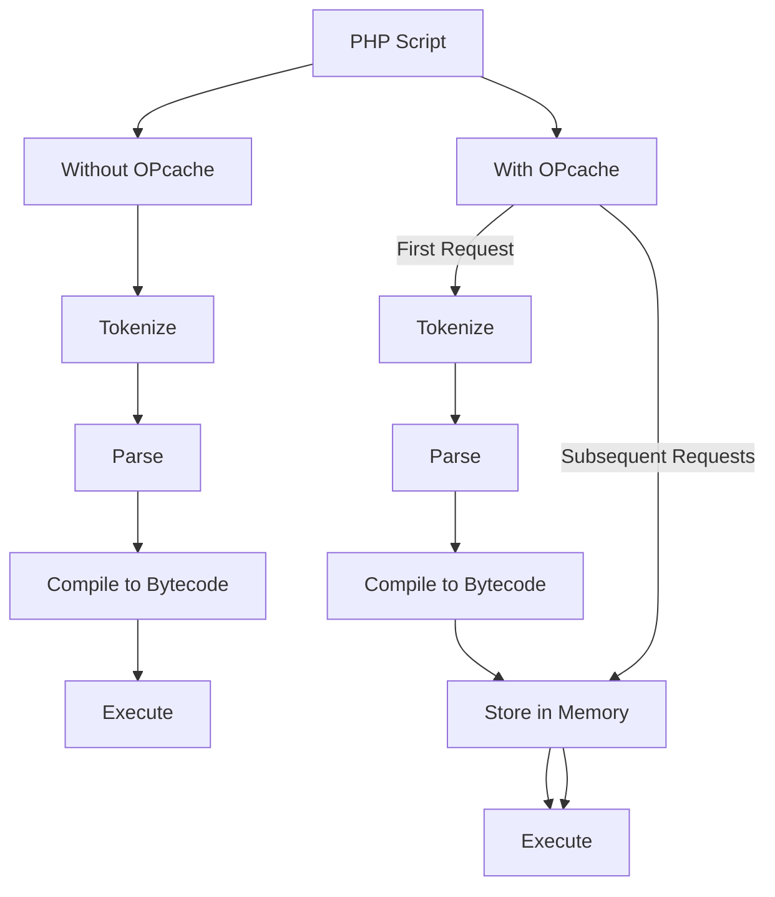

# PHP OPcache: Boosting Your PHP Performance

## Introduction

Have you ever wondered why your PHP application might be running slower than expected? One common reason is that PHP is an interpreted language. Each time a PHP script runs, the PHP engine needs to parse, compile, and execute your code. This process happens repeatedly, even if the code hasn't changed, which can lead to unnecessary overhead.

This is where **PHP OPcache** comes to the rescue. OPcache is a powerful optimization feature built into PHP that can significantly improve your application's performance by storing precompiled script bytecode in shared memory. This eliminates the need for PHP to load and parse scripts on each request, resulting in faster execution times and reduced server load.

In this tutorial, we'll explore what PHP OPcache is, how it works, and how you can configure and optimize it for your applications.

## What is PHP OPcache?

PHP OPcache (Optimizer Plus Cache) is a bytecode cache and optimizer that was integrated into PHP as a core extension starting from PHP 5.5. Before that, it was available as the separate Zend Optimizer+ extension.

### How OPcache Works

Let's understand the process of how PHP executes scripts with and without OPcache:



Without OPcache, PHP needs to read your script from disk, tokenize it, parse it, compile it to bytecode, and then execute it – every time the script is requested.

With OPcache enabled, PHP still goes through all these steps the first time, but it then stores the compiled bytecode in memory. For subsequent requests to the same script, PHP can skip the tokenizing, parsing, and compiling steps, jumping straight to execution.

## Enabling OPcache

OPcache is included with PHP 5.5 and later versions, but it may not be enabled by default. Here's how you can enable it:

### 1. Check if OPcache is Available

First, let's check if OPcache is available in your PHP installation:

```php
<?php
phpinfo();
?>
```

Look for the "opcache" section in the output. If it exists, OPcache is available but might not be enabled.

### 2. Enable OPcache

To enable OPcache, you need to modify your `php.ini` file:

```ini
; Enable OPcache
zend_extension=opcache.so

opcache.enable=1
opcache.enable_cli=1  ; Enable for CLI if needed
```

On Windows systems, the extension is typically named `php_opcache.dll`:

```ini
zend_extension=php_opcache.dll
```

After making changes to your `php.ini` file, restart your web server (Apache, Nginx, etc.) for the changes to take effect.

### 3. Verify OPcache is Running

Create a simple PHP script to check if OPcache is running:

```php
<?php
// opcache_status.php

if (function_exists('opcache_get_status')) {
    $status = opcache_get_status();
    echo "<pre>";
    print_r($status);
    echo "</pre>";
} else {
    echo "OPcache is not available.";
}
?>
```

**Output if OPcache is running:**
```
Array
(
    [opcache_enabled] => 1
    [cache_full] => 0
    [restart_pending] => 0
    [restart_in_progress] => 0
    [memory_usage] => Array
        (
            [used_memory] => 5559288
            [free_memory] => 60617640
            [wasted_memory] => 0
            [current_wasted_percentage] => 0
        )
    [interned_strings_usage] => Array
        (
            [buffer_size] => 4194304
            [used_memory] => 455784
            [free_memory] => 3738520
            [number_of_strings] => 6632
        )
    ...
)
```

## Configuring OPcache

Now that OPcache is enabled, let's look at how to configure it for optimal performance:

### Key Configuration Options

Here are the most important OPcache configuration options:

```ini
; Memory allocation (in megabytes)
opcache.memory_consumption=128

; Maximum number of files that can be stored in the cache
opcache.max_accelerated_files=10000

; How often to check for script changes (in seconds)
; 0 means it will check on every request (not recommended for production)
opcache.revalidate_freq=60

; Enable file timestamps validation
opcache.validate_timestamps=1

; Enable optimization
opcache.optimization_level=0x7FFFBFFF
```

### Explanation of Configuration Options

1. **opcache.memory_consumption**: The amount of memory (in MB) that OPcache will use for storing compiled PHP scripts. For larger applications, you may need to increase this value.

2. **opcache.max_accelerated_files**: The maximum number of PHP scripts that can be stored in the OPcache. If your application has many PHP files, you should increase this number.

3. **opcache.revalidate_freq**: How often (in seconds) OPcache should check if your PHP files have changed. In production, set this to a higher value (like 60 or 300).

4. **opcache.validate_timestamps**: Controls whether OPcache should check file timestamps for changes.
   - `1` (default): Check file timestamps according to `revalidate_freq`
   - `0`: Never check timestamps (requires manual cache reset on file changes)

5. **opcache.optimization_level**: Controls which optimizations should be performed. The default value usually works well.

## Practical Usage Examples

Let's look at some practical examples of how to work with OPcache:

### Example 1: Monitoring OPcache Status

Here's a more complete script to monitor OPcache status:

```php
<?php
// opcache_monitor.php

function format_bytes($bytes, $precision = 2) {
    $units = ['B', 'KB', 'MB', 'GB', 'TB'];
    $bytes = max($bytes, 0);
    $pow = floor(($bytes ? log($bytes) : 0) / log(1024));
    $pow = min($pow, count($units) - 1);
    $bytes /= (1 << (10 * $pow));
    return round($bytes, $precision) . ' ' . $units[$pow];
}

if (!function_exists('opcache_get_status')) {
    die('OPcache not available');
}

$status = opcache_get_status();
$config = opcache_get_configuration();

echo "<h2>OPcache Status</h2>";
echo "<table border='1' cellpadding='5'>";
echo "<tr><td>Enabled:</td><td>" . ($status['opcache_enabled'] ? 'Yes' : 'No') . "</td></tr>";
echo "<tr><td>Cache Full:</td><td>" . ($status['cache_full'] ? 'Yes' : 'No') . "</td></tr>";
echo "<tr><td>Restart Pending:</td><td>" . ($status['restart_pending'] ? 'Yes' : 'No') . "</td></tr>";
echo "<tr><td>Memory Usage:</td><td>" . format_bytes($status['memory_usage']['used_memory']) . " of " . 
     format_bytes($status['memory_usage']['used_memory'] + $status['memory_usage']['free_memory']) . " (" . 
     round(100 * $status['memory_usage']['used_memory'] / 
     ($status['memory_usage']['used_memory'] + $status['memory_usage']['free_memory']), 2) . "%)</td></tr>";
echo "<tr><td>Cached Scripts:</td><td>" . count($status['scripts']) . " of " . $config['directives']['opcache.max_accelerated_files'] . "</td></tr>";
echo "<tr><td>Hits:</td><td>" . $status['opcache_statistics']['hits'] . "</td></tr>";
echo "<tr><td>Misses:</td><td>" . $status['opcache_statistics']['misses'] . "</td></tr>";
echo "<tr><td>Hit Rate:</td><td>" . 
     round(100 * $status['opcache_statistics']['hits'] / 
     ($status['opcache_statistics']['hits'] + $status['opcache_statistics']['misses']), 2) . "%</td></tr>";
echo "</table>";
?>
```

**Output:**
```
OPcache Status
Enabled:         Yes
Cache Full:      No
Restart Pending: No
Memory Usage:    5.3 MB of 128 MB (4.14%)
Cached Scripts:  52 of 10000
Hits:            142
Misses:          52
Hit Rate:        73.2%
```

### Example 2: Resetting OPcache After Deployment

When you deploy new code to your production server, you'll need to reset the OPcache to ensure your changes take effect immediately:

```php
<?php
// reset_opcache.php
// WARNING: Protect this file with proper authentication!

if (opcache_reset()) {
    echo "OPcache successfully reset.";
} else {
    echo "Failed to reset OPcache.";
}
?>
```

You can call this script after deploying new code, or include it in your deployment script.

### Example 3: Performance Comparison

Let's create a simple benchmark to see the difference OPcache makes:

```php
<?php
// opcache_benchmark.php

// Create a complex task for testing
function fibonacci($n) {
    if ($n <= 1) return $n;
    return fibonacci($n - 1) + fibonacci($n - 2);
}

// Time function for measurement
function time_function($func, $iterations = 1) {
    $start = microtime(true);
    
    for ($i = 0; $i < $iterations; $i++) {
        $func();
    }
    
    $end = microtime(true);
    return $end - $start;
}

// The function we want to benchmark
$test_function = function() {
    fibonacci(30);
};

// Run the benchmark
$time = time_function($test_function, 5);

// Output results
echo "Time to execute 5 iterations: " . round($time, 4) . " seconds<br>";
echo "Average time per iteration: " . round($time / 5, 4) . " seconds<br>";

// Check if OPcache is enabled
echo "OPcache enabled: " . (function_exists('opcache_get_status') && opcache_get_status() ? 'Yes' : 'No');
?>
```

Run this script with OPcache disabled, then enable OPcache and run it again. You might not see a huge difference for this specific example (since the performance gain mainly comes from avoiding parsing and compilation), but for real-world applications with many included files, the difference can be substantial.

## Best Practices for OPcache in Production

Here are some recommended settings for production environments:

```ini
; Recommended production settings
opcache.memory_consumption=128
opcache.interned_strings_buffer=8
opcache.max_accelerated_files=10000
opcache.revalidate_freq=60
opcache.fast_shutdown=1
opcache.enable_cli=0
opcache.save_comments=1
```

### Development vs. Production Settings

For development environments, you might want to use different settings:

```ini
; Development settings
opcache.memory_consumption=128
opcache.interned_strings_buffer=8
opcache.max_accelerated_files=10000
opcache.revalidate_freq=0
opcache.fast_shutdown=1
opcache.enable_cli=1
opcache.save_comments=1
opcache.validate_timestamps=1
```

The key difference is `revalidate_freq=0`, which tells OPcache to check for file changes on every request. This ensures that your changes take effect immediately without having to manually reset the cache.

## Common Issues and Troubleshooting

### 1. Changes Not Appearing After Deployment

If you've updated your code but the changes aren't appearing, OPcache is likely still serving the old version from its cache.

**Solutions:**
- Reset OPcache using `opcache_reset()`
- Set `opcache.validate_timestamps=1` and wait for the cache to expire (based on `revalidate_freq`)
- Restart the web server

### 2. Running Out of Memory

If you see errors related to OPcache running out of memory, you need to increase the allocated memory.

**Solution:**
Increase `opcache.memory_consumption` in your php.ini file.

### 3. Too Many Files

If your application has more PHP files than OPcache can store, some files won't be cached, reducing performance.

**Solution:**
Increase `opcache.max_accelerated_files` to accommodate your application's file count.

## Summary

PHP OPcache is a powerful tool for improving the performance of your PHP applications by caching compiled bytecode and avoiding repeated parsing and compilation of your PHP scripts. By properly configuring OPcache, you can significantly reduce server load and improve response times.

Key takeaways:
- OPcache improves performance by caching compiled PHP bytecode
- It's built into PHP 5.5+ but needs to be enabled and configured
- Different settings are appropriate for development and production environments
- After code deployment, you need to reset the OPcache to see changes immediately
- Monitoring OPcache usage helps you optimize its configuration

## Additional Resources

- [PHP OPcache Documentation](https://www.php.net/manual/en/book.opcache.php)
- [PHP Performance Optimization Guide](https://www.php.net/manual/en/book.opcache.php)
- [Zend OPcache API Documentation](https://www.php.net/manual/en/book.opcache.php)

## Exercises

1. Enable OPcache on your development environment and measure the performance difference for a complex PHP application.
2. Create a simple monitoring script that alerts you when OPcache memory usage exceeds 80%.
3. Set up a deployment script that automatically resets OPcache after updating your code.
4. Experiment with different OPcache settings to find the optimal configuration for your specific application.
5. Create a benchmark script to compare the performance of various PHP operations with and without OPcache.