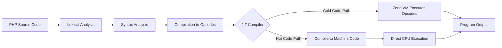

# PHP JIT Compilation

## Introduction

PHP traditionally uses an interpreter to execute code, which can lead to performance limitations. With PHP 8.0, a significant performance enhancement was introduced: Just-In-Time (JIT) compilation. JIT compilation bridges the gap between interpreted languages and compiled languages by converting frequently executed code paths into optimized machine code at runtime.

In this guide, we'll explore PHP's JIT compilation feature, understand how it works, learn how to enable and configure it, and see practical examples of its impact on performance.

## What is JIT Compilation?

JIT compilation is a technique that analyzes code during execution and compiles frequently used parts into machine code, which can then be executed directly by the CPU. This process happens "just in time" – meaning the compilation occurs during program execution rather than before it starts.

### How PHP Execution Worked Before JIT

Before diving into JIT, let's understand PHP's traditional execution model:


In this model:
1. PHP code is parsed and converted into opcodes (operation codes)
2. The Zend Virtual Machine (VM) interprets these opcodes one by one
3. Each opcode is executed through the VM, which introduces overhead

### How PHP JIT Changes Execution

With JIT enabled, the execution model changes:



In this enhanced model:
1. PHP still compiles code to opcodes
2. The JIT compiler identifies "hot" code paths (frequently executed code)
3. These hot paths are compiled to native machine code
4. The CPU can execute this machine code directly, bypassing the Zend VM interpreter
5. Less frequently used code still runs through the traditional interpreter

## Enabling and Configuring JIT in PHP

PHP JIT is part of the OPcache extension and is disabled by default. To enable and configure it, you need to modify your `php.ini` file.

### Basic JIT Configuration

```ini
; Enable OPcache
opcache.enable=1
opcache.enable_cli=1

; Enable JIT
opcache.jit_buffer_size=100M
opcache.jit=1235
```

Let's break down these settings:

- `opcache.enable=1` and `opcache.enable_cli=1`: Enables OPcache for web and CLI environments
- `opcache.jit_buffer_size=100M`: Allocates 100MB of memory for JIT-compiled code
- `opcache.jit=1235`: Sets the JIT mode (explained below)

### Understanding JIT Modes

The `opcache.jit` setting uses a 4-digit number (CRTO) that controls different aspects of JIT compilation:

1. **C - Tracing JIT Compilation Trigger (0-9)**
   - 0: Disable JIT
   - 1: Enable JIT for functions and loops only when their inferred types don't change (most conservative)
   - 2-9: Various thresholds for triggering compilation

2. **R - Register Allocation (0-2)**
   - 0: No register allocation (uses memory)
   - 1: Local linear-scan register allocation
   - 2: Global linear-scan register allocation (most aggressive)

3. **T - JIT Trigger (0-5)**
   - 0: JIT everything on script load
   - 1: JIT functions when they execute
   - 2-5: Various trigger methods based on function usage counts

4. **O - Optimization Level (0-5)**
   - 0: No optimizations
   - 5: Maximum optimizations

The recommended setting `1235` means:
- 1: JIT triggers on hot functions with consistent types
- 2: Global register allocation
- 3: JIT compiles functions after executing them 3 times
- 5: Maximum optimizations

### Checking JIT Status

You can verify if JIT is enabled by checking phpinfo() or running:

```php
<?php
echo "JIT: ", (ini_get('opcache.jit') ? 'Enabled' : 'Disabled'), "
";
echo "JIT Buffer Size: ", ini_get('opcache.jit_buffer_size'), "
";
?>
```

**Output:**
```
JIT: Enabled
JIT Buffer Size: 100M
```

## Practical Examples of JIT Impact

Let's look at some examples to see how JIT affects PHP performance.

### Example 1: CPU-Intensive Operations

The most significant impact of JIT is on CPU-intensive operations. Here's a simple benchmark for calculating Fibonacci numbers:

```php
<?php
// File: fibonacci_benchmark.php

// Functions with different implementations
function fibonacci_recursive($n) {
    if ($n <= 1) return $n;
    return fibonacci_recursive($n - 1) + fibonacci_recursive($n - 2);
}

function fibonacci_iterative($n) {
    if ($n <= 1) return $n;
    
    $a = 0;
    $b = 1;
    
    for ($i = 2; $i <= $n; $i++) {
        $c = $a + $b;
        $a = $b;
        $b = $c;
    }
    
    return $b;
}

// Benchmark function
function benchmark($func, $param, $iterations) {
    $start = microtime(true);
    
    for ($i = 0; $i < $iterations; $i++) {
        $func($param);
    }
    
    $end = microtime(true);
    return ($end - $start) * 1000; // Return time in milliseconds
}

// Run benchmarks
echo "Running benchmarks with JIT " . (ini_get('opcache.jit') ? 'enabled' : 'disabled') . ":

";

// Iterative approach (efficient algorithm)
$ms = benchmark('fibonacci_iterative', 30, 10000);
echo "Fibonacci iterative (n=30, 10,000 iterations): {$ms}ms
";

// Recursive approach (inefficient algorithm, benefits more from JIT)
$ms = benchmark('fibonacci_recursive', 20, 10);
echo "Fibonacci recursive (n=20, 10 iterations): {$ms}ms
";
?>
```

To compare JIT impact, run the script with JIT disabled and enabled:

```bash
# Disabled JIT
php -dopcache.enable=1 -dopcache.enable_cli=1 -dopcache.jit=0 fibonacci_benchmark.php

# Enabled JIT
php -dopcache.enable=1 -dopcache.enable_cli=1 -dopcache.jit=1235 -dopcache.jit_buffer_size=100M fibonacci_benchmark.php
```

**Sample Results:**
```
# Without JIT
Running benchmarks with JIT disabled:

Fibonacci iterative (n=30, 10,000 iterations): 124.7ms
Fibonacci recursive (n=20, 10 iterations): 1342.3ms

# With JIT
Running benchmarks with JIT enabled:

Fibonacci iterative (n=30, 10,000 iterations): 62.1ms
Fibonacci recursive (n=20, 10 iterations): 428.6ms
```

We can see significant performance improvements, especially for the recursive function, which has many function calls and repetitive calculations.

### Example 2: Real-World Application - Image Processing

Let's examine a more practical example with image processing:

```php
<?php
// File: image_processing.php

// Define an image processing function that applies a simple blur effect
function applyBlur($imageData, $width, $height, $radius = 1) {
    $result = array_fill(0, $width * $height, 0);
    
    for ($y = 0; $y < $height; $y++) {
        for ($x = 0; $x < $width; $x++) {
            $totalR = $totalG = $totalB = 0;
            $count = 0;
            
            // Gather pixel values in a radius
            for ($ky = max(0, $y - $radius); $ky <= min($height - 1, $y + $radius); $ky++) {
                for ($kx = max(0, $x - $radius); $kx <= min($width - 1, $x + $radius); $kx++) {
                    $idx = $ky * $width + $kx;
                    $totalR += ($imageData[$idx] >> 16) & 0xFF;
                    $totalG += ($imageData[$idx] >> 8) & 0xFF;
                    $totalB += $imageData[$idx] & 0xFF;
                    $count++;
                }
            }
            
            // Average the values
            $avgR = (int)($totalR / $count);
            $avgG = (int)($totalG / $count);
            $avgB = (int)($totalB / $count);
            
            // Store the result
            $result[$y * $width + $x] = ($avgR << 16) | ($avgG << 8) | $avgB;
        }
    }
    
    return $result;
}

// Create a test image (a simple gradient)
function createTestImage($width, $height) {
    $image = [];
    for ($y = 0; $y < $height; $y++) {
        for ($x = 0; $x < $width; $x++) {
            $r = (int)(255 * ($x / $width));
            $g = (int)(255 * ($y / $height));
            $b = (int)(255 * (($x + $y) / ($width + $height)));
            $image[$y * $width + $x] = ($r << 16) | ($g << 8) | $b;
        }
    }
    return $image;
}

// Run the benchmark
$width = 500;
$height = 500;
$image = createTestImage($width, $height);

$start = microtime(true);
$result = applyBlur($image, $width, $height, 2);
$end = microtime(true);

printf("Image processing completed in %.4f seconds
", $end - $start);
printf("JIT status: %s
", ini_get('opcache.jit') ? 'enabled' : 'disabled');
?>
```

This example processes a 500×500 pixel image by applying a simple blur filter. With JIT enabled, you might see performance improvements like:

**Sample Results:**
```
# Without JIT
Image processing completed in 1.9875 seconds
JIT status: disabled

# With JIT
Image processing completed in 0.7246 seconds
JIT status: enabled
```

## When to Use JIT

JIT provides the most benefit in specific scenarios:

### Good Candidates for JIT
- **CPU-bound applications**: Mathematical calculations, simulations, data processing
- **Long-running scripts**: CLI applications, background processes
- **Hot loops**: Code that executes the same paths many times

### Less Affected by JIT
- **I/O-bound applications**: Database-heavy websites, file operations
- **Simple scripts**: Quick, straightforward pages with minimal logic
- **Frequently changing code paths**: Code with unpredictable execution patterns

## JIT Performance Considerations

When working with JIT, keep these factors in mind:

1. **Memory Usage**: JIT requires additional memory for the buffer
2. **Warm-up Time**: JIT needs time to identify and compile hot code paths
3. **Type Consistency**: JIT performs best with consistent variable types

## Troubleshooting JIT Issues

If you encounter problems with JIT:

1. **Verify Configuration**: Ensure OPcache and JIT are properly configured
2. **Check Buffer Size**: If you see "JIT buffer full" errors, increase `opcache.jit_buffer_size`
3. **Debug with Statistics**: Use `opcache_get_status()` to check JIT statistics:

```php
<?php
$status = opcache_get_status(true);
echo "JIT buffer size: ", $status['jit']['buffer_size'], "
";
echo "JIT buffer used: ", $status['jit']['buffer_used'], "
";
?>
```

## Summary

PHP's JIT compilation is a powerful feature that can significantly improve performance for CPU-intensive applications. By understanding how JIT works and when to use it, you can optimize your PHP applications for better performance.

Key takeaways:
- JIT compiles frequently executed code to machine code
- Greatest benefits are seen in CPU-bound and long-running applications
- Configuration through OPcache settings in php.ini
- Can provide 2-3x performance improvement for suitable workloads

## Additional Resources

1. [PHP OPcache Documentation](https://www.php.net/manual/en/book.opcache.php)
2. [PHP 8.0 JIT RFC](https://wiki.php.net/rfc/jit)
3. [PHP 8 Performance Benchmarks](https://www.php.net/releases/8.0/en.php)

## Exercises

1. **Basic JIT Configuration**
   - Set up JIT with different configuration values and measure the impact on a CPU-intensive script

2. **Algorithm Comparison**
   - Implement different sorting algorithms and compare their performance with and without JIT

3. **Real-world Application**
   - Take an existing PHP application and measure the performance impact of enabling JIT
   - Identify which parts of your application benefit most from JIT

4. **JIT Monitoring**
   - Create a simple monitoring script that reports on JIT buffer usage and compilation statistics