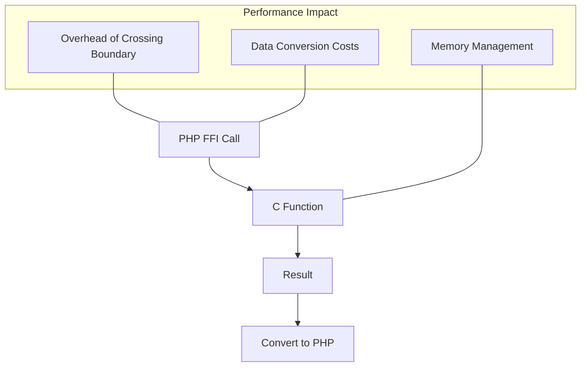

# PHP FFI - Foreign Function Interface

## Introduction

PHP's Foreign Function Interface (FFI) is a powerful feature introduced in PHP 7.4 that allows PHP code to interact directly with libraries written in C. Before FFI, extending PHP with C functionality required writing a PHP extension, which involved complex C programming and compilation steps. With FFI, you can now call functions from external C libraries directly from your PHP code, opening up a whole new world of possibilities without the overhead of creating custom extensions.

In this guide, we'll explore how PHP FFI works, why it's useful, and how you can use it to enhance your PHP applications with functionality from C libraries.

## What is FFI and Why Use It?

FFI (Foreign Function Interface) is a mechanism that allows code written in one programming language to call code written in another language. In PHP's case, FFI primarily focuses on allowing PHP to call C functions.

### Key Benefits of PHP FFI:

1. **Access to system libraries**: Use existing C libraries without PHP extensions
2. **Performance improvements**: Offload computationally intensive tasks to C
3. **Hardware access**: Interface with low-level hardware functionality
4. **Legacy code integration**: Integrate with existing C codebases

### Potential Use Cases:

- Image processing
- Machine learning
- Game development
- System programming
- Cryptocurrency and cryptography
- Scientific computing

## Getting Started with PHP FFI

### Prerequisites

Before using PHP FFI, ensure:

1. You're using PHP 7.4 or later
2. The FFI extension is enabled in your php.ini file
3. You have basic understanding of C programming concepts

To check if FFI is enabled:

```php
<?php
if (extension_loaded('ffi')) {
    echo "FFI extension is loaded!";
} else {
    echo "FFI extension is NOT loaded.";
}
```

### Basic FFI Usage

The general workflow for using FFI involves:

1. Loading a C library
2. Defining the C functions you want to use
3. Calling those functions from PHP

Here's a simple example that calls the C `abs()` function to get the absolute value of a number:

```php
<?php
// Create a new FFI instance
$ffi = FFI::cdef(
    // C function declaration
    "int abs(int);",
    // Library name (libc is the C standard library)
    "libc.so.6"
);

// Call the C function from PHP
$result = $ffi->abs(-42);
echo "The absolute value of -42 is: " . $result;
```

**Output:**
```
The absolute value of -42 is: 42
```

## Creating and Using C Structures

FFI allows you to work with C structures, which is especially useful for complex library interfaces:

```php
<?php
// Define a C structure for a point in 2D space
$ffi = FFI::cdef("
    typedef struct {
        double x;
        double y;
    } Point;
    
    // Function to calculate distance between two points
    double distance(Point p1, Point p2);
", "libgeometry.so"); // Assuming you have a geometry library

// Create instances of the Point structure
$point1 = $ffi->new("Point");
$point1->x = 0.0;
$point1->y = 0.0;

$point2 = $ffi->new("Point");
$point2->x = 3.0;
$point2->y = 4.0;

// Calculate distance using the C function
$distance = $ffi->distance($point1, $point2);
echo "Distance between points: " . $distance;
```

**Output:**
```
Distance between points: 5
```

## Using FFI with Inline C Code

If you don't have a pre-compiled library, you can use FFI with inline C code:

```php
<?php
// Define C code directly
$code = <<<'CODE'
    int multiply(int a, int b) {
        return a * b;
    }
CODE;

// Create a temporary shared object from the C code
$tempFile = tempnam(sys_get_temp_dir(), 'ffi') . '.c';
file_put_contents($tempFile, $code);
exec("gcc -shared -o {$tempFile}.so -fPIC {$tempFile}");

// Load the compiled library
$ffi = FFI::cdef("int multiply(int a, int b);", "{$tempFile}.so");

// Call the function
$result = $ffi->multiply(6, 7);
echo "6 * 7 = " . $result;

// Clean up
unlink($tempFile);
unlink("{$tempFile}.so");
```

**Output:**
```
6 * 7 = 42
```

## Memory Management in FFI

When working with FFI, you're dealing with C memory, which means you need to be mindful of memory management:

```php
<?php
// Define a simple C structure
$ffi = FFI::cdef("
    typedef struct {
        int value;
        char* name;
    } Item;
");

// Allocate memory for the structure
$item = $ffi->new("Item");
$item->value = 100;

// Allocate memory for a string
$name = $ffi->new("char[50]");
FFI::memcpy($name, "PHP FFI Example", strlen("PHP FFI Example") + 1);
$item->name = FFI::addr($name);

// Read values
echo "Item value: " . $item->value . "
";
echo "Item name: " . FFI::string($item->name) . "
";

// Free memory when done (important to avoid memory leaks!)
FFI::free($name);
```

**Output:**
```
Item value: 100
Item name: PHP FFI Example
```

## Real-World Example: Image Processing with libpng

Let's look at a more practical example by using libpng to create a simple PNG image:

```php
<?php
// This example assumes libpng is installed on your system
$ffi = FFI::cdef("
    typedef struct png_struct_def png_struct;
    typedef png_struct* png_structp;
    typedef struct png_info_def png_info;
    typedef png_info* png_infop;
    typedef struct FILE FILE;
    
    png_structp png_create_write_struct(const char* user_png_ver, void* error_ptr, void* error_fn, void* warn_fn);
    png_infop png_create_info_struct(png_structp png_ptr);
    void png_init_io(png_structp png_ptr, FILE* fp);
    void png_set_IHDR(png_structp png_ptr, png_infop info_ptr, int width, int height,
                     int bit_depth, int color_type, int interlace_method,
                     int compression_method, int filter_method);
    void png_write_info(png_structp png_ptr, png_infop info_ptr);
    void png_write_row(png_structp png_ptr, const unsigned char* row);
    void png_write_end(png_structp png_ptr, png_infop info_ptr);
    void png_destroy_write_struct(png_structp* png_ptr_ptr, png_infop* info_ptr_ptr);
    
    FILE* fopen(const char* filename, const char* mode);
    int fclose(FILE* stream);
", "libpng.so.16");

// Function to create a simple gradient PNG image
function createGradientImage($filename, $width, $height) {
    global $ffi;
    
    // Open file for writing
    $fp = $ffi->fopen($filename, "wb");
    if ($fp == null) {
        echo "Failed to open file for writing";
        return false;
    }
    
    // Create PNG write structure
    $png_ptr = $ffi->png_create_write_struct("1.6.37", null, null, null);
    if ($png_ptr == null) {
        $ffi->fclose($fp);
        echo "Failed to create PNG write structure";
        return false;
    }
    
    // Create PNG info structure
    $info_ptr = $ffi->png_create_info_struct($png_ptr);
    if ($info_ptr == null) {
        $ffi->png_destroy_write_struct(FFI::addr($png_ptr), null);
        $ffi->fclose($fp);
        echo "Failed to create PNG info structure";
        return false;
    }
    
    // Initialize PNG I/O
    $ffi->png_init_io($png_ptr, $fp);
    
    // Set PNG header information
    $ffi->png_set_IHDR($png_ptr, $info_ptr, $width, $height, 8, 2, 0, 0, 0);
    $ffi->png_write_info($png_ptr, $info_ptr);
    
    // Create row buffer
    $row = $ffi->new("unsigned char[" . ($width * 3) . "]");
    
    // Write image data - create a simple RGB gradient
    for ($y = 0; $y < $height; $y++) {
        for ($x = 0; $x < $width; $x++) {
            $row[$x * 3] = (int)($x * 255 / $width); // R
            $row[$x * 3 + 1] = (int)($y * 255 / $height); // G
            $row[$x * 3 + 2] = 128; // B
        }
        $ffi->png_write_row($png_ptr, $row);
    }
    
    // Finalize PNG writing
    $ffi->png_write_end($png_ptr, $info_ptr);
    
    // Clean up
    $ffi->png_destroy_write_struct(FFI::addr($png_ptr), FFI::addr($info_ptr));
    $ffi->fclose($fp);
    
    return true;
}

// Create a 256x256 gradient image
if (createGradientImage("gradient.png", 256, 256)) {
    echo "Successfully created gradient.png image!";
} else {
    echo "Failed to create image.";
}
```

## Performance Considerations

When dealing with FFI, there are performance considerations to keep in mind:



For optimal performance:

1. **Minimize boundary crossings**: Batch operations in C rather than making many small FFI calls
2. **Reuse FFI objects**: Create FFI objects once and reuse them
3. **Be careful with memory**: Properly manage memory to avoid leaks
4. **Benchmark**: Always measure performance to ensure FFI is actually providing a benefit

## Safety Considerations and Best Practices

Working with FFI can be risky because it bypasses PHP's safety mechanisms:

1. **Input validation**: Always validate inputs before passing them to C functions
2. **Error handling**: C functions often return error codes rather than throwing exceptions
3. **Memory safety**: Be careful with pointers and manual memory management
4. **Thread safety**: Be aware of thread safety issues if using FFI in multi-threaded environments
5. **Security**: Avoid using FFI with untrusted inputs

Example of safer FFI usage with error handling:

```php
<?php
// Safer FFI usage with error checking
try {
    $ffi = FFI::cdef("
        void* malloc(size_t size);
        void free(void* ptr);
        int* dangerous_function(int value);
    ", "libc.so.6");
    
    // Validate input
    $userInput = filter_input(INPUT_GET, 'value', FILTER_VALIDATE_INT);
    if ($userInput === false || $userInput === null) {
        throw new Exception("Invalid input. Integer required.");
    }
    
    // Call C function with error checking
    $result = $ffi->dangerous_function($userInput);
    if ($result == null) {
        throw new Exception("C function returned NULL pointer");
    }
    
    // Use the result safely
    echo "Result: " . $result[0];
    
    // Always free memory
    $ffi->free($result);
    
} catch (FFI\Exception $e) {
    echo "FFI Error: " . $e->getMessage();
} catch (Exception $e) {
    echo "Error: " . $e->getMessage();
}
```

## Preloading FFI Definitions for Better Performance

PHP 7.4 introduced preloading, which can be combined with FFI to improve performance:

```php
<?php
// File: ffi_preload.php
// This would be included in your php.ini's opcache.preload setting

// Preload common FFI definitions
FFI::load('definitions/libc.h');
FFI::load('definitions/libpng.h');
FFI::load('definitions/custom.h');
```

Then in your application code:

```php
<?php
// Use the preloaded FFI definitions
$libc = FFI::scope("libc");
$result = $libc->abs(-100);
echo "Absolute value: " . $result;
```

## Summary

PHP FFI is a powerful feature that bridges the gap between PHP and C, allowing you to:

1. **Extend PHP's capabilities** without writing PHP extensions
2. **Improve performance** for computationally intensive tasks
3. **Access system libraries** directly from PHP code
4. **Work with low-level hardware** functionality

However, with great power comes great responsibility. When using FFI:

- Be mindful of **memory management**
- Implement proper **error handling**
- Consider **security implications**
- Be aware of **performance considerations**

PHP FFI opens up exciting possibilities for PHP developers, allowing you to combine the ease of PHP with the performance and capabilities of C.

## Additional Resources

- [PHP FFI Documentation](https://www.php.net/manual/en/book.ffi.php)
- [PHP 7.4 Release Notes](https://www.php.net/releases/7_4_0.php)
- [C Programming Language Resources](https://en.cppreference.com/)
- [libffi Project](https://sourceware.org/libffi/)

## Exercises

1. **Basic FFI**: Write a PHP FFI script that calls the C `sqrt()` function to calculate the square root of a number.
2. **String Manipulation**: Create an FFI wrapper for the C `strcpy` and `strlen` functions to manipulate strings.
3. **File Operations**: Use FFI to interact with C file operations like `fopen`, `fread`, and `fwrite`.
4. **Memory Management**: Practice allocating and freeing memory with FFI using `malloc` and `free`.
5. **Challenge**: Create a simple image processing function that uses FFI to convert an image to grayscale using a C library.