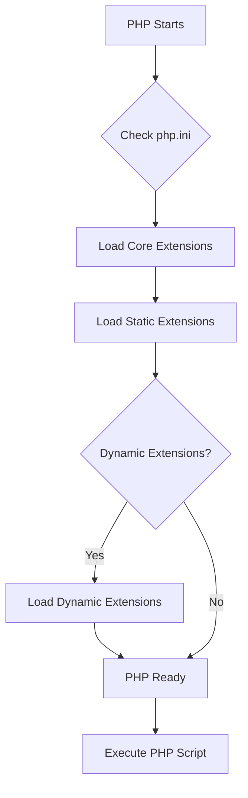

# PHP Extensions

## Introduction

PHP Extensions are modules that extend the core functionality of PHP, allowing developers to add new features, functions, and capabilities to the language. These extensions are typically written in C and compiled into the PHP engine or loaded dynamically at runtime.

Extensions are what make PHP so versatile and powerful - they allow you to interact with databases, manipulate images, handle XML, improve performance, and much more without having to write complex code from scratch.

In this guide, we'll explore what PHP extensions are, how to use built-in extensions, manage extensions in your PHP environment, and even get a glimpse of how to create your own simple extension.

## What Are PHP Extensions?

PHP extensions are modules that add functionality to PHP by providing new functions, classes, or constants that can be used in your PHP code. They fall into several categories:

1. **Core Extensions**: Built directly into PHP and always available (like arrays and strings manipulation)
2. **Bundled Extensions**: Come with PHP but need to be explicitly enabled
3. **External Extensions**: Third-party extensions that can be installed separately
4. **PECL Extensions**: PHP Extension Community Library extensions that can be installed using the PECL installer

Extensions act as a bridge between PHP and other systems or libraries, often wrapping C libraries to make them accessible through PHP code.

## Common PHP Extensions

Here are some essential extensions you'll encounter frequently:

| Extension | Purpose | Example Function |
|-----------|---------|-----------------|
| mysqli/PDO | Database connectivity | `mysqli_connect()`, `PDO::query()` |
| GD | Image manipulation | `imagecreate()` |
| cURL | HTTP requests | `curl_init()` |
| JSON | JSON parsing/encoding | `json_encode()` |
| mbstring | Multibyte string handling | `mb_strlen()` |
| OpenSSL | Cryptography | `openssl_encrypt()` |
| Zip | ZIP archive manipulation | `zip_open()` |

## Checking Installed Extensions

To see which extensions are installed in your PHP environment, you can use:

```php
<?php
// List all loaded extensions
print_r(get_loaded_extensions());

// Check if a specific extension is loaded
if (extension_loaded('mysqli')) {
    echo "MySQLi extension is loaded";
} else {
    echo "MySQLi extension is not loaded";
}
?>
```

Output:
```
Array
(
    [0] => Core
    [1] => date
    [2] => libxml
    [3] => openssl
    [4] => pcre
    [5] => zlib
    [6] => mysqli
    // ... many more extensions
)
MySQLi extension is loaded
```

You can also use the `phpinfo()` function to see detailed information about your PHP installation, including all enabled extensions:

```php
<?php
// Shows all PHP configuration information
phpinfo();
?>
```

## Installing and Enabling Extensions

### On Linux/Unix Systems

1. Using package managers:

```bash
# For Debian/Ubuntu
sudo apt-get install php-gd

# For CentOS/RHEL
sudo yum install php-gd
```

2. Using PECL:

```bash
pecl install redis
```

3. Manual configuration by editing `php.ini`:

```ini
; Uncomment or add this line in php.ini
extension=gd
```

After making changes, restart your web server:

```bash
sudo systemctl restart apache2    # For Apache
sudo systemctl restart php-fpm    # For PHP-FPM
```

### On Windows

1. Locate your `php.ini` file (usually in your PHP installation directory)
2. Uncomment (remove the semicolon) or add the extension line:

```ini
extension=gd
```

3. Restart your web server

## Using Extensions in Your Code

Once an extension is installed and enabled, you can use its functions, classes, and constants in your PHP code. Let's look at some practical examples:

### Example 1: Image Manipulation with GD

```php
<?php
// Create a 200x100 image
$image = imagecreatetruecolor(200, 100);

// Allocate colors
$background = imagecolorallocate($image, 255, 255, 255); // White
$textColor = imagecolorallocate($image, 0, 0, 255);     // Blue

// Fill the background
imagefill($image, 0, 0, $background);

// Add some text
imagestring($image, 5, 50, 40, 'Hello World!', $textColor);

// Output the image
header('Content-Type: image/png');
imagepng($image);

// Free memory
imagedestroy($image);
?>
```

This code creates a simple PNG image with "Hello World!" text using the GD extension.

### Example 2: Database Connection with MySQLi

```php
<?php
// Connect to the database
$mysqli = new mysqli('localhost', 'username', 'password', 'database');

// Check connection
if ($mysqli->connect_errno) {
    echo "Failed to connect to MySQL: " . $mysqli->connect_error;
    exit();
}

// Perform a query
$result = $mysqli->query("SELECT name, email FROM users LIMIT 5");

// Process results
echo "<h2>User List</h2>";
echo "<ul>";
while ($row = $result->fetch_assoc()) {
    echo "<li>" . htmlspecialchars($row['name']) . " - " . htmlspecialchars($row['email']) . "</li>";
}
echo "</ul>";

// Close connection
$mysqli->close();
?>
```

This example shows how to use the MySQLi extension to connect to a database and display user information.

### Example 3: HTTP Requests with cURL

```php
<?php
// Initialize a cURL session
$curl = curl_init();

// Set cURL options
curl_setopt($curl, CURLOPT_URL, "https://api.example.com/data");
curl_setopt($curl, CURLOPT_RETURNTRANSFER, true);
curl_setopt($curl, CURLOPT_HTTPHEADER, [
    'Content-Type: application/json',
    'Authorization: Bearer your-api-token'
]);

// Execute the request
$response = curl_exec($curl);

// Check for errors
if (curl_errno($curl)) {
    echo "cURL Error: " . curl_error($curl);
} else {
    // Process the response
    $data = json_decode($response, true);
    echo "Received " . count($data['items']) . " items from the API";
    
    // Display the first item
    if (!empty($data['items'])) {
        echo "<pre>";
        print_r($data['items'][0]);
        echo "</pre>";
    }
}

// Close the cURL session
curl_close($curl);
?>
```

This example demonstrates using the cURL extension to make an API request and process the JSON response.

## Extension Loading Process

To better understand how PHP extensions work, let's look at the extension loading process:



PHP loads extensions in a specific order:
1. Core extensions (always available)
2. Static extensions (compiled directly into PHP)
3. Dynamic extensions (specified in php.ini)

## Creating a Simple PHP Extension

Creating your own PHP extension requires C programming knowledge. Here's a simplified example of what a basic extension looks like:

```c
// hello_world.c
#include "php.h"

// Function declaration
PHP_FUNCTION(hello_world);

// List of functions provided by this extension
static const zend_function_entry hello_functions[] = {
    PHP_FE(hello_world, NULL)
    PHP_FE_END
};

// Extension entry
zend_module_entry hello_module_entry = {
    STANDARD_MODULE_HEADER,
    "hello", // Extension name
    hello_functions, // Functions
    NULL, NULL, NULL, NULL, NULL, // Various callbacks
    "1.0", // Version
    STANDARD_MODULE_PROPERTIES
};

// Initialize extension
ZEND_GET_MODULE(hello)

// Implement hello_world function
PHP_FUNCTION(hello_world) {
    RETURN_STRING("Hello, World from a PHP extension!");
}
```

To compile this extension, you would typically use:

```bash
phpize
./configure
make
make install
```

Then add `extension=hello.so` to your php.ini file.

Once installed, you could use it in PHP:

```php
<?php
echo hello_world(); // Output: Hello, World from a PHP extension!
?>
```

Creating an extension is advanced, but understanding the basics helps you appreciate what happens behind the scenes.

## Best Practices for Using Extensions

1. **Check Extension Availability**: Always check if an extension is loaded before using its functions:

```php
<?php
if (!extension_loaded('imagick')) {
    die("The Imagick extension is required for this script.");
}
?>
```

2. **Fallback Mechanism**: Provide alternatives when extensions might not be available:

```php
<?php
if (extension_loaded('gd')) {
    // Use GD functions for image processing
} elseif (extension_loaded('imagick')) {
    // Use ImageMagick as an alternative
} else {
    // Inform the user or use a basic alternative
}
?>
```

3. **Extension Version Checking**: Some functions may only be available in newer versions:

```php
<?php
if (extension_loaded('openssl')) {
    // Check for specific function availability
    if (function_exists('openssl_encrypt')) {
        // Use advanced encryption
    } else {
        // Use basic encryption or alternative
    }
}
?>
```

## Common Extension Issues and Troubleshooting

### Problem: Extension Not Loading

**Solution**:
- Verify the extension file exists in the extension directory
- Check php.ini for proper extension line
- Look for errors in PHP logs
- Ensure proper file permissions

### Problem: Dependency Issues

**Solution**:
- Install required libraries (e.g., libpng for GD)
- Verify compatible versions of dependencies
- Check for conflicting extensions

### Debugging Extensions:

```php
<?php
// Enable error reporting
error_reporting(E_ALL);
ini_set('display_errors', 1);

// Check extension directory
echo "Extension directory: ", ini_get('extension_dir'), "
";

// Check specific extension
var_dump(extension_loaded('mysqli'));

// Check for function availability
var_dump(function_exists('imagecreate'));
?>
```

## Summary

PHP Extensions are powerful modules that extend PHP's functionality, allowing you to interact with various systems and perform specialized operations. In this guide, we've covered:

- What PHP extensions are and their types
- How to check installed extensions
- Installing and enabling extensions
- Using extensions in your code with practical examples
- The extension loading process
- A brief introduction to creating your own extensions
- Best practices and troubleshooting tips

With this knowledge, you can now take advantage of PHP's extensibility to enhance your applications with additional functionality beyond the language's core features.

## Additional Resources

- [PHP Manual: Extensions](https://www.php.net/manual/en/extensions.php)
- [PECL - PHP Extension Community Library](https://pecl.php.net/)
- [PHP Internals Book](https://www.phpinternalsbook.com/)
- [Zend Extension API](https://www.zend.com/resources/php-extensions)

## Exercises

1. Install the GD extension and create a script that generates a dynamic banner with custom text.
2. Create a script that checks for the availability of five different extensions and reports their status.
3. Use the cURL extension to create a simple weather widget that fetches data from a public API.
4. Compare the performance of native PHP functions versus extension functions for a common task (like string manipulation using standard functions vs. mbstring).
5. Research and write a report on three PECL extensions that you find interesting and how they could be used in a web application.