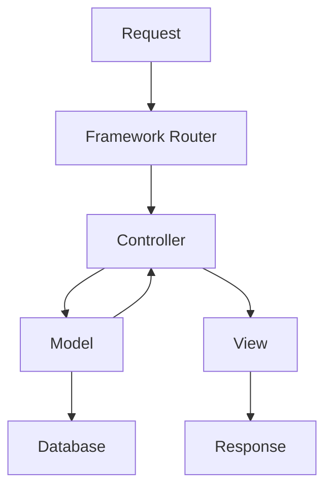

# PHP Frameworks Overview

## Introduction

PHP frameworks provide developers with structured, reusable code to accelerate web application development. Instead of building everything from scratch, frameworks offer pre-built components for common tasks like database operations, form validation, and security features. This allows developers to focus on building application logic rather than reinventing the wheel.

In this guide, we'll explore what PHP frameworks are, why they're beneficial, and compare some of the most popular options available today.

## What is a PHP Framework?

A PHP framework is a platform for developing PHP applications that provides a basic structure to streamline the development process. Frameworks follow the MVC (Model-View-Controller) architectural pattern or similar organizational approaches to separate application logic from the user interface.



## Why Use a PHP Framework?

Using a framework offers several advantages:

- **Efficiency**: Developers can focus on building unique features rather than writing boilerplate code
- **Security**: Frameworks implement best practices to protect against common vulnerabilities
- **Organization**: Code follows a structured pattern, making it easier to maintain
- **Collaboration**: Team members can work on different components simultaneously
- **Community Support**: Popular frameworks have large communities for support and resources

## Popular PHP Frameworks

### Laravel

Laravel is one of the most popular PHP frameworks, known for its elegant syntax and comprehensive feature set.

#### Key Features

- Eloquent ORM for simplified database interactions
- Blade templating engine
- Artisan command-line interface
- Built-in authentication and authorization

#### Example: Basic Laravel Route and Controller

```php
// routes/web.php
Route::get('/hello', 'GreetingController@hello');

// app/Http/Controllers/GreetingController.php
namespace App\Http\Controllers;

class GreetingController extends Controller
{
    public function hello()
    {
        return view('greeting', ['name' => 'World']);
    }
}
```

#### Output (in views/greeting.blade.php)
```html
<h1>Hello, {{ $name }}!</h1>
```

When a user visits `/hello`, they'll see "Hello, World!" rendered on the page.

### Symfony

Symfony is a set of reusable PHP components and a full-stack framework known for its stability and flexibility.

#### Key Features

- Modular components that can be used independently
- Doctrine ORM integration
- Twig templating engine
- Highly configurable

#### Example: Basic Symfony Controller

```php
// src/Controller/GreetingController.php
namespace App\Controller;

use Symfony\Component\HttpFoundation\Response;
use Symfony\Component\Routing\Annotation\Route;

class GreetingController
{
    /**
     * @Route("/hello")
     */
    public function hello(): Response
    {
        return new Response('<h1>Hello, World!</h1>');
    }
}
```

### CodeIgniter

CodeIgniter is known for its small footprint, simplicity, and speed.

#### Key Features

- Lightweight system with minimal configuration
- Excellent performance
- Built-in security tools
- Simple, clear documentation

#### Example: Basic CodeIgniter Controller

```php
// app/Controllers/Greeting.php
namespace App\Controllers;

class Greeting extends BaseController
{
    public function hello()
    {
        return view('greeting_view', ['name' => 'World']);
    }
}
```

### CakePHP

CakePHP follows convention over configuration principles to speed up development.

#### Key Features

- Convention over configuration
- Built-in validation
- ORM for database interactions
- Security components

#### Example: Basic CakePHP Controller

```php
// src/Controller/GreetingsController.php
namespace App\Controller;

class GreetingsController extends AppController
{
    public function hello()
    {
        $this->set('name', 'World');
    }
}
```

## Comparing Frameworks

Let's compare these frameworks across several dimensions:

| Framework  | Learning Curve | Performance | Size | Community Support | Best For |
|------------|----------------|-------------|------|------------------|----------|
| Laravel    | Moderate       | Good        | Large | Excellent        | Feature-rich applications |
| Symfony    | Steep          | Good        | Large | Excellent        | Enterprise applications |
| CodeIgniter| Gentle         | Excellent   | Small | Good             | Lightweight applications |
| CakePHP    | Moderate       | Good        | Medium | Good            | Rapid development |

## How to Choose a PHP Framework

When selecting a framework, consider:

1. **Project requirements**: Complex projects may benefit from feature-rich frameworks like Laravel or Symfony
2. **Team expertise**: Consider the learning curve and your team's familiarity
3. **Performance needs**: Lightweight frameworks like CodeIgniter offer better performance for simple applications
4. **Community support**: Larger communities provide more resources and third-party packages
5. **Long-term maintenance**: Consider the framework's future and update frequency

## Getting Started with a Framework

Let's see how to set up a basic Laravel project as an example:

```bash
# Install Laravel via Composer
composer create-project laravel/laravel my-first-app

# Navigate to the project directory
cd my-first-app

# Start the development server
php artisan serve
```

After running these commands, you'll have a working Laravel application at `http://localhost:8000`.

## Real-World Application Example

Let's create a simple task management API using Laravel:

```php
// Create a model and migration
// php artisan make:model Task -m

// database/migrations/xxxx_create_tasks_table.php
public function up()
{
    Schema::create('tasks', function (Blueprint $table) {
        $table->id();
        $table->string('title');
        $table->text('description')->nullable();
        $table->boolean('completed')->default(false);
        $table->timestamps();
    });
}

// app/Models/Task.php
namespace App\Models;

use Illuminate\Database\Eloquent\Model;

class Task extends Model
{
    protected $fillable = ['title', 'description', 'completed'];
}

// Create a controller
// php artisan make:controller TaskController --api

// app/Http/Controllers/TaskController.php
namespace App\Http\Controllers;

use App\Models\Task;
use Illuminate\Http\Request;

class TaskController extends Controller
{
    public function index()
    {
        return Task::all();
    }
    
    public function store(Request $request)
    {
        $request->validate([
            'title' => 'required|string|max:255',
        ]);
        
        return Task::create($request->all());
    }
    
    public function show(Task $task)
    {
        return $task;
    }
    
    public function update(Request $request, Task $task)
    {
        $task->update($request->all());
        return $task;
    }
    
    public function destroy(Task $task)
    {
        $task->delete();
        return response()->json(['message' => 'Task deleted']);
    }
}

// routes/api.php
use App\Http\Controllers\TaskController;

Route::apiResource('tasks', TaskController::class);
```

This example demonstrates how Laravel simplifies creating a RESTful API with database integration, validation, and routing.

## Summary

PHP frameworks significantly speed up web application development by providing structured environments with pre-built components for common tasks. The major frameworks each have their strengths:

- **Laravel**: Elegant, feature-rich, and great for modern web applications
- **Symfony**: Modular, highly configurable, and excellent for enterprise applications
- **CodeIgniter**: Lightweight, high-performance, and easy to learn
- **CakePHP**: Convention-based and great for rapid development

When choosing a framework, consider your project requirements, team expertise, and long-term maintenance needs.

## Additional Resources

- [Official Laravel Documentation](https://laravel.com/docs)
- [Symfony Documentation](https://symfony.com/doc)
- [CodeIgniter User Guide](https://codeigniter.com/user_guide)
- [CakePHP Documentation](https://book.cakephp.org/)

## Exercises

1. Install Laravel and create a simple "Hello World" application
2. Create a basic CRUD application using one of the frameworks discussed
3. Compare how routing works in Laravel vs. Symfony
4. Build a simple blog application with user authentication using your chosen framework
5. Research and evaluate one additional PHP framework not covered in this guide