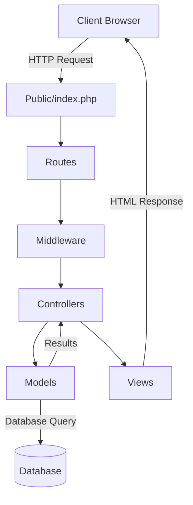

# PHP Laravel Basics

## Introduction

Laravel is a free, open-source PHP framework created by Taylor Otwell in 2011. It has quickly become one of the most popular PHP frameworks due to its elegant syntax, robust features, and developer-friendly approach. Laravel follows the Model-View-Controller (MVC) architectural pattern, making it easier to organize and maintain your code.

In this guide, we'll explore the fundamentals of Laravel and learn how to build web applications using this powerful framework.

## Why Use Laravel?

Before diving into Laravel's features, let's understand why it's beneficial to use Laravel over plain PHP:

- **Elegant Syntax**: Laravel's code is expressive and readable
- **Built-in Tools**: Authentication, routing, sessions, and caching are all pre-built
- **MVC Architecture**: Helps organize code in a maintainable structure
- **Eloquent ORM**: Simplifies database interactions
- **Artisan CLI**: Command-line interface for automating tasks
- **Robust Ecosystem**: Extensive packages and documentation
- **Community Support**: Large community for help and resources

## Prerequisites

Before starting with Laravel, you should have:

- Basic PHP knowledge
- Understanding of object-oriented programming concepts
- Familiarity with HTML/CSS
- Composer (PHP dependency manager) installed
- A local development environment with PHP ≥ 8.1

## Installing Laravel

There are several ways to install Laravel, but the easiest is using Composer:

```bash
composer create-project laravel/laravel my-laravel-app
cd my-laravel-app
php artisan serve
```

After running these commands, you should see output indicating that your Laravel application is running. By default, the application will be available at `http://localhost:8000`.

## Laravel Directory Structure

Laravel's directory structure is organized to make development intuitive. Here are the key directories and their purposes:

```
/app           - Contains the core code of your application
/bootstrap     - Contains files that bootstrap the framework
/config        - Contains configuration files
/database      - Contains database migrations and seeds
/public        - Contains the index.php file, the entry point for all requests
/resources     - Contains views, raw assets like LESS, SASS, etc.
/routes        - Contains all route definitions
/storage       - Contains compiled Blade templates, file-based sessions, etc.
/tests         - Contains automated tests
/vendor        - Contains Composer dependencies
```

## Understanding Routing

Routing in Laravel allows you to map URLs to controller actions. Routes are defined in the `/routes/web.php` file.

### Basic Route Example

```php
// routes/web.php
Route::get('/', function () {
    return view('welcome');
});

Route::get('/hello', function () {
    return 'Hello, World!';
});
```

When you visit `http://localhost:8000/hello`, you'll see "Hello, World!" displayed in your browser.

### Route Parameters

You can capture segments of the URL using route parameters:

```php
Route::get('/user/{id}', function ($id) {
    return 'User ID: ' . $id;
});
```

Visiting `http://localhost:8000/user/1` will display "User ID: 1".

### Named Routes

You can assign names to routes for easier referencing:

```php
Route::get('/profile', function () {
    return view('profile');
})->name('profile');
```

You can generate URLs to this route using:

```php
$url = route('profile');
```

## Working with Controllers

Controllers organize your route logic in separate classes. They are stored in the `app/Http/Controllers` directory.

### Creating a Controller

You can create a controller using Artisan:

```bash
php artisan make:controller UserController
```

This creates `app/Http/Controllers/UserController.php`.

### Basic Controller Example

```php
// app/Http/Controllers/UserController.php
namespace App\Http\Controllers;

use App\Http\Controllers\Controller;

class UserController extends Controller
{
    public function index()
    {
        return 'User List';
    }
    
    public function show($id)
    {
        return 'User ID: ' . $id;
    }
}
```

### Connecting Routes to Controllers

```php
// routes/web.php
use App\Http\Controllers\UserController;

Route::get('/users', [UserController::class, 'index']);
Route::get('/users/{id}', [UserController::class, 'show']);
```

## Blade Templating

Blade is Laravel's templating engine that allows you to write clean, reusable templates. Blade files are stored in the `resources/views` directory and have a `.blade.php` extension.

### Creating a Basic Blade Template

Create a file `resources/views/greeting.blade.php`:

```php
<!DOCTYPE html>
<html>
<head>
    <title>Greeting Page</title>
</head>
<body>
    <h1>Hello, {{ $name }}</h1>
</body>
</html>
```

### Rendering a Blade Template

```php
Route::get('/greeting/{name}', function ($name) {
    return view('greeting', ['name' => $name]);
});
```

Visiting `http://localhost:8000/greeting/John` will display a page with "Hello, John".

### Blade Directives

Blade provides directives for common PHP structures:

```php
@if($condition)
    This will only display if the condition is true.
@else
    This will display if the condition is false.
@endif

@foreach($users as $user)
    <p>{{ $user->name }}</p>
@endforeach
```

### Template Inheritance

Blade allows template inheritance using `@extends` and `@section`:

Create a layout file `resources/views/layouts/app.blade.php`:

```php
<!DOCTYPE html>
<html>
<head>
    <title>@yield('title')</title>
</head>
<body>
    <header>
        <h1>My Laravel App</h1>
    </header>
    
    <main>
        @yield('content')
    </main>
    
    <footer>
        <p>&copy; 2025 My Laravel App</p>
    </footer>
</body>
</html>
```

Create a child template `resources/views/home.blade.php`:

```php
@extends('layouts.app')

@section('title', 'Home Page')

@section('content')
    <h2>Welcome to our website!</h2>
    <p>This is the content of the home page.</p>
@endsection
```

## Working with Models and Databases

Laravel's Eloquent ORM (Object-Relational Mapping) makes working with databases easy. Models represent database tables and are stored in the `app/Models` directory.

### Database Configuration

Configure your database connection in the `.env` file:

```
DB_CONNECTION=mysql
DB_HOST=127.0.0.1
DB_PORT=3306
DB_DATABASE=laravel
DB_USERNAME=root
DB_PASSWORD=
```

### Creating a Model and Migration

```bash
php artisan make:model Post --migration
```

This creates:
- `app/Models/Post.php` (model)
- A migration file in `database/migrations/`

Edit the migration file:

```php
// database/migrations/xxxx_xx_xx_create_posts_table.php
public function up()
{
    Schema::create('posts', function (Blueprint $table) {
        $table->id();
        $table->string('title');
        $table->text('content');
        $table->timestamps();
    });
}
```

Run the migration to create the table:

```bash
php artisan migrate
```

### Basic Eloquent Model Usage

```php
// app/Models/Post.php
namespace App\Models;

use Illuminate\Database\Eloquent\Model;

class Post extends Model
{
    // Fields that can be mass-assigned
    protected $fillable = ['title', 'content'];
}
```

### CRUD Operations with Eloquent

```php
// Creating a record
$post = new Post;
$post->title = 'My First Post';
$post->content = 'Hello, Laravel!';
$post->save();

// Alternative way to create
Post::create([
    'title' => 'My Second Post',
    'content' => 'Learning Laravel is fun!'
]);

// Reading records
$allPosts = Post::all();
$firstPost = Post::find(1);
$recentPosts = Post::where('created_at', '>=', now()->subDay())->get();

// Updating a record
$post = Post::find(1);
$post->title = 'Updated Title';
$post->save();

// Deleting a record
$post = Post::find(1);
$post->delete();

// Alternative deletion
Post::destroy(1);
Post::destroy([1, 2, 3]);
```

## Forms and Validation

Laravel provides powerful tools for handling forms and validating input.

### Creating a Form

```php
<!-- resources/views/posts/create.blade.php -->
@extends('layouts.app')

@section('content')
    <h2>Create New Post</h2>
    
    @if ($errors->any())
        <div class="alert alert-danger">
            <ul>
                @foreach ($errors->all() as $error)
                    <li>{{ $error }}</li>
                @endforeach
            </ul>
        </div>
    @endif
    
    <form method="POST" action="{{ route('posts.store') }}">
        @csrf
        
        <div>
            <label for="title">Title:</label>
            <input type="text" id="title" name="title" value="{{ old('title') }}">
        </div>
        
        <div>
            <label for="content">Content:</label>
            <textarea id="content" name="content">{{ old('content') }}</textarea>
        </div>
        
        <button type="submit">Create Post</button>
    </form>
@endsection
```

### Form Controller Methods

```php
// app/Http/Controllers/PostController.php
public function create()
{
    return view('posts.create');
}

public function store(Request $request)
{
    $validated = $request->validate([
        'title' => 'required|max:255',
        'content' => 'required',
    ]);
    
    Post::create($validated);
    
    return redirect()->route('posts.index')
        ->with('success', 'Post created successfully.');
}
```

### Route Definitions for Forms

```php
// routes/web.php
Route::get('/posts/create', [PostController::class, 'create'])->name('posts.create');
Route::post('/posts', [PostController::class, 'store'])->name('posts.store');
```

## Laravel Architecture Diagram



## Practical Example: Building a Simple Task List

Let's build a simple task list application using Laravel:

### 1. Create a Task Model and Migration

```bash
php artisan make:model Task --migration
```

Edit the migration:

```php
// database/migrations/xxxx_xx_xx_create_tasks_table.php
public function up()
{
    Schema::create('tasks', function (Blueprint $table) {
        $table->id();
        $table->string('name');
        $table->boolean('completed')->default(false);
        $table->timestamps();
    });
}
```

Run the migration:

```bash
php artisan migrate
```

### 2. Create a Task Controller

```bash
php artisan make:controller TaskController --resource
```

### 3. Define Routes

```php
// routes/web.php
use App\Http\Controllers\TaskController;

Route::get('/', [TaskController::class, 'index']);
Route::resource('tasks', TaskController::class);
```

### 4. Implement the Controller

```php
// app/Http/Controllers/TaskController.php
namespace App\Http\Controllers;

use App\Models\Task;
use Illuminate\Http\Request;

class TaskController extends Controller
{
    public function index()
    {
        $tasks = Task::orderBy('created_at', 'desc')->get();
        return view('tasks.index', compact('tasks'));
    }

    public function create()
    {
        return view('tasks.create');
    }

    public function store(Request $request)
    {
        $validated = $request->validate([
            'name' => 'required|max:255',
        ]);

        Task::create($validated);

        return redirect()->route('tasks.index')
            ->with('success', 'Task created successfully.');
    }

    public function edit(Task $task)
    {
        return view('tasks.edit', compact('task'));
    }

    public function update(Request $request, Task $task)
    {
        $validated = $request->validate([
            'name' => 'required|max:255',
            'completed' => 'boolean',
        ]);

        $task->update($validated);

        return redirect()->route('tasks.index')
            ->with('success', 'Task updated successfully.');
    }

    public function destroy(Task $task)
    {
        $task->delete();

        return redirect()->route('tasks.index')
            ->with('success', 'Task deleted successfully.');
    }
}
```

### 5. Create Views

Task list index (`resources/views/tasks/index.blade.php`):

```php
@extends('layouts.app')

@section('content')
    <h1>Task List</h1>
    
    @if (session('success'))
        <div class="alert alert-success">
            {{ session('success') }}
        </div>
    @endif
    
    <a href="{{ route('tasks.create') }}" class="btn">Create New Task</a>
    
    @if (count($tasks) > 0)
        <ul class="task-list">
            @foreach ($tasks as $task)
                <li class="{{ $task->completed ? 'completed' : '' }}">
                    <span>{{ $task->name }}</span>
                    
                    <div class="actions">
                        <form method="POST" action="{{ route('tasks.update', $task->id) }}">
                            @csrf
                            @method('PATCH')
                            <input type="hidden" name="name" value="{{ $task->name }}">
                            <input type="hidden" name="completed" value="{{ $task->completed ? '0' : '1' }}">
                            <button type="submit">
                                {{ $task->completed ? 'Mark Incomplete' : 'Mark Complete' }}
                            </button>
                        </form>
                        
                        <a href="{{ route('tasks.edit', $task->id) }}">Edit</a>
                        
                        <form method="POST" action="{{ route('tasks.destroy', $task->id) }}">
                            @csrf
                            @method('DELETE')
                            <button type="submit" onclick="return confirm('Are you sure?')">Delete</button>
                        </form>
                    </div>
                </li>
            @endforeach
        </ul>
    @else
        <p>No tasks yet.</p>
    @endif
@endsection
```

Create task form (`resources/views/tasks/create.blade.php`):

```php
@extends('layouts.app')

@section('content')
    <h1>Create New Task</h1>
    
    @if ($errors->any())
        <div class="alert alert-danger">
            <ul>
                @foreach ($errors->all() as $error)
                    <li>{{ $error }}</li>
                @endforeach
            </ul>
        </div>
    @endif
    
    <form method="POST" action="{{ route('tasks.store') }}">
        @csrf
        
        <div>
            <label for="name">Task Name:</label>
            <input type="text" id="name" name="name" value="{{ old('name') }}">
        </div>
        
        <button type="submit">Create Task</button>
        <a href="{{ route('tasks.index') }}">Cancel</a>
    </form>
@endsection
```

Edit task form (`resources/views/tasks/edit.blade.php`):

```php
@extends('layouts.app')

@section('content')
    <h1>Edit Task</h1>
    
    @if ($errors->any())
        <div class="alert alert-danger">
            <ul>
                @foreach ($errors->all() as $error)
                    <li>{{ $error }}</li>
                @endforeach
            </ul>
        </div>
    @endif
    
    <form method="POST" action="{{ route('tasks.update', $task->id) }}">
        @csrf
        @method('PATCH')
        
        <div>
            <label for="name">Task Name:</label>
            <input type="text" id="name" name="name" value="{{ old('name', $task->name) }}">
        </div>
        
        <div>
            <label>
                <input type="checkbox" name="completed" value="1" {{ $task->completed ? 'checked' : '' }}>
                Completed
            </label>
        </div>
        
        <button type="submit">Update Task</button>
        <a href="{{ route('tasks.index') }}">Cancel</a>
    </form>
@endsection
```

## Key Laravel Features to Explore Further

As you become more comfortable with Laravel basics, explore these features:

1. **Middleware**: Filter HTTP requests entering your application
2. **Authentication**: Built-in user authentication system
3. **Authorization**: Define permissions and roles
4. **API Development**: Build APIs with Laravel
5. **Queues**: Defer processing of time-consuming tasks
6. **Events & Listeners**: Implement the observer pattern
7. **Mail**: Send emails from your application
8. **Testing**: Built-in testing tools
9. **File Storage**: Abstract file system operations

## Summary

In this guide, we've covered the fundamental aspects of Laravel:

- Installing Laravel and understanding its structure
- Creating routes to handle web requests
- Using controllers to organize application logic
- Building views with Blade templating
- Working with models and databases using Eloquent ORM
- Handling forms and validation
- Building a simple task list application

Laravel's elegant syntax, powerful features, and comprehensive documentation make it an excellent choice for both beginners and experienced PHP developers. By following the MVC pattern and providing tools for common web development tasks, Laravel helps you build robust applications efficiently.

## Additional Resources

- [Official Laravel Documentation](https://laravel.com/docs)
- [Laracasts](https://laracasts.com) - Video tutorials for Laravel
- [Laravel News](https://laravel-news.com) - Latest updates and tutorials
- [Laravel GitHub Repository](https://github.com/laravel/laravel)

## Practice Exercises

1. Extend the task list application to include categories for tasks
2. Add user authentication to the task list so each user has their own tasks
3. Implement a search feature to find specific tasks
4. Add due dates to tasks and display them in chronological order
5. Create an API endpoint that returns tasks in JSON format