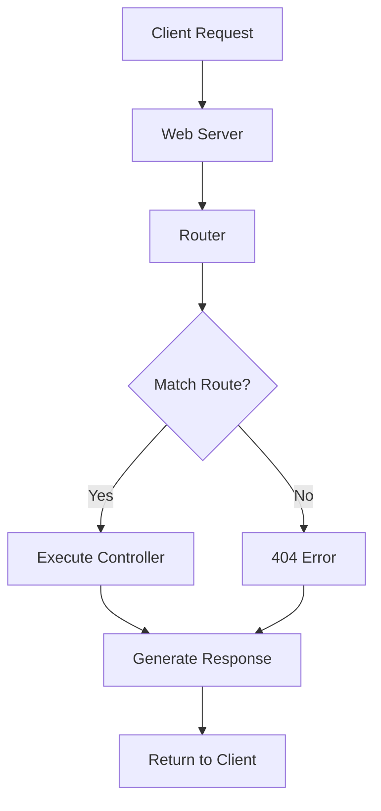

import Tabs from '@theme/Tabs';
import TabItem from '@theme/TabItem';

# PHP Routing

## Introduction

Routing is a fundamental concept in modern web development that manages how your application responds to client requests, specifically which code handles specific URL patterns. In traditional PHP applications, you might use a structure like `example.com/products.php?id=1` to display a product. With routing, you can transform this into cleaner, more readable URLs like `example.com/products/1`.

This tutorial will guide you through implementing routing in PHP, from basic concepts to more advanced techniques used in frameworks. By the end, you'll understand how to create clean URL structures and organize your code more effectively.

## Why Use Routing?

Before diving into implementation, let's understand why routing is essential:

1. **Clean URLs**: Routing allows for human-readable, SEO-friendly URLs
2. **Separation of Concerns**: It helps separate URL handling from business logic
3. **Security**: Routing can hide your file structure, adding a layer of security
4. **Maintainability**: Makes your code more organized and easier to manage
5. **RESTful API Support**: Enables creating standardized API endpoints

## Basic Routing Concepts

At its core, routing in PHP involves:

1. Capturing the requested URL
2. Matching it against defined patterns
3. Executing the corresponding controller or function

Let's visualize the routing flow:



## Setting Up Basic Routing

### Prerequisites

To implement routing in PHP, you'll need:

1. A web server with URL rewriting capability (Apache with mod_rewrite or Nginx)
2. Basic understanding of PHP
3. .htaccess file (for Apache) or server configuration (for Nginx)

### Step 1: Setting Up URL Rewriting

First, let's create an `.htaccess` file in your project root to redirect all requests to an `index.php` file:

```apache
# .htaccess file
RewriteEngine On
RewriteCond %{REQUEST_FILENAME} !-f
RewriteCond %{REQUEST_FILENAME} !-d
RewriteRule ^(.*)$ index.php [QSA,L]
```

This configuration tells Apache to send all requests to `index.php` unless the request is for an existing file or directory.

For Nginx, you would add this to your server configuration:

```nginx
location / {
    try_files $uri $uri/ /index.php?$query_string;
}
```

### Step 2: Creating a Simple Router

Now, let's create a basic router in our `index.php` file:

```php
<?php
// index.php

// Get the requested URI
$request_uri = $_SERVER['REQUEST_URI'];

// Remove query string and leading/trailing slashes
$uri = parse_url($request_uri, PHP_URL_PATH);
$uri = trim($uri, '/');

// Define routes
$routes = [
    '' => 'home.php',
    'about' => 'about.php',
    'contact' => 'contact.php',
    'products' => 'products.php'
];

// Check if the route exists
if (array_key_exists($uri, $routes)) {
    require $routes[$uri];
} else {
    // Route not found
    header("HTTP/1.0 404 Not Found");
    require '404.php';
}
```

Now create the required files (`home.php`, `about.php`, etc.) with your page content.

### Example Input/Output

**Input:** User visits `example.com/about`

**Output:** The server executes the code in `about.php` and displays it to the user

## Dynamic Routing with Parameters

The example above works for static routes, but what about dynamic routes like `products/123`? Let's enhance our router:

```php
<?php
// index.php

// Get the requested URI
$request_uri = $_SERVER['REQUEST_URI'];
$uri = trim(parse_url($request_uri, PHP_URL_PATH), '/');
$uri_segments = explode('/', $uri);

// Define routes with parameters
if (empty($uri_segments[0])) {
    // Home page
    require 'home.php';
} elseif ($uri_segments[0] === 'products' && isset($uri_segments[1])) {
    // Product detail page with ID parameter
    $product_id = $uri_segments[1];
    require 'product_detail.php';
} elseif (array_key_exists($uri_segments[0], [
    'about' => true,
    'contact' => true,
])) {
    // Static pages
    require $uri_segments[0] . '.php';
} else {
    // 404 page
    header("HTTP/1.0 404 Not Found");
    require '404.php';
}
```

In `product_detail.php`, you can use the `$product_id` variable:

```php
<?php
// product_detail.php

// Sanitize input
$product_id = filter_var($product_id, FILTER_VALIDATE_INT);

if ($product_id === false) {
    // Invalid product ID
    header("HTTP/1.0 400 Bad Request");
    echo "Invalid product ID";
    exit;
}

// Fetch product from database
// ...

echo "Displaying product with ID: " . $product_id;
```

### Example Input/Output

**Input:** User visits `example.com/products/42`

**Output:** 
```
Displaying product with ID: 42
```

## Creating a Router Class

For a more organized approach, let's create a Router class:

```php
<?php
// Router.php

class Router {
    private $routes = [];
    
    /**
     * Add a route
     * 
     * @param string $method HTTP method (GET, POST, etc.)
     * @param string $pattern URL pattern
     * @param callable $callback Function to execute
     */
    public function addRoute($method, $pattern, $callback) {
        $this->routes[] = [
            'method' => $method,
            'pattern' => $pattern,
            'callback' => $callback
        ];
    }
    
    /**
     * Add a GET route
     */
    public function get($pattern, $callback) {
        $this->addRoute('GET', $pattern, $callback);
    }
    
    /**
     * Add a POST route
     */
    public function post($pattern, $callback) {
        $this->addRoute('POST', $pattern, $callback);
    }
    
    /**
     * Match and dispatch a route
     */
    public function dispatch() {
        $uri = trim(parse_url($_SERVER['REQUEST_URI'], PHP_URL_PATH), '/');
        $method = $_SERVER['REQUEST_METHOD'];
        
        foreach ($this->routes as $route) {
            // Skip routes that don't match the request method
            if ($route['method'] !== $method) {
                continue;
            }
            
            // Convert route pattern to regex
            $pattern = '@^' . str_replace('/', '\/', $route['pattern']) . '$@';
            
            // Replace named parameters with regex patterns
            $pattern = preg_replace('/\{([a-zA-Z0-9_]+)\}/', '(?P<$1>[^/]+)', $pattern);
            
            // Try to match the current URI
            if (preg_match($pattern, $uri, $matches)) {
                // Filter out numeric keys
                $params = array_filter($matches, function($key) {
                    return !is_numeric($key);
                }, ARRAY_FILTER_USE_KEY);
                
                // Call the route callback with parameters
                call_user_func_array($route['callback'], $params);
                return;
            }
        }
        
        // No route matched
        header("HTTP/1.0 404 Not Found");
        echo "404 Not Found";
    }
}
```

Now let's use our Router class:

```php
<?php
// index.php
require 'Router.php';

$router = new Router();

// Define routes
$router->get('', function() {
    echo "Home Page";
});

$router->get('about', function() {
    echo "About Us Page";
});

$router->get('products/{id}', function($id) {
    echo "Product details for ID: " . $id;
});

$router->post('contact', function() {
    // Process contact form
    echo "Thank you for your message!";
});

// Dispatch the request
$router->dispatch();
```

## HTTP Method Routing

Modern web applications use different HTTP methods (GET, POST, PUT, DELETE) for different operations. Our Router class already supports this. Here's how to use it for a RESTful API:

```php
<?php
// api.php
require 'Router.php';

$router = new Router();

// Product API endpoints
$router->get('api/products', function() {
    // Get all products
    header('Content-Type: application/json');
    echo json_encode(['products' => [
        ['id' => 1, 'name' => 'Product 1'],
        ['id' => 2, 'name' => 'Product 2']
    ]]);
});

$router->get('api/products/{id}', function($id) {
    // Get specific product
    header('Content-Type: application/json');
    echo json_encode(['id' => $id, 'name' => 'Product ' . $id]);
});

$router->post('api/products', function() {
    // Create new product
    $data = json_decode(file_get_contents('php://input'), true);
    header('Content-Type: application/json');
    echo json_encode(['message' => 'Product created', 'data' => $data]);
});

$router->dispatch();
```

## Routing with Controllers

For larger applications, you'll want to use controllers instead of anonymous functions:

```php
<?php
// ProductController.php

class ProductController {
    public function index() {
        echo "All Products";
    }
    
    public function show($id) {
        echo "Showing product with ID: " . $id;
    }
    
    public function create() {
        echo "Create Product Form";
    }
    
    public function store() {
        echo "Product stored!";
    }
}
```

Update the Router class to handle controller methods:

```php
<?php
// Router.php (updated)

// Add this method to the Router class
public function addControllerRoute($method, $pattern, $controller, $action) {
    $this->addRoute($method, $pattern, function() use ($controller, $action) {
        $controller_instance = new $controller();
        call_user_func_array([$controller_instance, $action], func_get_args());
    });
}
```

Now use controllers with the router:

```php
<?php
// index.php
require 'Router.php';
require 'ProductController.php';

$router = new Router();

// Routes using controllers
$router->addControllerRoute('GET', 'products', 'ProductController', 'index');
$router->addControllerRoute('GET', 'products/{id}', 'ProductController', 'show');
$router->addControllerRoute('GET', 'products/create', 'ProductController', 'create');
$router->addControllerRoute('POST', 'products', 'ProductController', 'store');

$router->dispatch();
```

## Middleware Support

Let's add middleware support to our router for tasks like authentication:

```php
<?php
// Middleware example

class AuthMiddleware {
    public function handle($next) {
        // Check if user is logged in
        session_start();
        if (!isset($_SESSION['user_id'])) {
            header('Location: /login');
            exit;
        }
        
        // User is authenticated, proceed
        return $next();
    }
}

// Update Router class to support middleware
class Router {
    // ... existing code ...
    
    public function addRouteWithMiddleware($method, $pattern, $callback, $middleware) {
        $this->addRoute($method, $pattern, function() use ($callback, $middleware) {
            $middleware_instance = new $middleware();
            $next = function() use ($callback) {
                return call_user_func_array($callback, func_get_args());
            };
            return $middleware_instance->handle($next);
        });
    }
}
```

Usage example:

```php
<?php
// Secure route using middleware
$router->addRouteWithMiddleware('GET', 'dashboard', function() {
    echo "Dashboard Page";
}, 'AuthMiddleware');
```

## Practical Example: Building a Blog Routing System

Let's put everything together with a practical example for a simple blog:

```php
<?php
// index.php for a blog

require 'Router.php';
require 'controllers/BlogController.php';
require 'controllers/AuthController.php';
require 'middleware/AuthMiddleware.php';

$router = new Router();

// Public routes
$router->get('', function() {
    require 'views/home.php';
});

$router->get('blog', 'BlogController@index');
$router->get('blog/{id}', 'BlogController@show');
$router->get('login', 'AuthController@loginForm');
$router->post('login', 'AuthController@login');
$router->get('register', 'AuthController@registerForm');
$router->post('register', 'AuthController@register');

// Protected routes
$router->addRouteWithMiddleware('GET', 'blog/create', 'BlogController@create', 'AuthMiddleware');
$router->addRouteWithMiddleware('POST', 'blog/store', 'BlogController@store', 'AuthMiddleware');
$router->addRouteWithMiddleware('GET', 'blog/{id}/edit', 'BlogController@edit', 'AuthMiddleware');
$router->addRouteWithMiddleware('POST', 'blog/{id}/update', 'BlogController@update', 'AuthMiddleware');
$router->addRouteWithMiddleware('POST', 'blog/{id}/delete', 'BlogController@delete', 'AuthMiddleware');
$router->addRouteWithMiddleware('GET', 'dashboard', 'AuthController@dashboard', 'AuthMiddleware');
$router->addRouteWithMiddleware('GET', 'logout', 'AuthController@logout', 'AuthMiddleware');

$router->dispatch();
```

## Routing in PHP Frameworks

While building your own router is educational, most developers use established PHP frameworks that provide robust routing systems. Here's how routing looks in some popular frameworks:

<Tabs>
  <TabItem value="laravel" label="Laravel" default>
  
```php
// Laravel routing (routes/web.php)
Route::get('/', 'HomeController@index');
Route::get('/about', 'HomeController@about');
Route::resource('blog', 'BlogController');

// Route groups with middleware
Route::middleware(['auth'])->group(function () {
    Route::get('/dashboard', 'DashboardController@index');
    Route::resource('posts', 'PostController');
});
```
  
  </TabItem>
  <TabItem value="symfony" label="Symfony">
  
```yaml
# Symfony routing (config/routes.yaml)
homepage:
    path: /
    controller: App\Controller\HomeController::index

blog_show:
    path: /blog/{id}
    controller: App\Controller\BlogController::show
    requirements:
        id: '\d+'
```
  
  </TabItem>
  <TabItem value="slim" label="Slim">
  
```php
// Slim framework routing
$app = new \Slim\App();

$app->get('/', function ($request, $response) {
    return $response->write('Home Page');
});

$app->get('/blog/{id}', function ($request, $response, $args) {
    $id = $args['id'];
    return $response->write('Blog post: ' . $id);
});

$app->run();
```
  
  </TabItem>
</Tabs>

## Best Practices for PHP Routing

1. **Keep Routes Organized**: Group related routes together
2. **Use RESTful Patterns**: Follow RESTful conventions for API design
3. **Validate Parameters**: Always validate and sanitize route parameters
4. **Use Meaningful Names**: Choose descriptive names for your routes
5. **Implement Caching**: Cache route information for better performance
6. **Use Middleware**: Implement middleware for cross-cutting concerns
7. **Document Your Routes**: Keep a central documentation of all routes

## Common Routing Patterns

| URL Pattern | Description | Example |
|-------------|-------------|---------|
| `/resource` | List of resources | `/products` |
| `/resource/create` | Form to create resource | `/products/create` |
| `/resource/{id}` | View specific resource | `/products/42` |
| `/resource/{id}/edit` | Form to edit resource | `/products/42/edit` |
| `/api/v1/resource` | API endpoint with versioning | `/api/v1/products` |

## Summary

In this tutorial, we covered:
- The fundamentals of PHP routing
- Setting up URL rewriting
- Creating a simple router
- Handling dynamic routes with parameters
- Building a robust Router class
- Using controllers with routing
- Implementing middleware
- A practical blog routing example
- Routing in popular PHP frameworks
- Best practices for effective routing

By implementing proper routing in your PHP applications, you can create cleaner, more maintainable code with user-friendly URLs. As you progress in your PHP journey, consider exploring established frameworks like Laravel, Symfony, or Slim, which offer sophisticated routing systems with additional features.

## Exercises

1. Extend the Router class to support named routes and generate URLs from route names
2. Implement route caching to improve performance
3. Create a blog application using the routing system we built
4. Add validation for route parameters
5. Implement nested resources (e.g., `/posts/{post_id}/comments/{comment_id}`)

## Additional Resources

- [PHP League's Route Package](https://route.thephpleague.com/)
- [FastRoute - Fast request router for PHP](https://github.com/nikic/FastRoute)
- [Laravel Routing Documentation](https://laravel.com/docs/routing)
- [Symfony Routing Component](https://symfony.com/doc/current/routing.html)
- [RESTful API Design Best Practices](https://restfulapi.net/)