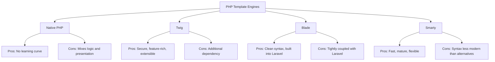

# PHP Templating

## Introduction

PHP Templating is a technique that allows developers to separate the presentation layer (HTML) from the business logic of a web application. This separation follows the MVC (Model-View-Controller) design pattern and helps create more maintainable, organized, and secure code.

Templating engines provide a way to write HTML with special placeholders and syntax that can be filled with dynamic data. This approach offers several advantages:

- **Separation of concerns**: Keeps code organized by separating logic from presentation
- **Improved collaboration**: Allows designers to work on templates while developers focus on logic
- **Enhanced security**: Helps prevent common vulnerabilities like XSS attacks
- **Code reusability**: Makes it easier to reuse page layouts and components

In this tutorial, we'll explore PHP templating concepts, compare different approaches, and learn how to implement templating in your PHP applications.

## Basic PHP Templating

### The Problem: Mixing HTML and PHP

When beginning with PHP, many developers mix HTML and PHP code like this:

```php
<?php
// Database connection and query
$conn = new mysqli("localhost", "username", "password", "database");
$result = $conn->query("SELECT * FROM products LIMIT 5");
?>

<!DOCTYPE html>
<html>
<head>
    <title>Product List</title>
</head>
<body>
    <h1>Our Products</h1>
    <ul>
    <?php while($row = $result->fetch_assoc()) { ?>
        <li><?php echo $row['name']; ?> - $<?php echo $row['price']; ?></li>
    <?php } ?>
    </ul>
</body>
</html>
```

This approach becomes difficult to maintain as applications grow larger.

### Solution: Simple PHP Templates

A basic templating approach involves separating HTML into template files and injecting data:

First, create a template file (`product_list.template.php`):

```php
<!DOCTYPE html>
<html>
<head>
    <title>Product List</title>
</head>
<body>
    <h1>Our Products</h1>
    <ul>
    <?php foreach($products as $product) { ?>
        <li><?php echo $product['name']; ?> - $<?php echo $product['price']; ?></li>
    <?php } ?>
    </ul>
</body>
</html>
```

Then, in your main PHP file (`index.php`):

```php
<?php
// Database connection and query
$conn = new mysqli("localhost", "username", "password", "database");
$result = $conn->query("SELECT * FROM products LIMIT 5");

// Prepare data for the template
$products = [];
while($row = $result->fetch_assoc()) {
    $products[] = $row;
}

// Include the template
include 'product_list.template.php';
?>
```

This separates the logic from the presentation but still requires PHP syntax in templates.

## Creating a Simple Template Engine

Let's build a basic template engine that uses placeholders instead of PHP code:

### Template with Placeholders

Create a template file (`product_list.html`):

```html
<!DOCTYPE html>
<html>
<head>
    <title>{{page_title}}</title>
</head>
<body>
    <h1>{{header}}</h1>
    <ul>
        {{product_list}}
    </ul>
</body>
</html>
```

### Template Engine Implementation

```php
<?php
class SimpleTemplateEngine {
    private $template;
    private $variables = [];
    
    public function __construct($template_file) {
        $this->template = file_get_contents($template_file);
    }
    
    public function assign($key, $value) {
        $this->variables[$key] = $value;
    }
    
    public function render() {
        $output = $this->template;
        
        foreach($this->variables as $key => $value) {
            $output = str_replace("{{".$key."}}", $value, $output);
        }
        
        return $output;
    }
}

// Usage example
$engine = new SimpleTemplateEngine('product_list.html');
$engine->assign('page_title', 'Product List');
$engine->assign('header', 'Our Products');

// Database connection and query
$conn = new mysqli("localhost", "username", "password", "database");
$result = $conn->query("SELECT * FROM products LIMIT 5");

// Build product list HTML
$product_list = "<ul>";
while($row = $result->fetch_assoc()) {
    $product_list .= "<li>{$row['name']} - \${$row['price']}</li>";
}
$product_list .= "</ul>";

$engine->assign('product_list', $product_list);

// Output the rendered template
echo $engine->render();
?>
```

### Output

The rendered page would look like:

```html
<!DOCTYPE html>
<html>
<head>
    <title>Product List</title>
</head>
<body>
    <h1>Our Products</h1>
    <ul>
        <li>Product A - $19.99</li>
        <li>Product B - $24.99</li>
        <li>Product C - $14.99</li>
        <li>Product D - $29.99</li>
        <li>Product E - $9.99</li>
    </ul>
</body>
</html>
```

## Template Inheritance

One powerful feature of modern template engines is template inheritance. This allows you to define a base layout and extend it in child templates.

### Base Template (`layout.html`)

```html
<!DOCTYPE html>
<html>
<head>
    <title>{{title}}</title>
    <link rel="stylesheet" href="/css/style.css">
</head>
<body>
    <header>
        <nav>
            <ul>
                <li><a href="/">Home</a></li>
                <li><a href="/products">Products</a></li>
                <li><a href="/about">About</a></li>
            </ul>
        </nav>
    </header>
    
    <main>
        {{content}}
    </main>
    
    <footer>
        <p>&copy; 2025 My PHP Website</p>
    </footer>
</body>
</html>
```

### Child Template (`product_page.html`)

```html
<!-- Extends: layout.html -->
<div class="product-container">
    <h1>{{product_name}}</h1>
    <div class="product-details">
        
        <div class="info">
            <p class="price">${{product_price}}</p>
            <p class="description">{{product_description}}</p>
            <button class="buy-now">Buy Now</button>
        </div>
    </div>
</div>
```

Implementing inheritance requires more complex templating engines, which we'll explore next.

## Popular PHP Template Engines

While building your own template engine is educational, most developers use established templating libraries. Here are some popular options:

### 1. Twig

[Twig](https://twig.symfony.com/) is the templating engine used by the Symfony framework and many other PHP applications.

**Installation:**
```bash
composer require twig/twig
```

**Example Usage:**

```php
<?php
require_once 'vendor/autoload.php';

$loader = new \Twig\Loader\FilesystemLoader('templates');
$twig = new \Twig\Environment($loader);

echo $twig->render('product.twig', [
    'product_name' => 'Awesome Product',
    'product_price' => 29.99,
    'product_description' => 'This is an amazing product you need to buy!',
    'product_image' => '/images/product1.jpg'
]);
?>
```

**Twig Template (`product.twig`):**

```twig



<div class="product-container">
    <h1>{{ product_name }}</h1>
    <div class="product-details">
        
        <div class="info">
            <p class="price">${{ product_price }}</p>
            <p class="description">{{ product_description }}</p>
            <button class="buy-now">Buy Now</button>
        </div>
    </div>
</div>

```

### 2. Blade

[Blade](https://laravel.com/docs/10.x/blade) is the templating engine used by the Laravel framework.

**Example Usage (in Laravel):**

```php
// In a controller
public function showProduct($id)
{
    $product = Product::find($id);
    return view('product', ['product' => $product]);
}
```

**Blade Template (`product.blade.php`):**

```blade
@extends('layouts.app')

@section('content')
<div class="product-container">
    <h1>{{ $product->name }}</h1>
    <div class="product-details">
        image }}" alt="{{ $product->name }}">
        <div class="info">
            <p class="price">${{ $product->price }}</p>
            <p class="description">{{ $product->description }}</p>
            <button class="buy-now">Buy Now</button>
        </div>
    </div>
</div>
@endsection
```

### 3. Smarty

[Smarty](https://www.smarty.net/) is one of the oldest PHP template engines, known for its performance and flexibility.

**Installation:**
```bash
composer require smarty/smarty
```

**Example Usage:**

```php
<?php
require_once 'vendor/autoload.php';

$smarty = new Smarty();
$smarty->setTemplateDir('templates');
$smarty->setCacheDir('cache');
$smarty->setCompileDir('compile');

$smarty->assign('product_name', 'Awesome Product');
$smarty->assign('product_price', 29.99);
$smarty->assign('product_description', 'This is an amazing product you need to buy!');
$smarty->assign('product_image', '/images/product1.jpg');

$smarty->display('product.tpl');
?>
```

**Smarty Template (`product.tpl`):**

```smarty
{extends file="layout.tpl"}

{block name="content"}
<div class="product-container">
    <h1>{$product_name}</h1>
    <div class="product-details">
        
        <div class="info">
            <p class="price">${$product_price}</p>
            <p class="description">{$product_description}</p>
            <button class="buy-now">Buy Now</button>
        </div>
    </div>
</div>
{/block}
```

## Template Engine Comparison

Here's a comparison of the templating engines we discussed:



### Feature Comparison

| Feature | Native PHP | Twig | Blade | Smarty |
|---------|------------|------|-------|--------|
| Learning Curve | None | Moderate | Low | Moderate |
| Syntax Cleanliness | Low | High | High | Medium |
| Performance | High | Medium | High | High |
| Security Features | Manual | Built-in | Built-in | Built-in |
| Template Inheritance | Manual | Yes | Yes | Yes |
| Framework Independence | Yes | Yes | No (Laravel) | Yes |
| Community Support | High | High | High | Medium |

## Practical Example: Building a Blog with Templates

Let's create a simple blog application using our custom template engine:

### Project Structure

```
/blog
  /templates
    layout.html
    home.html
    post.html
  /classes
    TemplateEngine.php
  index.php
  post.php
```

### Template Engine Class (`TemplateEngine.php`)

```php
<?php
class TemplateEngine {
    private $templates_dir;
    private $variables = [];
    private $layout = null;
    
    public function __construct($templates_dir = 'templates') {
        $this->templates_dir = $templates_dir;
    }
    
    public function assign($key, $value) {
        $this->variables[$key] = $value;
    }
    
    public function setLayout($layout_file) {
        $this->layout = $layout_file;
    }
    
    public function render($template) {
        $template_path = $this->templates_dir . '/' . $template;
        
        if (!file_exists($template_path)) {
            throw new Exception("Template file {$template} not found");
        }
        
        $content = file_get_contents($template_path);
        
        // Replace placeholders with values
        foreach ($this->variables as $key => $value) {
            $content = str_replace("{{".$key."}}", htmlspecialchars($value, ENT_QUOTES), $content);
        }
        
        // Check if we need to use a layout
        if ($this->layout) {
            $layout_path = $this->templates_dir . '/' . $this->layout;
            
            if (!file_exists($layout_path)) {
                throw new Exception("Layout file {$this->layout} not found");
            }
            
            $layout = file_get_contents($layout_path);
            $content = str_replace("{{content}}", $content, $layout);
            
            // Replace layout variables
            foreach ($this->variables as $key => $value) {
                $content = str_replace("{{".$key."}}", htmlspecialchars($value, ENT_QUOTES), $content);
            }
        }
        
        return $content;
    }
}
?>
```

### Layout Template (`layout.html`)

```html
<!DOCTYPE html>
<html>
<head>
    <title>{{page_title}} - My Blog</title>
    <style>
        body { font-family: Arial, sans-serif; line-height: 1.6; margin: 0; padding: 0; }
        .container { width: 80%; margin: 0 auto; }
        header { background: #333; color: #fff; padding: 1rem; }
        header a { color: #fff; text-decoration: none; }
        main { padding: 2rem 0; }
        footer { background: #333; color: #fff; text-align: center; padding: 1rem; }
    </style>
</head>
<body>
    <header>
        <div class="container">
            <h1><a href="index.php">My Blog</a></h1>
        </div>
    </header>
    
    <main class="container">
        {{content}}
    </main>
    
    <footer>
        <div class="container">
            <p>&copy; 2025 My PHP Blog</p>
        </div>
    </footer>
</body>
</html>
```

### Home Template (`home.html`)

```html
<h1>Latest Posts</h1>

<div class="posts">
    {{posts_list}}
</div>
```

### Post Template (`post.html`)

```html
<article>
    <h1>{{post_title}}</h1>
    <p class="meta">Posted on {{post_date}} by {{post_author}}</p>
    
    <div class="content">
        {{post_content}}
    </div>
    
    <div class="tags">
        <strong>Tags:</strong> {{post_tags}}
    </div>
    
    <hr>
    
    <a href="index.php">&laquo; Back to Home</a>
</article>
```

### Home Page (`index.php`)

```php
<?php
require_once 'classes/TemplateEngine.php';

// Mock database query to get posts
function getPosts() {
    return [
        [
            'id' => 1,
            'title' => 'Getting Started with PHP Templating',
            'excerpt' => 'Learn how to separate logic from presentation in PHP applications.',
            'date' => '2025-02-28',
            'author' => 'Jane Doe'
        ],
        [
            'id' => 2,
            'title' => 'Advanced Template Techniques',
            'excerpt' => 'Explore inheritance, partials, and other advanced templating features.',
            'date' => '2025-03-01',
            'author' => 'John Smith'
        ],
        [
            'id' => 3,
            'title' => 'Performance Optimization for Templates',
            'excerpt' => 'Tips and tricks to make your templates load faster.',
            'date' => '2025-03-02',
            'author' => 'Alex Johnson'
        ]
    ];
}

// Initialize template engine
$template = new TemplateEngine();
$template->setLayout('layout.html');
$template->assign('page_title', 'Home');

// Build posts list HTML
$posts = getPosts();
$posts_html = '';

foreach ($posts as $post) {
    $posts_html .= '<div class="post">';
    $posts_html .= '<h2><a href="post.php?id=' . $post['id'] . '">' . $post['title'] . '</a></h2>';
    $posts_html .= '<p class="meta">Posted on ' . $post['date'] . ' by ' . $post['author'] . '</p>';
    $posts_html .= '<p>' . $post['excerpt'] . '</p>';
    $posts_html .= '<p><a href="post.php?id=' . $post['id'] . '">Read more &raquo;</a></p>';
    $posts_html .= '</div>';
    $posts_html .= '<hr>';
}

$template->assign('posts_list', $posts_html);

// Render the template
echo $template->render('home.html');
?>
```

### Single Post Page (`post.php`)

```php
<?php
require_once 'classes/TemplateEngine.php';

// Mock function to get post by ID
function getPost($id) {
    $posts = [
        1 => [
            'title' => 'Getting Started with PHP Templating',
            'content' => '<p>PHP templating is a powerful technique that helps developers separate logic from presentation in web applications.</p>
            <p>In this post, we\'ll explore the basics of templating and why it\'s important for creating maintainable code.</p>
            <p>Templating engines provide a way to write HTML with special placeholders and syntax that can be filled with dynamic data. This approach offers several advantages:</p>
            <ul>
                <li>Separation of concerns: Keeps code organized by separating logic from presentation</li>
                <li>Improved collaboration: Allows designers to work on templates while developers focus on logic</li>
                <li>Enhanced security: Helps prevent common vulnerabilities like XSS attacks</li>
                <li>Code reusability: Makes it easier to reuse page layouts and components</li>
            </ul>',
            'date' => '2025-02-28',
            'author' => 'Jane Doe',
            'tags' => 'php, templates, beginners'
        ],
        2 => [
            'title' => 'Advanced Template Techniques',
            'content' => '<p>Now that you understand the basics, let\'s dive into more advanced templating techniques.</p>
            <p>In this post, we\'ll cover template inheritance, partials, and other powerful features.</p>',
            'date' => '2025-03-01',
            'author' => 'John Smith',
            'tags' => 'php, templates, advanced'
        ],
        3 => [
            'title' => 'Performance Optimization for Templates',
            'content' => '<p>Templates can impact the performance of your application if not implemented correctly.</p>
            <p>Learn how to optimize your templates for speed and efficiency.</p>',
            'date' => '2025-03-02',
            'author' => 'Alex Johnson',
            'tags' => 'php, templates, performance, optimization'
        ]
    ];
    
    return isset($posts[$id]) ? $posts[$id] : null;
}

// Get post ID from URL
$id = isset($_GET['id']) ? (int)$_GET['id'] : 0;
$post = getPost($id);

// Initialize template engine
$template = new TemplateEngine();
$template->setLayout('layout.html');

// If post exists, display it
if ($post) {
    $template->assign('page_title', $post['title']);
    $template->assign('post_title', $post['title']);
    $template->assign('post_date', $post['date']);
    $template->assign('post_author', $post['author']);
    $template->assign('post_content', $post['content']);
    $template->assign('post_tags', $post['tags']);
    
    echo $template->render('post.html');
} else {
    // Post not found
    $template->assign('page_title', 'Post Not Found');
    $template->assign('content', '<h1>Error 404</h1><p>The requested post could not be found.</p><p><a href="index.php">Return to home</a></p>');
    
    echo $template->render('layout.html');
}
?>
```

This example demonstrates a simple blog application that uses templates to separate the presentation from the logic. The template engine handles loading templates, replacing placeholders with values, and applying layouts.

## Best Practices for PHP Templating

1. **Keep templates simple**: Avoid complex logic in templates; move it to controller or helper classes
2. **Use consistent naming conventions**: For both template files and variable names
3. **Cache compiled templates**: Most template engines support caching to improve performance
4. **Use template inheritance**: Create base layouts and extend them to avoid code duplication
5. **Sanitize data**: Always escape output to prevent XSS attacks
6. **Document your templates**: Add comments to explain complex sections
7. **Group related templates**: Organize templates in subdirectories by feature or section
8. **Use partials for reusable components**: Extract common UI elements into partial templates
9. **Minimize database queries**: Prepare all data before passing it to templates
10. **Test your templates**: Ensure they render correctly with different data sets

## Template Security Considerations

When implementing templates, be mindful of security:

1. **Always escape output**: Use appropriate escaping functions (e.g., `htmlspecialchars()` in PHP, `{{ }}` in Twig/Blade)
2. **Don't trust user input**: Validate and sanitize before displaying in templates
3. **Be cautious with "raw" output**: Only use unescaped output for trusted content
4. **Implement CSRF protection**: For forms in templates
5. **Control access to templates**: Don't expose template files directly

## Template Engines and Performance

While templating adds a layer of abstraction, modern template engines are designed to minimize performance impact:

1. **Compilation**: Templates are compiled to PHP code for faster execution
2. **Caching**: Compiled templates are cached to avoid recompilation
3. **Lazy loading**: Templates are loaded only when needed
4. **Extension optimization**: Many engines optimize rendering of complex structures

## Summary

PHP Templating is a crucial technique for building maintainable web applications. It helps separate presentation from business logic, making your code more organized, secure, and easier to maintain. Key points to remember:

- Templating helps enforce the separation of concerns (MVC pattern)
- Simple templating can be implemented with native PHP
- Template engines like Twig, Blade, and Smarty offer more features
- Template inheritance allows for DRY (Don't Repeat Yourself) code
- Security should always be a consideration when working with templates

By mastering PHP templating, you'll be able to build more robust, maintainable, and secure applications.

## Exercises

1. Create a simple template engine that supports conditionals (if/else)
2. Convert an existing PHP page to use templates
3. Implement template inheritance with a base layout and child templates
4. Create a navigation partial that can be reused across multiple templates
5. Build a product catalog page using the template engine of your choice

## Additional Resources

- [Twig Documentation](https://twig.symfony.com/doc/3.x/)
- [Laravel Blade Documentation](https://laravel.com/docs/10.x/blade)
- [Smarty Documentation](https://www.smarty.net/docs/en/)
- [PHP: The Right Way - Templating](https://phptherightway.com/#templating)
- [MVC Pattern and PHP](https://www.php.net/manual/en/mvc.pattern.php)