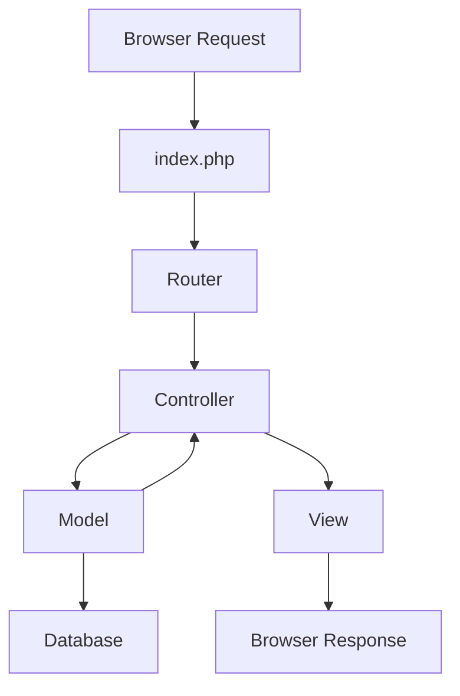

# PHP CodeIgniter Basics

## Introduction

CodeIgniter is a lightweight, open-source PHP framework that follows the Model-View-Controller (MVC) architectural pattern. Created by EllisLab and now maintained by the British Columbia Institute of Technology, CodeIgniter is designed to help developers build web applications faster by providing a rich set of libraries for common tasks while requiring minimal configuration.

In this tutorial, we'll explore the basics of CodeIgniter 4 (the latest major version), understand its core concepts, and build simple applications to demonstrate its capabilities. Whether you're new to PHP frameworks or looking to expand your toolkit, CodeIgniter offers a gentle learning curve with powerful features.

## Why Choose CodeIgniter?

Before diving into the code, let's understand why CodeIgniter might be the right framework for your projects:

- **Small Footprint**: CodeIgniter is lightweight and has minimal server requirements
- **Great Performance**: It's known for being faster than many other PHP frameworks
- **Simple Configuration**: Minimal setup required to get started
- **Documentation**: Comprehensive and well-maintained documentation
- **Community Support**: Active community and regular updates
- **Low Learning Curve**: Easy to learn, especially if you're familiar with PHP

## Setting Up CodeIgniter

### Installation

There are several ways to install CodeIgniter 4. We'll cover the two most common methods:

#### Method 1: Using Composer

```bash
# Create a project using Composer
composer create-project codeigniter4/appstarter project-name

# Navigate to your project
cd project-name

# Start the development server
php spark serve
```

#### Method 2: Manual Download

1. Download the latest version from [CodeIgniter's official website](https://codeigniter.com/download)
2. Extract the files to your web server directory
3. Configure your web server to point to the `public` folder

### Understanding the Project Structure

After installation, you'll see a directory structure like this:

```
project-root/
├── app/                    # Your application code goes here
│   ├── Config/             # Configuration files
│   ├── Controllers/        # Controllers
│   ├── Models/             # Models
│   ├── Views/              # Views
│   └── ...
├── public/                 # Publicly accessible files
│   ├── index.php           # Entry point to the application
│   ├── assets/             # CSS, JavaScript, images, etc.
│   └── ...
├── system/                 # CodeIgniter core files (don't modify)
├── writable/               # Logs, cache, and other writable files
├── tests/                  # Unit tests
└── spark                   # Command-line tool
```

## MVC Architecture in CodeIgniter

CodeIgniter follows the Model-View-Controller pattern, which separates your application into three main components:



- **Model**: Manages data and business logic
- **View**: Handles the presentation layer (HTML output)
- **Controller**: Coordinates between Model and View, processes requests

Let's see how each component works in CodeIgniter.

## Controllers: The Entry Point

Controllers handle user requests and coordinate the application's response. They are the central point of your application's logic.

### Creating Your First Controller

Create a file named `Hello.php` in the `app/Controllers` directory:

```php
<?php

namespace App\Controllers;

use CodeIgniter\Controller;

class Hello extends Controller
{
    public function index()
    {
        return "Hello, CodeIgniter!";
    }
    
    public function greet($name = 'World')
    {
        return "Hello, {$name}!";
    }
}
```

### Accessing Controllers

With the controller above, you can access:
- `http://localhost:8080/hello` - Shows "Hello, CodeIgniter!"
- `http://localhost:8080/hello/greet/John` - Shows "Hello, John!"

### Loading Views from Controllers

Let's modify our controller to use a view:

```php
<?php

namespace App\Controllers;

use CodeIgniter\Controller;

class Hello extends Controller
{
    public function index()
    {
        $data = [
            'title' => 'Welcome to CodeIgniter',
            'message' => 'Hello, CodeIgniter!'
        ];
        
        return view('hello_view', $data);
    }
}
```

## Views: The Presentation Layer

Views contain the HTML and presentation code. They receive data from controllers and display it to users.

### Creating Your First View

Create a file named `hello_view.php` in the `app/Views` directory:

```php
<!DOCTYPE html>
<html>
<head>
    <title><?= $title ?></title>
</head>
<body>
    <h1><?= $title ?></h1>
    <p><?= $message ?></p>
    
    <p>Current time: <?= date('Y-m-d H:i:s') ?></p>
</body>
</html>
```

### Using View Layouts

CodeIgniter 4 supports view layouts to avoid code duplication. Let's create a layout:

1. Create `app/Views/layouts/main.php`:

```php
<!DOCTYPE html>
<html>
<head>
    <title><?= $title ?? 'CodeIgniter 4' ?></title>
    <link rel="stylesheet" href="/assets/css/style.css">
</head>
<body>
    <header>
        <h1>My CodeIgniter Application</h1>
        <nav>
            <ul>
                <li><a href="/">Home</a></li>
                <li><a href="/about">About</a></li>
                <li><a href="/contact">Contact</a></li>
            </ul>
        </nav>
    </header>
    
    <main>
        <?= $this->renderSection('content') ?>
    </main>
    
    <footer>
        <p>&copy; <?= date('Y') ?> My Application</p>
    </footer>
    
    <script src="/assets/js/script.js"></script>
</body>
</html>
```

2. Create a view that uses the layout:

```php
<?= $this->extend('layouts/main') ?>

<?= $this->section('content') ?>
    <h2><?= $title ?></h2>
    <p><?= $message ?></p>
<?= $this->endSection() ?>
```

## Models: Working with Data

Models handle data access and business logic. They connect to databases and provide methods to manipulate data.

### Creating Your First Model

Create a file named `UserModel.php` in the `app/Models` directory:

```php
<?php

namespace App\Models;

use CodeIgniter\Model;

class UserModel extends Model
{
    protected $table = 'users';
    protected $primaryKey = 'id';
    
    protected $allowedFields = ['name', 'email', 'password'];
    
    protected $useTimestamps = true;
    protected $createdField = 'created_at';
    protected $updatedField = 'updated_at';
    
    protected $beforeInsert = ['hashPassword'];
    
    protected function hashPassword(array $data)
    {
        if (isset($data['data']['password'])) {
            $data['data']['password'] = password_hash($data['data']['password'], PASSWORD_DEFAULT);
        }
        
        return $data;
    }
}
```

### Using Models in Controllers

Now let's use our model in a controller:

```php
<?php

namespace App\Controllers;

use App\Models\UserModel;
use CodeIgniter\Controller;

class Users extends Controller
{
    public function index()
    {
        $userModel = new UserModel();
        $data['users'] = $userModel->findAll();
        
        return view('users/index', $data);
    }
    
    public function create()
    {
        return view('users/create');
    }
    
    public function store()
    {
        $userModel = new UserModel();
        
        $data = [
            'name' => $this->request->getPost('name'),
            'email' => $this->request->getPost('email'),
            'password' => $this->request->getPost('password')
        ];
        
        $userModel->insert($data);
        
        return redirect()->to('/users');
    }
}
```

## Working with Database

### Database Configuration

Configure your database in `app/Config/Database.php`:

```php
public $default = [
    'DSN'      => '',
    'hostname' => 'localhost',
    'username' => 'root',
    'password' => 'password',
    'database' => 'codeigniter',
    'DBDriver' => 'MySQLi',
    'DBPrefix' => '',
    'pConnect' => false,
    'DBDebug'  => (ENVIRONMENT !== 'production'),
    'charset'  => 'utf8',
    'DBCollat' => 'utf8_general_ci',
    'swapPre'  => '',
    'encrypt'  => false,
    'compress' => false,
    'strictOn' => false,
    'failover' => [],
    'port'     => 3306,
];
```

### Using the Query Builder

CodeIgniter provides a Query Builder class for working with databases:

```php
<?php

namespace App\Controllers;

use CodeIgniter\Controller;

class Posts extends Controller
{
    public function index()
    {
        $db = \Config\Database::connect();
        $builder = $db->table('posts');
        
        $query = $builder->select('posts.*, users.name as author')
                         ->join('users', 'users.id = posts.user_id')
                         ->where('posts.status', 'published')
                         ->orderBy('posts.created_at', 'DESC')
                         ->get();
        
        $data['posts'] = $query->getResult();
        
        return view('posts/index', $data);
    }
}
```

## Forms and Validation

### Creating a Form

Let's create a simple registration form:

```php
<!-- app/Views/register.php -->
<?= $this->extend('layouts/main') ?>

<?= $this->section('content') ?>
    <h2>Register</h2>
    
    <?php if (session()->has('errors')): ?>
        <div class="errors">
            <ul>
                <?php foreach (session('errors') as $error): ?>
                    <li><?= $error ?></li>
                <?php endforeach ?>
            </ul>
        </div>
    <?php endif ?>
    
    <form action="/register" method="post">
        <?= csrf_field() ?>
        
        <div>
            <label for="name">Name</label>
            <input type="text" name="name" id="name" value="<?= old('name') ?>">
        </div>
        
        <div>
            <label for="email">Email</label>
            <input type="email" name="email" id="email" value="<?= old('email') ?>">
        </div>
        
        <div>
            <label for="password">Password</label>
            <input type="password" name="password" id="password">
        </div>
        
        <div>
            <label for="password_confirm">Confirm Password</label>
            <input type="password" name="password_confirm" id="password_confirm">
        </div>
        
        <div>
            <button type="submit">Register</button>
        </div>
    </form>
<?= $this->endSection() ?>
```

### Implementing Form Validation

Let's add validation to our registration form:

```php
<?php

namespace App\Controllers;

use App\Models\UserModel;
use CodeIgniter\Controller;

class Auth extends Controller
{
    public function register()
    {
        return view('register');
    }
    
    public function processRegistration()
    {
        // Validation rules
        $rules = [
            'name' => 'required|min_length[3]|max_length[50]',
            'email' => 'required|valid_email|is_unique[users.email]',
            'password' => 'required|min_length[8]',
            'password_confirm' => 'required|matches[password]'
        ];
        
        // Custom error messages
        $messages = [
            'name' => [
                'required' => 'Name is required',
                'min_length' => 'Name must be at least 3 characters long'
            ],
            'email' => [
                'is_unique' => 'This email is already registered'
            ]
        ];
        
        // Run validation
        if (! $this->validate($rules, $messages)) {
            return redirect()->back()->withInput()->with('errors', $this->validator->getErrors());
        }
        
        // If validation passes, store the user
        $userModel = new UserModel();
        
        $userModel->insert([
            'name' => $this->request->getPost('name'),
            'email' => $this->request->getPost('email'),
            'password' => $this->request->getPost('password')
        ]);
        
        return redirect()->to('/login')->with('message', 'Registration successful! You can now log in.');
    }
}
```

## Routing in CodeIgniter

Routes define which controller and method should handle a specific URL request.

### Basic Routes

Edit `app/Config/Routes.php` to define your routes:

```php
// Default route
$routes->get('/', 'Home::index');

// Simple route
$routes->get('about', 'Pages::about');

// Route with parameters
$routes->get('users/(:num)', 'Users::show/$1');

// POST route
$routes->post('register', 'Auth::processRegistration');

// Route group with prefix
$routes->group('admin', function($routes) {
    $routes->get('dashboard', 'Admin::dashboard');
    $routes->get('users', 'Admin::users');
    $routes->get('settings', 'Admin::settings');
});

// Resource routes (RESTful)
$routes->resource('api/products');
```

## Working with Sessions

CodeIgniter provides a powerful session library for managing user sessions.

### Session Configuration

Configure sessions in `app/Config/App.php`:

```php
public $sessionDriver = 'CodeIgniter\Session\Handlers\FileHandler';
public $sessionCookieName = 'ci_session';
public $sessionExpiration = 7200;
public $sessionSavePath = WRITEPATH . 'session';
public $sessionMatchIP = false;
public $sessionTimeToUpdate = 300;
public $sessionRegenerateDestroy = false;
```

### Using Sessions

```php
<?php

namespace App\Controllers;

use CodeIgniter\Controller;

class Auth extends Controller
{
    public function login()
    {
        return view('login');
    }
    
    public function processLogin()
    {
        $email = $this->request->getPost('email');
        $password = $this->request->getPost('password');
        
        // Validate credentials (simplified for example)
        $userModel = new \App\Models\UserModel();
        $user = $userModel->where('email', $email)->first();
        
        if ($user && password_verify($password, $user['password'])) {
            // Set session data
            $session = session();
            $session->set([
                'user_id' => $user['id'],
                'user_name' => $user['name'],
                'user_email' => $user['email'],
                'logged_in' => true
            ]);
            
            return redirect()->to('/dashboard');
        }
        
        return redirect()->back()->with('error', 'Invalid credentials');
    }
    
    public function logout()
    {
        // Clear session data
        session()->destroy();
        
        return redirect()->to('/login');
    }
    
    public function dashboard()
    {
        // Check if user is logged in
        if (!session()->get('logged_in')) {
            return redirect()->to('/login');
        }
        
        $data['user_name'] = session()->get('user_name');
        
        return view('dashboard', $data);
    }
}
```

## File Uploads

CodeIgniter makes file uploads easy with its built-in file upload class.

### Creating a File Upload Form

```php
<!-- app/Views/upload_form.php -->
<?= $this->extend('layouts/main') ?>

<?= $this->section('content') ?>
    <h2>Upload File</h2>
    
    <?php if (session()->has('error')): ?>
        <div class="error"><?= session('error') ?></div>
    <?php endif ?>
    
    <?php if (session()->has('success')): ?>
        <div class="success"><?= session('success') ?></div>
    <?php endif ?>
    
    <form action="/upload" method="post" enctype="multipart/form-data">
        <?= csrf_field() ?>
        
        <div>
            <label for="file">Select File</label>
            <input type="file" name="userfile" id="file">
        </div>
        
        <div>
            <button type="submit">Upload</button>
        </div>
    </form>
<?= $this->endSection() ?>
```

### Handling File Uploads

```php
<?php

namespace App\Controllers;

use CodeIgniter\Controller;

class Upload extends Controller
{
    public function index()
    {
        return view('upload_form');
    }
    
    public function process()
    {
        $validationRule = [
            'userfile' => [
                'label' => 'Image File',
                'rules' => 'uploaded[userfile]'
                    . '|is_image[userfile]'
                    . '|mime_in[userfile,image/jpg,image/jpeg,image/png]'
                    . '|max_size[userfile,2048]',
            ],
        ];
        
        if (!$this->validate($validationRule)) {
            return redirect()->back()->with('error', $this->validator->getError('userfile'));
        }
        
        $file = $this->request->getFile('userfile');
        
        if ($file->isValid() && !$file->hasMoved()) {
            $newName = $file->getRandomName();
            $file->move(WRITEPATH . 'uploads', $newName);
            
            return redirect()->back()->with('success', 'File uploaded successfully: ' . $file->getClientName());
        }
        
        return redirect()->back()->with('error', 'Failed to upload file.');
    }
}
```

## Filters (Middleware)

Filters in CodeIgniter are similar to middleware in other frameworks. They can run before or after controller execution.

### Creating a Filter

Create a file named `AuthFilter.php` in the `app/Filters` directory:

```php
<?php

namespace App\Filters;

use CodeIgniter\Filters\FilterInterface;
use CodeIgniter\HTTP\RequestInterface;
use CodeIgniter\HTTP\ResponseInterface;

class AuthFilter implements FilterInterface
{
    public function before(RequestInterface $request, $arguments = null)
    {
        // Check if user is logged in
        if (!session()->get('logged_in')) {
            return redirect()->to('/login');
        }
    }
    
    public function after(RequestInterface $request, ResponseInterface $response, $arguments = null)
    {
        // Do something after the controller executes
    }
}
```

### Registering and Using Filters

Configure filters in `app/Config/Filters.php`:

```php
public $aliases = [
    'csrf'     => \CodeIgniter\Filters\CSRF::class,
    'toolbar'  => \CodeIgniter\Filters\DebugToolbar::class,
    'honeypot' => \CodeIgniter\Filters\Honeypot::class,
    'auth'     => \App\Filters\AuthFilter::class,
];

// Always enabled filters
public $globals = [
    'before' => [
        'csrf',
    ],
    'after' => [
        'toolbar',
    ],
];

// Filters for specific routes
public $methods = [];

// Filter for specific routes
public $filters = [
    'auth' => ['before' => ['dashboard', 'admin/*']],
];
```

## Practical Project: Todo List Application

Let's put everything together by building a simple todo list application.

### Step 1: Create the Database Table

```sql
CREATE TABLE todos (
    id INT(11) UNSIGNED AUTO_INCREMENT PRIMARY KEY,
    title VARCHAR(255) NOT NULL,
    description TEXT,
    status ENUM('pending', 'completed') DEFAULT 'pending',
    created_at DATETIME DEFAULT CURRENT_TIMESTAMP,
    updated_at DATETIME DEFAULT CURRENT_TIMESTAMP ON UPDATE CURRENT_TIMESTAMP
);
```

### Step 2: Create the Model

```php
<?php

namespace App\Models;

use CodeIgniter\Model;

class TodoModel extends Model
{
    protected $table = 'todos';
    protected $primaryKey = 'id';
    
    protected $allowedFields = ['title', 'description', 'status'];
    
    protected $useTimestamps = true;
    protected $createdField = 'created_at';
    protected $updatedField = 'updated_at';
    
    public function getPendingTodos()
    {
        return $this->where('status', 'pending')->findAll();
    }
    
    public function getCompletedTodos()
    {
        return $this->where('status', 'completed')->findAll();
    }
}
```

### Step 3: Create the Controller

```php
<?php

namespace App\Controllers;

use App\Models\TodoModel;
use CodeIgniter\Controller;

class Todos extends Controller
{
    protected $todoModel;
    
    public function __construct()
    {
        $this->todoModel = new TodoModel();
    }
    
    public function index()
    {
        $data = [
            'title' => 'Todo List',
            'pendingTodos' => $this->todoModel->getPendingTodos(),
            'completedTodos' => $this->todoModel->getCompletedTodos()
        ];
        
        return view('todos/index', $data);
    }
    
    public function create()
    {
        return view('todos/create', ['title' => 'Create Todo']);
    }
    
    public function store()
    {
        $rules = [
            'title' => 'required|min_length[3]|max_length[255]'
        ];
        
        if (!$this->validate($rules)) {
            return redirect()->back()->withInput()->with('errors', $this->validator->getErrors());
        }
        
        $this->todoModel->insert([
            'title' => $this->request->getPost('title'),
            'description' => $this->request->getPost('description')
        ]);
        
        return redirect()->to('/todos')->with('message', 'Todo created successfully!');
    }
    
    public function edit($id)
    {
        $data = [
            'title' => 'Edit Todo',
            'todo' => $this->todoModel->find($id)
        ];
        
        if (empty($data['todo'])) {
            return redirect()->to('/todos')->with('error', 'Todo not found');
        }
        
        return view('todos/edit', $data);
    }
    
    public function update($id)
    {
        $rules = [
            'title' => 'required|min_length[3]|max_length[255]'
        ];
        
        if (!$this->validate($rules)) {
            return redirect()->back()->withInput()->with('errors', $this->validator->getErrors());
        }
        
        $this->todoModel->update($id, [
            'title' => $this->request->getPost('title'),
            'description' => $this->request->getPost('description'),
            'status' => $this->request->getPost('status')
        ]);
        
        return redirect()->to('/todos')->with('message', 'Todo updated successfully!');
    }
    
    public function delete($id)
    {
        $this->todoModel->delete($id);
        
        return redirect()->to('/todos')->with('message', 'Todo deleted successfully!');
    }
    
    public function complete($id)
    {
        $this->todoModel->update($id, ['status' => 'completed']);
        
        return redirect()->to('/todos')->with('message', 'Todo marked as completed!');
    }
}
```

### Step 4: Create the Views

**app/Views/todos/index.php**:

```php
<?= $this->extend('layouts/main') ?>

<?= $this->section('content') ?>
    <h2>Todo List</h2>
    
    <?php if (session()->has('message')): ?>
        <div class="alert alert-success"><?= session('message') ?></div>
    <?php endif ?>
    
    <?php if (session()->has('error')): ?>
        <div class="alert alert-danger"><?= session('error') ?></div>
    <?php endif ?>
    
    <div class="actions">
        <a href="/todos/create" class="btn btn-primary">Create New Todo</a>
    </div>
    
    <h3>Pending Todos</h3>
    
    <?php if (empty($pendingTodos)): ?>
        <p>No pending todos.</p>
    <?php else: ?>
        <table class="table">
            <thead>
                <tr>
                    <th>Title</th>
                    <th>Description</th>
                    <th>Created</th>
                    <th>Actions</th>
                </tr>
            </thead>
            <tbody>
                <?php foreach ($pendingTodos as $todo): ?>
                    <tr>
                        <td><?= $todo['title'] ?></td>
                        <td><?= $todo['description'] ?></td>
                        <td><?= date('Y-m-d', strtotime($todo['created_at'])) ?></td>
                        <td>
                            <a href="/todos/edit/<?= $todo['id'] ?>" class="btn btn-sm btn-primary">Edit</a>
                            <a href="/todos/complete/<?= $todo['id'] ?>" class="btn btn-sm btn-success">Complete</a>
                            <a href="/todos/delete/<?= $todo['id'] ?>" class="btn btn-sm btn-danger" onclick="return confirm('Are you sure?')">Delete</a>
                        </td>
                    </tr>
                <?php endforeach ?>
            </tbody>
        </table>
    <?php endif ?>
    
    <h3>Completed Todos</h3>
    
    <?php if (empty($completedTodos)): ?>
        <p>No completed todos.</p>
    <?php else: ?>
        <table class="table">
            <thead>
                <tr>
                    <th>Title</th>
                    <th>Description</th>
                    <th>Completed</th>
                    <th>Actions</th>
                </tr>
            </thead>
            <tbody>
                <?php foreach ($completedTodos as $todo): ?>
                    <tr>
                        <td><s><?= $todo['title'] ?></s></td>
                        <td><?= $todo['description'] ?></td>
                        <td><?= date('Y-m-d', strtotime($todo['updated_at'])) ?></td>
                        <td>
                            <a href="/todos/delete/<?= $todo['id'] ?>" class="btn btn-sm btn-danger" onclick="return confirm('Are you sure?')">Delete</a>
                        </td>
                    </tr>
                <?php endforeach ?>
            </tbody>
        </table>
    <?php endif ?>
<?= $this->endSection() ?>
```

**app/Views/todos/create.php**:

```php
<?= $this->extend('layouts/main') ?>

<?= $this->section('content') ?>
    <h2>Create Todo</h2>
    
    <?php if (session()->has('errors')): ?>
        <div class="alert alert-danger">
            <ul>
                <?php foreach (session('errors') as $error): ?>
                    <li><?= $error ?></li>
                <?php endforeach ?>
            </ul>
        </div>
    <?php endif ?>
    
    <form action="/todos/store" method="post">
        <?= csrf_field() ?>
        
        <div class="form-group">
            <label for="title">Title</label>
            <input type="text" name="title" id="title" class="form-control" value="<?= old('title') ?>">
        </div>
        
        <div class="form-group">
            <label for="description">Description</label>
            <textarea name="description" id="description" class="form-control" rows="5"><?= old('description') ?></textarea>
        </div>
        
        <div class="form-group">
            <button type="submit" class="btn btn-primary">Create Todo</button>
            <a href="/todos" class="btn btn-secondary">Cancel</a>
        </div>
    </form>
<?= $this->endSection() ?>
```

**app/Views/todos/edit.php**:

```php
<?= $this->extend('layouts/main') ?>

<?= $this->section('content') ?>
    <h2>Edit Todo</h2>
    
    <?php if (session()->has('errors')): ?>
        <div class="alert alert-danger">
            <ul>
                <?php foreach (session('errors') as $error): ?>
                    <li><?= $error ?></li>
                <?php endforeach ?>
            </ul>
        </div>
    <?php endif ?>
    
    <form action="/todos/update/<?= $todo['id'] ?>" method="post">
        <?= csrf_field() ?>
        
        <div class="form-group">
            <label for="title">Title</label>
            <input type="text" name="title" id="title" class="form-control" value="<?= old('title', $todo['title']) ?>">
        </div>
        
        <div class="form-group">
            <label for="description">Description</label>
            <textarea name="description" id="description" class="form-control" rows="5"><?= old('description', $todo['description']) ?></textarea>
        </div>
        
        <div class="form-group">
            <label for="status">Status</label>
            <select name="status" id="status" class="form-control">
                <option value="pending" <?= $todo['status'] == 'pending' ? 'selected' : '' ?>>Pending</option>
                <option value="completed" <?= $todo['status'] == 'completed' ? 'selected' : '' ?>>Completed</option>
            </select>
        </div>
        
        <div class="form-group">
            <button type="submit" class="btn btn-primary">Update Todo</button>
            <a href="/todos" class="btn btn-secondary">Cancel</a>
        </div>
    </form>
<?= $this->endSection() ?>
```

### Step 5: Set Up Routes

```php
// app/Config/Routes.php
$routes->get('todos', 'Todos::index');
$routes->get('todos/create', 'Todos::create');
$routes->post('todos/store', 'Todos::store');
$routes->get('todos/edit/(:num)', 'Todos::edit/$1');
$routes->post('todos/update/(:num)', 'Todos::update/$1');
$routes->get('todos/delete/(:num)', 'Todos::delete/$1');
$routes->get('todos/complete/(:num)', 'Todos::complete/$1');
```

## Best Practices for CodeIgniter Development

1. **Follow MVC Pattern**: Keep your code organize