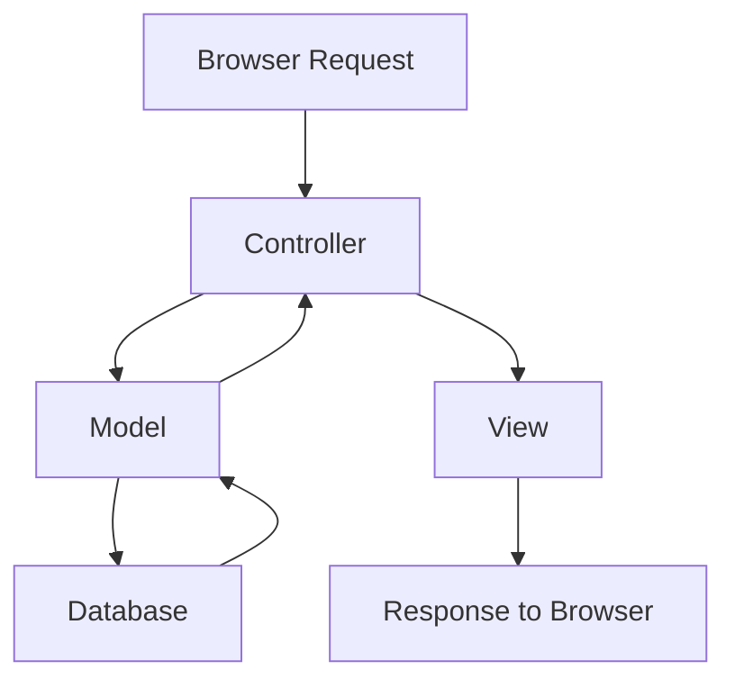

# PHP CakePHP Basics

## Introduction

CakePHP is a popular open-source PHP framework that follows the Model-View-Controller (MVC) architectural pattern. It's designed to make developing web applications simpler, faster, and require less code. CakePHP provides a structured foundation that enables developers to build robust applications without losing flexibility.

In this guide, we'll explore the basics of CakePHP, understanding its core concepts, and seeing how it can streamline your PHP development process.

## What is CakePHP?

CakePHP is a rapid development framework for PHP that provides an extensible architecture for developing, maintaining, and deploying applications. Some key features of CakePHP include:

- Built-in tools for database access, validation, authentication, and caching
- Convention over configuration approach
- MVC architecture
- Built-in security features
- Active and supportive community

CakePHP is perfect for beginners because it removes much of the complexity from web development while maintaining the flexibility needed for complex applications.

## Setting Up CakePHP

### Prerequisites

Before installing CakePHP, ensure you have:

- HTTP Server (Apache recommended)
- PHP 7.4 or higher
- Composer (dependency manager for PHP)

### Installation

The easiest way to install CakePHP is using Composer:

```bash
# Create a new CakePHP project
composer create-project --prefer-dist cakephp/app my_cake_app

# Navigate to your project
cd my_cake_app

# Start the built-in server (for development)
bin/cake server
```

After running these commands, you can visit `http://localhost:8765` to see your CakePHP application running!

## Understanding the MVC Architecture

CakePHP follows the MVC (Model-View-Controller) architectural pattern that separates your application into three main parts:



### Models

Models represent the data layer of your application. They're responsible for retrieving data, converting it into meaningful concepts for your application, as well as storing data, validating, and saving.

**Example of a simple User Model:**

```php
// src/Model/Table/UsersTable.php
namespace App\Model\Table;

use Cake\ORM\Table;
use Cake\Validation\Validator;

class UsersTable extends Table
{
    public function initialize(array $config): void
    {
        parent::initialize($config);
        
        $this->setTable('users');
        $this->setPrimaryKey('id');
        $this->addBehavior('Timestamp');
    }
    
    public function validationDefault(Validator $validator): Validator
    {
        $validator
            ->integer('id')
            ->allowEmptyString('id', null, 'create');
            
        $validator
            ->email('email')
            ->requirePresence('email', 'create')
            ->notEmptyString('email');
            
        $validator
            ->scalar('password')
            ->maxLength('password', 255)
            ->requirePresence('password', 'create')
            ->notEmptyString('password');
            
        return $validator;
    }
}
```

### Controllers

Controllers handle HTTP requests. They read data from the request, use models to fetch or save data, and set response data that will be turned into an HTTP response.

**Example of a Users Controller:**

```php
// src/Controller/UsersController.php
namespace App\Controller;

class UsersController extends AppController
{
    public function index()
    {
        $users = $this->Users->find()->all();
        $this->set(compact('users'));
    }
    
    public function view($id = null)
    {
        $user = $this->Users->get($id);
        $this->set(compact('user'));
    }
    
    public function add()
    {
        $user = $this->Users->newEmptyEntity();
        if ($this->request->is('post')) {
            $user = $this->Users->patchEntity($user, $this->request->getData());
            if ($this->Users->save($user)) {
                $this->Flash->success(__('The user has been saved.'));
                return $this->redirect(['action' => 'index']);
            }
            $this->Flash->error(__('Unable to add the user.'));
        }
        $this->set(compact('user'));
    }
}
```

### Views

Views are responsible for generating the specific output required for the request. Often this is HTML, but it could also be JSON, XML, or other formats.

**Example of User Index View:**

```php
<!-- templates/Users/index.php -->
<h1>Users</h1>
<table>
    <tr>
        <th>ID</th>
        <th>Email</th>
        <th>Created</th>
        <th>Actions</th>
    </tr>
    
    <?php foreach ($users as $user): ?>
    <tr>
        <td><?= $user->id ?></td>
        <td><?= $user->email ?></td>
        <td><?= $user->created->format('Y-m-d H:i:s') ?></td>
        <td>
            <?= $this->Html->link('View', ['action' => 'view', $user->id]) ?>
            <?= $this->Html->link('Edit', ['action' => 'edit', $user->id]) ?>
        </td>
    </tr>
    <?php endforeach; ?>
</table>

<?= $this->Html->link('Add New User', ['action' => 'add']) ?>
```

## Routing in CakePHP

Routing in CakePHP connects URLs to controller actions. By defining routes, you control how your application responds to specific URL patterns.

Default routes follow the pattern: `/{controller}/{action}/{id}`.

For example:
- `/users/view/1` maps to the `view()` method of the `UsersController` with parameter `$id = 1`

You can define custom routes in `config/routes.php`:

```php
// config/routes.php
use Cake\Routing\Route\DashedRoute;

$routes->scope('/', function ($routes) {
    // Connect the default home page
    $routes->connect('/', ['controller' => 'Pages', 'action' => 'display', 'home']);
    
    // Custom route for user profiles
    $routes->connect(
        '/profile/:username',
        ['controller' => 'Users', 'action' => 'profile'],
        ['pass' => ['username']]
    );
    
    // Apply default routes
    $routes->fallbacks(DashedRoute::class);
});
```

## Working with Database

CakePHP makes database operations easy and intuitive through its ORM (Object-Relational Mapping) system.

### Database Configuration

Configure your database connection in `config/app_local.php`:

```php
// config/app_local.php
'Datasources' => [
    'default' => [
        'host' => 'localhost',
        'username' => 'db_user',
        'password' => 'db_password',
        'database' => 'my_app',
        'url' => env('DATABASE_URL', null),
    ],
],
```

### Basic CRUD Operations

Here's how to perform basic Create, Read, Update, and Delete operations:

**Create (Save a new record):**

```php
// In a controller
public function add()
{
    $article = $this->Articles->newEmptyEntity();
    if ($this->request->is('post')) {
        $article = $this->Articles->patchEntity($article, $this->request->getData());
        if ($this->Articles->save($article)) {
            $this->Flash->success(__('Article saved!'));
            return $this->redirect(['action' => 'index']);
        }
        $this->Flash->error(__('Could not save article.'));
    }
    $this->set(compact('article'));
}
```

**Read (Find records):**

```php
// Find all
$articles = $this->Articles->find()->all();

// Find by primary key
$article = $this->Articles->get(12);

// Find with conditions
$articles = $this->Articles->find()
    ->where(['status' => 'published'])
    ->order(['created' => 'DESC'])
    ->limit(10);
```

**Update (Modify a record):**

```php
// In a controller's edit action
public function edit($id = null)
{
    $article = $this->Articles->get($id);
    if ($this->request->is(['post', 'put'])) {
        $article = $this->Articles->patchEntity($article, $this->request->getData());
        if ($this->Articles->save($article)) {
            $this->Flash->success(__('Article updated!'));
            return $this->redirect(['action' => 'index']);
        }
        $this->Flash->error(__('Could not update article.'));
    }
    $this->set(compact('article'));
}
```

**Delete (Remove a record):**

```php
// In a controller's delete action
public function delete($id = null)
{
    $this->request->allowMethod(['post', 'delete']);
    $article = $this->Articles->get($id);
    if ($this->Articles->delete($article)) {
        $this->Flash->success(__('Article deleted.'));
    } else {
        $this->Flash->error(__('Could not delete article.'));
    }
    return $this->redirect(['action' => 'index']);
}
```

## Forms and Validation

CakePHP provides powerful tools for creating and processing forms with built-in validation.

### Creating Forms

CakePHP's FormHelper makes creating forms easy:

```php
<!-- In a template file -->
<?= $this->Form->create($article) ?>
    <?= $this->Form->control('title') ?>
    <?= $this->Form->control('body', ['rows' => 3]) ?>
    <?= $this->Form->control('published', ['type' => 'checkbox']) ?>
    <?= $this->Form->button('Save Article') ?>
<?= $this->Form->end() ?>
```

### Validation

As shown earlier, validation rules are defined in the model's `validationDefault` method.

## Practical Example: Building a Simple Blog

Let's put everything together by creating a simple blog application with CakePHP.

### 1. Create Database Tables

First, create tables for your blog:

```sql
CREATE TABLE articles (
    id INT AUTO_INCREMENT PRIMARY KEY,
    title VARCHAR(255) NOT NULL,
    body TEXT NOT NULL,
    created DATETIME DEFAULT CURRENT_TIMESTAMP,
    modified DATETIME DEFAULT CURRENT_TIMESTAMP ON UPDATE CURRENT_TIMESTAMP
);

CREATE TABLE users (
    id INT AUTO_INCREMENT PRIMARY KEY,
    email VARCHAR(255) NOT NULL UNIQUE,
    password VARCHAR(255) NOT NULL,
    created DATETIME DEFAULT CURRENT_TIMESTAMP,
    modified DATETIME DEFAULT CURRENT_TIMESTAMP ON UPDATE CURRENT_TIMESTAMP
);
```

### 2. Create Models

```php
// src/Model/Table/ArticlesTable.php
namespace App\Model\Table;

use Cake\ORM\Table;
use Cake\Validation\Validator;

class ArticlesTable extends Table
{
    public function initialize(array $config): void
    {
        parent::initialize($config);
        
        $this->setTable('articles');
        $this->setPrimaryKey('id');
        $this->addBehavior('Timestamp');
    }
    
    public function validationDefault(Validator $validator): Validator
    {
        $validator
            ->integer('id')
            ->allowEmptyString('id', null, 'create');
            
        $validator
            ->scalar('title')
            ->requirePresence('title', 'create')
            ->notEmptyString('title')
            ->maxLength('title', 255);
            
        $validator
            ->scalar('body')
            ->requirePresence('body', 'create')
            ->notEmptyString('body');
            
        return $validator;
    }
}
```

### 3. Create Controllers

```php
// src/Controller/ArticlesController.php
namespace App\Controller;

class ArticlesController extends AppController
{
    public function index()
    {
        $articles = $this->Articles->find()->order(['created' => 'DESC'])->all();
        $this->set(compact('articles'));
    }
    
    public function view($id = null)
    {
        $article = $this->Articles->get($id);
        $this->set(compact('article'));
    }
    
    public function add()
    {
        $article = $this->Articles->newEmptyEntity();
        if ($this->request->is('post')) {
            $article = $this->Articles->patchEntity($article, $this->request->getData());
            if ($this->Articles->save($article)) {
                $this->Flash->success(__('Your article has been saved.'));
                return $this->redirect(['action' => 'index']);
            }
            $this->Flash->error(__('Unable to add your article.'));
        }
        $this->set(compact('article'));
    }
    
    public function edit($id = null)
    {
        $article = $this->Articles->get($id);
        if ($this->request->is(['post', 'put'])) {
            $article = $this->Articles->patchEntity($article, $this->request->getData());
            if ($this->Articles->save($article)) {
                $this->Flash->success(__('Your article has been updated.'));
                return $this->redirect(['action' => 'index']);
            }
            $this->Flash->error(__('Unable to update your article.'));
        }
        $this->set(compact('article'));
    }
    
    public function delete($id = null)
    {
        $this->request->allowMethod(['post', 'delete']);
        $article = $this->Articles->get($id);
        if ($this->Articles->delete($article)) {
            $this->Flash->success(__('The article has been deleted.'));
        } else {
            $this->Flash->error(__('Unable to delete the article.'));
        }
        return $this->redirect(['action' => 'index']);
    }
}
```

### 4. Create Views

**Index View (templates/Articles/index.php):**

```php
<h1>Blog Articles</h1>
<?= $this->Html->link('Add Article', ['action' => 'add'], ['class' => 'button']) ?>
<table>
    <tr>
        <th>Title</th>
        <th>Created</th>
        <th>Actions</th>
    </tr>
    
    <?php foreach ($articles as $article): ?>
    <tr>
        <td>
            <?= $this->Html->link($article->title, ['action' => 'view', $article->id]) ?>
        </td>
        <td>
            <?= $article->created->format('Y-m-d H:i:s') ?>
        </td>
        <td>
            <?= $this->Html->link('Edit', ['action' => 'edit', $article->id]) ?>
            <?= $this->Form->postLink(
                'Delete',
                ['action' => 'delete', $article->id],
                ['confirm' => 'Are you sure?'])
            ?>
        </td>
    </tr>
    <?php endforeach; ?>
</table>
```

**View Article (templates/Articles/view.php):**

```php
<h1><?= h($article->title) ?></h1>
<p><small>Created: <?= $article->created->format('Y-m-d H:i:s') ?></small></p>
<div class="article-body">
    <?= $article->body ?>
</div>
<?= $this->Html->link('Back to List', ['action' => 'index']) ?>
```

**Add Article Form (templates/Articles/add.php):**

```php
<h1>Add Article</h1>
<?= $this->Form->create($article) ?>
    <?= $this->Form->control('title') ?>
    <?= $this->Form->control('body', ['rows' => 10]) ?>
    <?= $this->Form->button('Save Article') ?>
<?= $this->Form->end() ?>
<?= $this->Html->link('Back to List', ['action' => 'index']) ?>
```

**Edit Article Form (templates/Articles/edit.php):**

```php
<h1>Edit Article</h1>
<?= $this->Form->create($article) ?>
    <?= $this->Form->control('title') ?>
    <?= $this->Form->control('body', ['rows' => 10]) ?>
    <?= $this->Form->button('Update Article') ?>
<?= $this->Form->end() ?>
<?= $this->Html->link('Back to List', ['action' => 'index']) ?>
```

## CakePHP Components

CakePHP comes with several built-in components that provide reusable code for controllers:

### Authentication Component

Handles user authentication and authorization:

```php
// src/Controller/AppController.php
public function initialize(): void
{
    parent::initialize();
    
    $this->loadComponent('Flash');
    $this->loadComponent('Auth', [
        'authenticate' => [
            'Form' => [
                'fields' => [
                    'username' => 'email',
                    'password' => 'password'
                ]
            ]
        ],
        'loginAction' => [
            'controller' => 'Users',
            'action' => 'login'
        ]
    ]);
}
```

### Session and Flash Components

Helps manage session data and flash messages:

```php
// In a controller action
$this->Flash->success('The article was saved successfully.');
$this->Flash->error('Could not save the article.');
```

## Helpers in CakePHP

Helpers are utility classes used in views:

### HTML Helper

Used for generating HTML elements:

```php
// Create a link
<?= $this->Html->link('View', ['controller' => 'Articles', 'action' => 'view', $article->id]) ?>

// Include CSS
<?= $this->Html->css('styles') ?>

// Include JavaScript
<?= $this->Html->script('app') ?>

// Create an image tag
<?= $this->Html->image('logo.png', ['alt' => 'Logo']) ?>
```

### Form Helper

As shown earlier, used for creating and processing forms.

## Summary

In this guide, we've covered the basics of CakePHP, including:

1. The MVC architecture that CakePHP follows
2. How to set up a CakePHP project
3. Creating models, controllers, and views
4. Routing in CakePHP
5. Working with databases using CakePHP's ORM
6. Forms and validation
7. Building a practical blog application
8. Using components and helpers

CakePHP provides a robust framework that simplifies PHP web development while offering the flexibility needed for complex applications. By following CakePHP's conventions, you can rapidly develop web applications with less code.

## Additional Resources

- [Official CakePHP Documentation](https://book.cakephp.org)
- [CakePHP GitHub Repository](https://github.com/cakephp/cakephp)
- [CakePHP API Documentation](https://api.cakephp.org)
- [CakePHP Cookbook](https://book.cakephp.org/4/en/index.html)
- [CakePHP Plugins](https://plugins.cakephp.org)

## Exercises

1. **Basic Blog**: Extend the blog application by adding categories to articles.
2. **User Authentication**: Implement a complete user authentication system (registration, login, logout).
3. **API Development**: Create a simple RESTful API for your blog application.
4. **Form Validation**: Add custom validation rules to the article form.
5. **Database Relations**: Implement a one-to-many relationship between users and articles.