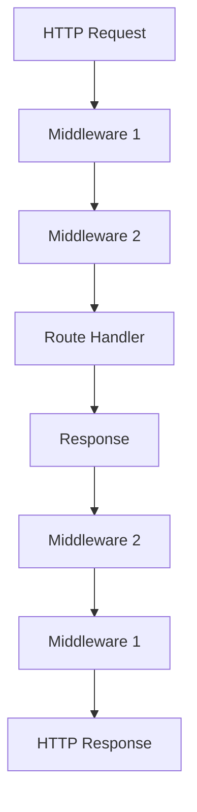

# PHP Slim Basics

## Introduction

Slim is a popular PHP micro-framework that helps you quickly build web applications and APIs. Unlike full-stack frameworks such as Laravel or Symfony, Slim provides just the essential components needed to handle HTTP requests, making it lightweight, fast, and easy to learn. It's an excellent choice for beginners who want to understand how frameworks operate without being overwhelmed by complex features.

In this tutorial, we'll explore the basics of the Slim framework, learn how to set up a simple application, and understand the core concepts that make Slim an excellent choice for small to medium-sized web projects.

## Why Choose Slim?

Slim offers several advantages for beginners:

- **Lightweight**: Minimal footprint with no unnecessary dependencies
- **Easy to learn**: Simple API with clear documentation
- **Flexible**: Easily extensible with middleware and plugins
- **PSR-7 compliant**: Uses standard HTTP message interfaces
- **Modern PHP practices**: Built on PHP 7+ with modern coding standards

## Getting Started with Slim

### Prerequisites

Before we begin, make sure you have:

- PHP 7.4 or newer
- Composer (for package management)
- Basic understanding of PHP and HTTP concepts

### Installation

The easiest way to get started with Slim is by using Composer. Create a new directory for your project and run:

```bash
composer require slim/slim:"4.*"
composer require slim/psr7
```

This installs Slim 4 along with PSR-7 implementation for handling HTTP messages.

### Creating Your First Slim Application

Let's create a simple "Hello World" application to understand the basics. Create a file named `index.php` with the following code:

```php
<?php
use Psr\Http\Message\ResponseInterface as Response;
use Psr\Http\Message\ServerRequestInterface as Request;
use Slim\Factory\AppFactory;

require __DIR__ . '/vendor/autoload.php';

// Create Slim app
$app = AppFactory::create();

// Define route
$app->get('/hello/{name}', function (Request $request, Response $response, array $args) {
    $name = $args['name'];
    $response->getBody()->write("Hello, $name!");
    return $response;
});

// Run the app
$app->run();
```

### Running Your Application

You can run your application using PHP's built-in server:

```bash
php -S localhost:8000
```

Now, navigate to `http://localhost:8000/hello/world` in your browser. You should see:

```
Hello, world!
```

If you change the URL to `http://localhost:8000/hello/Slim`, you'll see:

```
Hello, Slim!
```

## Core Concepts in Slim

### Application Container

Slim uses a Dependency Injection Container to manage dependencies. In Slim 4, you can use any PSR-11 compliant container. The container helps organize your application's services and makes testing easier.

Here's a simple example using PHP-DI:

```php
<?php
use DI\Container;
use Slim\Factory\AppFactory;

require __DIR__ . '/vendor/autoload.php';

// Create Container
$container = new Container();

// Add service to container
$container->set('logger', function() {
    return new MyLogger();
});

// Create app with container
AppFactory::setContainer($container);
$app = AppFactory::create();

// Now you can access the logger in your routes
$app->get('/', function ($request, $response) {
    $logger = $this->get('logger');
    $logger->info('Home page visited');
    
    $response->getBody()->write("Welcome to Slim!");
    return $response;
});

$app->run();
```

### Routing

Routing is a core feature of Slim. It maps HTTP requests to specific callback functions based on the request method and URI pattern.

#### Basic Routes

```php
// GET route
$app->get('/users', function (Request $request, Response $response) {
    $response->getBody()->write("GET users");
    return $response;
});

// POST route
$app->post('/users', function (Request $request, Response $response) {
    $response->getBody()->write("POST users");
    return $response;
});

// Multiple methods
$app->map(['GET', 'POST'], '/contact', function (Request $request, Response $response) {
    $response->getBody()->write("Contact page");
    return $response;
});
```

#### Named Routes

You can name your routes for easy URL generation:

```php
$app->get('/blog/{id}', function (Request $request, Response $response, array $args) {
    $response->getBody()->write("Blog post " . $args['id']);
    return $response;
})->setName('blog-post');

// Generate URL for the named route
$routeParser = $app->getRouteCollector()->getRouteParser();
$url = $routeParser->urlFor('blog-post', ['id' => 123]);
// Output: /blog/123
```

#### Route Groups

Route groups allow you to apply middleware or URL patterns to multiple routes:

```php
$app->group('/api', function ($group) {
    $group->get('/users', function ($request, $response) {
        $response->getBody()->write("API Users");
        return $response;
    });
    
    $group->get('/products', function ($request, $response) {
        $response->getBody()->write("API Products");
        return $response;
    });
});
```

### Request and Response Handling

Slim uses PSR-7 interfaces for handling HTTP requests and responses. This makes the framework interoperable with other PHP libraries.

#### Accessing Request Data

```php
$app->post('/user/create', function (Request $request, Response $response) {
    // Get query parameters
    $params = $request->getQueryParams();
    
    // Get POST data
    $postData = $request->getParsedBody();
    
    // Get uploaded files
    $files = $request->getUploadedFiles();
    
    // Get a specific header
    $contentType = $request->getHeaderLine('Content-Type');
    
    // Get cookies
    $cookies = $request->getCookieParams();
    
    $response->getBody()->write("User created");
    return $response;
});
```

#### Manipulating Responses

```php
$app->get('/download', function (Request $request, Response $response) {
    $response = $response->withHeader('Content-Type', 'application/pdf');
    $response = $response->withHeader('Content-Disposition', 'attachment; filename="report.pdf"');
    
    // Write response body
    $response->getBody()->write($pdfContent);
    
    return $response;
});
```

### Middleware

Middleware is a powerful concept in Slim. It allows you to execute code before and after your application handles a request. Middleware can modify the request and response objects, making it useful for authentication, logging, CORS handling, and more.

#### Creating Middleware

```php
<?php
use Psr\Http\Message\ServerRequestInterface as Request;
use Psr\Http\Server\RequestHandlerInterface as RequestHandler;
use Slim\Psr7\Response;

class ExampleMiddleware
{
    public function __invoke(Request $request, RequestHandler $handler): Response
    {
        $request = $request->withAttribute('middleware_message', 'Hello from middleware!');
        
        // Call the next middleware
        $response = $handler->handle($request);
        
        // Add a header to the response
        $response = $response->withHeader('X-Example-Middleware', 'Passed');
        
        return $response;
    }
}
```

#### Adding Middleware to Your Application

```php
// Global middleware (runs on all routes)
$app->add(new ExampleMiddleware());

// Route-specific middleware
$app->get('/protected', function (Request $request, Response $response) {
    $message = $request->getAttribute('middleware_message');
    $response->getBody()->write($message);
    return $response;
})->add(new AuthMiddleware());

// Group middleware
$app->group('/admin', function ($group) {
    // Routes here
})->add(new AdminAuthMiddleware());
```

## Practical Example: Building a Simple REST API

Let's create a simple REST API for managing a list of books. This example demonstrates routing, request/response handling, and data manipulation.

```php
<?php
use Psr\Http\Message\ResponseInterface as Response;
use Psr\Http\Message\ServerRequestInterface as Request;
use Slim\Factory\AppFactory;

require __DIR__ . '/vendor/autoload.php';

$app = AppFactory::create();
$app->addBodyParsingMiddleware(); // For parsing JSON request bodies

// Sample data (in a real app, this would come from a database)
$books = [
    ['id' => 1, 'title' => 'The Hobbit', 'author' => 'J.R.R. Tolkien'],
    ['id' => 2, 'title' => '1984', 'author' => 'George Orwell'],
    ['id' => 3, 'title' => 'To Kill a Mockingbird', 'author' => 'Harper Lee']
];

// GET all books
$app->get('/books', function (Request $request, Response $response) use ($books) {
    $payload = json_encode($books);
    $response->getBody()->write($payload);
    return $response->withHeader('Content-Type', 'application/json');
});

// GET a single book by ID
$app->get('/books/{id}', function (Request $request, Response $response, array $args) use ($books) {
    $id = (int)$args['id'];
    
    // Find the book
    $book = null;
    foreach ($books as $b) {
        if ($b['id'] === $id) {
            $book = $b;
            break;
        }
    }
    
    // Book not found
    if ($book === null) {
        $response->getBody()->write(json_encode(['error' => 'Book not found']));
        return $response
            ->withHeader('Content-Type', 'application/json')
            ->withStatus(404);
    }
    
    // Return the book
    $payload = json_encode($book);
    $response->getBody()->write($payload);
    return $response->withHeader('Content-Type', 'application/json');
});

// POST a new book
$app->post('/books', function (Request $request, Response $response) use (&$books) {
    $data = $request->getParsedBody();
    
    // Validate input
    if (!isset($data['title']) || !isset($data['author'])) {
        $response->getBody()->write(json_encode(['error' => 'Title and author are required']));
        return $response
            ->withHeader('Content-Type', 'application/json')
            ->withStatus(400);
    }
    
    // Create new book
    $newId = count($books) + 1;
    $newBook = [
        'id' => $newId,
        'title' => $data['title'],
        'author' => $data['author']
    ];
    
    // Add to collection
    $books[] = $newBook;
    
    // Return new book
    $payload = json_encode($newBook);
    $response->getBody()->write($payload);
    return $response
        ->withHeader('Content-Type', 'application/json')
        ->withStatus(201);
});

$app->run();
```

### Testing the API

You can test this API using tools like cURL, Postman, or JavaScript fetch:

**Get all books:**
```bash
curl http://localhost:8000/books
```

**Get a single book:**
```bash
curl http://localhost:8000/books/1
```

**Add a new book:**
```bash
curl -X POST http://localhost:8000/books \
  -H "Content-Type: application/json" \
  -d '{"title":"The Great Gatsby","author":"F. Scott Fitzgerald"}'
```

## Application Structure

For larger applications, it's important to organize your code properly. Here's a recommended structure for Slim applications:

```
project/
├── public/
│   └── index.php       # Front controller
├── src/
│   ├── Controllers/    # Application controllers
│   ├── Middleware/     # Middleware classes
│   ├── Models/         # Data models
│   └── Services/       # Business logic
├── templates/          # View templates
├── config/             # Configuration files
├── logs/               # Log files
├── tests/              # Test files
├── vendor/             # Composer dependencies
├── .htaccess           # Apache configuration
├── composer.json       # Composer configuration
└── README.md           # Project documentation
```

Here's a visual representation of the Slim request lifecycle:



## Error Handling

Slim provides a powerful error handling system that allows you to handle exceptions and display appropriate error messages.

```php
<?php
use Slim\Exception\HttpNotFoundException;

// Define custom error handler
$customErrorHandler = function (
    Request $request,
    Throwable $exception,
    bool $displayErrorDetails,
    bool $logErrors,
    bool $logErrorDetails
) use ($app) {
    $response = $app->getResponseFactory()->createResponse();
    
    // Log error
    if ($logErrors) {
        $logger = $app->getContainer()->get('logger');
        $logger->error($exception->getMessage());
    }
    
    // Return JSON error response
    $payload = ['error' => 'Something went wrong!'];
    
    if ($exception instanceof HttpNotFoundException) {
        $payload['error'] = 'Resource not found';
        $response = $response->withStatus(404);
    } else {
        $response = $response->withStatus(500);
    }
    
    $response->getBody()->write(json_encode($payload));
    return $response->withHeader('Content-Type', 'application/json');
};

// Add Error Middleware
$errorMiddleware = $app->addErrorMiddleware(true, true, true);
$errorMiddleware->setDefaultErrorHandler($customErrorHandler);
```

## Summary

In this tutorial, we've covered the basics of the Slim PHP framework, including:

- Setting up a Slim application
- Understanding the core concepts of routing
- Working with requests and responses
- Implementing middleware
- Building a simple REST API
- Organizing your application structure
- Handling errors

Slim's simplicity makes it an excellent choice for beginners looking to learn about frameworks, while its flexibility makes it suitable for a wide range of projects, especially APIs and microservices.

## Exercises

1. Extend the book API to include PUT and DELETE endpoints.
2. Add validation middleware to check incoming requests.
3. Implement a simple authentication system using middleware.
4. Create a front-end interface to interact with your API.
5. Refactor the example to use a proper file structure with separate controller classes.

## Additional Resources

- [Official Slim Framework Documentation](https://www.slimframework.com/docs/v4/)
- [Slim Framework GitHub Repository](https://github.com/slimphp/Slim)
- [PSR-7: HTTP Message Interface](https://www.php-fig.org/psr/psr-7/)
- [PHP-DI Documentation](https://php-di.org/) (for dependency injection)
- [Twig Documentation](https://twig.symfony.com/) (popular template engine that works well with Slim)