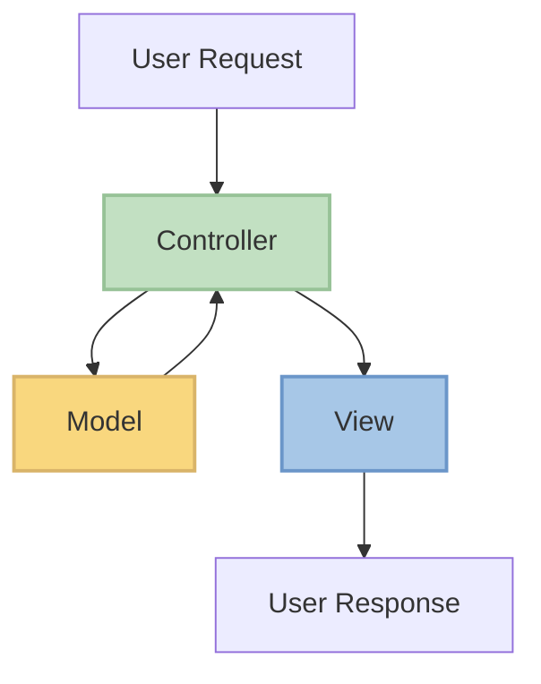

# PHP Yii Basics

## Introduction

Yii is a high-performance, component-based PHP framework designed for developing modern web applications rapidly. The name "Yii" (pronounced as "Yee" or [ji:]) stands for "Yes It Is!" in Chinese, representing simplicity and evolutionary development. First released in 2008, Yii has become one of the most popular PHP frameworks due to its elegant design, extensive features, and excellent performance.

In this guide, we'll cover the fundamental concepts of the Yii framework, how to set it up, and how to build basic applications with it. By the end, you'll have a solid understanding of Yii's architecture and be ready to develop your own web applications.

## Why Choose Yii?

Before diving into the technical details, let's understand why you might want to use Yii:

- **MVC Architecture**: Yii follows the Model-View-Controller (MVC) design pattern, making your code organized and maintainable.
- **DRY Principle**: Don't Repeat Yourself - Yii encourages code reusability.
- **Fast Performance**: Yii is optimized for speed with lazy loading techniques.
- **Security**: Built-in security features protect against common web vulnerabilities.
- **Database Abstraction**: Work with databases easily through ActiveRecord.
- **Extensions**: A large ecosystem of plugins and extensions.

## Understanding MVC in Yii

Yii is built on the MVC architectural pattern, which separates your application into three main components:



- **Model**: Represents data and business logic
- **View**: Handles the presentation and UI
- **Controller**: Processes user requests and coordinates between Model and View

## Installation and Setup

### Prerequisites

Before installing Yii, ensure you have:
- PHP 7.3 or higher
- Composer (dependency manager for PHP)
- Basic knowledge of PHP and object-oriented programming

### Installing Yii via Composer

```bash
# Create a new Yii project
composer create-project --prefer-dist yiisoft/yii2-app-basic basic

# Navigate to the project directory
cd basic

# Start the built-in PHP server
php yii serve
```

After running these commands, you can access your application at `http://localhost:8080`.

### Project Structure

When you create a new Yii project, it generates a directory structure like this:

```
basic/                  # Application base path
    composer.json       # Composer configuration
    config/             # Application configurations
        console.php     # Console application configuration
        web.php         # Web application configuration
    controllers/        # Controller classes
    models/             # Model classes
    views/              # View files
    web/                # Web accessible directory
        index.php       # Entry script
        assets/         # Published asset files
    vendor/             # Third-party packages
    runtime/            # Runtime files like logs and cache
```

## Creating Your First Yii Application

Let's create a simple "Hello World" application to understand the basics:

### 1. Create a Controller

Create a file named `HelloController.php` in the `controllers` directory:

```php
<?php

namespace app\controllers;

use yii\web\Controller;

class HelloController extends Controller
{
    public function actionIndex()
    {
        return $this->render('index');
    }
    
    public function actionSayHello($name = 'World')
    {
        return $this->render('hello', ['name' => $name]);
    }
}
```

### 2. Create Views

Create a directory named `hello` in the `views` directory, and add the following files:

**views/hello/index.php**:
```php
<?php
use yii\helpers\Html;
?>

<div class="hello-index">
    <h1>Hello World Application</h1>
    <p>This is the index page of our first Yii application.</p>
    <p>
        <?= Html::a('Say Hello', ['hello/say-hello'], ['class' => 'btn btn-primary']) ?>
    </p>
</div>
```

**views/hello/hello.php**:
```php
<?php
use yii\helpers\Html;
?>

<div class="hello-greeting">
    <h1>Hello, <?= Html::encode($name) ?>!</h1>
    <p>Welcome to your first Yii application.</p>
    <p>
        <?= Html::a('Go Back', ['hello/index'], ['class' => 'btn btn-secondary']) ?>
    </p>
</div>
```

### 3. Access Your Application

Now, you can access your application at:
- `http://localhost:8080/index.php?r=hello/index` - For the index page
- `http://localhost:8080/index.php?r=hello/say-hello&name=YourName` - To see a personalized greeting

### Example Output

When you visit `http://localhost:8080/index.php?r=hello/say-hello&name=Jane`:

```
Hello, Jane!
Welcome to your first Yii application.
[Go Back]
```

## Working with Models and Forms

Yii makes it easy to work with data models and forms. Let's create a simple contact form:

### 1. Create a Model

Create a file named `ContactForm.php` in the `models` directory:

```php
<?php

namespace app\models;

use yii\base\Model;

class ContactForm extends Model
{
    public $name;
    public $email;
    public $subject;
    public $message;
    
    public function rules()
    {
        return [
            [['name', 'email', 'subject', 'message'], 'required'],
            ['email', 'email'],
        ];
    }
}
```

### 2. Create a Controller Action

Add a new action to your `HelloController.php`:

```php
public function actionContact()
{
    $model = new \app\models\ContactForm();
    
    if ($model->load(\Yii::$app->request->post()) && $model->validate()) {
        // Process form data here
        \Yii::$app->session->setFlash('success', 'Thank you for contacting us. We will respond to you as soon as possible.');
        return $this->refresh();
    }
    
    return $this->render('contact', [
        'model' => $model,
    ]);
}
```

### 3. Create a View

Create a file named `contact.php` in the `views/hello` directory:

```php
<?php
use yii\helpers\Html;
use yii\widgets\ActiveForm;
?>

<div class="contact-form">
    <h1>Contact Us</h1>
    
    <?php if (Yii::$app->session->hasFlash('success')): ?>
        <div class="alert alert-success">
            <?= Yii::$app->session->getFlash('success') ?>
        </div>
    <?php endif; ?>
    
    <?php $form = ActiveForm::begin(); ?>
    
    <?= $form->field($model, 'name') ?>
    <?= $form->field($model, 'email') ?>
    <?= $form->field($model, 'subject') ?>
    <?= $form->field($model, 'message')->textarea(['rows' => 6]) ?>
    
    <div class="form-group">
        <?= Html::submitButton('Submit', ['class' => 'btn btn-primary']) ?>
    </div>
    
    <?php ActiveForm::end(); ?>
</div>
```

## Working with Databases: ActiveRecord

Yii's ActiveRecord provides an elegant way to interact with databases. Let's see how to create a simple model that connects to a database table:

### 1. Configure Database Connection

Edit the `config/db.php` file:

```php
return [
    'class' => 'yii\db\Connection',
    'dsn' => 'mysql:host=localhost;dbname=yii_basic',
    'username' => 'root',
    'password' => '',
    'charset' => 'utf8',
];
```

### 2. Create a Database Table

Run this SQL to create a sample table:

```sql
CREATE TABLE `user` (
  `id` INT NOT NULL AUTO_INCREMENT,
  `username` VARCHAR(255) NOT NULL,
  `email` VARCHAR(255) NOT NULL,
  `created_at` TIMESTAMP DEFAULT CURRENT_TIMESTAMP,
  PRIMARY KEY (`id`)
);
```

### 3. Create an ActiveRecord Model

Create a file named `User.php` in the `models` directory:

```php
<?php

namespace app\models;

use yii\db\ActiveRecord;

class User extends ActiveRecord
{
    public static function tableName()
    {
        return 'user';
    }
    
    public function rules()
    {
        return [
            [['username', 'email'], 'required'],
            ['email', 'email'],
            ['username', 'string', 'min' => 3, 'max' => 50],
        ];
    }
}
```

### 4. Using ActiveRecord in Controller

Add these methods to your controller:

```php
public function actionUsers()
{
    $users = \app\models\User::find()->all();
    return $this->render('users', ['users' => $users]);
}

public function actionCreateUser()
{
    $model = new \app\models\User();
    
    if ($model->load(\Yii::$app->request->post()) && $model->save()) {
        return $this->redirect(['users']);
    }
    
    return $this->render('create-user', ['model' => $model]);
}
```

### Example: Finding and Displaying Users

```php
// Find all users
$users = User::find()->all();

// Find a user by primary key
$user = User::findOne(1);

// Find users with conditions
$activeUsers = User::find()
    ->where(['status' => 'active'])
    ->orderBy('username')
    ->limit(10)
    ->all();
```

## Building RESTful APIs with Yii

Yii makes it easy to create RESTful APIs. Here's a simple example:

### 1. Configure URL Rules

Add the following to your `config/web.php`:

```php
'urlManager' => [
    'enablePrettyUrl' => true,
    'showScriptName' => false,
    'rules' => [
        ['class' => 'yii\rest\UrlRule', 'controller' => 'api/user'],
    ],
],
```

### 2. Create an API Controller

Create a file named `UserController.php` in the `controllers/api` directory:

```php
<?php

namespace app\controllers\api;

use yii\rest\ActiveController;

class UserController extends ActiveController
{
    public $modelClass = 'app\models\User';
}
```

Now you can access your API at endpoints like:
- `GET /api/users` - List all users
- `GET /api/users/1` - Get user with ID 1
- `POST /api/users` - Create a new user
- `PUT /api/users/1` - Update user with ID 1
- `DELETE /api/users/1` - Delete user with ID 1

## Yii Widgets

Yii provides many built-in widgets to help with UI components. Here are a few examples:

### GridView for Displaying Data Tables

```php
<?php
use yii\grid\GridView;
use yii\data\ActiveDataProvider;

$dataProvider = new ActiveDataProvider([
    'query' => \app\models\User::find(),
    'pagination' => [
        'pageSize' => 10,
    ],
]);

echo GridView::widget([
    'dataProvider' => $dataProvider,
    'columns' => [
        'id',
        'username',
        'email',
        'created_at',
        ['class' => 'yii\grid\ActionColumn'],
    ],
]);
?>
```

### DetailView for Displaying a Single Record

```php
<?php
use yii\widgets\DetailView;

echo DetailView::widget([
    'model' => $user,
    'attributes' => [
        'id',
        'username',
        'email',
        'created_at',
    ],
]);
?>
```

## Using Behaviors

Behaviors in Yii allow you to enhance the functionality of a class without modifying its code. Here's an example of a timestamp behavior:

```php
<?php

namespace app\models;

use yii\db\ActiveRecord;
use yii\behaviors\TimestampBehavior;

class Article extends ActiveRecord
{
    public function behaviors()
    {
        return [
            [
                'class' => TimestampBehavior::class,
                'createdAtAttribute' => 'created_at',
                'updatedAtAttribute' => 'updated_at',
            ],
        ];
    }
    
    // rest of the model
}
```

This automatically sets `created_at` and `updated_at` timestamps when an article is created or updated.

## Summary

In this guide, we've covered the basics of the Yii PHP framework:

- Installation and project structure
- MVC architecture in Yii
- Creating controllers and views
- Working with models and forms
- Database operations with ActiveRecord
- Building RESTful APIs
- Using Yii widgets
- Enhancing classes with behaviors

Yii provides a robust foundation for developing web applications with PHP. Its elegant design, performance optimizations, and extensive feature set make it an excellent choice for both beginners and experienced developers.

## Additional Resources

- [Official Yii Documentation](https://www.yiiframework.com/doc/guide/2.0/en)
- [Yii API Documentation](https://www.yiiframework.com/doc/api/2.0)
- [Yii Forum](https://forum.yiiframework.com/)
- [Yii GitHub Repository](https://github.com/yiisoft/yii2)

## Exercises

1. Create a simple blog application with posts and comments using Yii.
2. Implement user authentication and authorization using Yii's built-in authentication system.
3. Build a RESTful API for a resource of your choice (e.g., products, articles).
4. Create a form with file uploads and validation.
5. Implement a search feature using Yii's query builder.