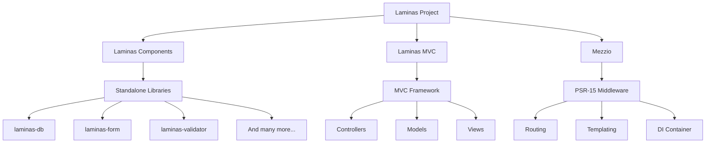
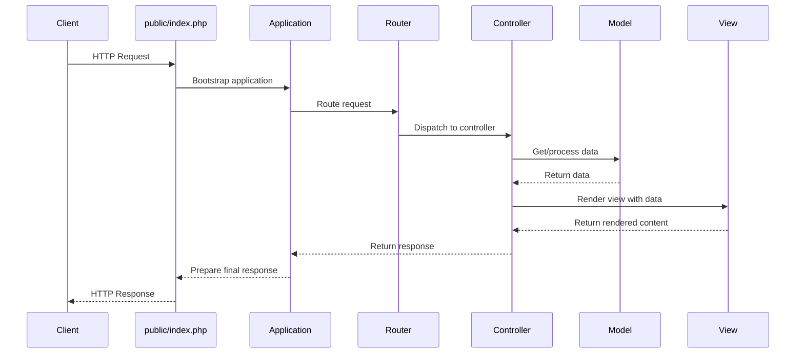

# PHP Laminas Basics

## Introduction

Laminas is a modern, open-source PHP framework for building web applications and services. It's the successor to the popular Zend Framework, maintaining the same high-quality codebase while operating under an open governance model through the Linux Foundation.

In this tutorial, we'll explore the fundamentals of Laminas, understand its architecture, and create a simple application to demonstrate its capabilities. By the end, you'll have a solid foundation to start building robust PHP applications using the Laminas framework.

## What is Laminas?

Laminas is a collection of PHP packages that together form a powerful framework for web application development. The project was created in 2019 when Zend Framework was transitioned to the Linux Foundation and rebranded. Laminas retains the enterprise-grade quality and features of Zend Framework while embracing a more community-driven approach.

Key features of Laminas include:

- **Modular architecture**: Use only what you need
- **MVC implementation**: Clean separation of concerns
- **Service management**: Dependency injection container
- **Event-driven programming**: Flexible application flow
- **Database abstraction**: Simple database interactions
- **Authentication and authorization**: Secure your applications
- **Form handling**: Validation and filtering
- **REST API support**: Build modern web services

## Laminas Framework Structure

Laminas is composed of three main sub-projects:

1. **Laminas Components** - Standalone libraries that can be used independently 
2. **Laminas MVC** - A full-stack MVC framework for web applications
3. **Mezzio** (formerly Zend Expressive) - Middleware runtime for PSR-15 middleware applications

Let's visualize this structure:



## Setting Up Your First Laminas Project

Let's start by creating a new Laminas MVC application. We'll use Composer, which is the standard PHP dependency manager.

### Prerequisites

- PHP 7.4 or higher
- Composer installed
- Basic PHP knowledge

### Creating a New Project

Open your terminal and run the following command:

```bash
composer create-project laminas/laminas-mvc-skeleton my-laminas-app
```

This command creates a new Laminas MVC application in the `my-laminas-app` directory. After the installation completes, navigate to the project folder:

```bash
cd my-laminas-app
```

### Project Structure

Here's what your newly created project structure looks like:

```
my-laminas-app/
├── config/             # Application configuration
├── data/               # Application data (logs, cache)
├── module/             # Application modules
│   └── Application/    # Default module
├── public/             # Public web directory
│   ├── css/
│   ├── img/
│   ├── js/
│   └── index.php       # Application entry point
├── vendor/             # Dependencies (managed by Composer)
├── composer.json       # Composer configuration
└── README.md           # Project documentation
```

### Running the Application

You can run the application using PHP's built-in web server:

```bash
php -S 0.0.0.0:8080 -t public
```

Now open your browser and navigate to `http://localhost:8080`. You should see the default Laminas welcome page.

## Understanding the MVC Pattern in Laminas

Laminas implements the Model-View-Controller (MVC) pattern, which separates your application into three main components:

1. **Models**: Handle data and business logic
2. **Views**: Present data to users
3. **Controllers**: Process requests and coordinate between models and views

### The Request Lifecycle

Let's see how a request flows through a Laminas application:



## Creating a Simple Module

In Laminas, applications are divided into modules. Let's create a simple "Blog" module to understand this concept better.

### 1. Create Module Structure

First, create the module directory structure:

```bash
mkdir -p module/Blog/config
mkdir -p module/Blog/src/Controller
mkdir -p module/Blog/src/Model
mkdir -p module/Blog/view/blog/index
```

### 2. Create Module Class

Create a file `module/Blog/src/Module.php`:

```php
<?php

namespace Blog;

use Laminas\ModuleManager\Feature\ConfigProviderInterface;

class Module implements ConfigProviderInterface
{
    public function getConfig()
    {
        return include __DIR__ . '/../config/module.config.php';
    }
}
```

### 3. Create Module Configuration

Create a file `module/Blog/config/module.config.php`:

```php
<?php

namespace Blog;

use Laminas\Router\Http\Segment;
use Laminas\ServiceManager\Factory\InvokableFactory;

return [
    'controllers' => [
        'factories' => [
            Controller\IndexController::class => InvokableFactory::class,
        ],
    ],
    'router' => [
        'routes' => [
            'blog' => [
                'type' => Segment::class,
                'options' => [
                    'route' => '/blog[/:action[/:id]]',
                    'defaults' => [
                        'controller' => Controller\IndexController::class,
                        'action' => 'index',
                    ],
                ],
            ],
        ],
    ],
    'view_manager' => [
        'template_path_stack' => [
            'blog' => __DIR__ . '/../view',
        ],
    ],
];
```

### 4. Create a Controller

Create a file `module/Blog/src/Controller/IndexController.php`:

```php
<?php

namespace Blog\Controller;

use Laminas\Mvc\Controller\AbstractActionController;
use Laminas\View\Model\ViewModel;

class IndexController extends AbstractActionController
{
    public function indexAction()
    {
        $posts = [
            ['id' => 1, 'title' => 'Introduction to Laminas', 'content' => 'This is a post about Laminas basics.'],
            ['id' => 2, 'title' => 'Working with Modules', 'content' => 'This post explains Laminas modules.'],
            ['id' => 3, 'title' => 'Laminas Forms', 'content' => 'Learn about form handling in Laminas.'],
        ];
        
        return new ViewModel(['posts' => $posts]);
    }
}
```

### 5. Create a View Template

Create a file `module/Blog/view/blog/index/index.phtml`:

```php
<div class="jumbotron">
    <h1>Welcome to the Blog Module</h1>
    <p>This is a simple blog module created with Laminas</p>
</div>

<div class="row">
    <?php foreach ($posts as $post): ?>
        <div class="col-md-4">
            <div class="card mb-4">
                <div class="card-body">
                    <h2 class="card-title"><?= $post['title'] ?></h2>
                    <p class="card-text"><?= $post['content'] ?></p>
                    <a href="#" class="btn btn-primary">Read More</a>
                </div>
            </div>
        </div>
    <?php endforeach; ?>
</div>
```

### 6. Register the Module

Open `config/modules.config.php` and add your module to the array:

```php
return [
    // ... other modules
    'Application',
    'Blog', // Add this line
];
```

Now navigate to `http://localhost:8080/blog` in your browser, and you should see your blog module in action!

## Working with Forms

Laminas provides a powerful form handling system. Let's create a simple contact form:

### 1. Create a Form Class

Create a directory for forms:

```bash
mkdir -p module/Blog/src/Form
```

Create a file `module/Blog/src/Form/ContactForm.php`:

```php
<?php

namespace Blog\Form;

use Laminas\Form\Form;
use Laminas\Form\Element;
use Laminas\InputFilter\InputFilterProviderInterface;
use Laminas\Validator;

class ContactForm extends Form implements InputFilterProviderInterface
{
    public function __construct($name = null)
    {
        parent::__construct('contact-form');
        
        // Name field
        $this->add([
            'name' => 'name',
            'type' => Element\Text::class,
            'options' => [
                'label' => 'Your Name',
            ],
            'attributes' => [
                'id' => 'name',
                'class' => 'form-control',
                'placeholder' => 'Enter your name',
                'required' => true,
            ],
        ]);
        
        // Email field
        $this->add([
            'name' => 'email',
            'type' => Element\Email::class,
            'options' => [
                'label' => 'Your Email',
            ],
            'attributes' => [
                'id' => 'email',
                'class' => 'form-control',
                'placeholder' => 'Enter your email',
                'required' => true,
            ],
        ]);
        
        // Message field
        $this->add([
            'name' => 'message',
            'type' => Element\Textarea::class,
            'options' => [
                'label' => 'Message',
            ],
            'attributes' => [
                'id' => 'message',
                'class' => 'form-control',
                'placeholder' => 'Enter your message',
                'required' => true,
                'rows' => 5,
            ],
        ]);
        
        // Submit button
        $this->add([
            'name' => 'submit',
            'type' => Element\Submit::class,
            'attributes' => [
                'value' => 'Send Message',
                'class' => 'btn btn-primary',
            ],
        ]);
    }
    
    public function getInputFilterSpecification()
    {
        return [
            'name' => [
                'required' => true,
                'filters' => [
                    ['name' => 'StripTags'],
                    ['name' => 'StringTrim'],
                ],
                'validators' => [
                    [
                        'name' => 'StringLength',
                        'options' => [
                            'min' => 2,
                            'max' => 100,
                            'messages' => [
                                Validator\StringLength::TOO_SHORT => 'Name must be at least %min% characters',
                                Validator\StringLength::TOO_LONG => 'Name must not exceed %max% characters',
                            ],
                        ],
                    ],
                ],
            ],
            'email' => [
                'required' => true,
                'filters' => [
                    ['name' => 'StripTags'],
                    ['name' => 'StringTrim'],
                ],
                'validators' => [
                    [
                        'name' => 'EmailAddress',
                        'options' => [
                            'messages' => [
                                Validator\EmailAddress::INVALID_FORMAT => 'Please enter a valid email address',
                            ],
                        ],
                    ],
                ],
            ],
            'message' => [
                'required' => true,
                'filters' => [
                    ['name' => 'StripTags'],
                    ['name' => 'StringTrim'],
                ],
                'validators' => [
                    [
                        'name' => 'StringLength',
                        'options' => [
                            'min' => 10,
                            'max' => 1000,
                            'messages' => [
                                Validator\StringLength::TOO_SHORT => 'Message must be at least %min% characters',
                                Validator\StringLength::TOO_LONG => 'Message must not exceed %max% characters',
                            ],
                        ],
                    ],
                ],
            ],
        ];
    }
}
```

### 2. Update the Controller

Add a new action to handle the contact form in `module/Blog/src/Controller/IndexController.php`:

```php
public function contactAction()
{
    $form = new \Blog\Form\ContactForm();
    $message = '';
    
    $request = $this->getRequest();
    if ($request->isPost()) {
        $form->setData($request->getPost());
        
        if ($form->isValid()) {
            // Get filtered and validated data
            $data = $form->getData();
            
            // In a real application, you would process the form data here
            // (send email, save to database, etc.)
            
            $message = 'Thank you for your message! We will get back to you soon.';
            
            // Reset form after successful submission
            $form = new \Blog\Form\ContactForm();
        }
    }
    
    return new ViewModel([
        'form' => $form,
        'message' => $message,
    ]);
}
```

### 3. Create a View Template

Create a file `module/Blog/view/blog/index/contact.phtml`:

```php
<div class="container">
    <h1>Contact Us</h1>
    
    <?php if (!empty($message)): ?>
        <div class="alert alert-success">
            <?= $message ?>
        </div>
    <?php endif; ?>
    
    <?php
    $form = $this->form;
    $form->prepare();
    echo $this->form()->openTag($form);
    ?>

    <div class="form-group">
        <?= $this->formLabel($form->get('name')) ?>
        <?= $this->formElement($form->get('name')) ?>
        <?= $this->formElementErrors($form->get('name')) ?>
    </div>

    <div class="form-group">
        <?= $this->formLabel($form->get('email')) ?>
        <?= $this->formElement($form->get('email')) ?>
        <?= $this->formElementErrors($form->get('email')) ?>
    </div>

    <div class="form-group">
        <?= $this->formLabel($form->get('message')) ?>
        <?= $this->formElement($form->get('message')) ?>
        <?= $this->formElementErrors($form->get('message')) ?>
    </div>

    <div class="form-group">
        <?= $this->formElement($form->get('submit')) ?>
    </div>

    <?= $this->form()->closeTag() ?>
</div>
```

Now navigate to `http://localhost:8080/blog/contact` to see and use your contact form.

## Working with Databases

Laminas provides the `laminas-db` component for database operations. Let's see how to work with databases:

### 1. Configure Database Connection

Update your `config/autoload/global.php` file:

```php
return [
    'db' => [
        'driver' => 'Pdo',
        'dsn'    => 'mysql:dbname=laminas_tutorial;host=localhost',
        'driver_options' => [
            PDO::MYSQL_ATTR_INIT_COMMAND => 'SET NAMES \'UTF8\''
        ],
    ],
    'service_manager' => [
        'factories' => [
            'Laminas\Db\Adapter\Adapter' => 'Laminas\Db\Adapter\AdapterServiceFactory',
        ],
    ],
];
```

Create `config/autoload/local.php` for your local database credentials (make sure this file is in your `.gitignore`):

```php
return [
    'db' => [
        'username' => 'your_username',
        'password' => 'your_password',
    ],
];
```

### 2. Create a Blog Post Model

Create a file `module/Blog/src/Model/Post.php`:

```php
<?php

namespace Blog\Model;

class Post
{
    public $id;
    public $title;
    public $content;
    public $created;

    public function exchangeArray(array $data)
    {
        $this->id      = !empty($data['id']) ? $data['id'] : null;
        $this->title   = !empty($data['title']) ? $data['title'] : null;
        $this->content = !empty($data['content']) ? $data['content'] : null;
        $this->created = !empty($data['created']) ? $data['created'] : null;
    }
}
```

### 3. Create a Table Gateway

Create a file `module/Blog/src/Model/PostTable.php`:

```php
<?php

namespace Blog\Model;

use Laminas\Db\TableGateway\TableGatewayInterface;
use RuntimeException;

class PostTable
{
    private $tableGateway;

    public function __construct(TableGatewayInterface $tableGateway)
    {
        $this->tableGateway = $tableGateway;
    }

    public function fetchAll()
    {
        return $this->tableGateway->select();
    }

    public function getPost($id)
    {
        $id = (int) $id;
        $rowset = $this->tableGateway->select(['id' => $id]);
        $row = $rowset->current();
        
        if (!$row) {
            throw new RuntimeException(sprintf(
                'Could not find row with identifier %d',
                $id
            ));
        }

        return $row;
    }

    public function savePost(Post $post)
    {
        $data = [
            'title'   => $post->title,
            'content' => $post->content,
        ];

        $id = (int) $post->id;

        if ($id === 0) {
            $data['created'] = date('Y-m-d H:i:s');
            $this->tableGateway->insert($data);
            return;
        }

        if (!$this->getPost($id)) {
            throw new RuntimeException(sprintf(
                'Cannot update post with identifier %d; does not exist',
                $id
            ));
        }

        $this->tableGateway->update($data, ['id' => $id]);
    }

    public function deletePost($id)
    {
        $this->tableGateway->delete(['id' => (int) $id]);
    }
}
```

### 4. Update Module Configuration

Update `module/Blog/config/module.config.php` to include service configuration:

```php
'service_manager' => [
    'factories' => [
        Model\PostTable::class => function($container) {
            $tableGateway = $container->get(Model\PostTableGateway::class);
            return new Model\PostTable($tableGateway);
        },
        Model\PostTableGateway::class => function($container) {
            $dbAdapter = $container->get('Laminas\Db\Adapter\Adapter');
            $resultSetPrototype = new ResultSet();
            $resultSetPrototype->setArrayObjectPrototype(new Model\Post());
            return new TableGateway('posts', $dbAdapter, null, $resultSetPrototype);
        },
    ],
],
```

Don't forget to add the necessary use statements at the top of the file:

```php
use Laminas\Db\ResultSet\ResultSet;
use Laminas\Db\TableGateway\TableGateway;
```

### 5. Update the Controller

Now update your `IndexController` to use the database:

```php
<?php

namespace Blog\Controller;

use Blog\Model\PostTable;
use Laminas\Mvc\Controller\AbstractActionController;
use Laminas\View\Model\ViewModel;

class IndexController extends AbstractActionController
{
    private $postTable;

    public function __construct(PostTable $postTable)
    {
        $this->postTable = $postTable;
    }

    public function indexAction()
    {
        return new ViewModel([
            'posts' => $this->postTable->fetchAll(),
        ]);
    }
}
```

Also update the controller factory in `module.config.php`:

```php
'controllers' => [
    'factories' => [
        Controller\IndexController::class => function($container) {
            return new Controller\IndexController(
                $container->get(Model\PostTable::class)
            );
        },
    ],
],
```

## Practical Example: Building a Todo List Application

Let's apply what we've learned to create a simple todo list application. We'll create:

1. A database table for tasks
2. Models to interact with the database
3. Controllers to handle CRUD operations
4. Views to display and manipulate tasks

### 1. Create the Database Table

First, create a tasks table in your database:

```sql
CREATE TABLE tasks (
    id INT AUTO_INCREMENT PRIMARY KEY,
    title VARCHAR(100) NOT NULL,
    description TEXT,
    status ENUM('pending', 'completed') DEFAULT 'pending',
    priority ENUM('low', 'medium', 'high') DEFAULT 'medium',
    created DATETIME DEFAULT CURRENT_TIMESTAMP
);

INSERT INTO tasks (title, description, priority) VALUES
('Learn Laminas', 'Study the basics of Laminas framework', 'high'),
('Create a sample application', 'Apply knowledge by building a simple app', 'medium'),
('Practice routing', 'Master Laminas routing system', 'low');
```

### 2. Create a Todo Module

Set up a new module structure:

```bash
mkdir -p module/Todo/config
mkdir -p module/Todo/src/Controller
mkdir -p module/Todo/src/Model
mkdir -p module/Todo/src/Form
mkdir -p module/Todo/view/todo/task
```

### 3. Create the Module Class

Create `module/Todo/src/Module.php`:

```php
<?php

namespace Todo;

use Laminas\ModuleManager\Feature\ConfigProviderInterface;

class Module implements ConfigProviderInterface
{
    public function getConfig()
    {
        return include __DIR__ . '/../config/module.config.php';
    }
}
```

### 4. Create Module Configuration

Create `module/Todo/config/module.config.php`:

```php
<?php

namespace Todo;

use Laminas\Router\Http\Segment;
use Laminas\ServiceManager\Factory\InvokableFactory;
use Laminas\Db\ResultSet\ResultSet;
use Laminas\Db\TableGateway\TableGateway;

return [
    'controllers' => [
        'factories' => [
            Controller\TaskController::class => function($container) {
                return new Controller\TaskController(
                    $container->get(Model\TaskTable::class)
                );
            },
        ],
    ],
    'router' => [
        'routes' => [
            'todo' => [
                'type' => Segment::class,
                'options' => [
                    'route' => '/todo[/:action[/:id]]',
                    'constraints' => [
                        'action' => '[a-zA-Z][a-zA-Z0-9_-]*',
                        'id'     => '[0-9]+',
                    ],
                    'defaults' => [
                        'controller' => Controller\TaskController::class,
                        'action'     => 'index',
                    ],
                ],
            ],
        ],
    ],
    'view_manager' => [
        'template_path_stack' => [
            'todo' => __DIR__ . '/../view',
        ],
    ],
    'service_manager' => [
        'factories' => [
            Model\TaskTable::class => function($container) {
                $tableGateway = $container->get(Model\TaskTableGateway::class);
                return new Model\TaskTable($tableGateway);
            },
            Model\TaskTableGateway::class => function($container) {
                $dbAdapter = $container->get('Laminas\Db\Adapter\Adapter');
                $resultSetPrototype = new ResultSet();
                $resultSetPrototype->setArrayObjectPrototype(new Model\Task());
                return new TableGateway('tasks', $dbAdapter, null, $resultSetPrototype);
            },
        ],
    ],
];
```

### 5. Create Task Model

Create `module/Todo/src/Model/Task.php`:

```php
<?php

namespace Todo\Model;

class Task
{
    public $id;
    public $title;
    public $description;
    public $status;
    public $priority;
    public $created;

    public function exchangeArray(array $data)
    {
        $this->id          = !empty($data['id']) ? $data['id'] : null;
        $this->title       = !empty($data['title']) ? $data['title'] : null;
        $this->description = !empty($data['description']) ? $data['description'] : null;
        $this->status      = !empty($data['status']) ? $data['status'] : 'pending';
        $this->priority    = !empty($data['priority']) ? $data['priority'] : 'medium';
        $this->created     = !empty($data['created']) ? $data['created'] : null;
    }

    public function getArrayCopy()
    {
        return [
            'id'          => $this->id,
            'title'       => $this->title,
            'description' => $this->description,
            'status'      => $this->status,
            'priority'    => $this->priority,
            'created'     => $this->created,
        ];
    }
}
```

### 6. Create Task Table Model

Create `module/Todo/src/Model/TaskTable.php`:

```php
<?php

namespace Todo\Model;

use Laminas\Db\TableGateway\TableGatewayInterface;
use RuntimeException;

class TaskTable
{
    private $tableGateway;

    public function __construct(TableGatewayInterface $tableGateway)
    {
        $this->tableGateway = $tableGateway;
    }

    public function fetchAll()
    {
        return $this->tableGateway->select();
    }

    public function getTask($id)
    {
        $id = (int) $id;
        $rowset = $this->tableGateway->select(['id' => $id]);
        $row = $rowset->current();
        
        if (!$row) {
            throw new RuntimeException(sprintf(
                'Could not find row with identifier %d',
                $id
            ));
        }

        return $row;
    }

    public function saveTask(Task $task)
    {
        $data = [
            'title'       => $task->title,
            'description' => $task->description,
            'status'      => $task->status,
            'priority'    => $task->priority,
        ];

        $id = (int) $task->id;

        if ($id === 0) {
            $this->tableGateway->insert($data);
            return;
        }

        if (!$this->getTask($id)) {
            throw new RuntimeException(sprintf(
                'Cannot update task with identifier %d; does not exist',
                $id
            ));
        }

        $this->tableGateway->update($data, ['id' => $id]);
    }

    public function deleteTask($id)
    {
        $this->tableGateway->delete(['id' => (int) $id]);
    }
}
```

### 7. Create Task Form

Create `module/Todo/src/Form/TaskForm.php`:

```php
<?php

namespace Todo\Form;

use Laminas\Form\Form;
use Laminas\Form\Element;
use Laminas\InputFilter\InputFilterProviderInterface;

class TaskForm extends Form implements InputFilterProviderInterface
{
    public function __construct($name = null)
    {
        parent::__construct('task-form');
        
        $this->add([
            'name' => 'id',
            'type' => Element\Hidden::class,
        ]);
        
        $this->add([
            'name' => 'title',
            'type' => Element\Text::class,
            'options' => [
                'label' => 'Title',
            ],
            'attributes' => [
                'id' => 'title',
                'class' => 'form-control',
                'required' => true,
            ],
        ]);
        
        $this->add([
            'name' => 'description',
            'type' => Element\Textarea::class,
            'options' => [
                'label' => 'Description',
            ],
            'attributes' => [
                'id' => 'description',
                'class' => 'form-control',
                'rows' => 4,
            ],
        ]);
        
        $this->add([
            'name' => 'status',
            'type' => Element\Select::class,
            'options' => [
                'label' => 'Status',
                'value_options' => [
                    'pending' => 'Pending',
                    'completed' => 'Completed',
                ],
            ],
            'attributes' => [
                'id' => 'status',
                'class' => 'form-control',
            ],
        ]);
        
        $this->add([
            'name' => 'priority',
            'type' => Element\Select::class,
            'options' => [
                'label' => 'Priority',
                'value_options' => [
                    'low' => 'Low',
                    'medium' => 'Medium',
                    'high' => 'High',
                ],
            ],
            'attributes' => [
                'id' => 'priority',
                'class' => 'form-control',
            ],
        ]);
        
        $this->add([
            'name' => 'submit',
            'type' => Element\Submit::class,
            'attributes' => [
                'value' => 'Save Task',
                'class' => 'btn btn-primary',
            ],
        ]);
    }
    
    public function getInputFilterSpecification()
    {
        return [
            'title' => [
                'required' => true,
                'filters' => [
                    ['name' => 'StripTags'],
                    ['name' => 'StringTrim'],
                ],
                'validators' => [
                    [
                        'name' => 'StringLength',
                        'options' => [
                            'min' => 3,
                            'max' => 100,
                        ],
                    ],
                ],
            ],
            'description' => [
                'required' => false,
                'filters' => [
                    ['name' => 'StripTags'],