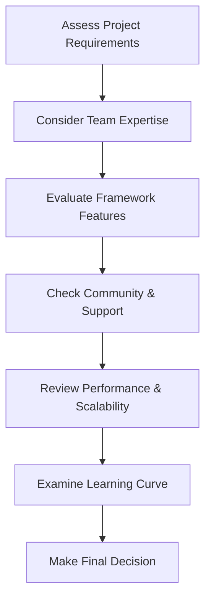

# PHP Framework Selection

## Introduction

Selecting the right PHP framework is a critical decision that can significantly impact your development experience and project success. PHP frameworks provide structured, reusable components that help you build web applications more efficiently than writing everything from scratch. This guide will walk you through the process of evaluating and choosing a PHP framework that best fits your needs, particularly if you're new to PHP development.

## Why Use a PHP Framework?

Before diving into the selection process, let's understand why frameworks are valuable:

- **Productivity**: Frameworks provide ready-to-use components, reducing development time
- **Security**: Most frameworks implement security best practices to protect against common vulnerabilities
- **Maintainability**: Organized structure makes code easier to maintain and extend
- **Community**: Access to documentation, tutorials, and support from the developer community
- **Standardization**: Consistent coding patterns and practices

## Understanding Different Types of PHP Frameworks

PHP frameworks can be categorized based on their architecture, size, and purpose:

### By Architecture

- **MVC (Model-View-Controller)**: Separates application logic from the user interface
- **MVP (Model-View-Presenter)**: A variation of MVC with different handling of the view layer
- **HMVC (Hierarchical Model-View-Controller)**: An extension of MVC with hierarchical organization
- **Middleware-based**: Uses request/response pipelines with middleware components

### By Size

- **Full-stack Frameworks**: Comprehensive solutions with numerous built-in features
- **Micro Frameworks**: Minimalist approach with core functionality, allowing you to add packages as needed
- **Component Libraries**: Collections of standalone components you can integrate into projects

## Popular PHP Frameworks Overview

Let's explore some popular PHP frameworks and their key characteristics:

### Laravel

Laravel is one of the most popular PHP frameworks, known for its elegant syntax and comprehensive feature set.

```php
// Laravel route example
Route::get('/users', function () {
    $users = App\Models\User::all();
    return view('users.index', ['users' => $users]);
});
```

**Strengths**:
- Elegant syntax and easy learning curve
- Comprehensive documentation
- Robust ecosystem with packages and tools
- Built-in features like Eloquent ORM and Blade templating

**Ideal for**: Medium to large projects, beginners who want an all-in-one solution

### Symfony

Symfony is an enterprise-grade framework with a strong emphasis on reusable components.

```php
// Symfony controller example
namespace App\Controller;

use Symfony\Component\HttpFoundation\Response;
use Symfony\Component\Routing\Annotation\Route;

class UserController
{
    #[Route('/users', name: 'user_list')]
    public function listUsers(): Response
    {
        // ... fetch users from database
        return $this->render('users/index.html.twig', [
            'users' => $users,
        ]);
    }
}
```

**Strengths**:
- Highly modular architecture
- Excellent for complex, enterprise applications
- Very stable with long-term support
- Individual components can be used separately

**Ideal for**: Enterprise applications, experienced developers, long-term projects

### CodeIgniter

CodeIgniter is known for its small footprint and straightforward approach.

```php
// CodeIgniter controller example
namespace App\Controllers;

class Users extends BaseController
{
    public function index()
    {
        $model = new \App\Models\UserModel();
        $data['users'] = $model->findAll();
        
        return view('users/index', $data);
    }
}
```

**Strengths**:
- Very lightweight and fast
- Minimal configuration required
- Excellent performance
- Straightforward documentation

**Ideal for**: Small to medium projects, developers who prefer simplicity

### Slim

Slim is a micro-framework focused on building simple yet powerful web applications and APIs.

```php
// Slim example
use Psr\Http\Message\ResponseInterface as Response;
use Psr\Http\Message\ServerRequestInterface as Request;
use Slim\Factory\AppFactory;

$app = AppFactory::create();

$app->get('/users', function (Request $request, Response $response) {
    // Fetch users
    $response->getBody()->write(json_encode($users));
    return $response->withHeader('Content-Type', 'application/json');
});

$app->run();
```

**Strengths**:
- Minimalist design, small footprint
- Fast and ideal for APIs
- PSR-7 HTTP message interfaces
- Middleware support

**Ideal for**: APIs, microservices, small applications

### Yii

Yii is a high-performance framework suitable for all types of web applications.

```php
// Yii controller example
namespace app\controllers;

use Yii;
use yii\web\Controller;

class UserController extends Controller
{
    public function actionIndex()
    {
        $users = \app\models\User::find()->all();
        return $this->render('index', [
            'users' => $users,
        ]);
    }
}
```

**Strengths**:
- High performance
- Strong security features
- Comprehensive database tools
- Code generation tools

**Ideal for**: Large-scale applications, performance-critical projects

## Framework Selection Process

Choosing the right framework involves a methodical approach. Follow these steps to make an informed decision:



### 1. Assess Project Requirements

Begin by clearly defining your project needs:

- **Project scale**: Small personal site or enterprise application?
- **Project type**: Content-based website, e-commerce, API, etc.
- **Specific features**: Authentication, file handling, real-time updates, etc.

For example, if building an e-commerce platform, you'll need robust database support, security features, and possibly integration capabilities.

### 2. Consider Team Expertise

Evaluate your team's familiarity with different frameworks:

```php
// Laravel uses expressive, elegant syntax
$users = User::where('active', 1)
             ->orderBy('name')
             ->get();

// Compared to more verbose approaches in other frameworks
$query = $this->db->table('users');
$query->where('active', 1);
$query->orderBy('name', 'ASC');
$users = $query->get();
```

If your team already knows Laravel, choosing it could reduce the learning curve significantly.

### 3. Evaluate Framework Features

Compare framework features against your requirements:

| Feature | Laravel | Symfony | CodeIgniter | Slim | Yii |
|---------|---------|---------|-------------|------|-----|
| ORM | Eloquent | Doctrine | Built-in | No | Active Record |
| Templating | Blade | Twig | Simple | No | PHP-based |
| Authentication | Built-in | Yes | Manual | Add-on | Built-in |
| API tools | Built-in | Yes | Manual | Core focus | Extensions |
| CLI tools | Artisan | Console | Spark | No | Console |

### 4. Check Community and Support

A strong community provides:
- Regular updates and security patches
- Third-party packages and extensions
- Help resources and tutorials
- Long-term sustainability

Indicators of community health:
- GitHub stars and contributors
- StackOverflow questions and answers
- Frequency of updates
- Conference presence

### 5. Review Performance and Scalability

For performance-critical applications, benchmark frameworks:

```php
// Example benchmark code
$startTime = microtime(true);

// Code to test
// ...

$endTime = microtime(true);
$executionTime = ($endTime - $startTime) * 1000; // in milliseconds
echo "Execution time: " . $executionTime . " ms";
```

Consider:
- Memory usage
- Response times
- Scalability with increased load
- Caching capabilities

### 6. Examine the Learning Curve

Consider the time investment required to become productive:

- **Laravel**: Moderate learning curve, excellent documentation
- **Symfony**: Steeper learning curve, but very structured
- **CodeIgniter**: Easy to learn with straightforward documentation
- **Slim**: Very easy to get started, limited features to learn
- **Yii**: Moderate learning curve with good documentation

## Practical Example: Framework Selection Scenario

Let's walk through a practical example to apply the selection process:

**Project**: Building a blog platform with user authentication, content management, and API for mobile integration.

**Step 1: Requirements**
- User authentication and authorization
- Content management with categories and tags
- RESTful API for mobile apps
- Search functionality
- Medium-scale, expected growth

**Step 2: Team Expertise**
- Team has some PHP experience but no framework expertise
- Looking for good documentation and learning resources

**Step 3: Feature Evaluation**
Laravel and Symfony both offer:
- Built-in authentication
- ORM for database operations
- API capabilities
- Search integration options

**Step 4: Community Assessment**
- Laravel has an active community with extensive tutorials
- Regular updates and security patches
- Numerous packages available via Composer

**Step 5: Performance Considerations**
- Both frameworks perform well for medium-scale applications
- Laravel offers caching and queue systems for scaling

**Step 6: Learning Curve**
- Laravel's documentation is beginner-friendly
- Extensive tutorials and courses available

**Decision**: Laravel would be a good choice for this project due to its comprehensive features, strong community support, and beginner-friendly documentation.

## Implementation Example: Getting Started with the Selected Framework

Once you've selected a framework, you'll need to set it up and start developing. Here's a quick example with Laravel:

```bash
# Install Laravel via Composer
composer create-project laravel/laravel blog

# Navigate to project directory
cd blog

# Start the development server
php artisan serve
```

Create a simple model and migration:

```php
// Generate model and migration
// php artisan make:model Post -m

// app/Models/Post.php
namespace App\Models;

use Illuminate\Database\Eloquent\Model;

class Post extends Model
{
    protected $fillable = [
        'title', 'content', 'user_id', 'published'
    ];
    
    public function user()
    {
        return $this->belongsTo(User::class);
    }
}

// database/migrations/xxxx_create_posts_table.php
public function up()
{
    Schema::create('posts', function (Blueprint $table) {
        $table->id();
        $table->string('title');
        $table->text('content');
        $table->foreignId('user_id')->constrained();
        $table->boolean('published')->default(false);
        $table->timestamps();
    });
}
```

Set up a controller:

```php
// php artisan make:controller PostController --resource

namespace App\Http\Controllers;

use App\Models\Post;
use Illuminate\Http\Request;

class PostController extends Controller
{
    public function index()
    {
        $posts = Post::where('published', true)->latest()->get();
        return view('posts.index', compact('posts'));
    }
    
    public function show(Post $post)
    {
        return view('posts.show', compact('post'));
    }
    
    // Other resource methods...
}
```

Define routes:

```php
// routes/web.php
use App\Http\Controllers\PostController;

Route::get('/', [PostController::class, 'index']);
Route::resource('posts', PostController::class);
```

## Summary

Selecting the right PHP framework is a crucial decision that impacts your development workflow and project success. Consider your project requirements, team expertise, framework features, community support, performance needs, and learning curve when making your choice.

Remember:
- There's no universally "best" framework - only the best for your specific needs
- Larger frameworks offer more built-in features but may have more overhead
- Micro-frameworks provide flexibility but require more manual integrations
- Community support and documentation quality significantly impact development experience

By following the structured selection process outlined in this guide, you'll be better equipped to choose a PHP framework that aligns with your project goals and team capabilities.

## Additional Resources

### Official Documentation
- [Laravel Documentation](https://laravel.com/docs)
- [Symfony Documentation](https://symfony.com/doc)
- [CodeIgniter Documentation](https://codeigniter.com/user_guide)
- [Slim Framework Documentation](https://www.slimframework.com/docs)
- [Yii Documentation](https://www.yiiframework.com/doc)

### Learning Resources
- PHP Framework Comparison Websites
- Online Courses for Specific Frameworks
- Framework-specific Books

### Practice Exercises
1. Create a simple blog using two different frameworks and compare the development experience
2. Build an API endpoint using a micro-framework
3. Implement authentication in a full-stack framework